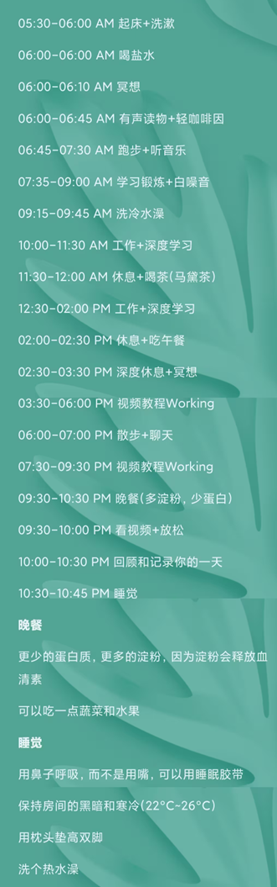

# 作息

## 日程表

| 时间          | 事情                             |
| ------------- | :------------------------------- |
| **6.00-6.45** | **起床==早起 To Do==**           |
| **-8.00**     | **地铁 ==视频课-教材 To Do==**   |
| **-9.30**     | **==工作A====启动To Do==**       |
| **-10.00**    | **Rest**                         |
| **-11.30**    | **==工作B==**                    |
| **-12.00**    | **==提升To Do==**                |
| **-13.30**    | **==工作C==**                    |
| **-14.00**    | **午餐**                         |
| **-15.30**    | **NSDR/深度休息**                |
| **-16.00**    | **==健身 To Do== ==科研To Do==** |
| **-17.30**    | **==工作D==**                    |
| **-18.00**    | **有氧？**                       |
| **-19.30**    | **==工作E==**                    |
| **-20.00**    | **晚饭**                         |
| **-21.30**    | **==工作F==**                    |
| **-22.40**    | **==地铁==总结回顾-时间管理**    |
| **-23.10**    | **==睡前 To Do==**               |

## 参考

https://abhishekmaharana.notion.site/Neuroscience-Based-Routine-970e075a1dd74686b58e888781ca009b

| 时间       | 事情           |
| ---------- | -------------- |
| 5.30-6.00  | wakeup things  |
| addition   | Salt water     |
|            | Meditate       |
| 6.10-6.45  | Audio book     |
| -7.30      | Running        |
| -9.30      | trainning、gym |
| -9.45      | code shower    |
| -11.30     | Deep work      |
| -12.00     | Rest           |
| -2.00      | work           |
| -2.30      | Rest lunch     |
| -3.30      | NSDR、Work out |
| phase-II   |                |
| 3.30-6.00  | Work           |
| -7.00      | Walk           |
| 7.30-9.30  | work           |
| 9.30-10.00 | Dinner         |
| -10.30     | Reviewer       |
| -10.45     | sleep          |

## 起床时间记录

| 时间     | 事情     | 耗时              |
| -------- | -------- | ----------------- |
| 10.30    | 起床     |                   |
| 10.50    | 出门     | 20分钟            |
| 11.00    | 吃饭     |                   |
| 12.20    | 到       | 从起床1小时50分钟 |
| 13.20-40 | 散步NSDR | 20分钟休息        |
| 第二天   |          |                   |
| 11.50    | 躺下     |                   |
| 4.00     | 睡觉     | 4h                |
| 8.00     | 醒来     |                   |
| 8.20     | 睡觉     |                   |
| 8.55     | 玩手机   | 55分钟            |
| 9.30     | 送东西   | 40分钟            |
| 10.00    | 吃早点   | 20分钟            |
| 11.20    | 到       | 1h20分            |
|          |          |                   |

# 健身

## 动作库

| 项目       | 动作                   |
| ---------- | ---------------------- |
| **胸**     | 上斜哑铃               |
|            | 上斜钻石               |
|            | 龙门架（下、上、中）   |
|            | 蝴蝶机（全程、后半程） |
|            | 万斯推胸               |
|            | 坐姿固定推胸           |
| **背**     | 引体向上-硬拉          |
|            | 高位下拉（宽、中、窄） |
|            | 划船                   |
|            | 史密斯反起             |
| **肩**     | 实力推                 |
|            | 推肩                   |
|            | 飞鸟递减&W提拉         |
|            | 后束飞鸟&蝴蝶机        |
|            | 龙门附身飞鸟           |
| **二头**   | 弯举&锤式              |
|            | 三头碎颅者             |
|            | 上斜出拳               |
|            | 哑铃提拉               |
| **腹**     | 瑜伽球起身             |
|            | 龙旗                   |
|            | 俄罗斯转体             |
|            | 提膝-侧身直身          |
|            | 朝圣者                 |
| **有氧**   | 拳击                   |
|            | dance                  |
|            | 跑步                   |
| **前锯肌** | 弹力带后缩前引         |
|            | 站姿杠铃推举           |

# 内务

## 衣服分类

| 种类     | 条目                                         |
| -------- | -------------------------------------------- |
| 外套     | 羽绒服、夹克、衬衫、开衫卫衣                 |
| 中层     | 卫衣、毛衣、开衫毛衣、长袖T恤、短袖衬衫      |
| 内层     | 半袖、POLO衫、背心、速干（背心、短袖、长袖） |
| 休闲下身 | 短裤、长裤、运动裤                           |
| 秋裤     | 紧身运动短裤                                 |
| 袜子     | 长袜、短袜、内裤                             |
| 鞋子     | 跑鞋、球鞋、板鞋、袜鞋                       |
| 健身     | 长袖、短袖、背心、短裤、长裤                 |
| 装饰     | 腰带、手链、项链、帽子                       |
| 洗护     | 洗发水、洗液、护发素                         |
|          | 沐浴露、沐浴花、刷子、                       |
|          | 洗衣液、卫生纸、湿巾                         |
|          | 棉棒、                                       |
|          | 止汗露、香水、                               |
|          | 洗面奶、护肤水、保湿霜                       |
|          | 刮胡刀、刮胡泡、电动刮胡刀                   |
|          | 电动牙刷、                                   |
|          | jiaoqi药                                     |

## 充电

| 大类 | 实物      | 形式     | 次数     |
| ---- | --------- | -------- | -------- |
| 外设 | RK100键盘 | Type-C   | 周一晚上 |
|      | 罗技Mx    | Type-C   | 周二晚上 |
|      | 罗技G602  | 充电电池 | 轮换     |
| 耳机 | JBL       | Type-C   | 周三     |
|      | 马歇尔II  | Type-C   | 周四     |
|      | 马歇尔III | micro-C  | 周五     |
|      | 勒姆森    | Type-C   | 每天     |
| 设备 | Ipad      | 苹果     | 每天     |
|      | Kindle    | microc-C | 周六     |

