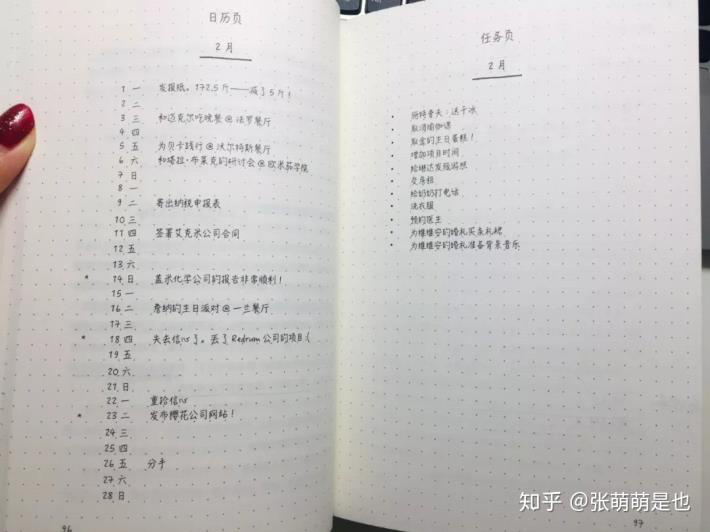

子弹笔记-实操

2022年10月12日

10:29

 

### **▏​内容：**

-   Index 目录：快速找到『未来规划表』、『月计划』、『日计划』

-   未来规划表：简单记录-每个月的重要任务。

-   月计划：记录当月的首要任务、活动、事项等。

-   日计划：仔细记录每天的事项，用特殊符号来区分不同类型。

### **▏​ 制作步骤：**

> 1、笔记本第一页，在左右两侧顶端写上『Index 目录』。
>
> 2、下一页，『Future Log 未来规划表』，笔记本上画两条线，分隔出六个区块。
>
> 3、填上月份，精简地写下当月的重要事项切忌详细。
>
> 4、标上页码，在『Index 目录』记录下页码。
>
> 5、『月计划』：下一页，请在左页顶端写下该月的月份。
>
> 分为左右两页，左边是事后填写的总结，右边是对当月时间的计划
>
> 
>
> 8、『日计划』，前一天结束时写第二天计划。
>
> 9、在待办事项前，标上符号，以区分。

### **▏​符号**

> 任务"・"
>
> 活动"。"
>
> 灵感"－"
>
> 优先处理"＊"
>
> 
>
> 已完成的事项 "x"
>
> 已迁移的事项"＞"
>
> 已搬回『Future Log 未来规划表』的事项"＜"

### **▏​自定义模块**

> 年度计划（Year Plan）
>
> 想读的书（Books to Read）
>
> 想看的电影（Movies to Watch）
>
> 心愿单（Wish List）
>
> 名言警句（Motivational Quote）
>
> 我之所爱（Things that I love about the world）
>
> 学习（Study）
>
> 2019年我想做的100件事（100 things to do before 2019 ends）
>
> 写作灵感（Writing Ideas）
>
>  
>
>  
>
> \* *
>
>  
>
>  

 

