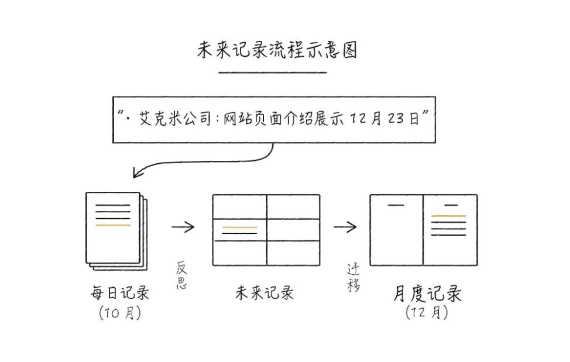
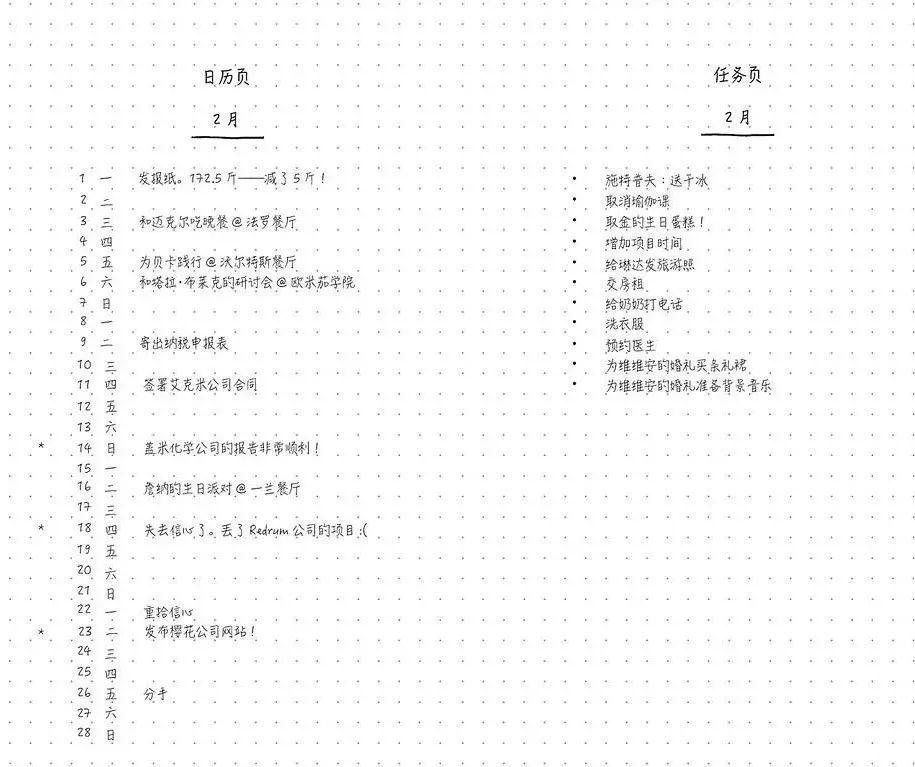
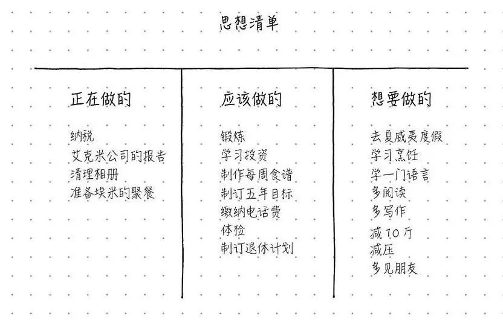
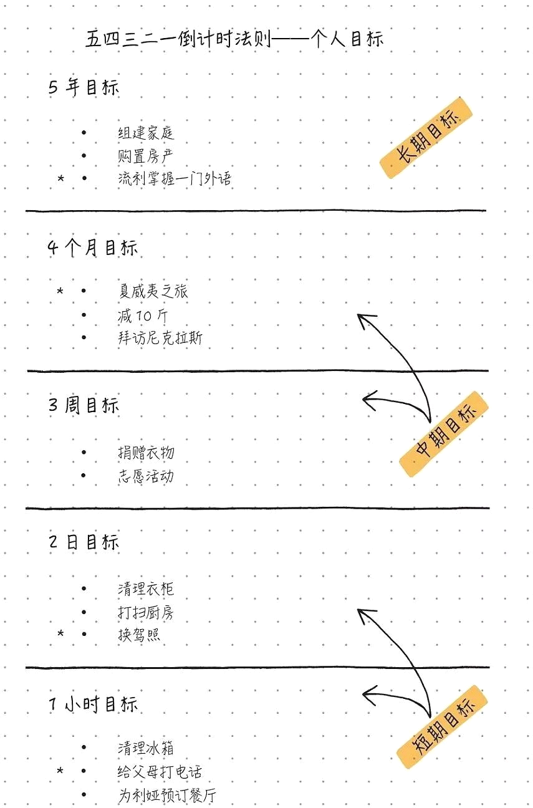
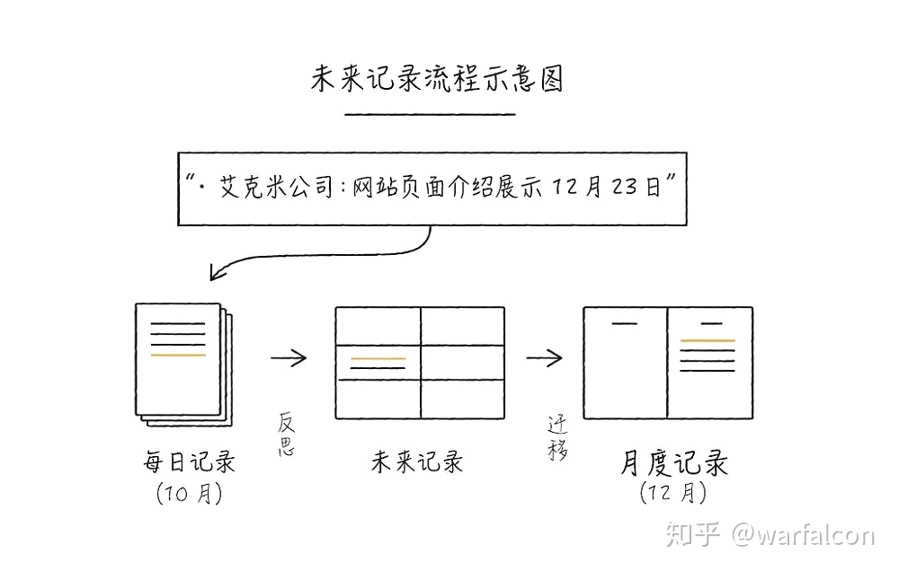
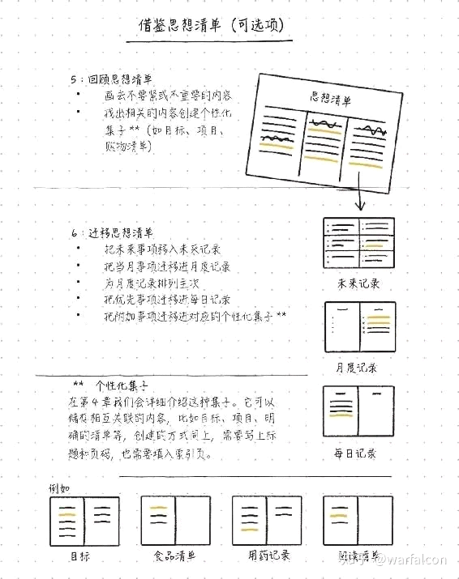
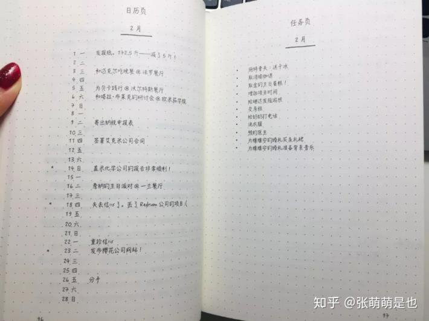

# habits_build

## I Will !

-   固定的行为

-   形成身份认同

-   别把事情搞得太难开始

-   Be easy and refine over and over again

-   先从喜欢的开始

-   计划可以变动-新环境新工作新阶段

-   展示特定的梦

-   注意奖励：衣服、篮球、健身、新事物

-   放弃对抗痛苦和不适感

-   我想重振家庭

-   念起即觉-觉即不随

-   克服惯性和路径依赖

-   不回避不抵抗

-   有时太过关注自身状态和感受

-   我现在首要任务

    -   学技能、知识、技术

    -   卷论文

    -   慢慢使用、熟练一些工具

-   具有解决问题的能力、力量、安全感、信心

-   学术成功、科研技能-平静 信心 安全感

-   健康、有型

-   强大、乐观心理

-   精明的人：精力、时间、金钱、资源

-   爱好：吉他 口琴 西班牙语

-   答应了就去做到、也不轻易许诺、答应自己的要拼命去做

-   专注当下、全身关注、进入心流

-   对于自己的过去、教训也好、创伤也好、激励 只是小输了一把而已、激励自己下一把吸取教训

-   去拼去赢、输了一把排位就应该总结完立马开下一把

-   生活悲惨的人不应该可怜自己 就好像输了的人也不能可怜自己

-   要尽快振作 集中力量 赢下一把

-   在某一冲击中发现灵魂中的清澈 崇高 正值的品格

-   养成良好的习惯

    -   收集精力

    -   收集文件、今日事、今日思考、今日毕

    -   总结能力：一句话把意思说清楚

    -   挖掘宝藏

-   对自己提一个严苛高标准的要求

-   低头先模仿他人

-   大学环境，一句话改变认知和观念甚至信念

    -   周围很多优秀的人会不自觉的在交流中展现自己的观念

        -   （即便不是正确的，但是这个观念会影响你的行为和意志力）

        -   孟劲松：你能做到就是找借口 不要想做 不想买计算器

        -   没有考不上的研究生、没有毕不了业的博士生

-   一个月进步一点就够了

-   一切好的行为都是为了成为更好的自己，这些行为坚持就会成为习惯

-   自律的人、上进的人、勤快的人、愿意改变的人、很少抱怨的人

-   我是一个想象力创造力十足的boy、并且说做就做、想做就能一直做到的

-   我是一个积极乐观、看破残酷仍然愿意热爱和怀抱希望的人

-   我总能看到一个事物积极的一面、并且愿意改变环境的人

-   愚公移山、明知山有虎的人

-   幽默的人、豁达的人

-   科研人、严谨、求索

-   运动健康人

-   温柔的人-不冲动-不强行压制自己的情绪-及时释放-及时表达-及时接纳

-   今日事-务必今日毕-直至无能为力

-   时间意识卡点

-   学会享受-全身心投入选择

-   若非整日无事做-切勿事事苛责自我

-   旧辅新知-新服救治-类比-他辅新知

-   强迫自己做对的事情

    -   投入

    -   平静

    -   应该做的想好理由

-   尽量事事提前思考-准备-风险预估

-   别着急清高了

## 刷牙

-   洗漱包
    -   内容：牙线、牙膏、牙刷、漱口水、刷筒

-   饮食：

    -   少糖、多纤维

-   一天：

    -   至少三次漱口

    -   两次刷牙

    -   完整刷牙：牙线、漱口、刷、漱口水

-   长期：

    -   三个月一换牙刷

    -   含氟牙膏

## BoJo Journy

 ### 大纲

 

 

 

 

 

 

 

 

### 实操

#### 内容：

-   Index 目录：快速找到『未来规划表』、『月计划』、『日计划』

-   未来规划表：简单记录-每个月的重要任务。

-   月计划：记录当月的首要任务、活动、事项等。

-   日计划：仔细记录每天的事项，用特殊符号来区分不同类型。

#### 制作步骤

> 1、笔记本第一页，在左右两侧顶端写上『Index 目录』。
>
> 2、下一页，『Future Log 未来规划表』，笔记本上画两条线，分隔出六个区块。
>
> 3、填上月份，精简地写下当月的重要事项切忌详细。
>
> 4、标上页码，在『Index 目录』记录下页码。
>
> 5、『月计划』：下一页，请在左页顶端写下该月的月份。
>
> 分为左右两页，左边是事后填写的总结，右边是对当月时间的计划
>
 
>
> 8、『日计划』，前一天结束时写第二天计划。
>
> 9、在待办事项前，标上符号，以区分。

#### 符号

> 任务"・"
>
> 活动"。"
>
> 灵感"－"
>
> 优先处理"＊"
>
 
>
> 已完成的事项 "x"
>
> 已迁移的事项"＞"
>
> 已搬回『Future Log 未来规划表』的事项"＜"

#### 自定义模块

> 年度计划（Year Plan）
>
> 想读的书（Books to Read）
>
> 想看的电影（Movies to Watch）
>
> 心愿单（Wish List）
>
> 名言警句（Motivational Quote）
>
> 我之所爱（Things that I love about the world）
>
> 学习（Study）
>
> 2019年我想做的100件事（100 things to do before 2019 ends）
>
> 写作灵感（Writing Ideas）
