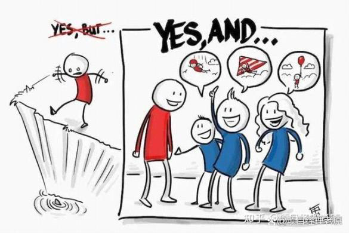
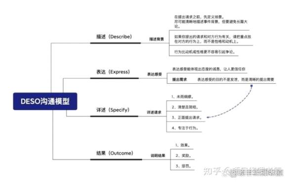

如何说服别人

2022年10月9日

20:53

 

很多人都知道，说服他人一个有效的方法是"Yes and"：先表达认同，再展开说建议。

但实际情况是，很多人都把它理解成了"Yes but"：只是表面认同，但马上又开始挑对方的错。

一、说服人先掌握3个底层逻辑

有人说，世界上有两件难事：一件是把别人口袋里的钱放到自己口袋里，一件是把自己脑袋里的想法放到别人脑袋里。

所以说，想要说服一个人其实是件不容易的事情。我把说服他人的底层逻辑浓缩成为了三句话。

01 没有人喜欢被改变

很多人认为「说服」就是让对方觉得你讲的都是对的，但你要知道这是根本不可能的事情。

而且我被说服了，等于我被打败了，谁会喜欢被打败的感觉？

很多人都知道，说服他人一个有效的方法是"Yes and"：先表达认同，再展开说建议。

但实际情况是，很多人都把它理解成了"Yes but"：只是表面认同，但马上又开始挑对方的错。

结果往往适得其反，让你的认同显得特别敷衍。

理解了这个逻辑，你只需要在沟通时，适当的改变几个词，语气和语境就完全不一样，那结果自然也完全不一样了。

比如：

你为什么不？→为什么要？

问：你为什么不好好学习？

答：没想过

问：你为什么不服从安排？

答：可能不想吧

用否定词去问问题，得到的大概率也是否定的答案，等于在帮他复习他不这么做的理由。

他也不会因此而意识到需要改变，或者认同你的观点。

现在我们改成「为什么要」试试

问：你有没有想过要好好学习？

答：有想过

问：1-10，你觉得你想学习的意愿有多强？

答：差不多有7吧

问：居然这么高！我看你不是很在意学习，以为只有2-3呢！为什么呢？

答：不学习看起来和大家格格不入

问：那也没啥，你可以有自己想做的事情

答：可是想做的事情，很多知识我都不会，还是得学。

有趣的是，他本来是没有要学习的，可是我问他想学习的理由是什么时，他就会去捍卫那个理由，自我增强这个理由。人就是这么有趣的生物。

02 没有人喜欢不知情

一个人在不了解状况的时候，别奢望他会乖乖配合。

我为啥总强调要向上汇报，要开项目启动会，给团队成员做信息同步和共享，就是基于这个逻辑。

及时把进度做好汇报，上级能及时得到信息，你再补充优先级，说明理由即可；

团队开会时，明确每个人的职责以及相互之间的影响，所有人都清晰了，知道你为什么要做，配合度自然也就高了。

否则，你在尝试说服时，每个人的脑海里都会下意识的浮现3个字：凭什么？

每个人都会想知道理由。所以告诉别人理由，就是最简单的说服方式。

 

03 所有人都希望有退路

看完上一条，你会说，我说了理由啊，他们还是不听。

为啥？你这么做，把人家的退路堵死了，凭啥听你的？

你买一样东西，我告诉你，不满意随时可以退款，你会更容易下决定。

告诉领导：我还有PlanB，你放心。

绝对比你说：这绝对不行，已经动不了了，来的效果好。

让人家有退路，反而充满说服力。

以上的3个底层逻辑，都需要反复去体会和琢磨，在此基础上，从生活中去尝试和总结。

这边我也建了个项目管理经验交流群，可以和各路大佬们探讨交流，也会不定期分享一些干货模板，想要进入交流群的也可以私聊我。

二、1个沟通模型：DESO

底层逻辑搞定，那不就得给你们上具体方法论。

其实说服别人这事没那么复杂，你不需要把自己修炼得有多高情商，多有魅力，只需要学会一个模型：DESO。

DESO是专门用来请求或说服他人达成目的的一种沟通模型，主要包括4个部分：

描述（Describe）

表达（Express）

详述（Specify）

结果（Outcome）

我们照着这个模型，回到开头的问题:如何说服领导给任务排优先级呢？

D（描述背景）：现在项目组成员手头的任务马不停蹄需要一周才能做完，如果这时候临时加需求的话，会影响其他任务的进度。

E（表达感受）：我理解您的需求非常紧急和重要，但我非常担心会不会影响其他更重要的任务的进度。

S（详述请求）：所以我需要您给这些任务排一下优先级，说明哪些是需要优先完成的，哪些可以往后排。

O（说明结果）：排好优先级，能避免一些风险：比如项目组成员先完成了不那么重要的任务，却导致重要的事情延期了。

我们一定要做一个"拎得清"的项目经理，不要想着尝试去改变别人，不要轻易给别人定性，轻易就觉得"这事没法谈"，把退路直接堵死。

在老原看来，这绝对不是一个积极的解决问题的态度。

如果你总是抱着这种心态，影响自己的情绪不说，也不可能把工作做好。

项目管理工作中的大多数问题，都能通过沟通来解决。

作为项目经理，一定要保持坦诚、积极的心态，尽可能地去解决问题，而不是逃避问题。
