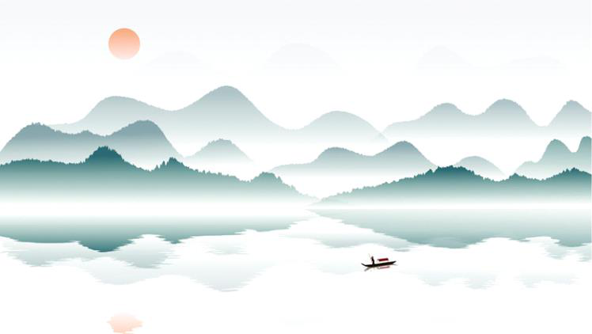
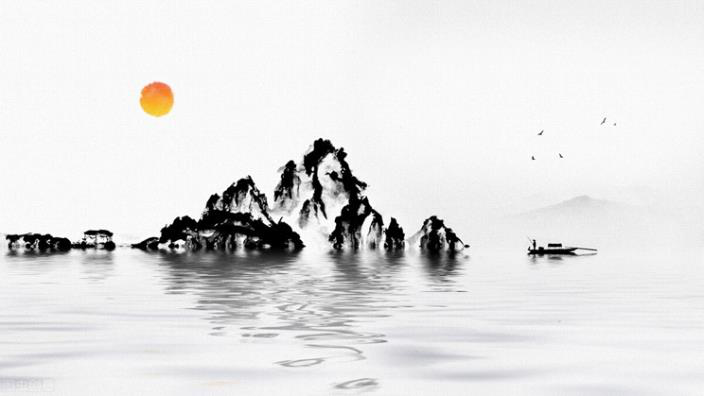
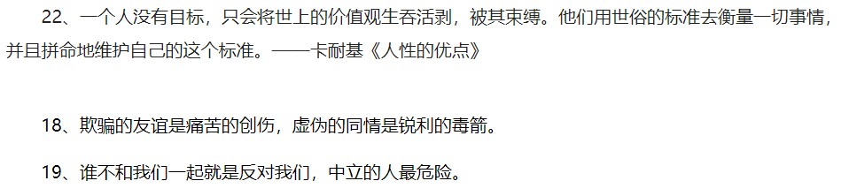

格言名言

2023年3月18日

12:26

-   Better late than never

-   Quiter never win

-   Every noble work is impossible at first

-   莫听穿林打叶声 何妨吟啸且徐行

-   慎重则必成 轻发则多败

-   无负今日

-   顺境不惰 逆境不馁

-   今日事 今日毕

-   事不拖 话不多 人不作

-   完成好过完美

-   No excuse just produce

-   自己是自己最大的敌人 造成自己一切困哪的源头是懦弱的自己

-   花开堪折直须折 莫待无花空折枝

-   对待生命你不妨大胆冒险一点, 因为好歹你要失去它。如果这世界上真有奇迹，那只是努力的另一个名字。生命中最难的阶段不是没有人懂你，而是你不懂你自己。

-   人生没有目的，只有过程，所谓的终极目的是虚无的。\-\--人的情况和树相同。它愈想开向高处和明亮处，它的根愈要向下，向泥土，向黑暗处，向深处，向恶

-   你要搞清楚自己人生的剧本------不是你父母的续集，不是你子女的前传，更不是你朋友的外篇。对待生命你不妨大胆冒险一点，因为好歹你要失去它。如果这世界上真有奇迹，那只是努力的另一个名字。生命中最难的阶段 不是没有 人懂你，而是 你不懂你自己。

-   不能听命于自己者，就要受命于他人。

-   人的精神有三种境界：骆驼、狮子和婴儿。第一境界骆驼，忍辱负重，被动地听命于别人或命运的安排；第二境界狮子，把被动变成主动，由"你应该"到"我要"，一切由我主动争取，主动负起人生责任；第三境界婴儿，这是一种 "我是"的 状态，活在当下，享受现在的一切。------尼采

-   我走在命运为我规定的路上， 虽然我并不愿意走在这条路上， 但是我除了满腔悲愤的走在这条路上别无选择 ------尼采我

-   人类的生命，不能以时间长短来衡量，心中充满爱时，刹那即为永恒！------尼采

-   受苦的人，没有悲观的权利。一个受苦的人，如果悲观了，就没有了面对现实的勇气，也没有了与苦难抗争的力量，结果是他将受到更大的苦。------尼采

-   谦逊基于力量，高傲基于无能。------尼采

-   你的良知在说什么？------你要成为你自己。------尼采 《快乐的科学》

-   如果我们整天满耳朵都是别人对我们的议论，如果我们甚至去推测别人心里对于我们的想法，那么，即使最坚强的人也将不能幸免于难！因为其他人，只有在他们强于我们的情况下，才能容许我们在他们身边生活；如果我 们超过了 他们，如果我 们哪怕仅仅是想要超过他们，他们就会不能容忍我们！总 之，让我们以一种难得糊涂的精神和他们相处，对于他们关于我们的所有议论，赞扬，谴责，希望和期待都充耳不闻，连想也不去想。

-    聪明的人只要能掌握自己，便什么也不会失去。

-   愚昧无知是一切痛苦之源。

-   自从我厌倦了寻找，便学会了找到。

-   男人骨子里坏，女人骨子里贱。

-   没有真理，只有解释

-   人可以控制行为，却不能约束感情，因为感情是变化无常的。

-   无选择的求知冲动，犹如无选择的性冲动一样------都是一种下贱的本能！

-   谁若孜孜于寻找，就越容易迷失自己。一切孤独皆是罪过。

-   无需时刻保持敏感，迟钝有时即为美德。尤其与人交往时，即便看透了对方的某种行为或者想法的动机，也需装出一副迟钝的样子。此乃社交之诀窍，亦是对人的怜恤。

-   当某一动物, 某一种族或某一个体失去其他种种本能时，当它选择以及当它偏爱对它不利的东西时，便称它为堕落。

-   在需要面前，一切理想主义都是虚伪的 

-   一束光照进铁塔，铁塔里的肮脏龌龊被显现，这束光便有了罪

-   感到难过，不是因为你欺骗了我，而是因为我再也不能相信你了。

-   事常与人违，事总在人为。

-   若是畏惧跌宕的山岩，生命永远只是一滩死水

-   不抱有一丝幻想，不放弃一丝机会，不停止一日努力

-   绅士就是从不无心伤害别人感觉的人。

-   奚落是庸才对天才的颂歌。

-   生活里有两个悲剧：一个是没有得到我们想要的，另外一个是得到了。

-   创造即享受，拼搏才是充实

-   害你至如此底部的人 正式懦弱的自己

-   不怕路长 只怕志短

-   脚步怎样才能不断向前 把脚印留在身后

-   对于坚毅强劲的年轻人来说，没有标准和典范可循也许更好

-   品质

-   道德之所以崇高和美好，正是因为他伴随着巨大的牺牲

-   读书使人充实，思考使人深邃，交谈使人清醒

-   眼泪为她下着雨，心却打着伞

-   把信念转化为行动，并坚持到底

-   人生意义不在于留下什么，只要经历，就是最大的美好，这不是无能，而是一种超然。

-   世间许多事情，追求的时候总比享用时浓烈

-   忧郁是因为自己无能，烦恼是由于欲望得不到满足，暴躁是一种怯懦的表现。

-   爱所有人，信任少数人，无伤任何人

-   小人的许多劣质品质，就是认为别人与他一样狭隘

-   造就伟人的不是高尚感情的强度，而是高尚感情的持续世间

-   谁不会休息，谁就不会工作

-   better late than never. 只要开始，虽晚不迟

-   one today is worth two tomorrows

-   a bold attempt is half success

-   Do what you say,say what you do

-   Zero in your target,and go for it.

-   When it has is lost, brave to give up. 当拥有已经是失去，就勇敢的放弃

-    Say goodbye to the depravation of yesterday

-    If you get tired, learn to rest, not to quit. 如果你累了，学会休息，而不是放弃

-   Quitters never win and winners never quit

-   Try your best when you are young.Never regret. 

-   Youth gives you light please don\'t let it down. 青春赋予你光芒 请你别让它失望。

-   思君令人老，岁月忽已晚

-   人生亦有命，安能行叹复坐愁

-   时危见臣节，世乱识忠良------鲍照《代出自蓟北门行》

-   自古圣贤尽贫贱，何况我辈孤且直！------鲍照《拟行路难·其六》

-   疾风知劲草，板荡识诚臣。------李世民《赐萧瑀》

-   流光容易把人抛，红了樱桃，绿了芭蕉。------蒋捷《一剪梅·舟过吴江》

-   三十功名尘与土，八千里路云和月。------岳飞《满江红·写怀》

-   小舟从此逝，江海寄余生。------苏轼《临江仙》

-   休对故人思故国，且将新火试新茶。诗酒趁年华。------苏轼《望江南·超然台作》

-   少年不识愁滋味，爱上层楼。爱上层楼，为赋新词强说愁。------辛弃疾《丑奴儿·书博山道中壁》

-   桃李春风一杯酒，江湖夜雨十年灯。------黄庭坚《寄黄几复》

-   老夫惟有，醒来明月，醉后清风。------元好问《人月圆》

-   醉后不知天在水，满船清梦压星河。------唐温如《题龙阳县青草湖》

-   月有盈亏花有开谢，想人生最苦离别。------张鸣善《普天乐·咏世》

-   我也不登天子船，我也不上长安眠。------唐寅《把酒对月歌》

-   无限山河泪，谁言天地宽！------夏完淳《别云间》

> 满江红⑴
>
> 怒发冲冠⑵，凭阑处⑶、潇潇雨歇⑷。抬望眼，仰天长啸⑸，壮怀激烈⑹。三十功名尘与土⑺，八千里路云和月⑻。莫等闲⑼、白了少年头，空悲切⑽。
>
> 靖康耻⑾，犹未雪。臣子恨，何时灭。驾长车，踏破贺兰山缺⑿。壮志饥餐胡虏肉⒀，笑谈渴饮匈奴血⒁。待从头、收拾旧山河，朝天阙⒂。 \[2\] 
>
>  

-   量力而为的人总是缺乏想象力

-   道德事实上是我们对不喜欢人的一种态度

-   生活里有两个悲剧：一个是没有得到我们想要的，另外一个是得到了。

-   悲观主义者是这种人：当他可以从两种罪恶中选择时，他把两种都选了

-   不满是个人或民族迈向进步的第一步

-   孩子最初爱他们父母，等大一些他们评判父母;然后有些时候，他们原谅父母。

-   恨是盲目的，爱亦然。

-   没有人富有到可以赎回自己的过去。

-   每个圣人都有过去，每个罪人都有未来。

-   梦想家只能在月光下找到前进的方向，他为此遭受的惩罚是比所有人提前看到曙光。

-   什么是离婚的主要原因?结婚。

-   我不想谋生;我想生活

-   我给你们讲述的是所有你们没勇气去犯的罪孽。

-   我想所有迷人的人都是被宠爱着的，这是他们吸引力来源的秘密

-   邪恶是善良的人们编造的谎言，用来解释其他人的特殊魅力

-   一个人总是可以善待他毫不在意的人

-   别试图去补救无望的过失，别在愚味庸俗各猥琐的事上浪费你的生命。这些东西是我们这个时代病态的目标和虚假的理想。去过你奇妙的生活，点滴都别浪费。

-   不要给女人忠告;决不要给女人任何她晚上不能穿戴的东西

-   除了感官，什么也不能治灵魂的创痛，同样，感官的饥渴也只有灵魂解除得了。

-   大多数人都是属于别人的人。他们的思想是他人的观点，他们的生活是一种模仿，他们的激情是一种引证

-   恭维话从来没有让女人缴械，但可以让男人缴械。这就是性别差异

-   结婚是想象战胜了理智，再婚是希望战胜了经验

-   来自敌人的困难可以忍，来自朋友的成功则无可忍。

-   你拥有青春的时候，就要感受它。不要虚掷你的黄金时代，不要去倾听枯燥乏味的东西，不要设法挽留无望的失败，不要把你的生命献给无知、平庸和低俗。\
    > 活着！把你宝贵的内在生命活出来。什么都别错过。

-   To define is to limit.\
    > 定义一样东西，就意味着限制了它。

-   烫过的孩子仍然爱火

 

萧伯纳

-   自我控制是最强者的本能

-   巴菲特就说过，"我之所以能有今天的投资成就，是依靠自己的自律和别人的愚蠢。"

-   别人一夸我，我就感到局促不安，因为夸得还不够。

-   柏格森、叔本华和尼采的哲学思想，又攻读过马克思

-   萧伯纳代表作：《凡人与超人》、《千岁人》、《圣女贞德》

-   未来取决于梦想，所以赶紧去睡觉吧。

-   痛苦的秘密在于有闲工夫担心自己是否幸福

-   所谓天才人物指的就是具有毅力的人、勤奋的人、入迷的人和忘我的人

-   理性的人使自己适应世界，不理性的人想使世界适应自己。但人类的大多数进步，往往是由后者创造的。

-   最使女人欣慰的是挫伤男人的骄傲，最使男人欣慰的是满足女人的骄傲

-   人类总是高估了自己所没有的东西的价值。

-   32\. 人可以爬到最高峰，但不能在那久住。

-   对于说谎者的惩罚绝不在于没有人相信他，而在于他不在能相信任何人

-   懒惰就像一把锁，锁住了知识的仓库，使你的智力变得匮乏

-   如果这个世界完好无缺，没有一点问题，我们不就无事可做了吗？

-    要学会演讲，就必须固执地、一个劲地让自己出丑，直到娴熟为止。

-   做你该做的事，结果则顺其自然。

-   真正的闲暇不是什么也不用做，而是能够自由地做自己感兴趣的事情

-   我年轻时注意到，我所做的事，十有八九是失败的，为了不甘于失败，于是我就十倍努力地干下去

-   人生真正的欢欣，就是在于你自认为正在为一个伟大的目标运用自己，而不是源于独自发光、自私渺小的忧烦躯壳，若只知道抱怨世界永远也无法带来快乐

-   征服世界的将是这样一些人：开始的时候，他们试图找到梦想中的乐园，最终，当他们无法找到时，就亲自创造了它。

-    有的人看到了已经发生的事情，问："为什么会这样？"，我却梦想一些从未发生的事，然后追问："为什么不能这样？"

-   萧伯纳墓志铭：我早就知道，无论我活多久，这种事情总会发生的。

-   生活不是寻找你自己，而是创造你自己。

-   人生真正的快乐，在于能对一个事业有所贡献，而自我认识到这是个伟大的事业。

-   人们估量肩上的担子有时重于担子本身。

-   在世界上出人头地的人，都能够主动寻找他们要的时势，如果找不到，他们就自己创造出来。

>  
>
> 
>
>  
>
> 

-   莫听穿林打叶声 何妨吟啸且徐行

-   顺境不惰 逆境不馁

-   今日事 今日毕

-   事不拖 话不多 人不作

-   完成好过完美

-   No excuse just produce

-   花开堪折直须折 莫待无花空折枝

-   事常与人违，事总在人为。

-   不怕路长 只怕志短

-   better late than never.

-   Do what you say ! Say what you do!

-    If you get tired, learn to rest, not to quit.

-   Quitters never win and winners never quit

-   Try your best when you are young.Never regret. 

-   三十功名尘与土，八千里路云和月。

-   小舟从此逝，江海寄余生。

-   醉后不知天在水，满船清梦压星河。

-   没有人富有到可以赎回自己的过去。

>  
>
>  
>
>  
>
>  
>
>  

 
