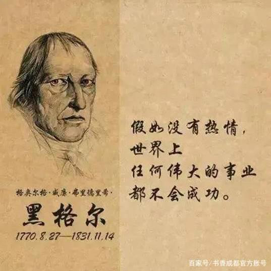

# 黑格尔格言

2023年3月18日

14:21

 

 

 

 

1、 一个民族有一群仰望星空的人，他们才有希望。------黑格尔

2、 我们从历史中学到的教训就是，没从历史中学到教训。------黑格尔

3、 一个志在有大成就的人，他必须如歌德所说，知道限制自己。反之，什么事都想做的人，其实什么事都不能做，而终归于失败。------黑格尔

4、 人类从历史学到的唯一的教训，就是人类没有从历史中吸取任何教训。------黑格尔

5、 纪律是自由的第一条件。------黑格尔

6、 有嫉妒心的人，自己不能完成伟大的事业，乃尽量去低估他人的伟大，贬抑他人的伟大使之与他人相齐。------黑格尔

7、 人们往往把任性也叫做自由，但是任性只是非理性的自由，人性的选择和自决都不是出于意志的理性，而是出于偶然的动机以及这种动机对感性外在世界的依赖 。------黑格尔

8、 个性像白纸，一经污染，便永不能再如以前的洁白。------黑格尔

9、 人应尊敬他自己，并应自视能配得上最高尚的东西。------黑格尔

10、 凡是现实（存在）的就是合理的，凡是合理（存在）的就是现实的。------黑格尔

11、 无知者是最不自由的，因为他要面对的是一个完全黑暗的世界 。------黑格尔

12、 什么是悲剧？悲剧就是善的冲突。------黑格尔

13、 一个拥有真正美的心灵总是有所作为的，并且是一个实实在在的人。------黑格尔

14、 我们可以断言，没有激情，任何伟大的事业都不能完成。------黑格尔

15、 只有那些永远躺在坑里从不仰望高空的人，才不会掉进坑里。------黑格尔

16、 最大的天才尽管朝朝暮暮躺在青草地上，让微风吹来，眼望着天空，温柔的灵感也始终不光顾他。------黑格尔

17、 美具有引人向善的作用和力量。------黑格尔

18、 世上大概有两种人，"一种人毕生致力于拥有，另一种人毕生致力于有所作为。"一心渴望拥有，一旦没有达到目的，就会失落、痛苦和绝望。心无旁鹜，专心 于 事业的追求，就会忘掉许多烦恼，找到许多努力过程中的快乐。默默耕耘的人其实是最智慧的人。------黑格尔

19、 理想的人物不仅要在物质需要的满足上，还要在精神旨趣的满足上得到表现。------黑格尔

20、 时代的艰苦使人对于日常生活中平凡的琐屑兴趣予以太大的重视，现实上很多的利益和为了这些利益而作的斗争，曾经过多地占据了精神上一切的能力和力量以 及 外在的手段，因而使得人们没有自由的心情去理会那较高的内心生活和较纯洁的精神活动，以致许多较优秀的人才都为这种艰苦环境所束缚，并且部分地被牺牲在里面。因为世界精神太忙碌于现实，所以它不能转向内心，回复到自身。------黑格尔

21、 审美的感官需要文化修养......借助修养才能了解美，发现美。------黑格尔

22、 存在就是合理 Only in the state does man have a rational existence. ------黑格尔

23、 每个人都是一个整体，本身就是世界，每个人都是一个完满的有生气的人，而不是某种孤立的性格特征的寓言式的抽象品 ------黑格尔

24、 一个人如果把从别人那里学来的东西算作自己的发现，这也很接近于虚骄。------黑格尔

25、 对现实的抽象就是对现实的毁灭 。------黑格尔

 

26、 爱情确实有一种高尚的品质，因为它不只停留在性欲上，而且显出一种本身丰富的高尚优秀的心灵，要求以生动活泼，勇敢和牺牲的精神和另一个人达到统一。--- ---黑格尔

27、 人类从历史里学到一个教训，那就是没有学到任何教训。------黑格尔

28、 凡是合理的都是存在的，凡是存在的都是合理的。------黑格尔

29、 只有经过长时间完成其发展的艰苦工作，并长期埋头沉没于其中的任务，方可有所成就。------黑格尔

30、 精神的生命不是表现为害怕死亡，与荒芜保持绝对的距离，而是表现为承受死亡，并在死亡中保存自身。只有当精神在一种相当绝对的支离破碎状态下重新找到 自 己，他才赢得它的真理。精神作为这样一种肯定的事物，并没有逃避否定的事物......同样，当虚假成为真理的一个环节，它也不再是一个虚假的东西。------格奥尔格·威廉·弗里德里希·黑格尔 《精神现象学》

31、 个性像白纸，一经污染，便永不能再如以前洁白。------黑格尔 《美学演讲录》

32、 有嫉妒心的人，自己不能完成伟大事业，便尽量去低估他人的伟大，贬抑他人的伟大性使之与他本人相齐。------黑格尔

33、 谁中途动摇信心，谁就是意志薄弱 ------黑格尔

34、 智慧之鸟的猫头鹰， 在文明的暮色中才开始起飞。------黑格尔

35、 精神上的道德力量发挥了它的潜能，举起了它的旗帜，于是我们的爱国热情和正义感在现实中均得施展其威力和作用。------黑格尔

36、 有一些宝贵的东西作为它的目标时，生活才有价值。------黑格尔

37、 只有一个人能理解我，但他也不能完全理解。------黑格尔

38、 一句哲理在年轻人嘴里说出和在老年人嘴里说出是不一样的。年轻人说的只是这句哲理本身，尽管他可能理解得完全正确。而老年人不只是说了这句哲理，其中 还 包含了他的全部生活！------黑格尔

39、 如果你生活是一种无法抗拒的、无法改变的痛苦里，那么这种痛苦将是你的幸福！给自己一个希望和勇气，大喊没有什么大不了的！慷慨的说句"大不了就是一 死 "！------黑格尔

40、 那隐藏着的宇宙本质自身并没有力量足以抗拒求知的勇气。对于勇毅的求知者，它只能揭开它的秘密，将它的财富和奥妙公开给他，让他享受。------黑格尔

41、 他是他自己本身的目的他自身中有一种无限的价值、一种永恒的使命 ------黑格尔

42、 我看见拿破仑，这个世界精神，在巡视全城。当我看见这样一个伟大人物时，真令我发生一种奇异的感觉。他骑在马背上，他在这里，集中在这一点上他要达到 全 世界、统治全世界。------黑格尔

43、 真理是在漫长的发展着的认识过程中被掌握的，在这一过程中，每一步都是它前一步的直接继续。------黑格尔

44、 婚姻实质上是伦理关系。婚姻是具有法定意义的伦理性的爱。------黑格尔

45、 我首先要求诸君信任科学，相信理性，信任自己，并相信自己。------黑格尔

46、 理想的人物不仅要在物质需要的满足上，还要在精神情趣的满足上得到表现。------黑格尔

47、 法律决非一成不变的，相反地，正如天空和海面因风浪而起变化一样，法律也因情况和时运而变化。------黑格尔

48、 运伟大之思者，必行伟大之迷途。------黑格尔

49、 真理诚然是一个崇高的字眼，然而更是一桩崇高的业绩。如果人的心灵与情感依然健康，则其心潮必将为之激荡不已。------黑格尔

50、 青春是生命中最美好的一段时间。------黑格尔
