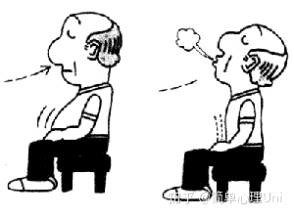
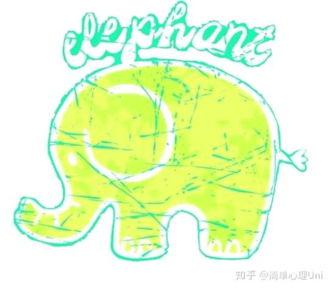

# 缓解焦虑的小技巧

**缓解焦虑的小技巧**

2023年3月18日

14:02

 

**缓解演讲焦虑的小技巧**

1.找出真正的凶手------你到底在害怕什么？

1）捕捉自己的**自动思维**（无意识，无目的，不需要努力就自然而然出现的思维）

例如，当你阅读这篇回答的时候，你会有一部分精力集中在回答的内容上，而另一方面，你可能正在产生一些快速的评价思维，这些思维不是深思熟虑或者推理产生的结果，而是快速涌现出来的简短的思维，这就是自动思维。下面列举几个演讲焦虑中常常出现的自动思维：

-   好丢人啊

-   他们会不会笑话我？

-   我一定讲不好

-   我真是太差劲了

-   ......

接下来，根据找到的自动思维对自己提问：

-   支持这个想法的证据是什么？反对这个想法的证据是什么？

-   最坏会发生什么事？如果发生了，我能如何应对？

-   如果我的家人朋友处于类似的情境中，我会对他们说些什么？

2）找到自动思维里的**核心信念**

核心信念是从童年开始形成，在一个人的认知中占主导地位的一种信念，是关于自我最核心的信念（Beck, 2001）。在自动思维和核心信念之间，还有中间信念。为了了解核心信念、中间信念和自动思维的作用过程，我们现在就拿演讲焦虑举个例子：

认知行为疗法里面有一个典型的核心信念"**我不胜任**"。

-   核心信念：我不胜任

↓

-   中间信念：①态度：不胜任很糟糕 ②假设：如果我很努力，我可以做好演讲；如果我不努力，我会演讲失败。

↓

-   自动思维：我做不了这个演讲；演讲太难了；我永远都做不到自信自如地演讲......

找出我们的核心信念、中间信念和自动思维以后，可以试着去评价自己的这些思维和认知，并对其中不合理的地方进行修正。这是一个需要反复练习的过程。

3）再问自己几个问题，找到这种焦虑感背后，你真正的**需要**是什么？

-   我演讲时声音发抖了，会怎么样呢？

-   我没有讲好，会怎么样呢？

-   我丢人了，会怎么样呢？

-   别人笑话我了，对我有不好的评价了，又会怎么样呢？

-   ......

所以，你的需要是得到认可？还是希望更好地融入集体，不因负面评价而被集体排斥？或者说，你需要被看到？

 

2.选择适合自己的选题和风格

演讲的选题和风格也会对演讲者的自信程度产生影响。如果你选择了你熟悉的、适合你的演讲主题，那么相比那些陌生的主题，你会感到更加自信。另外，每个人都有不同的演讲风格，不必去刻意模仿其他人的演讲，让你感到最自然的演讲方式和风格，才是真正适合你的。

 

3.做好充分的准备

除了即兴演讲，你都有机会去为这件自己并不擅长的事情做充分的准备。比如：

-   查阅相关资料

-   准备道具（PPT等）

-   准备吸引人的小素材（比如一些幽默的句子，引入话题的小故事、小活动等）

-   提前演练、计时（控制好演讲时间）

-   ......

 

4.练习

你可以**对着镜子练习**，镜子会不加任何评判地反映你真实的演讲状况。当你一遍又一遍在镜子面前熟悉自己的演讲状态，你会更加了解自己，了解你的演讲有哪些优点和缺点，应当如何改进。同时，在镜子面前练习演讲，也是你直面和接纳演讲焦虑的一次契机。

你可以**对着家人朋友练习**，让他们给你提供反馈和建议。你也可以就此认识到，在别人眼中，你的演讲状态是什么样的。也许别人眼中的你的演讲表现，并没有你想象的那么糟糕呢。

你可以**在想象中练习**，想象中的演练可以随时随地进行，只要你不是在骑车、开车、开飞机等等。

另外，试着抓住每一次大大小小的**演讲机会**，把它们当成是属于你的练习。当你越来越习惯和适应了演讲的情境，当你对周围的一切感到了熟悉，你就会慢慢放松下来，焦虑感也会一次比一次更低。

 

5.放松训练

**1）腹式呼吸**

我们平时的呼吸是胸腔的呼吸，吸气呼气时伴随着胸腔的起伏。而腹式呼吸则是伴随着腹部的起伏，可以尝试在学习腹式呼吸时把手放在腹部，感受吸气时腹部向外鼓，呼气时腹部向内收缩。多练习几次，就可以掌握腹式呼吸的技能。这个方法在演讲上场前很有效果哦\~

 

 

 

 

 

**2）肌肉放松**

-   找一个不被打扰的安静环境，或躺或坐在舒服的椅子上，开始收紧右胳膊的肌肉直到颤抖。

-   坚持五秒再放松，然后让手和胳膊变软，完全放松。

-   重复2\~3次，交替收紧和放松肌肉。

-   把这个过程逐渐运用到左胳膊、右腿、左腿、腹部、胸部、肩膀、脖颈、下巴、喉咙、前额和嘴部周围的肌肉。最后，交替蜷曲脚趾并放松。

-   继续这些紧张---放松练习直到全身彻底放松。

熟练掌握这些技巧后，你应当可以在5\~10分钟内完全放松身体。

**3）自我暗示**

"请不要想一只绿色的大象。"

读到这句话，你脑海中出现了什么呢？

所以想要给自己积极的自我暗示的时候，尽量不要使用否定词，例如，我不紧张，我不焦虑，我不害怕......当我们使用否定词的时候，很有可能会起到相反的暗示效果（你的大脑只接收到了"紧张"、"焦虑"、"害怕"等信息，而忽略了"不"）。因此，要多用这样的心理暗示------我很放松，我一定可以的，我很自信......

 

 

 

 

 

 

6.觉察自己的焦虑

不知道上述关于认知行为疗法的小技巧有没有让你有种被push的感觉呢？

事实上，你不可能完全摆脱焦虑。**因为焦虑是人类的一部分，没有人会不焦虑。**只是有的人焦虑过头了，有的人则在特殊情境（例如我们的好朋友演讲）下格外焦虑。

李松蔚老师在奇葩大会上的演讲"没有用的心理学"感染了很多人。他在演讲稿的结尾说道："**我有演讲焦虑，不妨碍我讲下来了。我讲下来了，不妨碍你为我鼓掌。**"

是啊，有演讲焦虑又怎么样呢？我们完全可以带着这份焦虑参与任何公开的演说，因为适当的焦虑并不会过分影响我们演说的效果。

下面分享一个觉察焦虑的技术，希望可以帮助你在焦虑的陪伴下更好地生活。

**"觉察（AWARE）"技术**（Beck & Emery, 1985）：

A：接纳自己的焦虑

W：不带评判地观察自己的焦虑

A：当焦虑产生时，要像不焦虑一样行事

R：重复前三个步骤

E：期待最好的事情发生

 

7.接纳不完美的自己

这是一个漫长的成长过程。如果演讲这件事情让你感到不舒服了，给你带来困扰了，那么你会面临两种选择------要么接纳，要么改变。而在我看来，改变的前提依然是接纳。其实题主终于第一次把这件事情写出来发在了知乎上，就已经是一个很大的改变了，这也是很重要的一步------因为你终于可以直面你的演讲焦虑，正视它的存在并且希望得到改善。

题主在题目的描述中提到的另一个困惑------求全心理导致的写字看书方面的强迫症，就说明题主可能存在完美主义的倾向。因此，接纳不完美的自己这件事情正是题主需要去不断尝试和探索的。在这一方面，也许心理咨询可以帮助到你。

 

最后，期待害怕演讲的朋友们都可以早日攻克这一难题，从此走上人生巅峰\~

 

参考文献

Brydon, S., & Scottwrited, M. (1994).*Between One and Many:The Art and Science of Public Speaking*. Mayfield Publishing Company.

Blöte AW, Kint MJ, Miers AC, & Westenberg PM. (2009). The relation between public speaking anxiety and social anxiety: a review.*Journal of Anxiety Disorders,23*(3), 305-13.

Beck, A. T. (2001).*认知疗法:基础与应用*. 中国轻工业出版社.

Beck, A. T., Emery, G., & Greenberg, R. L. (1986). Anxiety disorders and phobias: a cognitive perspective.*Psychosomatics,27*(2), 155.

 

 

 

 

 

 

 

 

 

 

 

 

 

 

 

 

 

 

 

 

 

 

 

 

 

 

 

 

 

 

 

 

 

 

 

 

 

 

 

 

 

 

 

 

 

 

 

 

 

爱默生说："恐惧较之世上任何事物更能击溃人类。"诚然，有过公共演讲经历的人都知道，很少人能够做到心情平静信心十足地登上演讲台。心理学研究表明：人们在日常生活中，经常会遇到各种各样的困难和障碍，为了解决问题，实现自己的目标，就必须克服困难。而困难的出现和克服，会引起人内心的不安和紧张，严重时就会给人带来恐惧，形成焦虑。下面是小编为大家收集关于克服演讲紧张情绪的技巧，欢迎借鉴参考。

**1、去尝试**

以前老师就说你越怕什么就一定越要尝试。这句话也有用，第一次尝试是克服的开始，没有开始你怎么能克服。

**2、充分的准备**

林肯曾说："我相信，我若是无话可说时，就是经验再多、年龄再老，也不能免于难为情的。"这话说得很深刻。要进行成功的演讲，就必须有成功的准备，否则，没有准备好就出现在听众面前，与未穿衣服是一样的。对付怯场心理最有力的武器是诚心诚意地告诉自己你对本次演讲准备得十分充分。只有有备而来的演说者才能获得自信和成功。同时，对演讲者来说，平时不但要做好演讲前的准备，还要注意加强自己的心理训练和调适，养成良好的应考习惯。

**3、端正演讲动机，减轻心理负担**

不要把目标定得过高，对于不切实际的期望要有客观的分析。如果把演讲的意义片面夸大，甚至把演讲与个人终生的成就、事业和幸福等紧紧联系在一起，演讲还未来临，就已经是惶惶不可终日了。带着强烈的求胜动机和沉重的心理负担去准备，结果情绪焦虑程度越积越强烈，到了发挥时却事违人愿。因此，演讲者要学会适度降低求胜动机，减轻心理负担，真正做到轻装上阵。

**4、保持积极的情绪体验**

有些演讲者面对即将到来的演讲，感觉就像如临大敌，心惊胆颤，有着诸多的这样那样的担心，比如，在演讲过程中总是设想自己会犯语法错误，或总担心自己讲着讲着会突然地停顿下来，讲不下去了，这就是一种反面的假想，它很可能会抹煞我们对演讲的信心。面对这种情况发生，可以使用积极自我暗示的方法。暗示对人的心理影响是极大的，我们都能看到人在不良的心理状态下发挥是不正常的。多学会给自己一种积极放松的暗示，用一些"我一定可以做得很好""我一定可以超常发挥"等肯定自己的短句。在平时联系休息之余多和自己交谈，不断地强化一种必胜的信心与信念。时间长了，就会发现这种良好的积极的心态就会成为自己的一种思维习惯。

**5、提前到场**

记得演讲是每个人都要演讲，往往最开始还不紧张，但是经过了漫长地等待，慢慢就紧张了。有时上课假如老师突然把你喊上去说话，你连让自己紧张的时间都没有。所以演讲要提前到场，慢慢看着一个人一个人走进来，熟悉环境。

**6、避免机械背诵演讲稿**

逐字逐句地背诵讲稿，很容易在面对听众时遗忘，即使没忘，讲起来也会显得十分机械化。美国总统林肯曾说过："我不喜欢听刀削式的、枯躁无味的讲演"。背演讲稿对演讲者可能是一种必要的准备方式，但是,背诵依赖的是机械记忆，逐字逐句的记忆不仅是耗费演讲者大量的时间,而且容易形成演讲者心理麻痹。实际的演讲过程中,一旦因怯场、听众骚动,设备故障等突然出事而容易出现"短路"现象。因而，在准备演讲中我们只要准备好大概的提纲，根据自己的语言、思路发挥更能打动观众。

**7、演讲前要注意把注意力从自己身上移开**

比如，可以积极听取主办人和听众的意见，这样我们可以转移注意力，放松身体和思想。又如可以做做肌力均衡运动。均衡运动是指有意识地让身体某一部分肌肉有规律地紧张和放松。比如我们可以先握紧拳头，然后松开;也可以固定脚掌，作压腿，然后放松。作肌力均衡运动的目的在于让你某部分肌肉紧张一段时间，然后你便不仅能更好地放松那部分肌肉，而且能更好地放松整个身心。因此，在开始讲演时，最重要的就是要把注意力从自己身上移开，或是集中精力听别的讲演者说些什么，以便把注意力放在他们身上，避免不必要的登台恐惧感。

**8、冷静处理"怯场"**

1988年汉城奥运会上，称雄排坛数年的中国女排，在与前苏联队一场比赛中，不仅以0：3败北，而且第一局竞创纪录地吃了零分，其中最主要原因不在于技术基础，而在于心理的崩溃。演讲中的怯场同样也是一种心理崩溃的反映。事实上，当怯场现象发生时，只要有所准备，掌握必要的技巧，也可以顺利度过这一危机期。当意识到自己出现怯场现象时，不要惊恐慌乱，抱着平常心的心态，不要好强求胜，也不要过分地强调自己的怯场紧张心理。通过呼吸调节法消除自己的紧张感，采用这种方法可以消除杂念和干扰。当自我感觉十分紧张时，有意识控制自己的情绪。要时时记住，既然你自己下定的决心，那就大踏步而出，并深深地呼吸吧。事实上，在开始演讲之前，应深呼吸三十秒，这样所增加的氧气供应可以提神，并能给你勇气。

**9、当一个神气的债主**

对于消除紧张心理比任卡耐基先生最有经验，而在他的众多经验中最基本的经验就是："你要假设听众都欠你的钱，正要求你多宽限几天;你是神气的债主，根本不用怕他们。"把身体站直，然后开始信心十足地讲话吧!好似他们每个人都欠你的钱，你在催他们还债，假想他们聚在那儿是要求你宽限还债的时间。这种心理作用对我们大有帮助。我们也许在最初面临听众时，总会经历到一些恐惧，一些震击，一些精神上的紧张，这是正常的。 问题是，只要能坚韧不拔，不久所有顾虑都会一扫而光。

**朋友们，如果你想克服演讲的紧张心理，不妨先要弄清自己为什么害怕当众说话，只要对症下药，只要肯多下功夫，就会发现这种上台恐惧的程度，很快便会减少到某一地步，这时它就是一种助力，而不是一种阻力了。**

 

有一天，你的老板找到你，让你和另一名工程师合作完成一个项目，那么你希望这名的工程师具有什么样的品质？开发速度快(coding machine)？代码清晰易懂？接口易用？系统搞设计能力强？知识渊博？靠谱？有激情？容易相处？自我驱动力强？或者以上所有？那么你所想看到的优点也就同样是你在面试时候需要考察的重点。面试首先要明确目标，再通过目标反向推导出面试的考察点和内容。硅谷大公司的面试分为三种类型：编程面试，系统设计面试，行为面试。一般在编程面试或者系统设计面试中不会涉及行为面试，但是在行为面试中可能会加入简单的系统设计以及编程。本文主要分享的是编程面试的经验总结，所以不会涉及过多的系统设计或者行为面试的内容。其他类型的面试会在之后的文章中讨论。

 

我很有激情 对这件事情好奇 兴奋 觉得能做好才会来 想海绵宝宝一样 了解之后会有变化 但一般刚开始都找不到激情 慢慢接纳 不出成绩的 （工作本身神圣的）章鱼哥 枯燥前提是不是挑战 完全胜任

 

 

 

 

 

 

 

 

 

 

 

 

 

 

 

 

 

 

 

 

 

 

 

 

 

 

 

 

 

 

 

 

 

 

作者：Kathy

链接：https://www.zhihu.com/question/290543744/answer/756935168

来源：知乎

著作权归作者所有。商业转载请联系作者获得授权，非商业转载请注明出处。

**这次想说一说那些我在面试中踩过的坑**

**就在今年暑假，我经历了人生中最失败最糟糕的一次面试，都不想回忆，但还是得逼着自己复盘，否则没办法进步。**

**长沙天虹商场的招商实习生面试。**

**其实整篇文章是对我这次面试的经验总结和复盘。**

此前也经历过新东方之类的面试，怎么说也算是个有几次面试经验的老人家了，天虹的群面和营销策划的Boss面也发挥得不错，进行得十分顺利，本以为可以顺利进入天虹做一名营销策划实习生。可就在我以为稳了，安心回趟家看看我奶奶的时候，天虹的HR打电话来说营销策划岗位只招一个实习生，另一个专业对口的湖南大学的女生更适合这岗位，但是她们认为我也不错，想问问我转招商实习生的岗位怎么样？我答应下来，可转招商实习生第二天又要进行一次面试，我表示第二天我在家没法面试，HR说没事，可以进行视频面试。我答应了。可能是因为在群面中表现还不错吧，再加上营销策划的面试也非常简单，所以我以为HR已经认为我可以胜任招商实习生的工作了，招商面试就只是和营销策划面试一样走一走过场，就没有做什么准备，只是挂完电话查了一下商场招商实习生的工作内容，其实就是需要在商场周边进行商家拓展之类的，可能需要一些沟通谈判的技巧。第二天睡了一个午觉把手机怼在面前就轻装上阵了，下午两点HR小姐姐很准时的打微信视频电话来了。

我立马地按了接听。

接下来就是我的大型翻车现场！！！

**自我介绍：**

HR：这两位是我们的招商部总监，王总监和李总监，首先你给总监来自我介绍一下吧

（营销策划面试是一个总监面两个面试者，压力很小，而且整个面试是非常轻松自在的聊天形式，聊的内容也是我认真准备过的内容营销方面的，比如说对营销策划岗位的了解，我做软文营销的经历之类的。而招商面试则是两个总监加上一个HR面试我一个实习生，而且总监脸色非常严肃，我一下子就感觉到巨大的压力扑面而来，于是我在自我介绍的过程就扑街了，然后一乱套后面全乱套了。）

我犯了以下错误

**1. 面试未能到场，没有表达出我不能到现场的抱歉。**

面试是因为我的原因导致我不能到现场进行面试，其实一开始就应该对因为个人原因不能到场表示抱歉，这也体现了我作为实习生的礼貌和谦逊。然而我并没有想到这一点，直到后面总监用质问的语气问我为什么没到现场时，我也丝毫没表示出我的抱歉，只是简单说明了我回家了这一情况。

**2.HR刚给我介绍完总监的姓氏，我就太紧张忘了，于是只能说，总监们好**

**3.说话发抖+口误**

因为太紧张，不仅说话声音有些发抖，还在自我介绍时全程把我应聘的招商助理说成招聘助理，得到了总监们轻蔑的笑和窃窃私语的反应时我还一头雾水，后来HR小姐姐提醒我我才反应过来。

**4.自我介绍毫无准备，结结巴巴：**

我的错误示范：介绍完学校专业后......因为有在招聘网站中看到天虹的招商助理的工作，主要是需要一些沟通谈判的能力，我在新东方做校园实习生的期间有进行这样的一些沟通交流的工作.......

正确示范：（描述我拥有的和岗位对应的特质，不要重复简历上的，也不要自嗨型的讲套话而没有案例佐证，并且用一些抓人眼球的经历来佐证）

我是一个性格比较外向活泼，善于和人打交道的比较有亲和力的人，平时喜欢逛超市，因为逛超市时感到很幸福，对于超市非常有归属感，这也是我想要来天虹工作的原因。因为我确定了我的职业规划和职业发展方向是招商助理，又加上我是一个热爱学习的人，所以课余的时候就会利用各种网络资源去学习一些思维逻辑表达课程和沟通谈判技巧，希望能帮助自己以后在工作中更好的完成招商工作，实现自己的价值。希望天虹能够给我这个机会来到天虹做招商实习生。（**其实这个例子也比较中规中矩，整个故事讲起来也没有什么案例和亮点，不过至少不会踩雷，也能比较好的表达自己具有符合招商工作的工作能力**）

**简历细节**

**1.对于我写在简历上的每一项经历没有非常全面的认知，也不能保证自己能够说出经历中的细节。**

在压力面中，面试官会深挖你简历中的每一个细节，对你简历中的所有经历一问到底。

我的简历还算比较优秀的，在本科期间也参加了不少活动，拿了一些得奖证书之类的，然而我基本上都已经不记得我参加比赛的一些经历和收获了，比如大一时参加的李锦记创新大赛

我已经完全没有任何印象了，面试前也没有对这个内容做任何准备，只是把得奖经历写在简历里面，又调整了一下顺序把它放在了2018-2019年，于是......

面试官对我简历的挖掘从李锦记创新大赛开始，那一刻，我就懵了

对于一个我完全不记得的项目，面试官开始了他们的灵魂拷问：

**1.介绍一下你参加的这个李锦记创新大赛的内容？**

**2.你们做的什么项目？**

**3.你在项目里扮演什么角色？**

**4.整个项目中有什么令你影响深刻的地方？**

**5.你们项目的成功点在哪里？失败点在哪里？**

**6.你知道第一名是什么项目吗？他们为什么会得第一呢？你们之间的差距在哪里呢？**

**7.在这次经历中，你有什么收获？**

我只能结结巴巴的凭借一些仅存的记忆回答，我能感觉到面试官脸色从一开始的严肃变得越来越难看。

所以对于这种面试我们提前一定要做好的准备就是，自己对自己简历上写的每一项内容进行以上灵魂拷问，并且确保自己每一个都能够非常从容淡定的去回答，我非常推荐临场发挥能力不强朋友们写逐字稿，因为首先，一个好的故事一定是经过反复打磨出来的。我们在写逐字稿的过程中就会反复打磨我们的实习经历。再者，即使是新东方最优秀的老师讲课前也会写逐字稿，反复磨课，我们这种初入职场的小白就更别说能够在没有准备稿子的情况下即兴发挥的很好了。

另外在讲故事的时候拿出一些具体的数据来，这个数据之前就要想好，在说的时候不要犹豫，如果你表现出来对具体的数据不太记得或者不太肯定，就会让面试官怀疑你经历的真实性。比如我讲到我去上海参加生存挑战的时候，生存挑战中赚了多少钱我也是想了很久，因为不记得了，后来不太肯定的说我们团队当时好像是赚了500。

**2.在回答项目成功点的时候一定要凸显出团队协作的力量，展现出你团队合作的能力。 **

我就没有注意这一点，全程没有提到团队合作的重要性。

**3.面试官：能具体说一说你在文案社为京东、丸美等企业供稿的经历吗？**

我犯了两大错误：

（1）说话找不到重点：从很古早的进入文案社，然后用新东方雅思品评报告让我进入实战群比稿之类的开始说，而且找不到说话的重点，到后面说自己写的不错，文案社的老师遇到甲方要求高的稿子就找我，后来回忆起来，自己说这个的时候有点吹捧自己，让人听着很不舒服。

正确示范：

简明的表达出为企业供稿的工作内容，这个最好先准备好逐字稿吧

（还是那句话：**没有一个好的故事不是经过反复打磨的，所有工作经历根据思维逻辑原理和讲故事的逻辑，写好逐字稿，并且多加练习**，因为面试过程中你其实没办法办到即兴的就能用很简明扼要也很专业的话术去讲好你的工作内容和学到的经验，尤其是我这样一个说话比较没有逻辑还喜欢绕弯子的人呜呜呜......）

（2）我的简历中写的是文案社助理，工作内容有审稿，统筹协调和为甲方寻找写手，与写手进行沟通交流等工作（我的确当过几天的文案社助理），但是我在回答的过程中完全没有涉及到这方面的内容，估计面试官都要把我当成骗子啦啊啊啊！

**面试官的问题陷阱**

**1.你经历过的最大的挫折**

这就是让我哭的点了，其实面试官提出的这个问题我在一些面经中见过，然而我是真的想不到我经历过怎样的挫折啊，我一直都觉得我的一生比较幸运，到目前为止都没有经历过什么比较大的挫折。唯一的不顺大概是父母离婚吧，不过他们并没有影响我什么，因为我还有很多爱我的亲人一直在支持和帮助我，教育我。于是面试官问出这个问题以后，我冥思苦想了好久，最后给出的答案是：因为这个有涉及到我的隐私，就是我的父母关系不是太好...（我又说不清楚他们为啥离婚，也不太方便说，于是支支吾吾了半天）

面试官就露出可怜我的表情说：对不起啊，那就不回答这个问题了。

就是面试官的这个表情和这句对不起，一下子触发了我的泪点，我是一个特别感性的人，这也算是我的一个比较大的弱点吧。其实真的没有多委屈，但是就是忍不住流泪了，并且在之后全程都控制不住眼泪和表情管理。（我是真的能哭很久啊哈哈哈哈，面试结束后大哭了一通，算是对面试压力的一种释放吧）

后来看到面试攻略中说，当你谈到你的家庭时宜强调温馨和睦的家庭氛围。宜强调父母对自己教育的重视。我知道，我又犯了大忌......

**2.面试官问你的优点和爱好的时候，是想要得到你和职位匹配的特点。**

这个道理我本来也是知道的，我们学长此前专门给我们上了面试指导课，说这个就是面试官在给你挖陷阱。然而，相信我，**等你真正面对压力面紧张得不得了的时候，你真的啥都忘了！！！**这个时候最重要的一件事就是告诉自己，这只是个面试！让自己在第一时间冷静下来思考面试官是想要得到什么信息，我要展示出我的什么能力和特质。

而我当时大脑整个是被压力压迫得停止思考的，于是

面试官：你周围的朋友是怎么评价你的，她们认为你有什么优点？

我：（当时已经控制不住自己的表情了然后是一边哭一边回答的，也顾不上思考自己到底有什么优点能够体现出自己的工作能力了ps：其实我之前有准备这些问题的一些大体的回答方向，但是一紧张，全忘了）一边哽咽一边回答说 我周围的朋友都评价我对于我想要完成的事情是全力以赴的去完成，他们认为我是一个非常努力的人，努力和真诚就是我的优点。

**在面试中表现出你是一个努力的人没有问题，但是你只表现出你的努力就有问题了啊！这个问题的回答可以展现出更多你的其他特质，只要是你想让面试官知道的你的优点，请全部都放在这种问题的回答下！什么热爱学习啦、活泼开朗、人际关系好、学习效率高、生活学习很自律、能很好的协调好自己的工作和生活、对未来有规划什么的，我真的爆哭，我感觉自己的优点特质完全没展现出来啊啊啊。**

面试官：你有什么爱好？

我：（脑袋短路只能想到逛超市这个和天虹相关的爱好，但其实这个我还可以回答更多能够体现我工作能力的爱好）我爱好很广泛，但是因为是天虹的面试，所以我想说一说我特别喜欢逛超市这个爱好，BlaBlaBla........

哎，我真的不想评论我的回答，我觉得是个人在旁边都要为我捏一把汗。

**3.不要给出犹豫不决的答案，你回答的每个答案都要自信并且斩钉截铁！**

当我说到在上海生存挑战中和别人推销矿泉水我不畏惧和陌生人打交道时

面试官问：所以你是活泼外向的人？

我认为我不算一个特别外向的人，但是我可以表现的非常外向，所以当时我心里有所犹豫，于是我犹豫了一下说：可以这么说（这是面试中比较忌讳的，我面试的是招商助理，需要和陌生人沟通交流和说服别人，但是我却连回答这个问题时都不够自信和坚定）

正确的回答应该是非常自信并且斩钉截铁的告诉面试官，是的！面试的一个很重要的原则就是自信，即使你心里只有50分的自信，也要表现出120分，连你自己都不能肯定自己能否胜任，那么如何让面试官相信你能胜任呢？其实面试和销售很像，销售是把一个产品推销出去，说服别人购买，你想象一下，当一个销售员表现出对他的产品非常自信时，你是不是更容易购买他推销给你的产品？而面试则是把自己推销出去，说服面试官录用你，所以你打心底就要相信自己是值得被录用的，自己是足够优秀的。

**我关注的一个b站up毛小星说，面试的过程就是面试官在心里不停给你打勾的过程，你要做的就是让面试官不停给你打钩，给他洗脑，让他认为就是你没错啦！**

**4.为什么跨专业找工作？为什么想要找招商实习生这个工作？**

哎，为什么不找本专业的工作这个问题真的是经常遇到啊，总感觉每个人都用专业在限制我。自认为我的回答没有太大的问题，但是问题还是有的，就是我在这个回答下一直强调自己经常被问到这个问题。

这个问题在我看来回答以下3个要点会比较好

1.大学课堂的学习我们更多的是学一些**综合性的课程**，大学课堂更加注重提升学生的**综合能力**，其实完全不用拿专业来限制我们的就业的方向。

2.**表达自己的职业规划是这个工作岗位**而不是专业对口的工作岗位，至于原因可以说本专业的工作简单稳定，自己更希望能从事具有挑战性，能从中获得更大成就感的工作。

3.**拿出数据来表达现在从事与本专业对口工作的大学生其实很少**，甚至剩下的从事与本专业对口的工作的人也会在几年后转行。

嗯，终于总结完了，花了我好几个小时，希望以后写经验贴和回答的效率能够更高。本宝宝的长期目标还是希望能成为一个生产高价值文字的人！今天在樊登读书上听了一本书，叫《你能写出好故事》，觉得如果能当一个作家，其实小日子可以过得很滋润，所以从小事做起，每天坚持生产2000字，不急，咱们还有一辈子，慢慢来，万一哪一天就真的实现了呢？

表示才发现的这个宝藏，今天就听了6本书了，而且每次听完书之后的小测试都是100分，嘻嘻嘻。听完也真的很有感触啊，能在很短的时间内学到一本书的精华，开熏\~

 

对一个事情有精确清晰的定义

精简提炼 形容词·1

需求的痛点

总结 提炼

结论先行 先说他想听到的 然后自己再拓展

安下心来 静静地做好一件事

并不是很契合

有时候我希望你这样去想 但我更希望你认清真正的原因 然后接纳 把它看作一个简单的问题发现 解决 反复 失败再尝试 再深入再解决

有限的时间学习更多的知识

 

希望你第一时间听懂对方·1的话 他出于什么目的 想看清你什么品质 最希望得到什么结果 你的独到见解怎样才能给他惊喜 又带来认同

你的完成度 你的工作内容和擅长技能以及经验 和你的高光时刻 结果 评价 量化

更加有吸引力 更加引人入胜

对职位的理解和期望

简历制作

难不代表不可能

不要害怕失败 更不要害怕成功

工作很有挑战吗 最大的工作就是应对挑战

你可能不会去学所有的事情 但你要愿意去学·1

满腔的激情和热情去做 getting things done

But a little bit fear is good

如果这就是 实习生的感觉 我希望我这辈子都是希望的感觉

米白色 蓝色

价格厮杀时代
