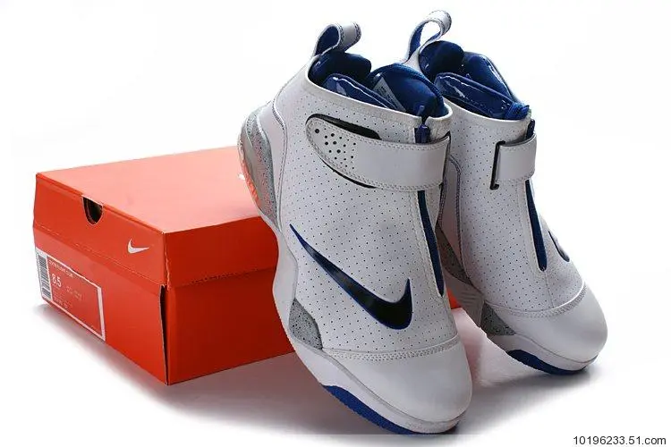
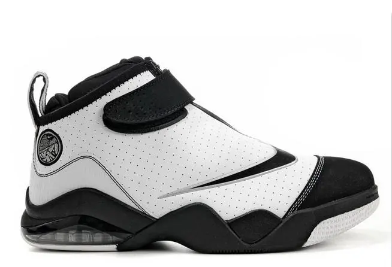
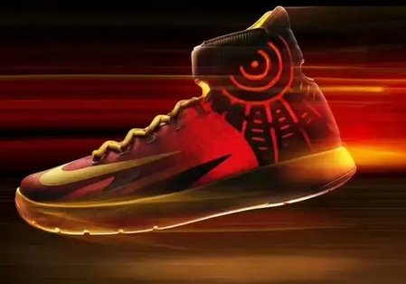

# 珍藏

## 挚爱珍藏

### Nike

- HyperFuse - HyperDunk帖子
  - https://baijiahao.baidu.com/s?id=1741689554257396388&wfr=spider&for=pc
  - https://www.sohu.com/a/260278970_100284789
  - https://post.smzdm.com/p/a99vm8ve/
  - https://www.sohu.com/a/772155118_121124678
  - https://m.dewu.com/note/trend/details?id=174203963&exposureSource=baidu
  - https://baijiahao.baidu.com/s?id=1744380581124803444&wfr=spider&for=pc

 

 

- 购买链接
  - 个人：https://tieba.baidu.com/p/8350908174
  - http://www.dunkhome.com/shoes?brand=699

### 帕克

https://mbd.baidu.com/newspage/data/dtlandingsuper?nid=dt_4639561795760581233

 

 

邓肯:https://www.douyin.com/note/7326756089544985897

 

 ## 球鞋保存

- 原则
  - 适度干燥、通风、中低温
  - 防尘除湿
- 方案
  - 原盒+干燥剂
  - 白毛巾+保鲜袋

## 修鞋

- 第一次

| 鞋名                  | 问题                                                 | 期望方案                             |
| --------------------- | ---------------------------------------------------- | ------------------------------------ |
| 绿黑 Hyperfuse 10     | 右：鞋舌头开裂                                       | 缝线一圈儿（一双）                   |
| 紫金 Hyperdunk 11     | 双：鞋头开胶、鞋头起皮                               | 鞋头补胶水；起皮重粘或透明塑料封鞋头 |
| 黄绿 Hyperfuse 10 Low | 左：鞋舌根部开裂倾向                                 | 加固或缝线或粘布                     |
|                       | 双：鞋底开胶                                         | 重粘                                 |
| 红 Hyperfuse 10 Low   | 双：鞋头开裂起皮、鞋带口脱落、鞋舌头部脱落、鞋底开胶 | 补新的皮布或是漆皮、重粘             |
