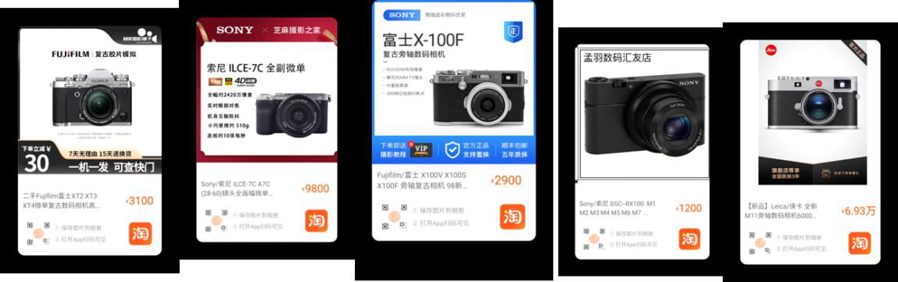

栋哥选相机指导

2023年3月28日

16:24

索尼黑卡和富士x100系列从两千到八千都有型号，性能有些差异，外观差不多

然后xt4和a7c属于预算过万的选择，实际上后续加镜头之类的下来会接近一万五到两万

然后a6400二手配下来差不多8000左右

a7c关键性能还强

然后a6000，比6400能便宜三千，性价比相当高

单论拍照没啥毛病，跟6400很接近

视频和对焦方面稍微弱些

嗯，x100f挺不错的，4000左右可以拿下

6000单机身二手价也就2000

配个套机头3000出头够了

富士主打的就是一个直出色彩

 
