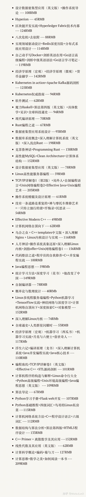
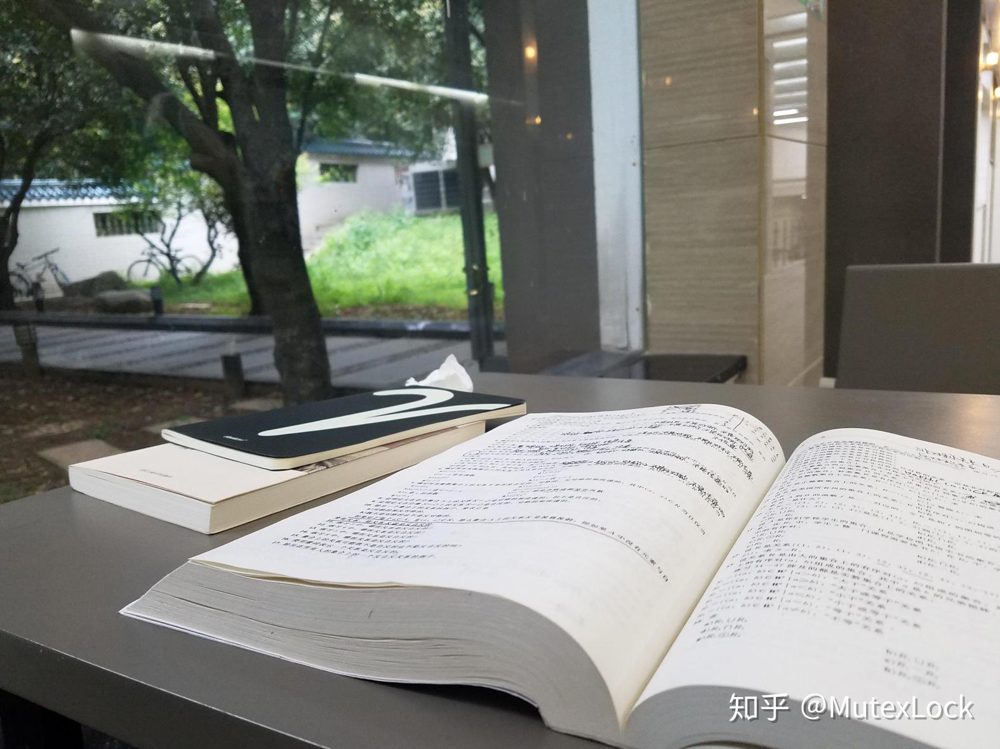
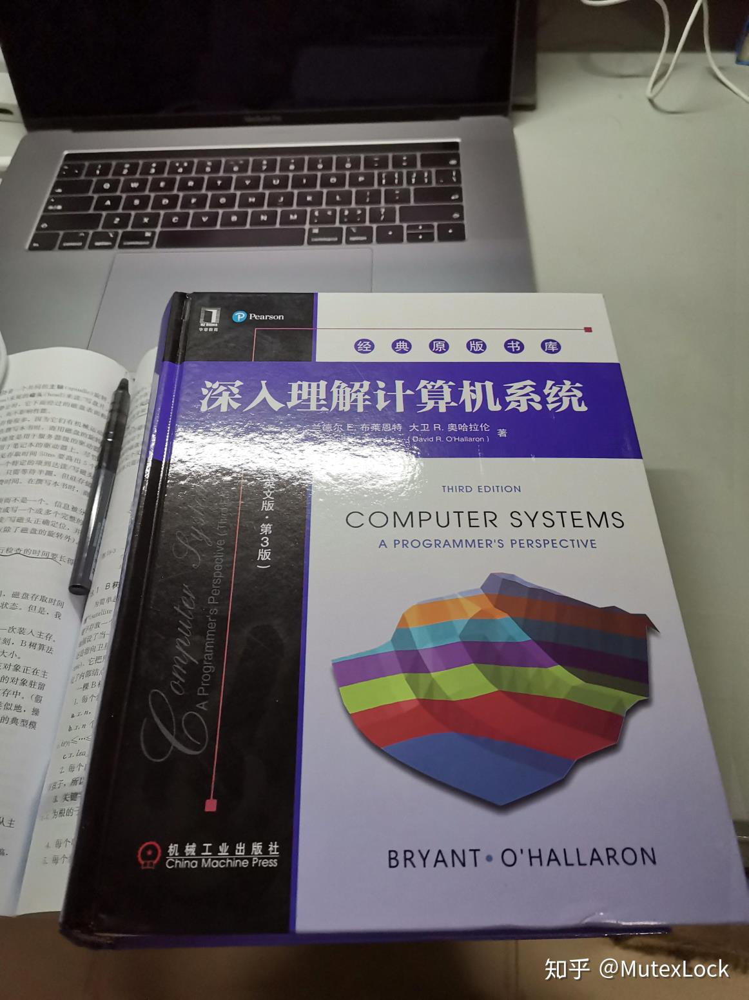
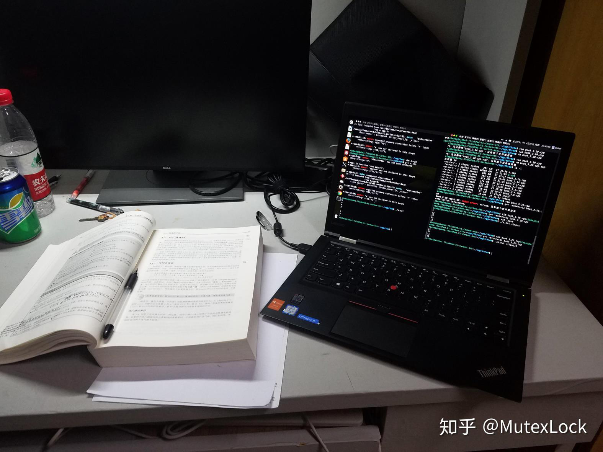
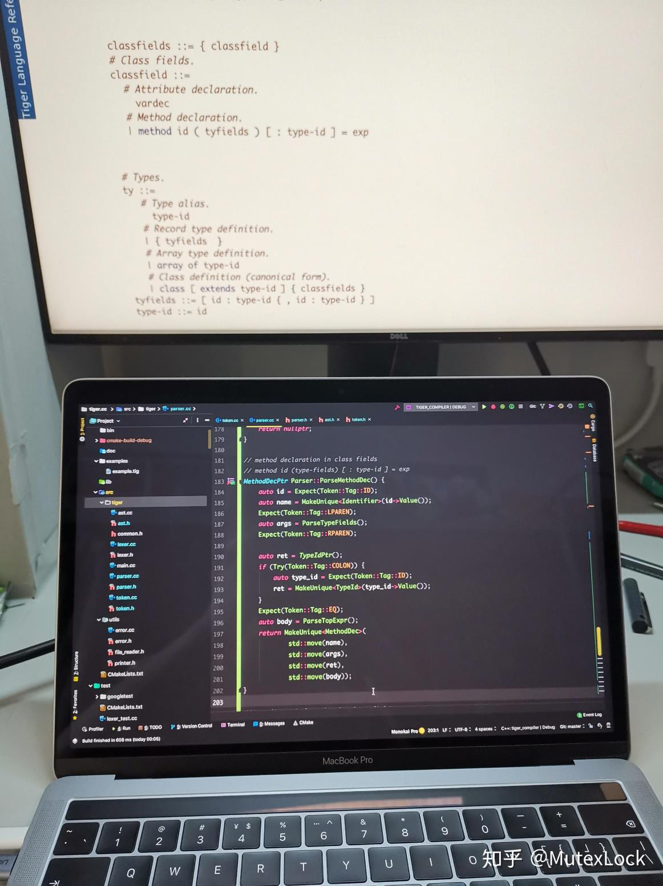

# 从小白到bat后端工程师的自学路线___知乎

从小白到BAT后端工程师的自学路线 - 知乎

星期六, 三月 23, 2024

2:36 下午

 

已剪辑自: [https://zhuanlan.zhihu.com/p/130364187]{.underline}

### 1. 前言

之前回答了「你的编程能力从什么时候开始突飞猛进？」，分享了一下自己的学习经历，很多知友评论要求详细分享一下学习道路，于是写下了这篇文章。如果有遗漏的，欢迎补充。

本文所述的学习道路，适合那些想要成为后端工程师的大学生，学习的主要目标是为了提升技术，打下牢固的基础，并且能够拿到B(yteDance)AT的offer。分享的内容不具有普适性，大家可以根据自身情况来灵活安排。另外，本文中的后端指的是C++/Go技术栈，而非Java技术栈。另外，本文只是介绍了主要的学习道路，还有一些比较杂的东西（比如git怎么用），可以自行搜索，反正遇事不决就Google。

### 2.学习方向和学习方式

大学计算机学习中，首先需要有牢固的计算基础，然后还要有一定的代码量积累，理论知识和动手实践都要兼顾。主要学习的方向有：

-   语言（C、C++、Go、Python等）

-   数据结构和算法（一切的基石）

-   操作系统（操作系统理论知识、Linux中怎么实现）

-   计算机网络（网络分层、TCP协议）

-   系统编程和网络编程（Linux/Unix的系统编程接口和网络编程模型）

另外还有一些很有意思的方向，可以作为进阶学习，对于大部分岗位的面试而言，只是加分项，而非必选项：

-   分布式系统（感兴趣可以学习，分布式存储、计算等，加分项）

-   编译原理（很大的魅力，感兴趣可以学，耗时间，加分项）

-   Functional Programming（同上）

-   云原生、容器、服务编排等（Docker、Kubernetes什么的，加分项）

主要的学习方式有：

-   看书（买书不要吝啬）

-   名校课程（MIT、CMU有很多不错的courses）

-   阅读源码（熟练运用google、github）

-   刷题（LeetCode）

-   自己实现一遍

-   知乎等平台（参与讨论，会发现很多自己没有思考到的东西）

另外，推荐用Linux或者MacOS来进行学习，或者Windows上装WSL也可以。但是，经济允许的条件下，本人最推荐MacBook Pro，因为写代码屏幕看起来最舒服，而且像艺术品一样，看见就爱不释手，学习了起来。

还有一些工具方面，比如编辑器推荐VS Code，IDE推荐JetBrain全家桶（学生可以买免费申请License）。笔记方面Typora、Evernote等。

书籍方面，如果英语基础不错，可以读英文版。如果觉得电子版比纸质版好，也可以去看电子版，推荐一个英文书籍检索网站：[Electronic library. Download books free. Finding books]{.underline}.。

3.学习道路
----------

以下内容讲述了学习道路，包括所需要学习的知识点和推荐的书籍、课程等，尽量是按照较为合理的学习曲线来安排了，如果在自己学习过程中发现更加适合自己的路径，可以自己调整。

-   入门，C语言，推荐书籍：《C Primer Plus 》，另外有两本可以作为辅助读物：《编码》和《计算科学概论》，这两本书可以翻一翻，没兴趣也可以不读。

 

-   学完了C语言之后，就有能力去学习数据结构了，推荐《数据结构与算法分析（C语言描述）》，尽量把上面的数据结构和算法都自己实现一遍。这个时候最好学会了使用命令行，然后代码可以托管在Github。

 

-   然后，可以学习一下主要的语言C++，推荐《C++ Primer》。另外，学习一下脚本语言也有一些用处，推荐Python，书籍《Python基础教程》，了解下基本语法就好。学习Python之后，可以尝试去做一些比较有意思的项目，例如写个爬虫，这样可以培养自己的编程兴趣，也挺有成就感，写爬虫可以在网上搜一些教程，在学习的过程中，也可以对html、http协议等有一些了解。

 

-   算法仍是重中之重，学习完C++后，可以着重学习这方面，推荐《算法（第四版）》和《算法导论》，这两本书都是很经典的算法方面的书籍，前者难度相对较低，后者因为有很多算法复杂度分析，会让人觉得读起来很困难。我的建议是，算法4需要通读，并且用C++来实现上面的算法（书上都是用Java实现的），然后算法导论看完前面17章即可（到贪心那章），算法复杂度分析的部分可以尝试去看看，如果实在讨厌公式推导也可以跳过，但是要能够掌握推导一些常见算法的复杂度。

 

-   为了应付公司面试时的算法题，同时也是为了积累自己的代码量，就需要开始刷题，主要就是LeetCode：[力扣 (LeetCode) 官网 - 全球极客挚爱的技术成长平台]{.underline}。这个刷题要一直持续到找工作，所以尽量安排好自己的刷题节奏。我的经验是，可以按照题目的tag来刷，这样更容易增强自己的解题能力，最好写三百道以上吧。刷题可以和后面的学习同步进行。

 

-   此时具备了编码的基本能力，可以尝试去做一些项目，例如JSON库、正则引擎，这些都可以在网上找到教程。

 

-   学习完了上面内容后，就要进入系统的世界了。首推《深入理解计算机系统》，这本书涵盖了从一个bit到一个网络应用的系统知识，初学者会有很多概念都难以理解，建议是尝试检索相关内容去理解，实在学不会就先跳过，继续后面的内容。读书过程中，也不需要一定按照其安排的章节顺序，可以先挑自己喜欢的读，例如为了理解计算机中的cache，就去读第六章。这本书是CMU CS15213 课程（[Introduction to Computer Systems]{.underline}）的配套书籍，该课程相关的资源也可以用来辅助学习，另外，最精髓的就在于配套的Lab了，难度不低，这个一定要做，如果做的很困难，也要坚持去做，完成后会发现自己的能力有很大的提升。这本书也不用一口气读完，有些章节不太感兴趣，或者读不下去的话，可以留着，等后面知识更加丰富了再回头来看（例如网络那章，我看的是很难理解一些概念，后来学习了计算机网络和网络编程后，就发现读起来比较简单了）。

 

-   再就是十分重要的**操作系统**的学习了。这方面建议先学习理论，然后再去实践。理论方向推荐OSTEP（网上有免费pdf），中文版是《操作系统导论》，建议通读。学习过程中，如果对很多概念很有兴趣，想知道Linux是怎么实现的，可以看《Linux内核设计与实现》和《[深入理解LINUX内核]{.underline}》，当然这种书不必通读，挑自己感兴趣的章节看就好了。

 

-   如果时间充裕，可以尝试自己去实现一个操作系统，这方面推荐书籍《操作系统真象还原》，或者课程MIT6.828：[6.S081 / Fall 2019]{.underline}，两者二选一吧。

 

-   为了能够培养好的C++编程习惯和巩固C++知识，建议看《Effective C++》和《Effective Modern C++》，另外还有Google C++ Style Guide（[Google C++ Style Guide]{.underline}）。

 

-   然后就是计算机网络的学习，理论先看《计算机网络：自顶向下》，可以只看前面三章，即应用层和传输层，做下每章后面的lab。再就是对TCP/IP协议的学习，推荐《TCP/IP详解：卷1》，也是为了节省时间，可以只看TCP相关的章节。这本书英文版是第一版，中文版是第二版，个人是先看的英文第一版，然后再看第二版，挑了新加入的内容看。学习的时候，建议用wireshark来抓包，感受一下这些协议是怎么工作在这互联世界的网络中的，会很有趣的。

 

-   前面学习了操作系统和网络是怎么工作的，然后就需要学习怎么通过编程来调用操作系统的接口，来进行系统编程和网络编程。这方面比较经典的是《Unix环境高级编程》和《Unix网络编程》，这两本书都比较古老，比如现在网络模型中常用的epoll就没有介绍，因为成书早，那个时候Linux内核还没有实现epoll，可惜书的作者早逝，不能更新了。但是也很经典，需要搭配《Linux/Unix编程手册》。当然，这方面的书籍也不是要通读，只需要精读部分章节就好了。

 

-   至此，应该能满足大厂实习面试的要求了，可以去投一投简历了。然后需要丰富一下自己的项目经历，多做一些工程。学习了网络编程后，可以学习《Linux多线程服务端编程》来学习一些C++在实际中的应用，一些常用的小东西（double-buffer啥的），并且加深自己并发编程的能力，相信在前面的基础学习后，能够很好地理解锁，而且对锁的实现，也会了然于胸。然后，这本书还介绍了现在常用的网络IO模型，自己可以实现一种，做一个网络库，并基于此实现一个http server。另外，还可以阅读该书配套代码，muduo，一方面可以看一看优秀的C++代码应该是怎样的，还可以查漏补缺自己的C++知识。

 

-   为了应付面试，C++方面还需要加深下学习，读一读《深度探索C++对象模型》，理解C++中的虚函数、继承等特性都是怎么实现的，然后读一读《STL源码剖析》和SGI STL源码来看看STL是如何实现的（例如ST-L的内存分配器、很常用的vector容器），不过前提是对模板有一点认知，推荐看《C++ template》的部分内容，C++的模板是一个深坑，了解到偏特化的程度就行了。对了，还有C++的并发编程，看一看《C++ concurrency in action》（一定不要买中文版，被那个翻译恶心到了）。写代码的时候，就常备cppreference吧。

 

-   到这个时候，差不多就是一台offer收割机了。为了应付面试，可以看一看《剑指offer》，免得被套路题给难倒，然后多看看面经。

 

-   为了变得更强，还需要看一看工业界中常用的东西，各种中间件，比如Redis，推荐《Redis深度历险》，可以看看它源码中感兴趣的部分。还有消息队列，我最近在看的nats。然后就是LevelDB，这个也是特别值得学习的东西，了解它的原理，看它的源码，了解大神的C++代码是怎样的，也是可以学习到很多东西，例如我之前才学到的clang支持的thread safety annotation。自己也可以实现一个单机版本的kv数据库，可以用最简单的bitcask的方案做存储，再加上自己写的网络库来对外提供服务，做起来也会很有趣。

 

-   如果还有余力，就要向分布式系统进发了。我学的比较浅，推荐学习资料是MIT6.824课程（[6.824 Schedule: Spring 2020]{.underline}），做lab看paper吧。书籍方面，很推荐《Design Data Intensive Applications》，另外还读过一个小册子《Distributed System for Fun and Profit》，感觉不是很喜欢。

 

-   如果对编译器感兴趣，想自己做编译器，推荐书《编译原理》、《编译器设计》、《自制编译器》。编译原理对于找工作影响不大，如果不太感兴趣，只需要大致了解一下编译的过程。

 

### 4.最后

差不多就是这些了，学完之后，肯定就有能力自己去寻找后面应该学习的方向了。上面这些书籍也不是一定要全部看完，可以自己来判别是否适合自己、是否感兴趣吧。另外，很多时候会有一些更加有吸引力的技术，比如十分高冷女神范的Haskell，总是吸引我向她走去，但是理智告诉我，为了找工作，不能这样子。

至于大学课程，我个人处理的方式是，平时不听讲，大多自学，考试前几天刷书，也能拿比较优秀的分数，所以大学四年的前面两年，成绩是学院Top10%，后来去实习了，就没有管成绩如何了。因为，最开始想的还是两手准备，如果找工作不行，还是尝试保研。

大家买书一定不要吝啬，这是回报率极高的投资，对于一些喜欢的书，买下来！推荐给大家一个很好的购书渠道，就是关注京东图书的活动，经常会有400减300、300减200的活动，十分划算。大概统计了一下，大学期间我花了五千多块钱去买书，这算是我花的最值的一笔钱。

 

粗略统计的书籍购买历史

这两天回忆了一下大学的生活，翻相册时候看到很多学习的时候拍的照片，看起来很是感伤，怀念背着书包在校园里找自习室，怀念和同学在走去食堂的路上争论内核实现细节，怀念和舍友LOL开黑一整天，不赢不睡觉，一输一通宵。

大家看完觉得不错的话，别只收藏呀，点个赞吧。

 

 

 

 

 

 

 

 

 

 

 

 
