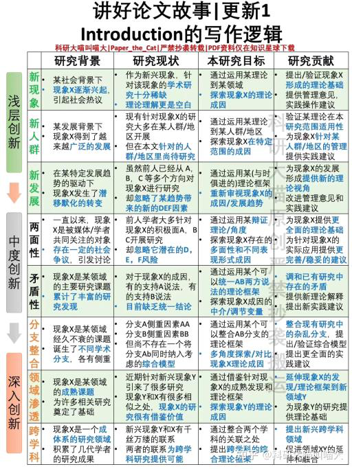
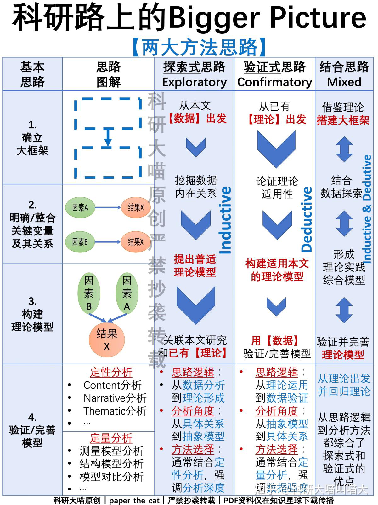
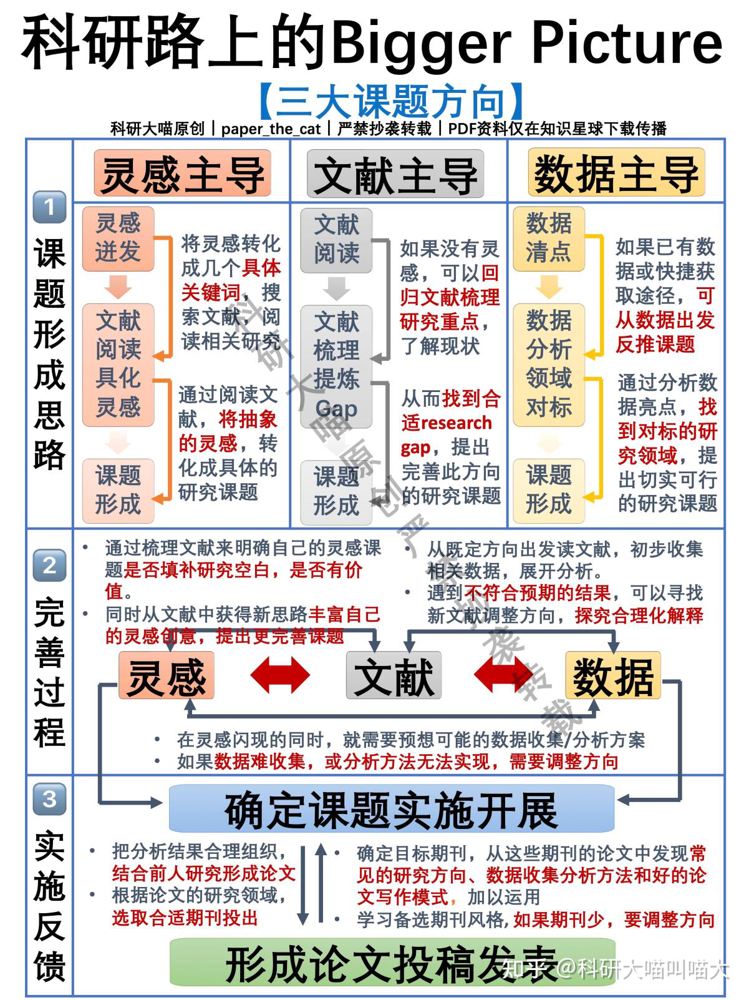
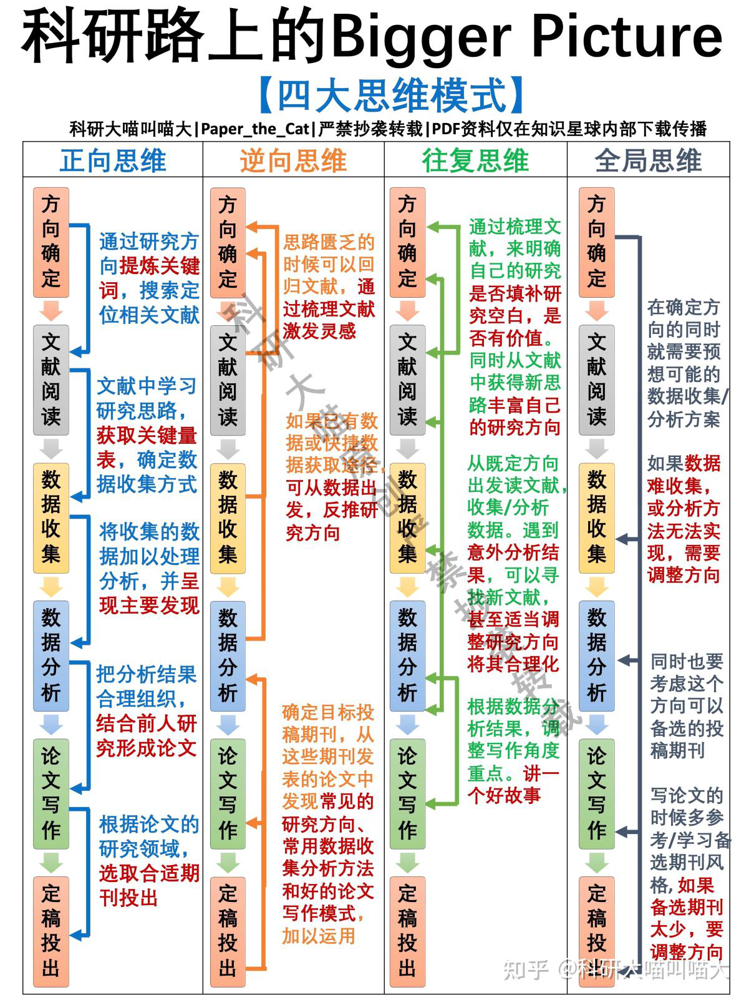
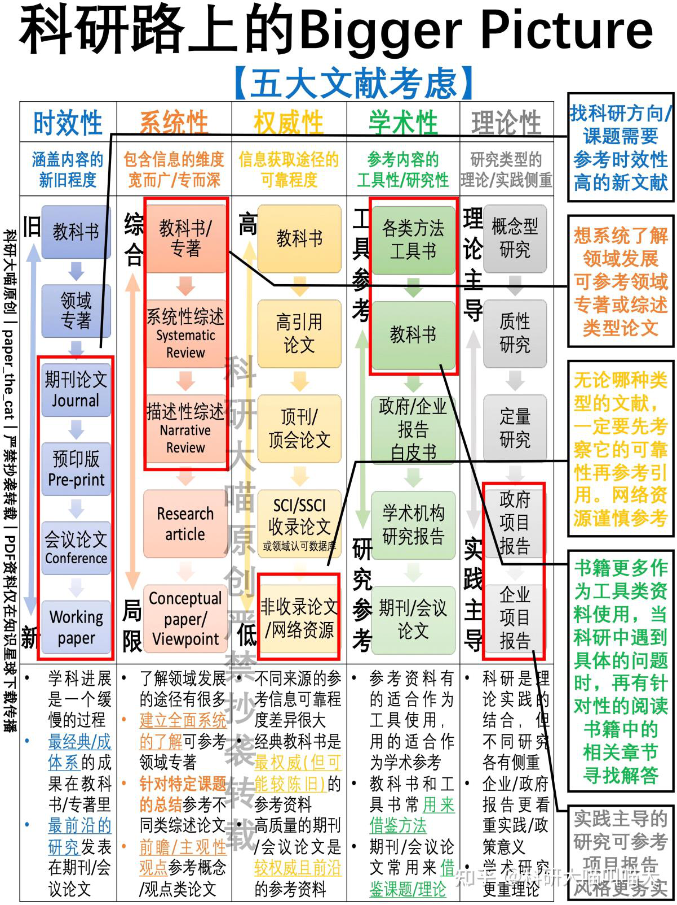
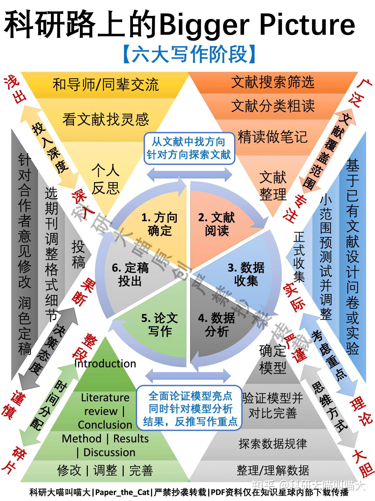
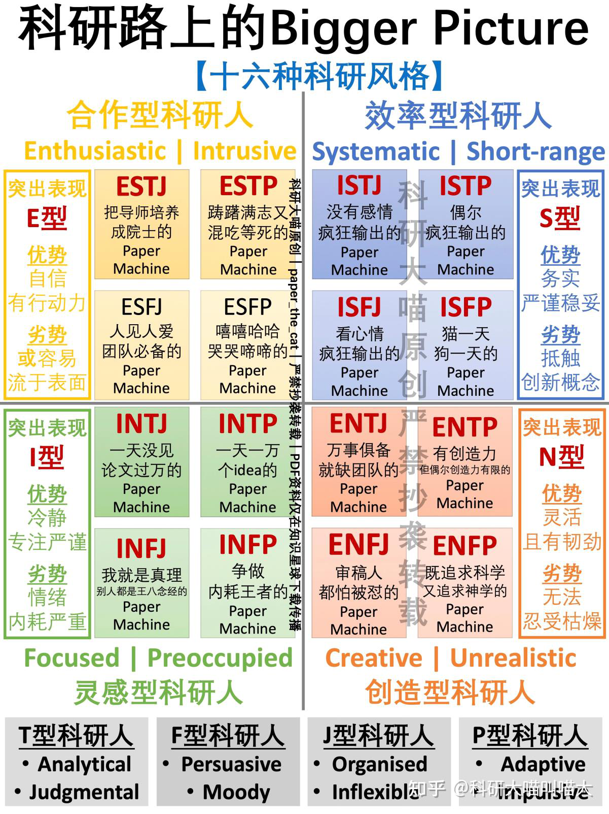
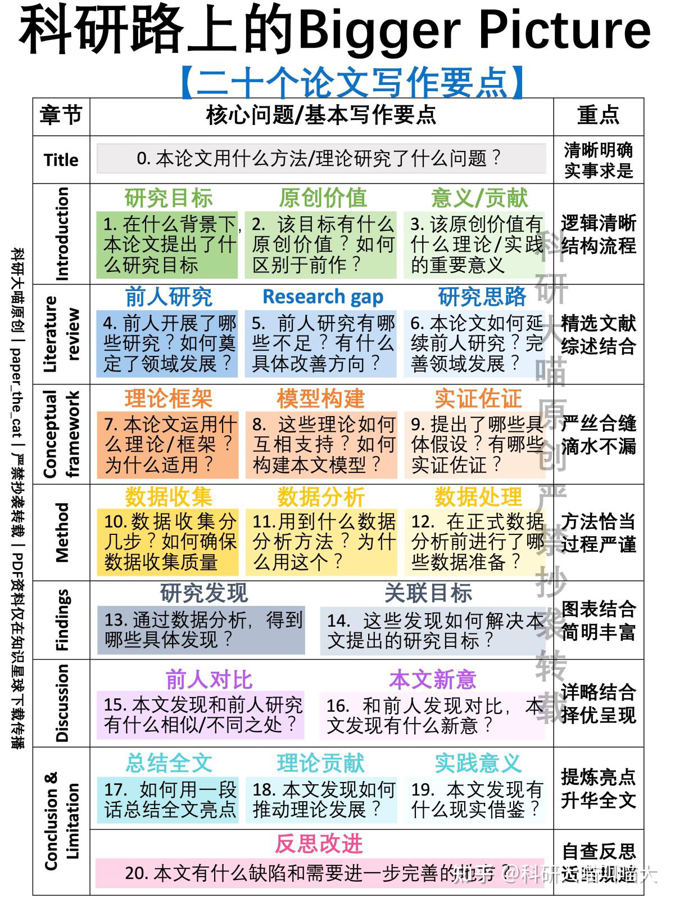

# 你的科研能力从什么时候开始突飞猛进的

你的科研能力从什么时候开始突飞猛进的？ - 知乎

星期六, 三月 23, 2024

2:38 下午

 

已剪辑自: [https://www.zhihu.com/question/524855881/answer/3132052781]{.underline}

从不再纠结科研的【意义】开始
----------------------------

或者说是明白"意义"这件事情，并不会客观存在，而是把课题中的"故事"说圆了，意义就有了。

和大家分享一下怎样由浅入深讲好科研的故事，先来一张图划重点！

 

具体来说，包含以下八个角度

-   研究背景：某社会背景下，现象X逐渐兴起，引起社会热议

-   研究现状：作为新兴现象，针对该现象的学术研究十分稀缺，理论理解更是空白

-   研究目标：通过运用某理论到某领域，探索现象X的理论成因

-   研究贡献：提出/验证现象X形成的理论基础，提供管理意见，实践操作建议

### 2. 从【新人群】切入

-   研究背景：某发展背景下，[现象X]{.underline}得到了越来越广泛的发展

-   研究现状：现有针对现象X的研究大多在某人群/地区开展，但在本文针对的人群/地区里尚待研究

-   研究目标：通过运用某理论到某人群/地区，探索现象X在特定范围的成因

-   研究贡献：验证某理论在本研究范围适用性，为现象X针对某人群/地区的管理提供实践建议

### 3. 从【新发展】切入

-   研究背景：在某特定发展趋势的驱动下，现象X发生了潜移默化的转变

-   研究现状：虽然前人已经从 A，B，C 等多个方向对现象X进行研究，却忽略了某趋势带来的新的DEF因素

-   研究目标：通过运用某(与时俱进的)理论框架，重新审视现象X的成因/发展趋势

-   研究贡献：为现象X的发展形成提供新的理论视角，改进管理意见和实践建议

### 4. 从【研究的两面性】切入

-   研究背景：一直以来，现象X是被媒体/学者共同关注的对象，存在一定的社会争议，引发讨论

-   研究现状：前人学者大多针对现象X的积极面A，B，C开展研究，却忽略它潜在的D，E，F风险

-   研究目标：通过运用某辩证理论/角度，探索现象X存在的多面性和不同表现形式成因

-   研究贡献：为现象X提供更全面的理论基础，为针对现象X的实际应用提供更完善/稳妥的建议

 

-   研究背景：现象X是某领域的主要研究课题，累计了丰富的研究发现

-   研究现状：对于现象X的成因，有的支持A说法，有的支持B说法，目前缺乏统一结论

-   研究目标：通过运用某个可以统一AB两方说法的理论框架，探索现象X成因的中介/[调节变量]{.underline}

-   研究贡献：调和已有研究中存在的矛盾，提供新理论解释，提出新实践建议

### 6. 从【分支整合】切入

-   研究背景：现象X是某领域经久不衰的课题，诞生了不同学术分支，各有侧重

-   研究现状：分支A侧重因素AA，分支B侧重因素BB，但尚不存在一个将分支Ab同时纳入考虑的综合模型

-   研究目标：通过运用某个可以整合AB分支的理论框架，多角度探索/对比现象X理论成因

-   研究贡献：整合现有研究中的杂乱分支，提出/验证综合模型，提出更全面的实践建议

### 7. 从【领域渗透】切入

-   研究背景：现象X是某领域的成熟课题，为许多相关研究奠定了基础

-   研究现状：近期针对新兴现象Y引来了很多研究，[现象Y]{.underline}和X有很多相似之处，现象X的研究很有借鉴价值

-   研究目标：通过借鉴针对现象X的成熟发现和理论框架，探索现象Y的理论成因

-   研究贡献：延伸现象X的发现/理论框架到新领域Y，为现象Y的研究提供理论基础

### 8. 从【跨学科】切入

-   研究背景：现象X是一个成体系的研究领域，积累了几代学者的研究成果

-   研究现状：新兴现象Y和X有千丝万缕的联系，两者的联系为[跨学科研究]{.underline}提供可能

-   研究目标：通过整合两个学科的关联之处，提出跨学科的综合理论框架

-   研究贡献：提出新兴跨学科领域，促进领域XY的延伸和融合

说明一下啦，这里不是让大家多做"表面工夫"，而是如何有效的呈现自己论文的角度和亮点，希望大家觉得有用啦。

以防被杠，说明一下：

我个人经验来看，【意义】是自己一步步慢慢理解慢慢找到。我的博士课题就是个非常粗浅的用户对科技接受程度的系列研究，可以说没有什么真正的意义（好在我当时一心只想毕业，只要能毕业，管他呢？所以并没有什么意义不意义的反思\[捂脸\]）

毕业之后的这些年，才慢慢有机会稍微深入一点的切入自己感兴趣的课题，从当初简单的科技接受行为，逐渐转到科技和人类的互动模式和相互渗透的方式，随着一点点新想法的融入，一篇篇论文推进课题，现在好像能找到一点课题中的乐趣和意义（虽然也不是什么上天入地的意义，但似乎有一些自己独到的见解了，也有了一点捍卫自己课题的理直气壮），我相信以后随着更多的思考投入到研究中，会找到更多可以说服自己的意义。

所以，寻找意义，可能是一个漫长的过程，是一个点滴积累才逐渐柳暗花明的过程。

不过科研这件事，读博的时候是份"手艺"，毕业后以此为生就是份"工作"，长久追求的话会成为一份"职业"，能有份有意义的职业当然是最好，但其实大多数人都在从事一份没有什么意义的职业，这也是常态啦。

借着这个问题分享一下硕博萌新在科研路上可能忽略掉的bigger picture！目光放远！如有神助！

有时候会感觉困难太大，不可战胜，可能只是因为太执着于当下的琐事，而忽略了全盘考虑，忽略了应该有的轻重缓急。其实一条路不通，还有第二条第三条第十条可以尝试所以无需在一条路走到黑，有一个懂得全盘考虑的【大局观】就很重要啊！汇总一下科研路上的bigger picture

两大方法思路（如下）
--------------------

探索式的思路走不通，就试试验证式，当然还可以两者结合

 

三大课题方向（如下）
--------------------

灵感、文献、数据结合起来，综合考虑找课题

 

四大思维模式（如下）
--------------------

正向、逆向、往复、整体考虑，不要陷入思维的死胡同

 

五大文献考虑（如下）
--------------------

文献的来源有很多，考虑文献的实效性、系统性、权威性、学术性和理论性，结合自己的需要，高效获取文献信息

 

六大写作阶段（如下）
--------------------

方向确定、文献阅读、数据收集、数据分析、论文写作、定稿投出，这条路不可能一帆风顺，不要卡在一个点，停滞不前的之后可以跳跃进行

 

十六种科研风格（如下）
----------------------

 

二十个论文要点（如下）
----------------------

其实一篇学术论文只需要解决20个小问题，掰开了揉碎了，难题就迎刃而解了

 

总之，【格局】大了，困难就小啦！（其实也算不上什么格局啦，就是多一点全盘考虑！）

每周更新｜每天答疑｜年费订阅

科研大喵原创｜严禁抄袭转载
�
��
�
