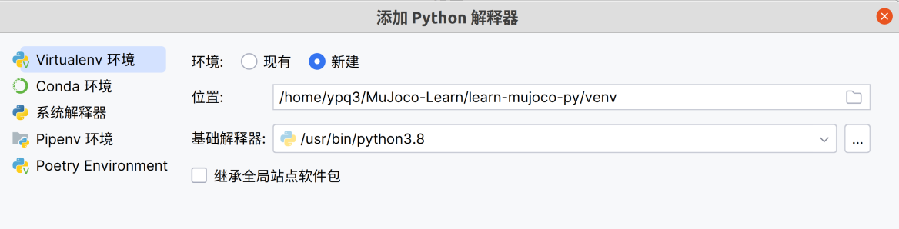
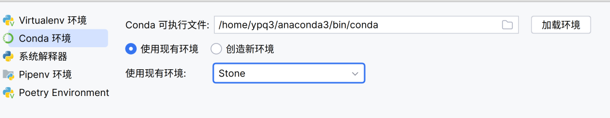

## CGAL库

### 总目标

- 基于随机点 拟合为凸多边形
- 基于接触的点生成相关几何计算
  - 支撑多边形Si
  - 法向向量-PCA

### 执行

- 版本

  | ss           | ss                    | ss   |
  | ------------ | --------------------- | ---- |
  | Ubuntu 20.04 | CGAL 5.0.2(Doc-5.0.4) |      |

- 编译

> 1. `-DCGAL_DIR=$CMAKE_INSTALLED_PREFIX/lib/CGAL`：这是一个 **CMake** 选项，用于设置 `CGAL_DIR` 变量的值。
>    - `-D`：表示我们正在设置一个 **CMake** 变量。
>    - `CGAL_DIR`：要设置的 **CMake** 变量的名称。
> 2. $CMAKE_INSTALLED_PREFIX：要分配给CGAL_DIR变量的值。
>    - `$CMAKE_INSTALLED_PREFIX`：这是一个占位符，表示 **CGAL** 安装的实际安装前缀（目录）。通常设置为 **CGAL** 库、头文件和其他文件所在的目录。
>    - `/lib/CGAL`：这是安装前缀内 **CGAL** 库所在的相对路径。
>
> 总之，这个命令用于配置一个 **CMake** 项目，能够找到 **CGAL** 库，通过指定 **CGAL** 安装的位置。实际的 `$CMAKE_INSTALLED_PREFIX` 值应该替换为用户系统上 **CGAL** 安装的正确路径。

```shell
cmake -DCGAL_DIR=$CMAKE_INSTALLED_PREFIX/lib/CGAL -DCMAKE_BUILD_TYPE=Release .
cmake -DCGAL_DIR=$CMAKE_INSTALLED_PREFIX/lib/CGAL 
make
```

- learn-CGAL

  - https://github.com/DengMen/learnCGAL

  - Debug

    - 编辑`CMakelists.txt`，删除`>>>>>这两行`

    - 关于调用报错

      - > system("pause")替换为  int res=system("pause");
        >
        > https://blog.csdn.net/gdizcm/article/details/120910858

- 软件包及相关任务

| 任务                           |                              包                              | 位置                                               |
| ------------------------------ | :----------------------------------------------------------: | -------------------------------------------------- |
| 点云简化                       | [Point Set Processing](https://doc.cgal.org/5.0.4/Point_set_processing_3/index.html#Chapter_Point_Set_Processing) | _3/wlop_simplify_and_regularize_point_set_example. |
| 三维点集转为二维点集           | [Principal Component Analysis] (https://doc.cgal.org/5.0.4/Principal_component_analysis/index.html#Chapter_Principal_Component_Analysis) | /linear_least_squares_fitting_triangles_3.         |
| 德劳内三角计构建多边形、法向量 | [2D Segment Delaunay Graphs](https://doc.cgal.org/5.0.4/Segment_Delaunay_graph_2/index.html#Chapter_2D_Segment_Delaunay_Graphs) | _2/sdg-fast-sp-polygon.                            |

- 软件包：`CGAL-pre`

  - `CMakeLists编写`

- 软件包：`CGAL-learn-demo`

  - `CMakeLists编写`

    - `Geomview`

      - ```shell
        sudo apt install geomview
        ```

### link to Envs

- 方案

> 1. **pybind11**：
>    - **上手难度**：中等
>    - **稳定性**：良好
>    - 说明：
>      - **pybind11** 是一个用于将 **C++** 代码绑定到 **Python** 的库。
>      - 它使用 **C++** 模板和编译时内省来生成包装代码。
>      - **pybind11** 语法类似于 **Boost Python**，但更现代且活跃。
>      - 需要一些 **C++** 和 **Python** 的知识，但它的稳定性较高。
> 2. **SWIG**：
>    - **上手难度**：中等
>    - **稳定性**：良好
>    - 说明：
>      - **SWIG** 是一个用于生成 **C++** 和其他语言（包括 **Python**）之间绑定的工具。
>      - 它支持多种语言，不仅限于 **Python**。
>      - 需要一些配置和学习成本，但它的稳定性较高。
> 3. **Boost.Python**：
>    - **上手难度**：中等
>    - **稳定性**：良好
>    - 说明：
>      - **Boost.Python** 是一个用于将 **C++** 代码绑定到 **Python** 的库。
>      - 它是 **Boost** 库的一部分，因此需要安装 **Boost**。
>      - 需要一些配置和学习成本，但它的稳定性较高。

### 编译 CMake相关问题

- > -- NOTICE: a few examples require TBB and will not be compiled.

  - 示例代码依赖于Intel Threading Building Blocks（TBB）
  - 安装

    ```shell
    sudo apt update
    sudo apt install libtbb-dev
    ```

- > NOTICE : LAS IO requires LASlib and will not be available.
  >
  > NOTICE: Classification IO functions require Boost IO Streams, and will not be compiled.

  - ```shell
    sudo apt install liblas-dev
    sudo apt-get install libboost-iostreams-dev
    ```

  - 

### Swig-CGAL

- 源码参考

https://github.com/CGAL/cgal-swig-bindings?tab=readme-ov-file

https://github.com/CGAL/cgal-swig-bindings/wiki

- 安装

  - **Prerequisite**

    - Swig 2.0 or newer

      - > **install**
        >
        > ```shell
        > sudo apt install swig
        > swig -version
        > ```
        >
        > **Usage**
        >
        > 创建一个 C 文件（例如 `example.c`），其中包含你想要扩展到 Python 的功能。
        >
        > 创建一个接口文件（例如 `example.i`），在其中声明你的 C 函数和变量。
        >
        > 编译接口文件，生成 Python 接口模块：
        >
        > ```shell
        > swig -python example.i
        > ```
        >
        > 编译 C 文件和生成的包装文件：
        >
        > ```shell
        > gcc -fPIC -c example.c example_wrap.c -I /usr/include/python3.6
        > gcc -shared -fPIC example.o example_wrap.o -o _example.so
        > ```
        >
        > 在 Python 中导入 `_example` 模块并使用其中的函数。

  - **Build**

    - 查看CGAL路径：`/usr/lib/x86_64-linux-gnu/cmake/CGAL`
    
    - ```shell
      mkdir build/CGAL-5.0_release -p
      cd build/CGAL-5.0_release
      
      
      ## 可选
       cmake -DCGAL_DIR=/usr/lib/CGAL -DBUILD_PYTHON=ON -DBUILD_JAVA=OFF 
       cmake -DCGAL_DIR=/usr/lib/CGAL -DBUILD_PYTHON=OFF -DJAVA_OUTDIR_PREFIX=../../examples/java ../..
       cmake -DCGAL_DIR=/usr/lib/CGAL -DBUILD_JAVA=OFF -DPYTHON_OUTDIR_PREFIX=../../examples/python ../.. -DCMAKE_BUILD_TYPE=Release ..
       cmake -DCGAL_DIR=/usr/local/lib/cmake/CGAL -DBUILD_JAVA=OFF -DPYTHON_LIBRARIES=/usr/local/lib/python3.7 -DPYTHON_LIBRARY=/usr/local/Cellar/python/3.7.7/Frameworks/Python.framework/Versions/3.7/lib/libpython3.7.dylib -DPython_FRAMEWORKS=/usr/local/Cellar/python/3.7.7/Frameworks/Python.framework -DPYTHON_INCLUDE_DIR=/usr/local/Cellar/python/3.7.7/Frameworks/Python.framework/Headers
       cmake -DCGAL_DIR=$CMAKE_INSTALLED_PREFIX/lib/CGAL -DBUILD_PYTHON=ON 
      ## 暂定
       cmake -DCGAL_DIR=$CMAKE_INSTALLED_PREFIX/lib/CGAL -DBUILD_JAVA=OFF -DPYTHON_OUTDIR_PREFIX=../../examples/python ../.. -DCMAKE_BUILD_TYPE=Release.
      make -j 4
      ```
    
    - **报错**
    
      - >CMake Error at CMakeLists.txt:210 (include):
        >  include could not find requested file:
        >
        >​				CGAL_Eigen3_support
    
      - 修改对应的`CMakeLists.txt`
    
      - > 原先：
        >
        > if (EIGEN3_FOUND)
        >
        >   include(CGAL_Eigen3_support)
        >
        > 修改后：
        >
        > if (EIGEN3_FOUND)
        >   include(${EIGEN3_USE_FILE})
    
    - **报错**
    
      - > CMake Error at /home/ypq3/.local/lib/python3.8/site-packages/cmake/data/share/cmake-3.27/Modules/UseSWIG.cmake:1071 (target_link_libraries):
        >   Target "CGAL_Polygon_mesh_processing_python" links to:
        >
        > ​					CGAL::Eigen3_support
        >
        >   but the target was not found.  Possible reasons include:
        >
        > * There is a typo in the target name.
        > * A find_package call is missing for an IMPORTED target.
        > * An ALIAS target is missing.
    
      - 修改`CMakeLists.txt`
    
      - > 修改前：
        >
        > find_package(Eigen3 3.1.0)
        >
        > 修改后（暂时不需要）：
        >
        > find_package(CGAL REQUIRED COMPONENTS Eigen3)
        >
        > 修改前：所有的
        >
        > SET (LIBSTOLINKWITH CGAL_Kernel_cpp CGAL::Eigen3_support)
        >
        > 修改后：
        >
        > ```cmake
        > SET (LIBSTOLINKWITH CGAL_Kernel_cpp ${EIGEN3_LIBRARIES})
        > ```
    
    - `Make -j 4 报错`
    
      - 文件：`/home/ypq3/CGAL-learn/cgal-swig-bindings/SWIG_CGAL/Common/macros.h`
    
        - > 17行修改为：#include <CGAL/is_iterator.h>
    
      - 文件：`/home/ypq3/CGAL-learn/cgal-swig-bindings/SWIG_CGAL/Alpha_wrap_3`
    
        - > 修改库为：Alpha_shapes_3.h
    
      


### Pybind 11 CGAL

- 参考
  - https://github.com/HexUp/try_pybind11
  - 
  - 【如何在Python中调用C++代码？pybind11极简教程】https://www.bilibili.com/video/BV1jr421W71p?vd_source=a16f4c6f7a2a235c328816d5509362e9

#### 操作

- 官方仓库

  - ```shell
    https://github.com/pybind/pybind11.git extern/pybind11
    ```

##### 使用：

- 项目架构

  - 软件包移动至文件夹：`extern`下

  - `CMakelist.tx`

- Build

  ```shell
  mkdir build
  cd build
  cmake ..
  make
  ```

  - 报错1：缺少`pytest 3.1`

    - ```shell
      /usr/bin/python3.8 -m pip install pytest
      ```

  - 报错2：缺少`catch`

    - 修改`cmake ..`为`cmake .. -DDOWNLOAD_CATCH=ON`

- 关于IDE中不能`import`这件事

  - > 你的脚本使用的是在`/home/ypq3/anaconda3/envs/Stone/bin/python`的Python环境，而你的终端使用的是在`/home/ypq3/anaconda3/bin/python`的Python环境。你的`example`模块可能已经安装在你的终端的Python环境中，但还没有安装在你的脚本的Python环境中。
    >
    > 要解决这个问题，你可以尝试以下方法：
    >
    > 1. **更改你的脚本的Python解释器**：你可以将你的脚本的第一行（也就是shebang行）更改为`#!/home/ypq3/anaconda3/bin/python`。这样，当你运行你的脚本时，它将使用和你的终端相同的Python环境。
    > 2. **在你的脚本的Python环境中安装`example`模块**：你可以激活你的脚本的Python环境（使用命令`source /home/ypq3/anaconda3/envs/Stone/bin/activate`），然后在这个环境中安装`example`模块。
    > 3. **在你的IDE中更改Python解释器**：如果你正在使用一个IDE（如PyCharm、VS Code等）来运行你的脚本，你可以在IDE的设置中更改Python解释器。你应该选择和你的终端相同的Python解释器。

  - `.py`文件导入build目录下就可以引用

  - 编辑`CMakeLists.txt`

    ```shell
    # 设置解释器路径
    set(PYTHON_EXECUTABLE "/home/ypq3/anaconda3/envs/Stone/bin/python")
    # 保存python动态库
    set(PYTHON_INCLUDE_DIRECTORY "/home/ypq3/anaconda3/envs/Stone/lib/python3.10/site-packages")
    ```


### 编译CGAL-processing

- 优化后的编译操作

```shell
# delete the cmake and make garbage
rm -rf build/*
# build
mkdir build
cd build
cmake ..
make
```

- `CMakeLists.txt`


- bug1：找不到头文件

> /home/ypq3/CGAL-learn/pybind11-CGAL/src/1.WLOP_points_set_simplify.cpp:10:10: fatal error: pq/0.mytypes.h: 没有那个文件或目录
>    10 | #include "pq/0.mytypes.h"

加当前项目的头文件检索路径

``` shell
include_directories(${CMAKE_SOURCE_DIR}/include)
```

- bug2：没有权限在usr路径下生成ld文件

> /usr/bin/ld: cannot open output file /usr/lib/x86_64-linux-gnu/1: 权限不够
> collect2: error: ld returned 1 exit status

cmake的输出文件路径出错！

```shell
set(CMAKE_RUNTIME_OUTPUT_DIRECTORY ${CMAKE_BINARY_DIR}/bin)
```

- 修改编译指令

```shell
# 此前指令
cmake -DCGAL_DIR=$CMAKE_INSTALLED_PREFIX/lib/CGAL
# CMakeLists.txt添加：
set(CGAL_DIR "$ENV{CMAKE_INSTALLED_PREFIX}/lib/CGAL")
```

- Bug:段错误、核心已转储

> 看起来你在使用计算几何算法库（CGAL）时遇到了一个错误。错误信息表明在`Triangulation_3.h`文件中违反了前提条件。这通常意味着函数`tester(d)`在第1333行所做的一些假设没有得到满足。
>
> 错误信息是中文，翻译为"已放弃 (核心已转储)"。这通常发生在程序引起段错误的情况，可能是由于访问了"不属于它的"内存。
>
> 没有更多的上下文，很难提供具体的解决方案。然而，这里有一些一般性的建议：
>
> - 检查输入到`tester(d)`函数的内容，确保它满足函数的前提条件。
> - 确保你没有试图访问未分配的内存，或者已经被释放的内存。
> - 如果你在使用指针，确保它们被正确地初始化和使用。
>
> 如果你能提供更多关于你试图实现什么以及相关代码的细节，我可能会更有效地帮助你。

- 当前节点

  - 成功
  - 源码包：`CGAL-mycode`

  ```shell
  ├── bin
  │   ├── data
  │   ├── main_cgal
  │   └── WLOP_points_set_simplify
  ├── build
  │   ├── __
  │   ├── CMakeCache.txt
  │   ├── CMakeFiles
  │   ├── cmake_install.cmake
  │   ├── libcomputation.a
  │   ├── libgv_utils.a
  │   ├── libpca_analysis.a
  │   ├── libprjt_p2plane.a
  │   ├── libwlop.a
  │   └── Makefile
  ├── build_log.md
  ├── CMakeLists.txt
  ├── extern
  │   └── pybind11
  ├── include
  │   ├── CGAL-official
  │   └── pq
  └── src
      ├── 0.gv_utils.cpp
      ├── 1.wlop_points_set_simplify.cpp
      ├── 2.pca_analysis.cpp
      ├── 3.projection_point2plane.cpp
      ├── 4.computation.cpp
      └── main_cgal_process.cpp
  ```

  

## MuJoco python API

- 参考-example Demo
  - MuJoCo-py 
    - 官方
      - examples/
        - [`body_interaction.py`](https://github.com/openai/mujoco-py/blob/master/examples/body_interaction.py)：显示碰撞体之间的相互作用
        - [`disco_fetch.py`](https://github.com/openai/mujoco-py/blob/master/examples/disco_fetch.py)：显示如何使用`TextureModder`随机化对象纹理
        - [`internal_functions.py`](https://github.com/openai/mujoco-py/blob/master/examples/internal_functions.py)：显示如何调用原始mujoco函数，如`mjv_room2model`
        - [`markers_demo.py`](https://github.com/openai/mujoco-py/blob/master/examples/markers_demo.py)：显示如何向查看器添加仅可视化的几何图元
        - [`serialize_model.py`](https://github.com/openai/mujoco-py/blob/master/examples/serialize_model.py)：显示如何保存和恢复模型
        - [`setting_state.py`](https://github.com/openai/mujoco-py/blob/master/examples/setting_state.py)：显示如何将模拟重置为给定状态
        - [`tosser.py`](https://github.com/openai/mujoco-py/blob/master/examples/tosser.py)：显示了一个简单的驱动物体分拣机器人应用程序
    - 文档
      - https://openai.github.io/mujoco-py/build/html/index.html

### 学习官方案例

#### 环境配置

- 报错

  - > 在 'imported module mujoco_py' 中找不到引用 'load_model_from_xml'

  - 处理

    - 查找`mujoco-py`包相关信息

    ```shell
    pip list
    pip show mujoco-py
    ```

    - 在环境中，重新安装`mujoco-py`

    ```shell
    pip install mujoco-py==2.1.2.14
    ```

- 重新配置`Mujoco210`

  > - 创建：`/home/.mujoco`
  > - 解压并更名为：`mujoco210`
  > - 添加环境变量：`.bashrc`
  >
  > ```shell
  > export LD_LIBRARY_PATH=$LD_LIBRARY_PATH:/home/($ username)/.mujoco/mujoco210/bin
  > export MUJOCO_KEY_PATH=/home/($ username)/.mujoco${MUJOCO_KEY_PATH} 
  > ```
  >
  > - 启动：
  >
  > ```shell
  > cd ~/.mujoco/mujoco210/bin
  > ./simulate ../model/humanoid.xml
  > ```
  >
  > - 配置密钥**可能暂时不需要**：将文件 `mjkey.txt` 复制到` home/.mujoco`和 `home/.mujoco/mujoco210/bin`

- 为项目新建环境

  - `文件>>设置`

  

  

- 新环境`venv`

  - 安装所需软件包

  - ```shell
    ##激活
    source venv/bin/activate
    ##关闭
    deactivate
    ##安装 
    pip install mujoco-py
    ```

  - 激活Conda

  - ```shell
    1.重新激活Conda
    .bashrc 添加
    export PATH=/home/ypq3/anaconda3/bin:$PATH
    2.重启shell
    conda init
    3.再次重启shell
    ```

- 报错

  - >Exception: 
    >Missing path to your environment variable. 
    >Current values LD_LIBRARY_PATH=
    >Please add following line to .bashrc:
    >export LD_LIBRARY_PATH=$LD_LIBRARY_PATH:/home/ypq3/.mujoco/mujoco210/bin

  - 解决

    - https://blog.csdn.net/weixin_43348762/article/details/127923621

- 报错

  - > Exception:  You appear to be missing MuJoCo.  We expected to find the file here: 

  - 解决：卸载mujoco及mujoco-py 并重装gym[mujoco]

  - ```shell
    pip uninstall mujoco-py
    pip install gym[mujoco] -i https://pypi.tuna.tsinghua.edu.cn/simple
    pip uninstall mujoco
    ```


#### 学习

- 教程

https://colab.research.google.com/github/google-deepmind/mujoco/blob/main/python/tutorial.ipynb#scrollTo=8a8hswjjKyIa

## Mujoco学习

- sample案例make

``` shell
cd sample 
make
```

## 环境学习

### Anaconda

- 图像化

```shell
## 图形化界面工具安装
sudo apt-get install -y libgl1-mesa-glx libegl1-mesa libxrandr2 libxrandr2 libxss1 libxcursor1 libxcomposite1 libasound2 libxi6 libxtst6
### 启动图形化管理界面
anaconda-navigator
## 安装navigator
conda install -c anaconda anaconda-navigator
## 图形化环境变量
export LIBGL_DRIVERS_PATH=/usr/lib/x86_64-linux-gnu
export LIBXCB_DRI2_LIBS_PATH=/usr/lib/x86_64-linux-gnu
## 开启jupyter
jupyter notebook
```

### python环境变量

```shell
## 菜鸟
export PATH="$PATH:/usr/local/bin/python" 
```


| 变量名        | 描述                                                         |
| ------------- | ------------------------------------------------------------ |
| PYTHONPATH    | PYTHONPATH是Python搜索路径，默认我们import的模块都会从PYTHONPATH里面寻找。 |
| PYTHONSTARTUP | Python启动后，先寻找PYTHONSTARTUP环境变量，然后执行此变量指定的文件中的代码。 |
| PYTHONCASEOK  | 加入PYTHONCASEOK的环境变量, 就会使python导入模块的时候不区分大小写. |
| PYTHONHOME    | 另一种模块搜索路径。它通常内嵌于的PYTHONSTARTUP或PYTHONPATH目录中，使得两个模块库更容易切换。 |

# pybind学习

## 资料/参考

### github-翻译中文文档

- https://github.com/charlotteLive/pybind11-Chinese-docs/tree/main

```shell
sudo install mdbook
mdbook init my-book
mdbook build my-book
#实际
snap install mdbook
# 生成书籍 -src上层目录下
mdbook build my-book
```

- `book.tmol`

> [book]
> authors = ["wuqiang"]
> language = "zh"
> multilingual = false
> src = "src"
> title = "pybind11中文文档"

- build doc by sphinx

```shell
cd docs
make html
```

### Example-learn

- https://github.com/tdegeus/pybind11_examples?tab=readme-ov-file
- 路径：CGAL:learn-pybind11

- usage

```cmake
c++ -O3 -shared -std=gnu++11 -I ./pybind11/include `python3-config --cflags --ldflags --libs` example.cpp -o example.so -fPIC
## CMake
cmake_minimum_required(VERSION 2.8.12)
project(example)

add_subdirectory(pybind11)
pybind11_add_module(example example.cpp)

find_package( PkgConfig )
pkg_check_modules( EIGEN3 REQUIRED eigen3 )
include_directories( ${EIGEN3_INCLUDE_DIRS} )

set(CMAKE_CXX_STANDARD 14)

python3 setup.py build
python3 setup.py install
```


## Ubuntu-网络断开连接

```shell
sudo service network-manager stop 
sudo rm /var/lib/NetworkManager/NetworkManager.state 
sudo service network-manager start
```

