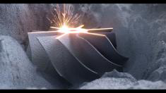
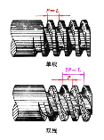
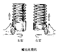

介绍一下螺纹结合的五大基本要素 - 知乎

星期一, 十二月 19, 2022

12:46 下午

 

已剪辑自: [https://zhuanlan.zhihu.com/p/342328045]{.underline}

螺纹的基本要素有：牙型、螺纹的基本尺寸、线数、导程和螺距、旋向。

牙型
----

在通过螺纹轴线的剖面上，螺纹的轮廓形状称螺纹牙型。常见的牙型有三角形、梯形、锯齿形等。本图所示的是三角形牙型。

 

 

螺纹的基本尺寸
--------------

**大径d（D）：**与外螺纹牙顶或内螺纹牙底相重合的假想圆柱体直径，是螺纹的最大直径。

**小径d1（D1）：**与外螺纹牙底或内螺纹牙顶相重合的假想圆柱体直径，是螺纹的最小直径。

**中径*d*2（*D*2）：**一个假想圆柱的直径，其圆柱母线通过牙型上沟槽和凸起宽度相等的地方。

**公称直径：**代表螺纹规格的直径，一般指螺纹大径尺寸。但管螺纹的公称直径不是指螺纹大径，而是指管子的公称直径。

 

部分普通螺纹的基本尺寸

线数（n）
---------

螺纹有单线和多线之分，沿一条螺旋线形成的螺纹称单线螺纹，沿两条或两条以上在轴向等距分布的螺旋线形成的螺纹，称多线螺纹。

 

 

导程（P）和螺距（L）
--------------------

**导程：**沿同一条螺旋线形成的螺纹上相邻两牙在中径线上对应两点间的轴向距离。

**螺距：**螺纹上相邻两牙在中径线上对应两点间的轴向距离。可见

导程=螺距×线数

双线螺纹的导程L＝P×2=2P

普通螺纹的螺距查表可得。

旋向
----

螺纹有右旋和左旋之分。当螺纹旋进时为顺时针方向旋转的，称为右旋螺纹；逆时针方向旋转的，称为左旋螺纹。右旋螺纹由于应用较多，故图纸上不必注明；而左旋螺纹则必须在图纸上注明左旋。

 

 

述五项是螺纹的基本要素，改变其中任何一顶，就会使螺纹规格不同。为了便于设计、制造与选用，国家标准对螺纹的牙型、大径、螺距都作了规定，凡这三项符合标准的，称为标准螺纹；牙型符合标准规定，大径或螺距不符合标准的称特殊螺纹；牙型不符合标准的称非标准螺纹。要使内外螺纹旋合，五要素应分别相同。

 

免责声明：本文来源于网络资料整理，仅供学习分享，严禁用于任何商业用途，后果自负。如涉及作品版权问题，请第一时间联系告知，我们将根据您提供的相关资料进行确认，并及时修改或删除。

**更多精彩内容请关注【公差帮APP】：**

各大应用市场搜索安装"公差帮GDT版"&"公差帮GPS版"
