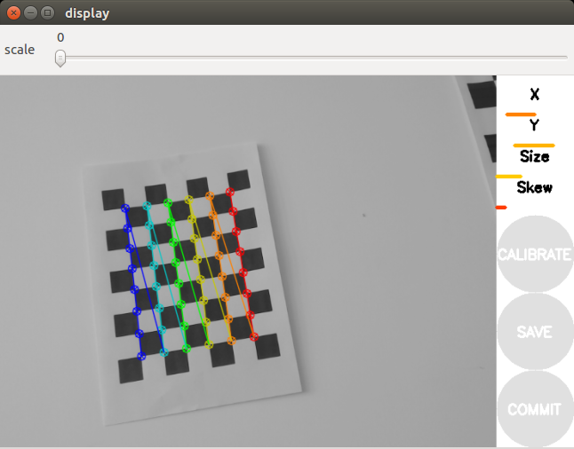

# 内参标定
## 网站
- 标定板生成网站

==注，要在linux下使用==
<https://calib.io/pages/camera-calibration-pattern-generator>

- 官网

  http://wiki.ros.org/camera_calibration/

## 启动标定
```shell
$ rosrun camera_calibration cameracalibrator.py --size 8x6-square 0.024 image:=/camera/color/image_raw
$ roslaunch realsense2_camera rs_camera.launch
```


> （1）--size 8x6： 为当前标定板的大小（如果你的棋盘格的小方格的个数是9x7，那么我们这里就写–size 8x6）
> （2）--square 0.108：为每个小棋盘格的边长，单位是米,上面打印的标定版尺寸
> （3）image:=/usb_cam/image_raw：标定当前订阅图像来源自名为/usb_cam/image_raw的topic
> （4）camera:=/usb_cam：为摄像机名
> 原文链接：https://blog.csdn.net/weixin_48319333/article/details/126342438

## 相机调节

```shell
$ rosrun rqt_reconfigure rqt_reconfigure
```

- 主要调整
  - 关闭结构光
  - 帧率由25 Hz调整至4 Hz

> 标定完成后点击Calculate会稍微有点卡顿，不要担心后台正在进行标定，完成后下面的SAVE和COMMIT按钮变为可用状态，点击SAVE即可保存标定完成后的文件。
>
> 点击commit即可把标定文件存储到系统的~/.ros/camera_info/xxx.yaml目录

## 标定结果的使用

- head_camera.yaml标定好的参数如下：

  ```yaml
  image_width: 640
  image_height: 480
  camera_name: head_camera
  camera_matrix:
    rows: 3
    cols: 3
    data: [517.5903341153015, 0, 323.3090435751261, 0, 517.7724331237808, 255.469742969125, 0, 0, 1]
  distortion_model: plumb_bob
  distortion_coefficients:
    rows: 1
    cols: 5
    data: [-0.05426751481755746, -0.03837743589544444, -0.002732448183023058, 0.007057077502912143, 0]
  rectification_matrix:
    rows: 3
    cols: 3
    data: [1, 0, 0, 0, 1, 0, 0, 0, 1]
  projection_matrix:
    rows: 3
    cols: 4
    data: [502.5735473632812, 0, 328.3470488253988, 0, 0, 511.0068969726562, 254.9924938559434, 0, 0, 0, 1, 0]```
  ```

  

  > image_height、image_width代表图片的长宽 camera_name为摄像头名
  > camera_matrix规定了摄像头的内部参数矩阵
  > distortion_model指定了畸变模型
  > distortion_coefficients指定畸变模型的系数
  > rectification_matrix为矫正矩阵，一般为单位阵
  > projection_matrix为外部世界坐标到像平面的投影矩阵
  >
  > 原文链接：https://blog.csdn.net/weixin_48319333/article/details/126342438
- 标定文件：`/tmp/calibrationdata.tar.gz`
- <kbd>ost.yaml</kbd>

```xml
<param name="camera_info_url" type="string" value="file://$(find)">
```

## 查看Intel-Realsense的内参

```shell
$ roslaunch realsense2_camera rs_camera.launch
$ rostopic echo /camera/color/camera_info
```

> 输出说明：
>
> D：表示相机的失真系数，其参数分别是(k1, k2, t1, t2, k3)
> K：内参矩阵，其参数(fx,0,cx,0,fy,cy,0,0,1)
> R: 3*3的旋转矩阵，仅对双目相机有效，使左右极线平行
> P: 投影矩阵，其参数分别是(fx’,0,cx’, Tx,0,fy,‘cy’,Ty,0,0,1,0)在单目相机中, T x = T y = 0 Tx=Ty=0 Tx=Ty=0
> ————————————————
> 原文链接：https://blog.csdn.net/weixin_42691563/article/details/126818521

https://blog.yanjingang.com/?p=6483#41

https://blog.csdn.net/m0_46611008/article/details/123996058?ops_request_misc=%257B%2522request%255Fid%2522%253A%2522165529539716782425139896%2522%252C%2522scm%2522%253A%252220140713.130102334..%2522%257D&request_id=165529539716782425139896&biz_id=0&utm_medium=distribute.pc_search_result.none-task-blog-2~all~baidu_landing_v2~default-4-123996058-null-null.142%5Ev16%5Epc_search_result_control_group,157%5Ev14%5Econtrol&utm_term=%E5%8D%95%E7%9B%AE%E7%9B%B8%E6%9C%BA%E5%86%85%E5%8F%82%E6%A0%87%E5%AE%9A&spm=1018.2226.3001.4187

https://mp.weixin.qq.com/s?__biz=MzU0NjgzMDIxMQ==&mid=2247591782&idx=3&sn=511cd9483b91ed13c6d58f36f16446cd&chksm=fb54858acc230c9c2d870a0edb6973d7d8107d135b94086520d194ebc8f9b92d7c346a489cca&scene=27
