# 强化学习

## 参考

https://zhuanlan.zhihu.com/p/158457613

https://www.mathworks.com/products/reinforcement-learning.html?s_tid=srchtitle

【强化学习/OpenAI】强化学习中的关键概念

https://blog.csdn.net/qq_33446100/article/details/117868833?spm=1001.2014.3001.5502

## 基础概念

### 控制系统的目标

控制系统的目标是确定生成期望的系统行为的正确系统输入（动作）

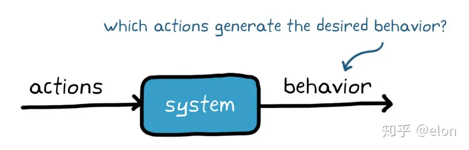

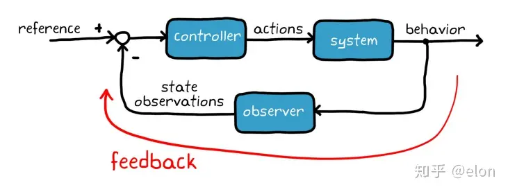

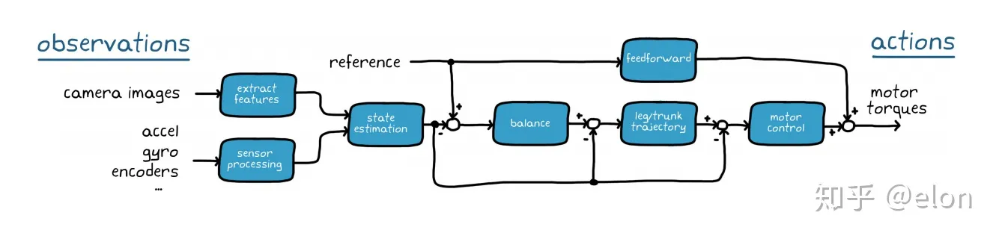

-  强化学习与传统控制系统设计的概念对比

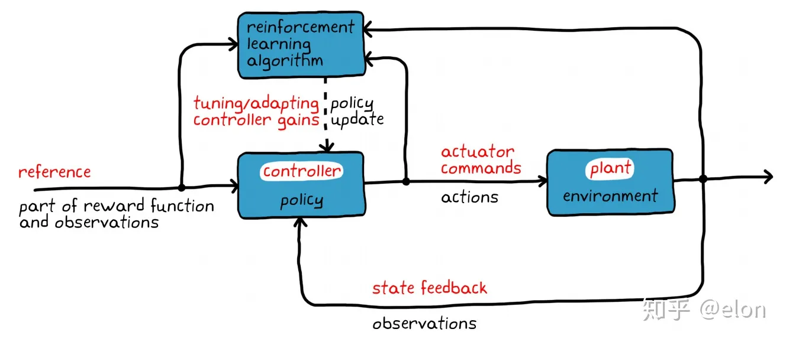

### 价值和奖励

奖励：处于某一状态或采取特定动作的即时收益

价值：代理预期从某一状态和往后将会获得的总回报

短视的好处？

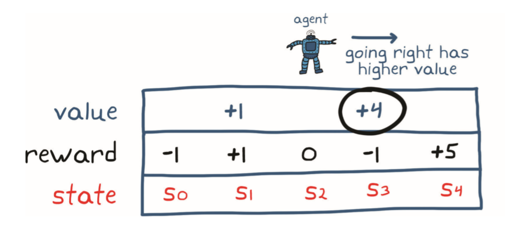

### 策略

智能体由策略和学习算法组成

策略是一种将观测量映射到行动的函数抽象

学习算法是用来获取最优策略的优化方法

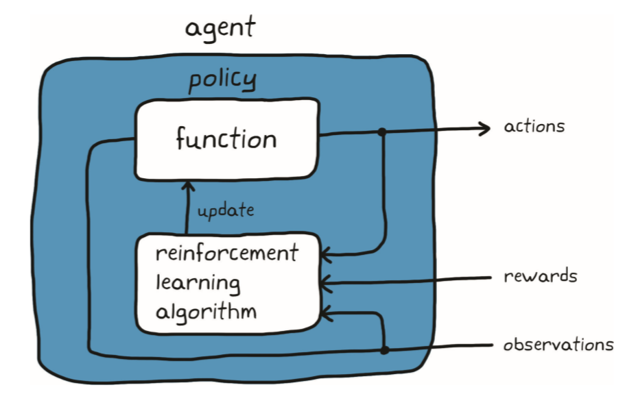

如何理解策略

- 简单的，策略是以状态观测为输入、以动作为输出的函数。任何具有这种输入和输出关系的函数都可以用于表示策略。

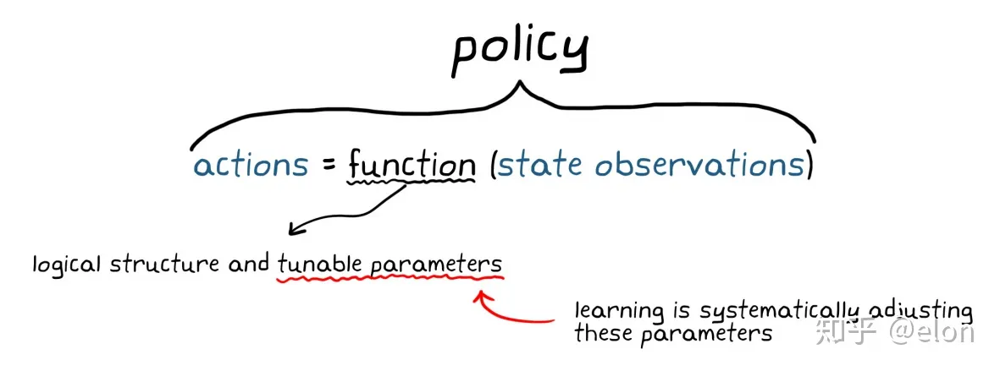

如何构造策略函数

- 直接：状态观测和动作间存在的特定映射
- 简介：由其他指标（价值）来判断最优映射关系

策略的表达形式

- 用表格
  - 状态和动作空间离散且稀少
  - Q-table

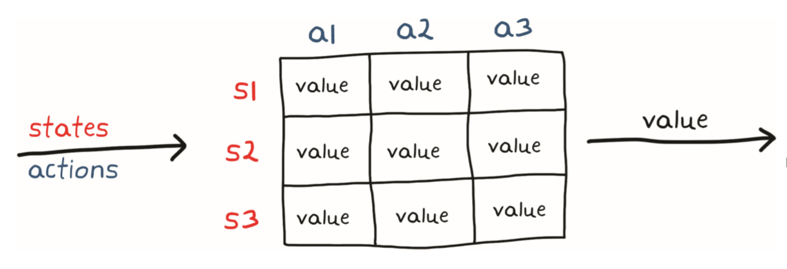

- 连续函数-神经网络
  - 连续的状态/动作空间
  - 特性函数：状态为输入、动作为输出
  - 通用函数逼近器：神经网络
  - 学习过程将包括系统地调节参数，找到最优输入/输出关系。

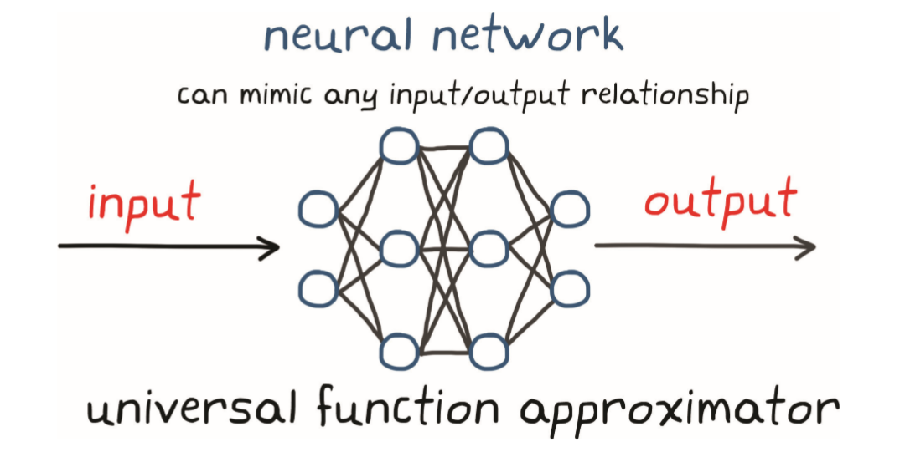

- 神经网络表示策略
  - 以大量的观测量为输入，并将其变换为能控制一些非线性环境的一组动作

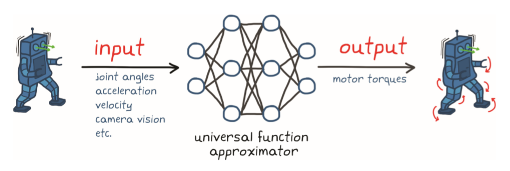

### 强化学习的环境

在强化学习中，与智能体相交互的所有内容都被称为环境，除去智能体之外的所有事物均为环境，环境有不同的类型，主要分为以下几个种类：

- **确定性环境**

这是一种根据当前的状态就可以知道相应结果的环境。比如在我们在下象棋的时候可以知道在移动一颗棋子后的确切结果。

- **随机性环境**

对比上一种环境，如果根据当前的状态无法知道相应结果，那就是随机环境。这样的环境存在较大的不确定性，比如掷骰子，我们无法预知即将出现的数字。

- **完全可观测环境**

如果智能体在任何时候都可以确定系统的状态，那就是一个完全可观测的环境。比如在下围棋的时候，我们可以知道棋盘上所有棋子的位置信息。

- **部分可观测环境**

如果智能体无法像上一种环境中那样，在任何时刻都确定系统状态，那就是部分可观测环境。比如我们在打斗地主的时候，我们只知道自己的牌，却无法知道对手的牌是什么。

- **离散环境**

如果从一个状态转移到另一个状态后只能有一个有限的行为状态，那就是离散的环境。比如在国际象棋中，只能有移动棋子后的有限集。

- **连续环境**

如果从一个状态到另一个状态后可以有无限个行为状态，那么就是连续环境。比如从A点到B点可以有无数条路。

- **情景和非情景环境**

在情景（非序贯）环境中，智能体的当前行为不会影响将来行为，执行的是独立任务。而在非情景（序贯）环境中，智能体当前的行为会影响未来的行为，智能体前后的行为是相关的。

- **单智能体和多智能体环境**

环境中有一个智能体就是单智能体，有多个智能体就是多智能体。在执行复杂任务时常使用多智能体环境，各智能体之间可以相互通信。多智能体环境具有较大程度的不确定性，所以大多是随机的。

### 强化学习算法

强化学习算法主要有两大分类，分别是免模型学习（Model-Free） vs 有模型学习（Model-Based），这两者的差别体现在：**智能体是否能完整了解或学习到所在环境的模型。**

有模型学习（Model-Based）对环境有提前的认知，可以提前考虑规划，但是缺点是如果模型跟真实世界不一致，那么在实际使用场景下会表现的不好。

免模型学习（Model-Free）放弃了模型学习，在效率上不如前者，但是这种方式更加容易实现，也容易在真实场景下调整到很好的状态。所以免模型学习方法更受欢迎，得到更加广泛的开发和测试。

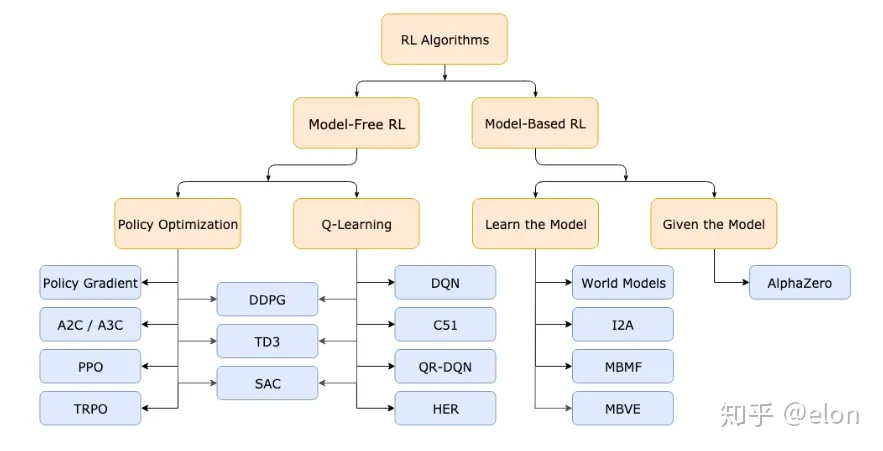

### 强化学习流程

- 强化学习算法（理解为学习方法）

  - 策略函数

    - 策略梯度

    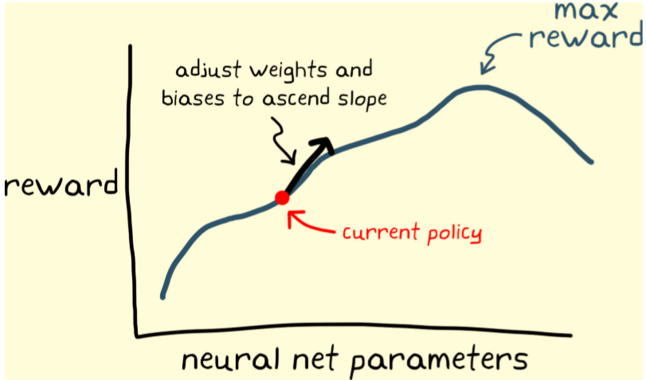

    - 随机策略

  - 价值函数

  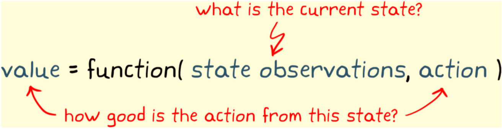

  - 执行器-评价器（Actor-critic）

  missing： v2-655f39f0f6b63fc1d8b8c8608f5e876f_1440w.webp

- 贝尔曼方程（用于更新价值）
  - 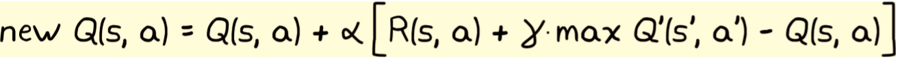

### 基于模型与否

- 基于模型的强化学习
  - 缩短学习最优策略所需的时间，使用模型指导代理远离已知的低奖励状态空间区域。
  - 在基于模型的强化学习中，不需要了解整个环境模型；只需为代理提供我们自己了解的那部分环境。

- 无模型 RL 更受欢迎，应用也更广泛，因为人们希望通过它来解决一些难以开发模型（甚至是简单模型）的问题。

# 初学者入门路线

机器学习参考

https://blog.csdn.net/xundh/article/details/72672900

# 强化学习算法

## 参考

- https://zhuanlan.zhihu.com/p/491909457
- 

## 研究范式

> 这是一个很好的问题！让我来解释一下这些算法。
>
> 1. [**DDPG (Deep Deterministic Policy Gradient)**: DDPG 是一种用于连续动作空间的强化学习算法](https://spinningup.openai.com/en/latest/algorithms/ddpg.html)[1](https://spinningup.openai.com/en/latest/algorithms/ddpg.html)[2](https://paperswithcode.com/method/ddpg)[3](https://docs.cleanrl.dev/rl-algorithms/ddpg/)[4](https://medium.com/intro-to-artificial-intelligence/deep-deterministic-policy-gradient-ddpg-an-off-policy-reinforcement-learning-algorithm-38ca8698131b)[5](https://arxiv.org/pdf/1911.11679.pdf)[。它是一种同时学习 Q 函数和策略的算法，使用离策略数据和贝尔曼方程来学习 Q 函数，并使用 Q 函数来学习策略](https://spinningup.openai.com/en/latest/algorithms/ddpg.html)[1](https://spinningup.openai.com/en/latest/algorithms/ddpg.html)。
> 2. [**TD3 (Twin Delayed Deep Deterministic Policy Gradient)**: TD3 是 DDPG 的改进版本，通过引入双 Q 学习、延迟策略更新和目标策略平滑等技巧来提高算法的性能和稳定性](https://spinningup.openai.com/en/latest/algorithms/ddpg.html)[6](https://spinningup.openai.com/en/latest/algorithms/td3.html)[7](https://www.mathworks.com/help/reinforcement-learning/ug/td3-agents.html)[8](https://docs.cleanrl.dev/rl-algorithms/td3/)[9](https://zhuanlan.zhihu.com/p/111334500)。
> 3. [**SAC (Soft Actor-Critic)**: SAC 是一种基于最大熵强化学习框架的深度强化学习算法](https://spinningup.openai.com/en/latest/algorithms/ddpg.html)[10](https://spinningup.openai.com/en/latest/algorithms/sac.html)[11](https://paperswithcode.com/method/soft-actor-critic)[12](https://medium.com/intro-to-artificial-intelligence/soft-actor-critic-reinforcement-learning-algorithm-1934a2c3087f)[13](https://zhuanlan.zhihu.com/p/566722896)[。它优化了一个随机策略，使得在期望回报的同时，也最大化了策略的熵，这与探索-利用权衡有着紧密的联系](https://spinningup.openai.com/en/latest/algorithms/ddpg.html)[10](https://spinningup.openai.com/en/latest/algorithms/sac.html)。
> 4. [**HER (Hindsight Experience Replay)**: HER 是一种可以与任何离策略 RL 算法（如 DDPG、TD3、SAC）结合使用的技术](https://spinningup.openai.com/en/latest/algorithms/ddpg.html)[14](https://di-engine-docs.readthedocs.io/en/latest/12_policies/her.html)[15](https://arxiv.org/abs/1707.01495)[。HER 利用了一个事实，即即使期望的目标没有达成，过去的经验中可能已经达成了其他目标。它通过重新标记过去经验中的转换（改变期望的目标）来创建“虚拟”转换](https://spinningup.openai.com/en/latest/algorithms/ddpg.html)[14](https://di-engine-docs.readthedocs.io/en/latest/12_policies/her.html)[15](https://arxiv.org/abs/1707.01495)。
>
> [这三个算法（DDPG、TD3、SAC）都是用于连续动作空间的深度强化学习算法，它们在处理连续控制任务时表现出了相对适应的策略](https://spinningup.openai.com/en/latest/algorithms/ddpg.html)[16](https://blog.csdn.net/zKAwJqD/article/details/135690862)[17](https://www.atlantis-press.com/proceedings/dai-23/125998066)[。因此，对这三个算法进行横向对比可以帮助我们理解它们在不同任务和环境中的性能差异。同时，通过将 HER 与这些算法结合，我们可以研究 HER 如何改进这些算法的性能](https://spinningup.openai.com/en/latest/algorithms/ddpg.html)[18](https://stable-baselines3.readthedocs.io/en/master/modules/her.html)[19](https://zhuanlan.zhihu.com/p/352909964)。

>  在过去的三年里，连续动作空间的深度强化学习领域有一些非常有影响力的论文。以下是一些你可能感兴趣的论文：
>
> 1. [**"Deep Reinforcement Learning in Continuous Action Spaces: a Case Study in the Game of Simulated Curling"**](http://proceedings.mlr.press/v80/lee18b/lee18b.pdf)[1](http://proceedings.mlr.press/v80/lee18b/lee18b.pdf)[2](https://paperswithcode.com/paper/deep-reinforcement-learning-in-continuous)[：这篇论文提出了一个新的自我对弈强化学习框架，该框架配备了一个连续搜索算法，可以在连续动作空间中进行搜索](http://proceedings.mlr.press/v80/lee18b/lee18b.pdf)[1](http://proceedings.mlr.press/v80/lee18b/lee18b.pdf)。
> 2. [**"An Overview of the Action Space for Deep Reinforcement Learning"**](http://proceedings.mlr.press/v80/lee18b/lee18b.pdf)[3](https://dl.acm.org/doi/epdf/10.1145/3508546.3508598)[：这篇论文提供了深度强化学习动作空间的概述，包括连续动作空间](http://proceedings.mlr.press/v80/lee18b/lee18b.pdf)[3](https://dl.acm.org/doi/epdf/10.1145/3508546.3508598)。
> 3. [**"Representation Learning for Continuous Action Spaces is Beneficial for Efficient Policy Learning"**](http://proceedings.mlr.press/v80/lee18b/lee18b.pdf)[4](https://arxiv.org/abs/2211.13257)[：这篇论文探讨了连续动作空间的表示学习对于高效策略学习的益处](https://arxiv.org/abs/2211.13257)[4](https://arxiv.org/abs/2211.13257)。
>
> [这些论文都在连续动作空间的深度强化学习领域做出了重要的贡献，并对该领域的发展产生了深远影响。希望这个答案对你有所帮助！如果你还有其他问题，欢迎继续提问。](http://proceedings.mlr.press/v80/lee18b/lee18b.pdf)[1](http://proceedings.mlr.press/v80/lee18b/lee18b.pdf)[2](https://paperswithcode.com/paper/deep-reinforcement-learning-in-continuous)[3](https://dl.acm.org/doi/epdf/10.1145/3508546.3508598)[4](https://arxiv.org/abs/2211.13257)
>
>  

> [在机器人智能算法领域，"将某些工作做成了baseline"通常是指将某种算法或方法作为基准（baseline）](https://datascience.stackexchange.com/questions/30912/what-does-baseline-mean-in-the-context-of-machine-learning)[1](https://datascience.stackexchange.com/questions/30912/what-does-baseline-mean-in-the-context-of-machine-learning)[。这个基准通常是一个已经被广泛接受和使用的算法或方法，它的性能已经被证明是可靠的](https://datascience.stackexchange.com/questions/30912/what-does-baseline-mean-in-the-context-of-machine-learning)[1](https://datascience.stackexchange.com/questions/30912/what-does-baseline-mean-in-the-context-of-machine-learning)。
>
> **意义**：
>
> 1. [**性能比较**：Baseline提供了一种方式来比较新的算法或方法的性能](https://datascience.stackexchange.com/questions/30912/what-does-baseline-mean-in-the-context-of-machine-learning)[2](https://www.atlassian.com/agile/project-management/project-baseline)[3](https://toggl.com/blog/what-is-a-project-baseline-and-why-is-it-important)[。如果新的算法在相同的任务和环境中比baseline表现得更好，那么我们就可以说新的算法是有改进的](https://datascience.stackexchange.com/questions/30912/what-does-baseline-mean-in-the-context-of-machine-learning)[2](https://www.atlassian.com/agile/project-management/project-baseline)[3](https://toggl.com/blog/what-is-a-project-baseline-and-why-is-it-important)。
> 2. [**理解改进**：Baseline也可以帮助我们理解新的算法或方法为什么会有改进](https://datascience.stackexchange.com/questions/30912/what-does-baseline-mean-in-the-context-of-machine-learning)[2](https://www.atlassian.com/agile/project-management/project-baseline)[3](https://toggl.com/blog/what-is-a-project-baseline-and-why-is-it-important)[。通过比较新的算法和baseline，我们可以更好地理解新的算法在哪些方面做得更好](https://datascience.stackexchange.com/questions/30912/what-does-baseline-mean-in-the-context-of-machine-learning)[2](https://www.atlassian.com/agile/project-management/project-baseline)[3](https://toggl.com/blog/what-is-a-project-baseline-and-why-is-it-important)。
>
> **影响**：
>
> 1. [**推动研究**：Baseline可以推动机器人智能算法领域的研究](https://www.atlassian.com/agile/project-management/project-baseline)[2](https://www.atlassian.com/agile/project-management/project-baseline)[3](https://toggl.com/blog/what-is-a-project-baseline-and-why-is-it-important)[。研究人员可以使用baseline来测试他们的新算法，看看是否有所改进](https://www.atlassian.com/agile/project-management/project-baseline)[2](https://www.atlassian.com/agile/project-management/project-baseline)[3](https://toggl.com/blog/what-is-a-project-baseline-and-why-is-it-important)。
> 2. [**标准化评估**：Baseline为评估新的算法提供了一种标准化的方式](https://www.atlassian.com/agile/project-management/project-baseline)[2](https://www.atlassian.com/agile/project-management/project-baseline)[3](https://toggl.com/blog/what-is-a-project-baseline-and-why-is-it-important)[。这使得不同的研究人员可以在同样的条件下比较他们的算法](https://www.atlassian.com/agile/project-management/project-baseline)[2](https://www.atlassian.com/agile/project-management/project-baseline)[3](https://toggl.com/blog/what-is-a-project-baseline-and-why-is-it-important)。
>
> [希望这个答案对你有所帮助！如果你还有其他问题，欢迎继续提问。](https://www.atlassian.com/agile/project-management/project-baseline)[2](https://www.atlassian.com/agile/project-management/project-baseline)[3](https://toggl.com/blog/what-is-a-project-baseline-and-why-is-it-important)[1](https://datascience.stackexchange.com/questions/30912/what-does-baseline-mean-in-the-context-of-machine-learning)
>
> ​                 

> [**TRPO (Trust Region Policy Optimization)**](https://spinningup.openai.com/en/latest/algorithms/trpo.html)[1](https://spinningup.openai.com/en/latest/algorithms/trpo.html)[2](https://arxiv.org/abs/1502.05477)[3](https://garage.readthedocs.io/en/latest/user/algo_trpo.html)[4](https://paperswithcode.com/method/trpo)[5](https://dilithjay.com/blog/trpo)
>
> - [**原理**：TRPO通过在策略更新时引入一个特殊的约束来优化策略，该约束限制了新策略和旧策略之间的接近程度](https://spinningup.openai.com/en/latest/algorithms/trpo.html)[1](https://spinningup.openai.com/en/latest/algorithms/trpo.html)[。这种约束以KL散度的形式表达，KL散度是一种衡量概率分布之间（类似但不完全相同的）距离的方法](https://spinningup.openai.com/en/latest/algorithms/trpo.html)[1](https://spinningup.openai.com/en/latest/algorithms/trpo.html)。
> - [**来源**：TRPO是由John Schulman等人在2015年提出的](https://arxiv.org/abs/1502.05477)[2](https://arxiv.org/abs/1502.05477)。
> - [**适用场景**：TRPO可以用于具有离散或连续动作空间的环境](https://spinningup.openai.com/en/latest/algorithms/trpo.html)[1](https://spinningup.openai.com/en/latest/algorithms/trpo.html)。
> - [**主要优势**：TRPO能够避免策略性能的崩溃，并倾向于快速且单调地提高性能](https://spinningup.openai.com/en/latest/algorithms/trpo.html)[1](https://spinningup.openai.com/en/latest/algorithms/trpo.html)。
>
> [**A3C (Asynchronous Advantage Actor Critic)**](https://spinningup.openai.com/en/latest/algorithms/trpo.html)[6](https://paperswithcode.com/method/a3c)[7](https://zhuanlan.zhihu.com/p/77523580)[8](https://www.activeloop.ai/resources/glossary/asynchronous-advantage-actor-critic-a-3-c/)[9](https://www.geeksforgeeks.org/explanation-of-fundamental-functions-involved-in-a3c-algorithm/)
>
> - [**原理**：A3C是一种策略梯度算法，它维护一个策略和一个价值函数的估计，它在前向视图中操作，并使用n步返回来更新策略和价值函数](https://paperswithcode.com/method/a3c)[6](https://paperswithcode.com/method/a3c)。
> - [**来源**：A3C是由Mnih等人在2016年提出的](https://spinningup.openai.com/en/latest/algorithms/trpo.html)[6](https://paperswithcode.com/method/a3c)。
> - [**适用场景**：A3C可以用于具有离散或连续动作空间的环境](https://paperswithcode.com/method/a3c)[6](https://paperswithcode.com/method/a3c)。
> - [**主要优势**：A3C的优点在于其并行性，多个actor在并行环境中训练，并定期与全局参数同步](https://zhuanlan.zhihu.com/p/77523580)[7](https://zhuanlan.zhihu.com/p/77523580)。
>
> [**PPO (Proximal Policy Optimization)**](https://spinningup.openai.com/en/latest/algorithms/trpo.html)[10](https://openai.com/research/openai-baselines-ppo)[11](https://spinningup.openai.com/en/latest/algorithms/ppo.html)[12](https://en.wikipedia.org/wiki/Proximal_Policy_Optimization)[13](https://medium.com/@brianpulfer/ppo-intuitive-guide-to-state-of-the-art-reinforcement-learning-410a41cb675b)
>
> - [**原理**：PPO试图在每一步都计算一个最小化代价函数的更新，同时确保新策略与旧策略的偏差相对较小](https://openai.com/research/openai-baselines-ppo)[10](https://openai.com/research/openai-baselines-ppo)。
> - [**来源**：PPO是由John Schulman等人在2017年提出的](https://spinningup.openai.com/en/latest/algorithms/trpo.html)[10](https://openai.com/research/openai-baselines-ppo)。
> - [**适用场景**：PPO可以用于具有离散或连续动作空间的环境](https://spinningup.openai.com/en/latest/algorithms/ppo.html)[11](https://spinningup.openai.com/en/latest/algorithms/ppo.html)。
> - [**主要优势**：PPO在实现复杂性、样本复杂性和调整容易性之间取得了平衡](https://openai.com/research/openai-baselines-ppo)[10](https://openai.com/research/openai-baselines-ppo)。
>
> [**SAC (Soft Actor-Critic)**](https://spinningup.openai.com/en/latest/algorithms/trpo.html)[14](https://spinningup.openai.com/en/latest/algorithms/sac.html)[15](https://zhuanlan.zhihu.com/p/385658411)[16](https://paperswithcode.com/method/soft-actor-critic)[17](https://medium.com/intro-to-artificial-intelligence/soft-actor-critic-reinforcement-learning-algorithm-1934a2c3087f)[18](https://zhuanlan.zhihu.com/p/566722896)
>
> - [**原理**：SAC是一种基于最大熵强化学习框架的深度RL算法](https://spinningup.openai.com/en/latest/algorithms/sac.html)[14](https://spinningup.openai.com/en/latest/algorithms/sac.html)[。在这个框架中，actor旨在最大化期望的奖励，同时也最大化熵](https://spinningup.openai.com/en/latest/algorithms/trpo.html)[16](https://paperswithcode.com/method/soft-actor-critic)。
> - [**来源**：SAC是由UC Berkely和Google联合开发的](https://spinningup.openai.com/en/latest/algorithms/trpo.html)[17](https://medium.com/intro-to-artificial-intelligence/soft-actor-critic-reinforcement-learning-algorithm-1934a2c3087f)。
> - [**适用场景**：SAC适用于具有连续动作空间的环境](https://spinningup.openai.com/en/latest/algorithms/trpo.html)[14](https://spinningup.openai.com/en/latest/algorithms/sac.html)。
> - [**主要优势**：SAC通过引入熵正则化，鼓励更多的探索，这可以加速后期的学习](https://spinningup.openai.com/en/latest/algorithms/trpo.html)[14](https://spinningup.openai.com/en/latest/algorithms/sac.html)。
>
> [**TD3 (Twin Delayed Deep Deterministic Policy Gradient)**](https://spinningup.openai.com/en/latest/algorithms/trpo.html)[19](https://spinningup.openai.com/en/latest/algorithms/td3.html)[20](https://www.mathworks.com/help/reinforcement-learning/ug/td3-agents.html)[21](https://docs.cleanrl.dev/rl-algorithms/td3/)[22](https://zhuanlan.zhihu.com/p/409536699)[23](https://zhuanlan.zhihu.com/p/111334500)
>
> - **原理**：TD3通过引入三个关键技巧来解决DDPG中的问题：1)剪裁的双Q学习，2)延
>
> ​              

>  当然，以下是对这些算法的简要介绍：
>
> 1. [**TRPO (Trust Region Policy Optimization)**：TRPO 是一种用于连续动作空间的强化学习算法。它是一种同时学习 Q 函数和策略的算法，使用离策略数据和贝尔曼方程来学习 Q 函数，并使用 Q 函数来学习策略。TRPO 的主要优势在于其能够保证策略改进的单调性，这使得它在一系列任务上表现出强大的性能](https://arxiv.org/abs/1502.05477)[1](https://arxiv.org/abs/1502.05477)。
> 2. [**A3C (Asynchronous Advantage Actor Critic)**：A3C 是一种策略梯度算法，它维护一个策略和一个值函数的估计](https://paperswithcode.com/method/a3c)[2](https://paperswithcode.com/method/a3c)[。它在前向视图中操作，并使用混合的 n 步返回来更新策略和值函数](https://paperswithcode.com/method/a3c)[2](https://paperswithcode.com/method/a3c)[。A3C 的主要优势在于其异步性，这使得它比传统的强化学习算法具有更快的学习速度和更好的性能](https://www.activeloop.ai/resources/glossary/asynchronous-advantage-actor-critic-a-3-c/)[3](https://www.activeloop.ai/resources/glossary/asynchronous-advantage-actor-critic-a-3-c/)。
> 3. [**PPO (Proximal Policy Optimization)**：PPO 是一种新的强化学习算法，它在简单性、稳定性和样本效率方面都表现出优越的性能](https://openai.com/research/openai-baselines-ppo)[4](https://openai.com/research/openai-baselines-ppo)[5](https://www.machinelearningexpedition.com/ppo-proximal-policy-optimization/)[6](https://medium.com/@danushidk507/ppo-algorithm-3b33195de14a)[7](https://en.wikipedia.org/wiki/Proximal_Policy_Optimization)[。PPO 试图在每一步计算一个最小化代价函数的更新，同时确保新的策略与旧的策略的偏差相对较小](https://openai.com/research/openai-baselines-ppo)[4](https://openai.com/research/openai-baselines-ppo)。
> 4. [**SAC (Soft Actor-Critic)**：SAC 是一种基于最大熵强化学习框架的深度强化学习算法](https://www.activeloop.ai/resources/glossary/asynchronous-advantage-actor-critic-a-3-c/)[3](https://www.activeloop.ai/resources/glossary/asynchronous-advantage-actor-critic-a-3-c/)[1](https://arxiv.org/abs/1502.05477)[8](https://spinningup.openai.com/en/latest/algorithms/trpo.html)[9](https://www.mathworks.com/help/reinforcement-learning/ug/trpo-agents.html)[。它优化了一个随机策略，使得在期望回报的同时，也最大化了策略的熵，这与探索-利用权衡有着紧密的联系](https://www.activeloop.ai/resources/glossary/asynchronous-advantage-actor-critic-a-3-c/)[3](https://www.activeloop.ai/resources/glossary/asynchronous-advantage-actor-critic-a-3-c/)。
> 5. [**TD3 (Twin Delayed Deep Deterministic Policy Gradient)**：TD3 是 DDPG 的改进版本，通过引入双 Q 学习、延迟策略更新和目标策略平滑等技巧来提高算法的性能和稳定性](https://spinningup.openai.com/en/latest/algorithms/sac.html)[10](https://spinningup.openai.com/en/latest/algorithms/sac.html)[11](https://arxiv.org/abs/1812.05905)[12](https://arxiv.org/pdf/1812.05905.pdf)[13](https://arxiv.org/pdf/2012.15511.pdf)。
>
> [这些算法都是用于连续动作空间的深度强化学习算法，它们在处理连续控制任务时表现出了相对适应的策略](https://www.machinelearningexpedition.com/ppo-proximal-policy-optimization/)[5](https://www.machinelearningexpedition.com/ppo-proximal-policy-optimization/)[6](https://medium.com/@danushidk507/ppo-algorithm-3b33195de14a)[。因此，对这些算法进行横向对比可以帮助我们理解它们在不同任务和环境中的性能差异。同时，通过将 HER 与这些算法结合，我们可以研究 HER 如何改进这些算法的性能](https://spinningup.openai.com/en/latest/algorithms/td3.html)[14](https://spinningup.openai.com/en/latest/algorithms/td3.html)[15](https://paperswithcode.com/method/td3)[。](https://arxiv.org/abs/1502.05477)[10](https://spinningup.openai.com/en/latest/algorithms/sac.html)[11](https://arxiv.org/abs/1812.05905)[12](https://arxiv.org/pdf/1812.05905.pdf)[2](https://paperswithcode.com/method/a3c)[13](https://arxiv.org/pdf/2012.15511.pdf)[3](https://www.activeloop.ai/resources/glossary/asynchronous-advantage-actor-critic-a-3-c/)[1](https://arxiv.org/abs/1502.05477)[8](https://spinningup.openai.com/en/latest/algorithms/trpo.html)[9](https://www.mathworks.com/help/reinforcement-learning/ug/trpo-agents.html)[14](https://spinningup.openai.com/en/latest/algorithms/td3.html)[15](https://paperswithcode.com/method/td3)[4](https://openai.com/research/openai-baselines-ppo)[5](https://www.machinelearningexpedition.com/ppo-proximal-policy-optimization/)[6](https://medium.com/@danushidk507/ppo-algorithm-3b33195de14a)[7](https://en.wikipedia.org/wiki/Proximal_Policy_Optimization)
>
> ​                 

> [DDPG (Deep Deterministic Policy Gradient) 确实是一种相对较早的强化学习算法，它在连续动作空间中的应用表现出色。然而，随着研究的深入，已经有许多新的算法被提出，这些算法在某些任务上可能会比 DDPG 表现得更好](https://www.zhihu.com/question/627146972)[1](https://www.zhihu.com/question/627146972)[2](https://zhuanlan.zhihu.com/p/342919579)。
>
> 以下是一些较新且在强化学习领域被广泛使用的算法：
>
> 1. [**Soft Actor-Critic (SAC)**：SAC 是一种基于最大熵强化学习框架的算法，它可以处理连续动作空间的问题。SAC 不仅估计值函数的期望值，而是对值函数的分布进行建模和学习](https://www.zhihu.com/question/627146972)[1](https://www.zhihu.com/question/627146972)。
> 2. [**Proximal Policy Optimization (PPO)**：PPO 是一种策略优化方法，它通过使用剪裁技术提高稳定性和样本效率](https://www.zhihu.com/question/627146972)[1](https://www.zhihu.com/question/627146972)。
> 3. [**Distributional Soft Actor-Critic (DSAC)**：DSAC 是由清华大学于2021年提出的一种新算法，它在最大熵强化学习框架的基础上，引入了值分布学习理论](https://www.zhihu.com/question/627146972)[1](https://www.zhihu.com/question/627146972)。
> 4. [**MuZero**：MuZero 是由 DeepMind 在2020年提出的一种基于模型的强化学习算法，它在多个棋盘游戏和电子游戏中都取得了极强的超人水平表现](https://www.zhihu.com/question/627146972)[2](https://zhuanlan.zhihu.com/p/342919579)。
> 5. [**DreamerV3**：DreamerV3 是一种基于模型的强化学习算法，它把问题抽象到潜在空间然后进行解决](https://www.zhihu.com/question/627146972)[1](https://www.zhihu.com/question/627146972)。
>
> 这些算法各有优势，选择哪种算法取决于具体的任务和需求。希望这个信息对你有所帮助！如果你还有其他问题，欢迎随时向我提问。😊
>
> ​                       

  分层强化学习          

>当然，以下是一些关于分层强化学习的经典论文和实操博客帖子：
>
>**经典论文**：
>
>1. [“The Option-Critic Architecture”：这篇论文将option框架与深度强化学习结合起来，提出了option-critic算法](https://zhuanlan.zhihu.com/p/501932920)[1](https://zhuanlan.zhihu.com/p/501932920)。
>2. [“Hierarchical Deep Reinforcement Learning: Integrating Temporal Abstraction”：这篇论文介绍了一种深度分层强化学习方法，集成了时间抽象](https://zhuanlan.zhihu.com/p/501932920)[1](https://zhuanlan.zhihu.com/p/501932920)。
>3. [“FeUdal：一种分层的神经网络结构与训练模型”：这篇论文提出了一种基于封建等级制度的分层强化学习方法](https://zhuanlan.zhihu.com/p/501932920)[1](https://zhuanlan.zhihu.com/p/501932920)。
>4. [“HIRO：一种off-policy的分层强化学习算法”：这篇论文提出了一种off-policy的分层强化学习算法](https://zhuanlan.zhihu.com/p/501932920)[1](https://zhuanlan.zhihu.com/p/501932920)。
>5. [“HAC：一种多层级的分层强化学习算法”：这篇论文提出了一种多层级的分层强化学习算法](https://zhuanlan.zhihu.com/p/501932920)[1](https://zhuanlan.zhihu.com/p/501932920)。
>
>**实操博客帖子**：
>
>1. [“【分层强化学习】关于分层强化学习的总结与思考”：这篇博客帖子对分层强化学习进行了全面的总结和思考](https://zhuanlan.zhihu.com/p/501932920)[1](https://zhuanlan.zhihu.com/p/501932920)。
>2. [“一文看尽系列：分层强化学习(HRL)经典论文全面总结”：这篇博客帖子全面总结了分层强化学习的经典论文](https://cloud.tencent.com/developer/article/2290173)[2](https://cloud.tencent.com/developer/article/2290173)。
>3. [“分层强化学习 学习笔记”：这篇博客帖子分享了作者对分层强化学习的学习笔记](https://blog.csdn.net/weixin_44109905/article/details/130717250)[3](https://blog.csdn.net/weixin_44109905/article/details/130717250)。
>4. [“强化学习笔记：分层强化学习”：这篇博客帖子分享了作者对分层强化学习的理解和学习笔记](https://blog.csdn.net/qq_40206371/article/details/124096918)[4](https://blog.csdn.net/qq_40206371/article/details/124096918)。
>
>这些资源可以为你提供关于分层强化学习的深入理解和实践指导。希望对你有所帮助！
>
>​              

  