# 双系统-环境配置

## 参考

- 阿杰

https://www.bilibili.com/video/BV1554y1n7zv/?spm_id_from=333.999.0.0&vd_source=6e01dedcf408a17a20fd6d828fe9dff8

## 准备工具

- 硬件
  - 启动U盘-黑色闪迪32GB

- 软件
  - Ubuntu 20.04 LTS ISO
  - Disk Genius

## 安装过程

### 步骤一  制作启动优盘


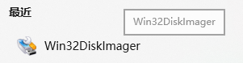

### 步骤二 磁盘分区

- Ubuntu 系统空间配置

| 名称       | 空间  | 作用     |
| ---------- | ----- | -------- |
| EFI        | 500MB | 引导分区 |
| Swap       | 70GB  | 交换分区 |
| ext4 /     | 30GB  | 根挂载点 |
| ext4 /home | 200GB | 数据分区 |

==合计：300 GB==

- 压缩硬盘

磁盘管理器：GPT格式


右键选择分区：压缩卷

### 步骤三 安装Ubuntu

- 插入启动盘-进入BIOS（<kbd>F2</kbd> or<kbd>DEL</kbd>）
- 进入BIOS的启动-安全启动菜单
  - 操作系统类型：Windows UEFI 模式
  - Security-修改安全选项
  - 启动设置-U盘第一位置
  - 保存变更
- <kbd>F12</kbd>进入启动选项

Ubuntu：基础知识https://blog.csdn.net/qq_61540355/article/details/124853683

- 安装Ubuntu
  - 拔掉网线
  - 正常安装
    - 关闭：安装Ubuntu时下载更新
  - 其他选项
    - 磁盘分区表
      - 选择左下角加号
        - EFI系统分区-500MB
        - 交换空间-70GB
        - / - 30GB
        - / home - 其他全部
      - 记住EFI分区的名称
        - 安装启动引导器的设备
      - 点击现在安装

- 计算机名字
  - ypq-6
  - 自动登录

 

## 其他问题 -NVIDIA 与Ubuntu

https://www.bilibili.com/video/BV1wY411p7mU/?vd_source=6e01dedcf408a17a20fd6d828fe9dff8

- Grub 菜单中 press E
- 在--- 删除 改成 nomodeset
- Alt+F7
- 下载NVIDIA 驱动
  - NVIDIA 显卡驱动
- 安装
  - bios 关闭security boot

```shell
chmod +x NVIDIAxxxxx.run
sudo bash 
sudo reboot
nvidia-smi
```


##  Ubuntu 系统配置

### 基础设置

- 参考

https://blog.csdn.net/feichangyanse/article/details/129326005

#### 更换镜像源头

<kbd>软件和更新</kbd>

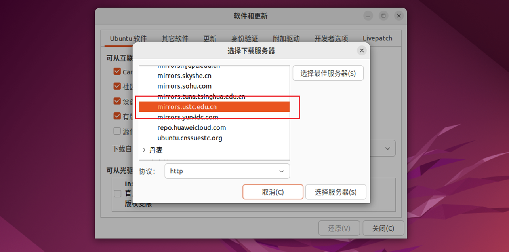

> sudo apt install 或 pip install ,在操作系统中设置了清华镜像源，这些软件包下载也会从清华镜像源获取。
>
> 
>
> 镜像源的速度和可用性会随时发生变化，所以在使用中如果发现获取软件包的速度较慢或下载失败，您可以考虑更换其他可用的镜像源
>
> 对于某些软件包，可能只存在于默认的 Ubuntu 软件源中，这些软件包可能无法从您选择的镜像源获取，需要您根据提示选择安装源

#### 系统更新

```shell
# 更新软件包列别 
sudo apt update
# 升级已安装的软件包到最新可用版本
sudo apt upgrade
```

####  语言支持

- 选择：`安装`

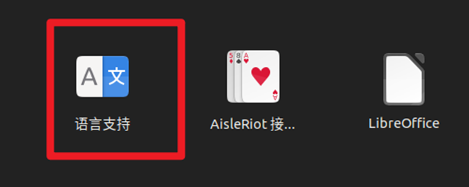

#### 时间同步

```shell
sudo apt install ntpdate
sudo ntpdate time.windows.com
sudo hwclock --localtime --systohc
```

#### 分辨率-美化

```shell
sudo apt install gnome-tweaks 
sudo apt install gnome-shell-extensions
```

#### 系统调优-Swap

```shell
sudo gedit /etc/sysctl.conf
### 添加
vm.swappiness=10
## 验证
 cat /proc/sys/vm/swappiness
```

### 常用软件

#### 星火商店


```shell
apt install spark-store
apt --fix-broken install
## 本体安装
sudo apt install ./spark-store_3.1.2_amd64.deb
## 依赖包安装
chmod +x /home/username/foldername/installer.sh
./installer.sh
```

- 修正后安装次序

```shell
# dependence （修改"双击我"文件）
chmod +x installer.sh
./installer.sh
# install
sudo apt install ./spark-store_4.2.8.1_amd64.deb 
```

#### 树洞-VPN

https://kkone.io/user/tutorial?os=Windows&client=clashy

- U盘软件包


```
sudo apt install ./Clashyamd64.deb
##订阅配置
https://mercedes1208.xn--3iq226gfdb94q.com/link/Q4In91iEXf3QVg7x?clash=1
```

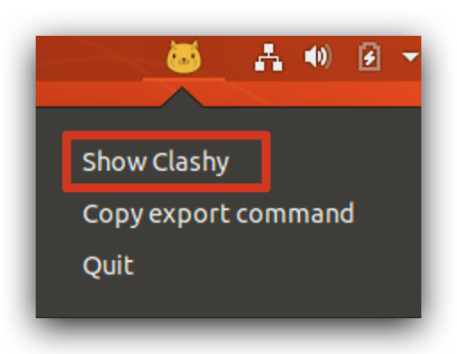

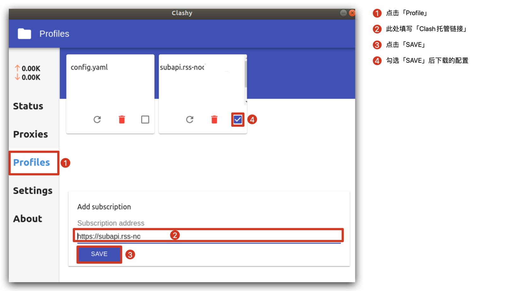

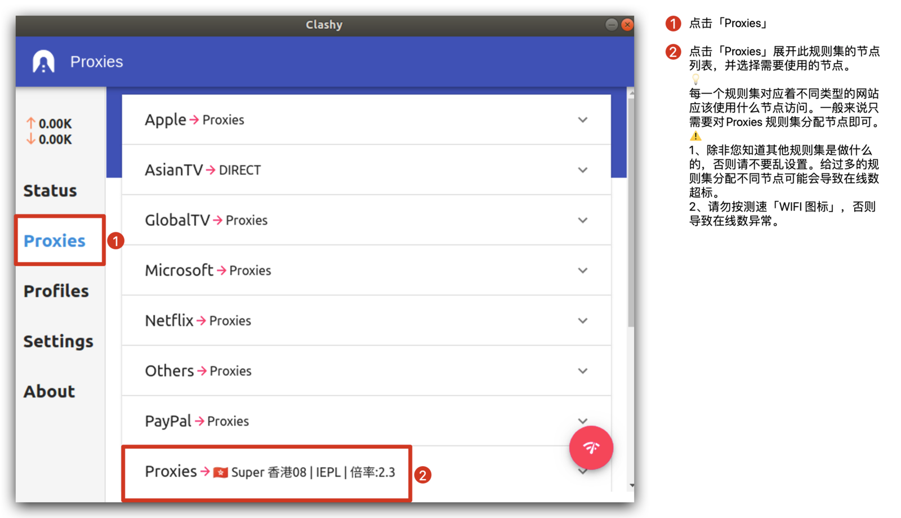

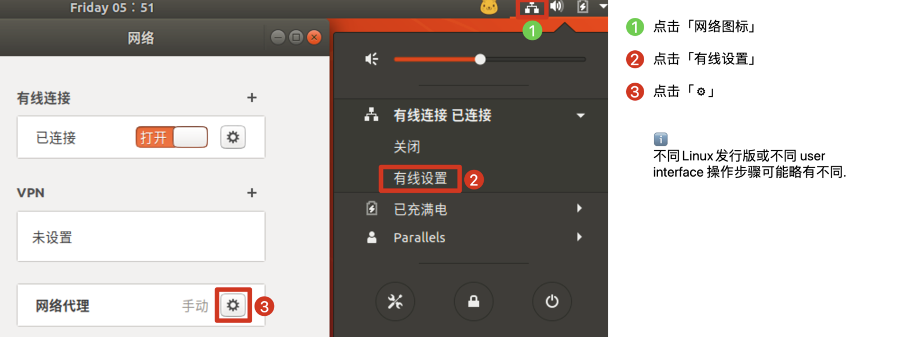

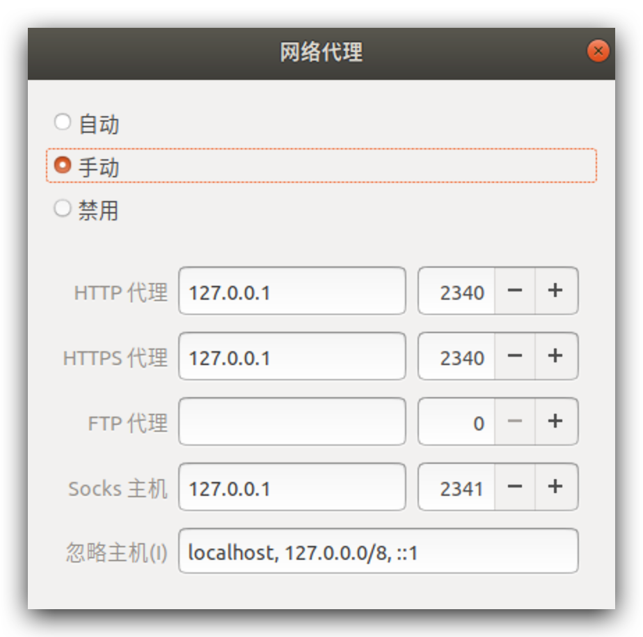

#### PyCharm

- U盘软件包

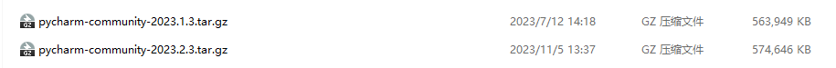

- 下载&安装

https://www.jetbrains.com/pycharm/download/?section=linux#section=linux

https://blog.csdn.net/zhuanzhuxuexi/article/details/132008578

- 解压

```shell
tar -xzf pycharm-community-2023.1.3.tar.gz
```

- 运行

进入：`home/bin/`

```shell
sh pycharm.sh
```

- 建立快捷方式
  - 进入桌面
  - 新建：pycharm.desktop


```shell
gedit pycharm.desktop
### 文件中输入
[Desktop Entry]
Version=1.0
Type=Application
Name=Pycharm
### 根据个人文件位置修改
Icon=/opt/pycharm/pycharm-community-2022.2.1/bin/pycharm.png
Exec=/opt/pycharm/pycharm-community-2022.2.1/bin/pycharm.sh

MimeType=application/x-py
Name[en_US]=pycharm
```

- 文件属性
  - 文件权限：:heavy_check_mark:允许作为程序运行

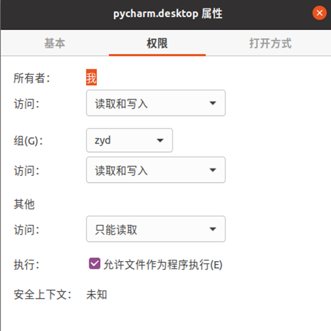

- 右键

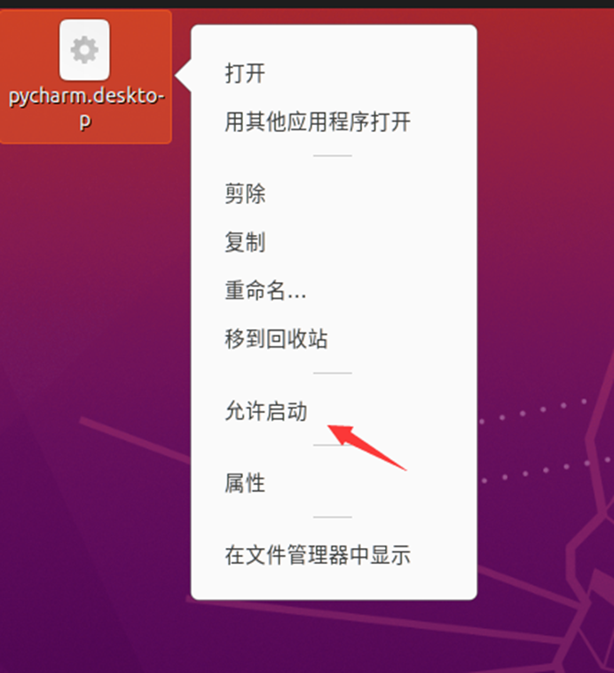

#### VSCode

- U盘软件包


- 安装

```shell
sudo dpkg -i code_1.80.0-1688479026_amd64.deb
```

#### Markdown编辑器

- 星火安装Typora

- Mark text[^marktext]

  - [Ubuntu下载安装MarkText ](https://zhuanlan.zhihu.com/p/555479039)

    - 官方下载`.AppImage`，<[(https://github.com/marktext/marktext)](https://zhuanlan.zhihu.com/write)>

      - 点击Download，选择对应系统及格式

      ```shell
      sudo chown ypq3 marktext-x86_64.AppImage 
      chmod +x marktext-x86_64.AppImage 
       ./marktext-x86_64.AppImage 
      ```

    - 快捷方式-右键>>允许启动

    ```shell
    touch marktext.desktop
    gedit marktext.desktop
    ```

    > [Desktop Entry]
    > Name=MarkText
    > Comment=Next generation markdown editor
    > Exec=/home/ypq3/Mark-Down-Ty-pq/marktext-x86_64.AppImage %F
    > Terminal=false
    > Type=Application
    > Icon=/home/ypq3/Mark-Down-Ty-pq/logo.png
    > Categories=Office;TextEditor;Utility
    > MimeType=text/markdown;
    > Keywords=marktext;
    > StartupWMClass=marktext
    > Actions=NewWindows
    > StartupNotify=true
    >
    > [Desktop Action NewWindows]
    > Name=New Window
    > Exec=/home/ypq3/Mark-Down-Ty-pq/marktext-x86_64.AppImage %F
    > Icon=/home/ypq3/Mark-Down-Ty-pq/logo.png

    - 收藏夹

    ```shell
    sudo cp marktext.desktop /usr/share/applications
    
    cd /usr/share/applications
    sudo gedit defaults.list
    在最后一行添加：text/markdown=marktext.desktop
    ```

    

## 附录：文件路径

### 软件安装包

- 星火商店

  - 本体安装包:`.deb`
  - 依赖项压缩包:`.tz`
  - 路径：蓝色u盘\1.软件包\1.环境配置-双系统安装

- [^marktext]: Download

  - 软件包：`marktext-x86_64.AppImage`
  - 路径：蓝色u盘\1.软件包\1.环境配置-双系统安装

VPN-Linux

PyCharm

VsCode

### 源码


