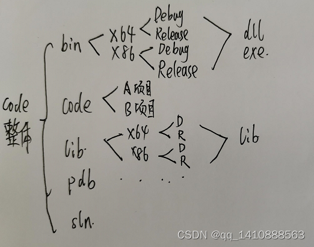

# 项目架构

## 介绍

> [干货：构建C/C++良好的工程结构 - 知乎 (zhihu.com)](https://zhuanlan.zhihu.com/p/59450618)
>
> [C++项目目录结构（C++目录结构）_c++万能目录-CSDN博客](https://blog.csdn.net/Dontla/article/details/120137863)

[C++工程架构主要包括以下几个部分](https://zhuanlan.zhihu.com/p/59450618)[1](https://zhuanlan.zhihu.com/p/59450618)[2](https://blog.csdn.net/Dontla/article/details/120137863)：

1. [**源代码**：通常存放在`src`文件夹中，包含所有的`.cpp`文件](https://blog.csdn.net/Dontla/article/details/120137863)[2](https://blog.csdn.net/Dontla/article/details/120137863)。
2. [**头文件**：通常存放在`include`文件夹中，包含所有的`.h`或`.hpp`文件](https://blog.csdn.net/Dontla/article/details/120137863)[2](https://blog.csdn.net/Dontla/article/details/120137863)。
3. [**构建系统**：如`CMakeLists.txt`或者`makefile`脚本](https://zhuanlan.zhihu.com/p/59450618)[1](https://zhuanlan.zhihu.com/p/59450618)。
4. [**自述文件**：里面有说明和协议 (License)](https://zhuanlan.zhihu.com/p/59450618)[1](https://zhuanlan.zhihu.com/p/59450618)。
5. [**二进制文件**：作者可能为你生成好了二进制文件，比如Windows下它里面包含dll和lib。很多工程二进制文件放在了`bin`文件夹](https://zhuanlan.zhihu.com/p/59450618)[1](https://zhuanlan.zhihu.com/p/59450618)。
6. [**静态链接库**：作者可能已经为你编好了静态库。很多工程静态链接库放在了`lib`文件夹中](https://zhuanlan.zhihu.com/p/59450618)[1](https://zhuanlan.zhihu.com/p/59450618)。