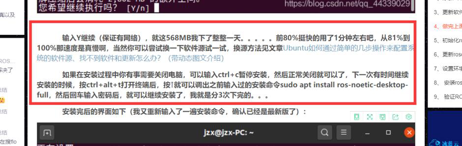

详细介绍如何在ubuntu20.04中安装ROS系统，超快完成安装（重要-紧急）

星期四, 十二月 15, 2022

12:34 下午

已剪辑自: [https://blog.csdn.net/qq\_44339029/article/details/120579608]{.underline}

###    2020年的10月份，我整理写了一篇名为：详细介绍如何在ubuntu20.04中安装ROS系统，以及安装过程中出现的常见错误的解决方法，填坑！！！的博客，已经经过了很多小伙伴的验证，确实是可行的，该篇博客链接如下：[【请点击此处进行跳转】]{.underline}

###    经过近期的探索，我将安装步骤进行了进一步的优化，使安装变得更加快速，更加简单，我已经验证了其可行性，期待更多的小伙伴们一起来验证，如果按本篇文章步骤进行安装，出现了未说明的错误，可以去上面提到的2020.10月份的那篇文章中寻找解决方法

###    本次安装依旧采用在虚拟机中安装的模式，一年前我用的VMware15.5，现在用的VMware16.1.1，【获取方式（附安装步骤，提取码：MUYU）：[请点击此处进行跳转]{.underline}】

###    优化后的步骤如下：

###    1、添加ROS软件源

sudo sh -c \'. /etc/lsb-release && echo \"deb [http://mirrors.ustc.edu.cn/ros/ubuntu/]{.underline} \$DISTRIB\_CODENAME main\" \> /etc/apt/sources.list.d/ros-latest.list\'

-   1

###    2、添加密钥

#### *     将以下命令复制到ubuntu的终端执行*

sudo apt-key adv \--keyserver \'hkp://keyserver.ubuntu.com:80\' \--recv-key C1CF6E31E6BADE8868B172B4F42ED6FBAB17C654

-   1

#### *     成功后会显示如下界面：*

###    3、更新软件源

#### *     将以下命令复制到ubuntu的终端执行（在这里顺便说一下，如果用wifi更新慢或者失败的话，切换至手机热点，再执行下面的命令试一下）*

sudo apt update

-   1

#### *     成功后会显示如下界面：*

###    4、配置及更换最佳软件源

#### *     选择合适的软件源会很大程度上提高下载速度，如何更换软件源及选择最佳软件源在之前的文章Ubuntu如何通过简单的几步操作来配置系统的软件源、找不到软件和更新怎么办？（带动态图文介绍）中已进行过说明，文章链接如下：[【请点击此处跳转】]{.underline}*

#### *     如果在重新载入软件列表时，遇到了以下错误，请在终端输入以下命令（命令的最后一部分按错误提示进行修改，也就是下图中红色框内的内容）*

sudo apt-key adv \--keyserver keyserver.ubuntu.com \--recv-keys F42ED6FBAB17C654

-   1

#### *     会显示如下界面，此时再重新配置及更换最佳软件源就可以了*

###    5、做完上面的四步就可以开始安装ROS了

#### *     因ubuntu版本的不同其安装指令也有可能不同，我的是ubuntu20.04 执行下面的命令来安装：*

sudo apt install ros-noetic-desktop-full

-   1

#### *     会显示如下界面：*

#### *    还记得我在2020年10月份的那篇文章中如何说的吗，下面放一下当时的截图：*

#### *     按照本篇文章所介绍的方法，相比于之前的一天时间，我这次只用了2分钟就完成了本步的安装，这速度确定把我感动了。*

#### *     安装完后的界面如下（我又重新输入了一遍安装命令，确认已经是最新版了）：*

###    6、初始化rosdep

   ☆☆☆注：本步一直失败的小伙伴可以先跳到文章末尾，看一下2022年10月11日更新补充的内容，补充了两种rosdep一直失败的解决方法，据很多小伙伴反映效果很好

#### *     输入以下的命令，先对其初始化一下*

sudo rosdep init

-   1

#### *     如果出现以下界面，那么恭喜你，你可以省下一些麻烦了，直接跳到第7步就行了：*

#### *     如果出现了以下几种错误，也不要担心，下面几种错误我都经历过 ，当然也就为大家整理好了解决方法*

#### *   （1）错误1：找不到命令*

#### *     尝试着输入以下命令*

sudo apt install python-rosdep2

-   1

#### *     或者：*

sudo apt install python3-rosdep2

-   1

#### *    这时候它会出现以下的界面，输入Y继续*

#### *    到这里如果再输入sudo rosdep init命令试试，如果出现了之前介绍的，我们想要的界面，请跳到第7步，若出现了新的错误，请继续看本步（第6步）的内容*

#### *   （2）错误2：ERROR: cannot download default sources list from:https : //raw.githubusercontent.com/ros/rosdistro/master/rosdep/sources.list.d/20-default.listWebsite may be down.*

#### *    输入以下命令：*

sudo gedit /etc/hosts

-   1

#### *    然后在打开的hosts文件中添加如下的内容，然后保存退出*

199.232.28.133 raw.githubusercontent.com

-   1

#### *    关于上面这条语句，它的内容可能会变化，评论区的小伙伴给出了查询最新地址的方法，我在这里引用一下，通过IPAddress.com首页,输入raw.githubusercontent.com查询到最新的真实IP地址，新的地址是这个： 185.199.109.133 raw.githubusercontent.com，但是我使用上面那条语句中的地址也成功了，没有成功的小伙伴可以试一下改成最新的地址试一下。*

#### *    顺便提一下，对于sudo rosdep init这条指令当使用无线网络执行超时的话，真的真的真的可以换成手机热点试一下，亲测有用！！！*

#### *    到这里如果再输入sudo rosdep init命令试试，如果出现了之前介绍的，我们想要的界面，请跳到第7步，若出现了新的错误，请继续看本步（第6步）的内容*

#### *   （3）错误3：ERROR: default sources list file already exists: /etc/ros /rosdep/sources.list.d/20-default.listPlease delete if you wish to re-initialize*

#### *   输入以下命令：*

sudo rm /etc/ros/rosdep/sources.list.d/20-default.list

-   1

#### *    到这里如果再输入sudo rosdep init命令试试，应该就会出现了之前介绍的我们想要的界面了*

   ☆☆☆注：本步一直失败的小伙伴可以先跳到文章末尾，看一下2022年10月11日更新补充的内容，补充了两种rosdep一直失败的解决方法，据很多小伙伴反映效果很好

###    7、设置环境变量

#### *    （1）输入下面的这行代码，注意到底是melodic还是noetic或者是kinetic是由你的ubuntu的版本决定的，比如我的ubuntu是20.04版本的，对应的是noetic，也就是应该下面的这行代码，而不是上面那行*

echo \"source /opt/ros/noetic/setup.bash\" \>\> \~/.bashrc

-   1

#### *    如果你一不小心第一次没有运行对正确的版本，比如应该是noetic，而你输入的是命令对应的是melodic，那么此时即使你再输入正确的命令后，再进行下一步，他也会显示：bash: /opt/ros/melodic/setup.bash: 没有那个文件或目录，这个时候的的解决方法如下，先执行以下命令*

gedit .bashrc

-   1

#### *    它会打开一个文件，把文件的最后一行source /opt/ros/melodic/setup.bash中的melodic改为正确的noetic，保存退出就可以了（如果有多行，删去多余的，只保留一行）*

#### *    （2）输入以下命令，运行该脚本让环境变量生效*

source \~/.bashrc

-   1

###    8、 安装rosinstall

#### *    输入以下命令：*

sudo apt install python3-rosinstall python3-rosinstall-generator python3-wstool

-   1

#### *    成功后的界面如下所示：*

###    9、 验证ROS是否安装成功

#### *    按正常来说ROS到这里就安装完成了，现在我们来验证一下，输入以下命令：*

roscore

-   1

#### *    如果出现了以下的问题：Command 'roscore' not found, but can be installed with:sudo apt install python3-roslaunch，按照提示输入sudo apt install python3-roslaunch命令并执行，成功后界面如下：*

#### *    如果出现了以下的问题说明，之前的安装没有安装全*

#### *    输入以下命令，把没安装的安装一下就好了（如果显示有几个安装包无法下载，是因为网络的原因重新输入以下命令就行了）*

sudo apt install ros-noetic-desktop-full

-   1

#### *    如果出现了以下的问题：*

#### *    可尝试输入以下命令：*

source /opt/ros/noetic/setup.bash

-   1

#### *    到这里再输入roscore看一下，若安装成功会显示如下界面：*

#### *    然后我们启动一下小海龟的仿真器试一试，按ctrl+alt+t打开一个新的终端，输入以下命令*

rosrun turtlesim turtlesim\_node

-   1

#### *    按ctrl+alt+t再打开一个新的终端，输入以下命令*

rosrun turtlesim turtle\_teleop\_key

-   1

#### *    这时候你按键盘上的↑↓←→键就可以控制小海龟移动了！！！*

#### *     那么恭喜你的ROS已经成功安装完了！！！*

   ☆☆☆2022年10月11日更新内容☆☆☆

   补充上面的第六步中rosdep init和rosdep update失败的两种有效方法：

   方法一：借助六部工坊的配置修改工具（该方法强烈推荐\-\-\--简单有效）

   （1）运行以下指令，安装Python的软件包管理工具 pip

sudo apt-get install python3-pip

-   1

   （2）运行以下指令，使用pip安装配置修改工具

sudo pip3 install 6-rosdep

-   1

   （3）运行以下指令来运行配置修改工具

sudo 6-rosdep

-   1

   （4）接下来就可以正常运行sudo rosdep init和rosdep update指令了

sudo rosdep init

-   1

rosdep update

-   1

   ☆☆☆若以上指令都正常执行，则恭喜你可以继续按照文章的介绍完成第7\~9步的内容了

   这里有一点还要说明，有些安装教程里跳过了sudo rosdep init或rosdep update，貌似也是可以运行ROS的，但是这相当于埋下了隐患，后续有些功能包可能就会运行出错，比如说研究SLAM的小伙伴，跳过这两步，谷歌的Cartographer算法就不能运行。

   在本文开头放的我2020年写的安装教程中是有rosdep update这一步的，2021年写本篇教程的时候为了方便省去了rosdep update这一步，现在2022年对本文进行更新，再次补充上这一步。

   方法二：该方法多名小伙伴反映有效（我没试过，建议先尝试上面的方法一）

   链接如下：https://zhuanlan.zhihu.com/p/392082731

   [ROS安装过程中如何解决 rosdep update 命令出现错误（点击可跳转）]{.underline}
