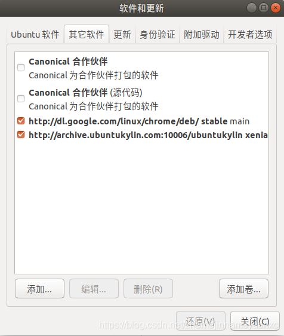
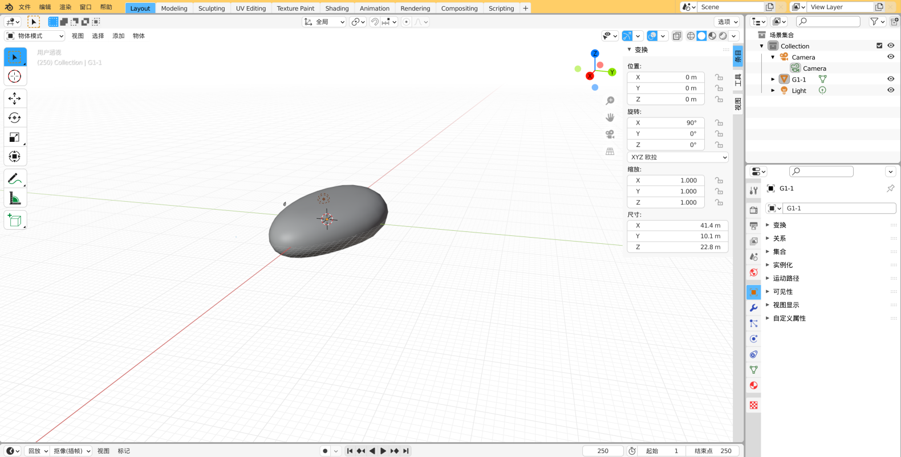
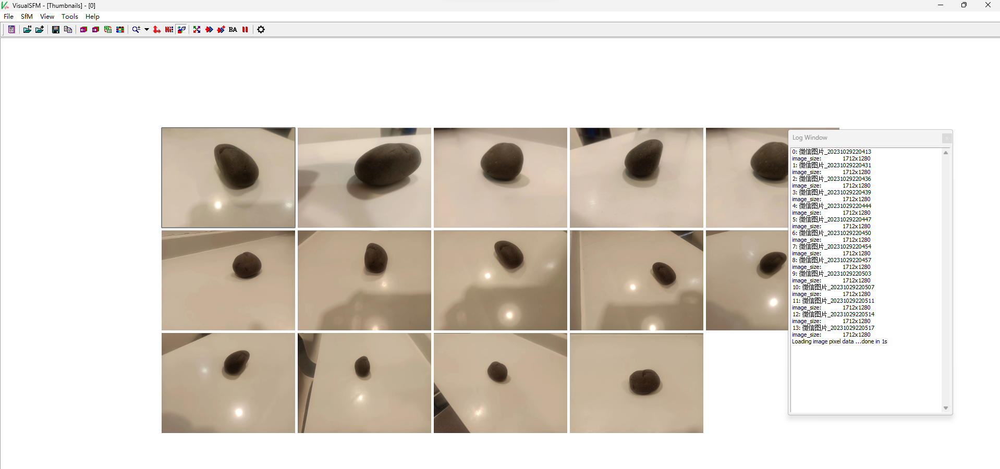

# 日志三月十日起

## 预计

- 三维软件处理石块模型：
  - 尺寸及相关信息-页岩石块
  - 石块类型-统计-数据来源

- 环境设计
- CGAL图形学分析
- 配置环境
- 论文系统
  - 管理-阅读笔记-文件-引注


## 石块三维 尺寸处理

### Blender 安装

- 添加Blender官方存储库。运行以下命令：

```
sudo add-apt-repository ppa:thomas-schiex/blender
```

> - Bug
>
> N: 无法安全地用该源进行更新，所以默认禁用该源。
> N: 参见 apt-secure(8) 手册以了解仓库创建和用户配置方面的细节。
>
> - 处理
>   - https://blog.csdn.net/zhemejinnameyuanxc/article/details/100030629
>   - 删除不需要的源
 
>   - E: 仓库 “http://ppa.launchpad.net/oguzhaninan/stacer/ubuntu focal Release” 没有 Release 文件。

- 更新软件包列表。运行以下命令：

```shell
sudo apt-get update
```

安装Blender。运行以下命令：

```shell
sudo apt-get install blender
```

安装完成后，在终端中键入`blender`

> - Bug
>
>   - /usr/lib/blender/blender: error while loading shared libraries: libLLVM-6.0.so.1: cannot open shared object file: No such file or directory
>
>   - ```shell
>     sudo apt install llvm-6.0
>     ```

### Blender 使用

- 修改原点及缩放模型
  - 导入模型：顶部菜单中选择“File” -> “Import” -> “Wavefront (.obj)”
  - 点击模型以确保它被选中。
  - 改变模型尺寸：   - 在右侧的属性面板中（按N键打开/关闭），您可以找到“Dimensions”部分。
  - 将模型原点定在质心处：   - 在3D视图中，选择模型后，按Shift + S键，然后选择“Cursor to Selected”。这将将3D光标（原点）移到所选对象的质心。   
  - 然后在顶部菜单中选择“Object” -> “Set Origin” -> “Origin to 3D Cursor”。这将把模型的原点定位到质心处。
  - 导出修改后的模型为OBJ格式或其他格式。在顶部菜单中选择“File” -> “Export” -> “Wavefront (.obj)”来导出您的模型。
 

- 整体缩放
  - 选择模型对象
  - 打开“Transform”面板：按键盘上的快捷键`N`
  - 在属性面板中找到“Dimensions”部分。
  - 在3D视图中按`S`键缩放模型，然后输入缩放比例
  - 完成比例缩放操作后，按`Enter`键确认或鼠标右键取消。

- 批量缩放

  - 使用python脚本运行多文件整体修改原点和尺寸

  - ```python
    import bpy
    import os
    
    # 设置待处理的obj文件所在的目录路径
    obj_dir = '/home/ypq3/CGAL-learn/Stone-3D/single stone-process/all'
    obj_out_dir = '/home/ypq3/CGAL-learn/Stone-3D/single stone-process/processed'
    # 获取obj文件列表
    obj_files = [f for f in os.listdir(obj_dir) if f.endswith('.obj')]
    
    # 遍历处理每个obj文件
    for obj_file in obj_files:
        # 导入obj文件
        bpy.ops.import_scene.obj(filepath=os.path.join(obj_dir, obj_file))
    
        # 获取当前导入的对象
        obj = bpy.context.selected_objects[0]
    
        # 设置原点位置为世界原点
        bpy.ops.object.origin_set(type='GEOMETRY_ORIGIN', center='MEDIAN')
    
        # 缩放对象
        bpy.ops.transform.resize(value=(0.001, 0.001, 0.001))
        
        # 设置活动对象
        bpy.context.view_layer.objects.active = obj
    
        # 导出处理后的obj文件
        bpy.ops.export_scene.obj(filepath=os.path.join(obj_out_dir, 'processed_' + obj_file),use_selection=True)
        # 删除导入的对象，以便处理下一个文件
        bpy.data.objects.remove(obj)
    ```
  
- Blender->Scripting->Open
  
 

### MeshLab-OBJ编辑

```shell
sudo apt install meshlab
meshlab
```

裁剪后的石块

- 关于其物理学相关参数的获取

  - 选择“Filters”菜单，展开“Quality Measures and Computations”选项，然后单击“Compute Geometric Measures”。

  - 在“Compute Geometric Measures”对话框中，勾选“Compute Bounding Box（计算包围盒）”、“Compute Center of Mass（计算形心）”和“Compute Vertex Normals（计算顶点法线）”这三个选项。

  - 单击“Apply”按钮，MeshLab将会计算模型的形心和坐标原点。完成后，你可以在左侧资源管理器的“Layer”列表中选择“[YourModel] Geometric Measures”图层，然后展开“BoundingBox”和“CenterOfMass”选项，查看模型的包围盒、形心和坐标原点的信息。

  - 注意
    - 如果没有勾选“Compute Vertex Normals”选项，MeshLab可能会在计算形心时出现错误，导致计算结果不准确。因为形心是依赖于顶点法线信息计算的。

```c++
Mesh Bounding Box Size 41.382401 10.090899 22.839401
Mesh Bounding Box Diag 48.331848 
Mesh Bounding Box min 141.004593 0.491200 133.901993
Mesh Bounding Box max 182.386993 10.582100 156.741394
Mesh Surface Area is 1895.748291
Mesh Total Len of 834 Edges is 2588.781738 Avg Len 3.104055
Mesh Total Len of 834 Edges is 2588.781738 Avg Len 3.104055 (including faux edges))
Thin shell (faces) barycenter: 161.373383 5.543417 145.839096
Vertices barycenter 163.021820 5.490052 146.660187
Mesh Volume is 5554.141602
Center of Mass is 161.321121 5.543604 145.793976
Inertia Tensor is :
| 180511.953125 -274.762329 -30765.220703 |
| -274.762329 650426.500000 -173.483124 |
| -30765.220703 -173.483124 537474.062500 |
Principal axes are :
| -0.996359 -0.000610 -0.085259 |
| -0.085260 0.001358 0.996358 |
| 0.000492 -0.999999 0.001405 |
axis momenta are :
| 177887.781250 540110.500000 650420.312500 |
Applied filter Compute Geometric Measures in 28 msec 
OUT OF SCOPE 
  
  All files opened in 9 msec
OUT OF SCOPE 
Mesh Bounding Box Size 0.041382 0.010091 0.022842
Mesh Bounding Box Diag 0.048333 
Mesh Bounding Box min 162.999756 5.485048 146.647446
Mesh Bounding Box max 163.041138 5.495139 146.670288
Mesh Surface Area is 0.001896
Mesh Total Len of 834 Edges is 2.588855 Avg Len 0.003104
Mesh Total Len of 834 Edges is 2.588855 Avg Len 0.003104 (including faux edges))
Thin shell (faces) barycenter: 163.020111 5.490098 146.659378
Vertices barycenter 163.021774 5.490047 146.660202
Mesh Volume is 0.000006
Center of Mass is 163.021164 5.488582 146.653320
Inertia Tensor is :
| 0.000008 -0.000001 0.000000 |
| -0.000001 0.000006 -0.000000 |
| 0.000000 -0.000000 0.000003 |
Principal axes are :
| -0.057512 0.035436 0.997716 |
| -0.442500 -0.896746 0.006342 |
| 0.894922 -0.441124 0.067254 |
axis momenta are :
| 0.000003 0.000005 0.000008 |
Applied filter Compute Geometric Measures in 39 msec 
```

改编为XML：

```python
质心：
-194.037018 6.164951 329.447388
体积:
1291.078369
密度：
花岗岩：2600-2800 kg/m³
大理石：2500-2800 kg/m³
砂岩：2200-2800 kg/m³
轴的转动惯量：
| 18866.824219 26905.671875 29991.556641 |
```

调整质心后

 

 

### 所有三维重建的参考

```html
https://cloud.tencent.com/developer/article/1475767
https://www.codenong.com/cs106520549/
https://www.xjx100.cn/news/524076.html?action=onClick
https://www.jianshu.com/p/be4e7ff3ccd6
https://blog.csdn.net/weixin_41202834/article/details/130313302
https://blog.csdn.net/zhazhaqiangdedad/article/details/125071414
https://zhuanlan.zhihu.com/p/487038742
https://github.com/charlesq34/pointnet2
https://blog.csdn.net/weixin_42785537/article/details/124245721
https://www.cnblogs.com/zxdplay/p/16743328.html
https://zhuanlan.zhihu.com/p/617362102 #重要
http://ccwu.me/vsfm/
https://www.meshlab.net/
https://blog.csdn.net/weixin_43693967/article/details/126753176
http://e.betheme.net/zz/276352.html
https://github.com/cnr-isti-vclab/meshlab/tree/main/install/linux
https://blog.csdn.net/HW140701/article/details/78876507/
https://blog.csdn.net/HW140701/article/details/78876507/
https://blog.csdn.net/qq_41159191/article/details/123279195
https://www.youtube.com/playlist?list=PL8B1E816EAE236B4D
https://www.youtube.com/playlist?list=PL8B1E816EAE236B4D
https://blog.csdn.net/baidu_40840693/article/details/102930769?ops_request_misc=%257B%2522request%255Fid%2522%253A%2522169849083616800226557428%2522%252C%2522scm%2522%253A%252220140713.130102334.pc%255Fall.%2522%257D&request_id=169849083616800226557428&biz_id=0&utm_medium=distribute.pc_search_result.none-task-blog-2~all~first_rank_ecpm_v1~rank_v31_ecpm-9-102930769-null-null.142^v96^pc_search_result_base9&utm_term=meshlab%20this%20model%20has%20no%20vertex%20quality&spm=1018.2226.3001.4187
https://blog.csdn.net/baidu_40840693/article/details/103040326
https://blog.csdn.net/weixin_43042683/article/details/127930496
https://www.pianshen.com/article/42911306020/
https://blog.csdn.net/zouyu1746430162/article/details/78638133
https://github.com/pmoulon/CMVS-PMVS
https://zhuanlan.zhihu.com/p/385281495?utm_id=0&wd=&eqid=a27d63d20000803b00000004647f0169
```

## 环境配置

### 新建一个自定义环境

https://www.youtube.com/watch?v=ZxXKISVkH6Y&t=3s

- 文件架构

  - > ├── main.py
    > ├── setup.py
    > └── stone_stack_game
    >     ├── DDPG
    >     ├── envs
    >     │   ├── assets(==Mujoco模型文件==)
    >     │   │   ├── scene.xml
    >     │   │   └── stone.xml
    >     │   ├── __init__.py
    >     │   ├── mjc_stone.py
    >     │   ├── mujoco_env.py
    >     │   └── pq_env.py
    >     ├── __init__.py
    >     └── wrappers
  - `main.py`用于安装包
 
 


### 环境设计

| 空间              | 数据结构                         |
| ----------------- | -------------------------------- |
| Action Space      | `Box(-1.0, 1.0, (8,), float32)`  |
| Observation Space | `Box(-inf, inf, (27,), float64)` |
| import            | `gymnasium.make("Ant-v4")`       |


## CGAL

- 基于随机点 拟合为凸多边形
- 基于接触的点生成相关几何计算
  - 支撑多边形Si
  - 法向向量-PCA

## 论文

### 阅读记录

- 23年苏黎世未完成
- 12年 Lambert 论文
