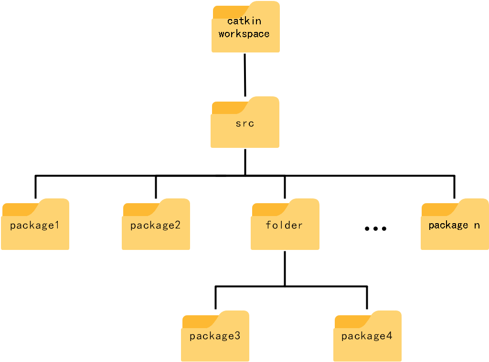
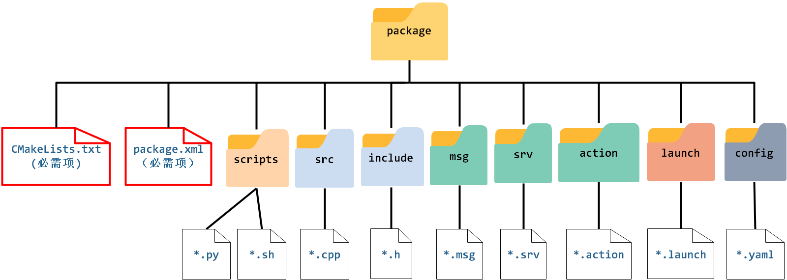

# 创建软件包并完成c程序编译

## 非常不错的教程及参考

[创建&编译ROS软件包Package](https://blog.csdn.net/CynalFly/article/details/125637949)

==跟随其教程完成ROS学习==

## 创建软件包基本操作

### 软件包架构及相关内容

##### 工作空间

 

##### 软件包内部文件

 

###### 相关文件说明

`CMakeLists.txt`：包含CMake构建文件，定义package的包名、源文件、依赖、目标文件等编译规则；
`package.xml`：包含了 package 的描述信息和依赖关系，并记录版本、维护者、许可证等有关软件包的信息；
`scripts`：可执行脚本，Python脚本(.py)，shell脚本(.sh)；
`src`：源文件C++
`include`：C++头文件
`msg`：存放消息文件（.msg）
`srv`：存放服务文件（.srv）
`action`：存放动作文件（.action）
`launch`：存放launch文件（.launch或.xml），可一次运行多个节点
`config`：配置信息

## 创建软件包

### create pkg

```shell
$ mkdir -p ~/catkin_ws/src
$ catkin_create_pkg <package_name> [depend1] [depend2] [depend3][...][dependn]
$ catkin_init_workspace
# std_msgs roscpp rospy
$ catkin_make
# only want build certain pkg
$ catkin_make -DCATKIN_WHITELIST_PACKAGES="package1;package2"
# 恢复编译
$ catkin_make -DCATKIN_WHITELIST_PACKAGES=""

```

### 编译C++文件

```shell
# 创建文件夹
$ touch  XXX.cpp
$ gedit XXX.xx
```

### 编辑`package.xml`

```xml
<!--编译依赖项-->
  <build_depend>moveit_core</build_depend>
  <build_depend>moveit_ros_planning_interface</build_depend>
  <build_depend>moveit_ros_perception</build_depend>
  <build_depend>tf2_geometry_msgs</build_depend>
  <build_depend>roscpp</build_depend>
  <build_depend>rospy</build_depend>
  <build_depend>std_msgs</build_depend>  
<!--运行依赖项-->
    <exec_depend>tf2_geometry_msgs</exec_depend>
    <exec_depend>rospy</exec_depend>
    <exec_depend>roscpp</exec_depend>
    <exec_depend>moveit_core</exec_depend>
    <exec_depend>moveit_ros_planning_interface</exec_depend>
    <exec_depend>moveit_ros_perception</exec_depend>
    <exec_depend>std_msgs</exec_depend>
```

### :star:编辑`CMakelists.txt`

#### 找到依赖包

```Cmake

find_package(catkin REQUIRED COMPONENTS
  	moveit_core
    moveit_ros_planning
    moveit_ros_planning_interface
		tf2_geometry_msgs
  	roscpp
  	rospy
  	std_msgs
)
```

#### catkin所需文件（取消注释）

```Cmake
catkin_package(
INCLUDE_DIRS include
LIBRARIES add_obj
CATKIN_DEPENDS tf2_geometry_msgs roscpp rospy std_msgs moveit_core  moveit_ros_planning_interface
DEPENDS system_lib 
)
```

#### 添加可执行文件和动态链接库

```Cmake
add_executable(add_collision src/add_collision.cpp)

target_link_libraries(add_collision
  ${catkin_LIBRARIES}
 )
```

#### C++版本声明

```cmake
set(CMAKE_CXX_FLAGS "${CMAKE_CXX_FLAGS}  -std=c++0x")
```

##### :warning:阻止报错

```shell
/opt/ros/kinetic/include/moveit/macros/declare_ptr.h:53:16: error: ‘shared_ptr’ in namespace ‘std’ does not name a template type
   typedef std::shared_ptr<const Type> Name
```

### 编译

或者在VScode中：使用<kbd>Ctrl</kbd>+<kbd>shift</kbd>+<kbd>B</kbd>编译

```shell
$ catkin_make
source devel/setup.bash
```

### 编辑python文件

```shell
$ touch xx.py
# add excuteable rights
chmod a+x hello.py
```

#### py下的编辑`CMakelists.txt`

```cmake
 catkin_install_python(PROGRAMS
   scripts/helloworld.py
   DESTINATION ${CATKIN_PACKAGE_BIN_DESTINATION}
)
```

#### 其余问题

- 依赖项moveit的头文件软件包名称：moveit_core

- Cmake.list中

  ```Cmake
  catkin_package(
  INCLUDE_DIRS include
  LIBRARIES add_obj
  CATKIN_DEPENDS tf2_geometry_msgs roscpp rospy std_msgs moveit_core  moveit_ros_planning_interface
  # DEPENDS system_lib 
  )
  ```

  


