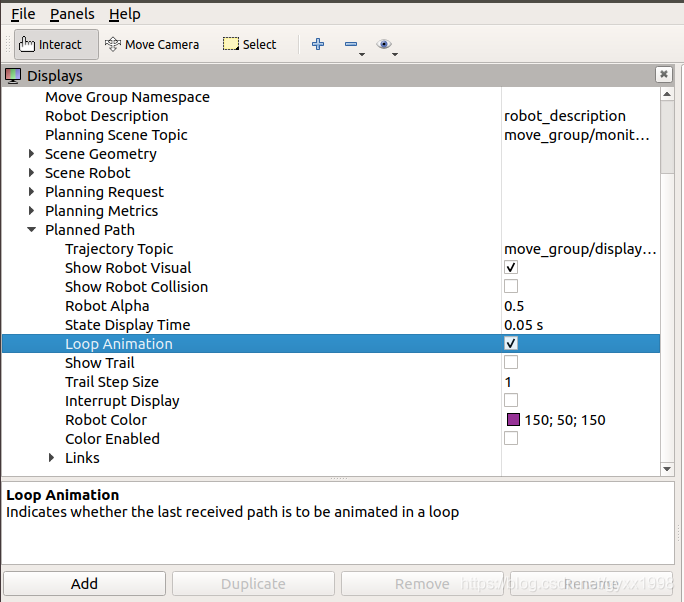
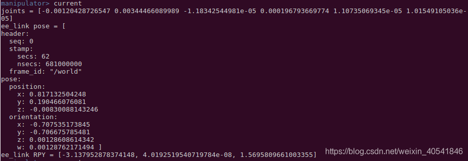
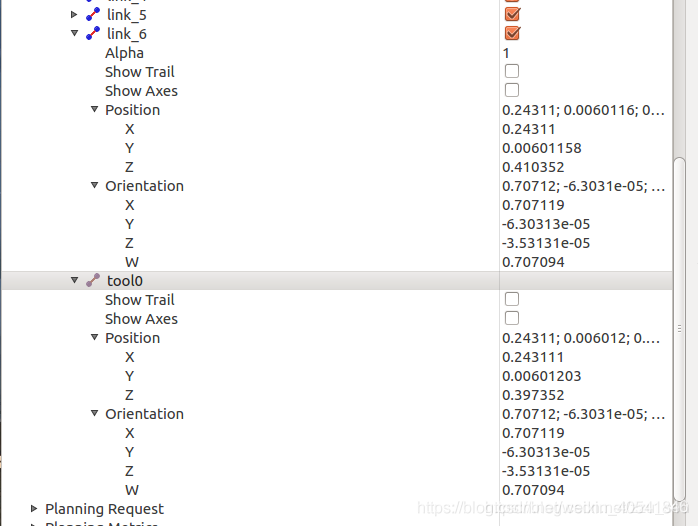

# ros-ur5下载安装编译

## 参考

### universal robot

https://github.com/ros-industrial/universal_robot
https://github.com/UniversalRobots/Universal_Robots_ROS_Driver

### :star:超全Debug指南

https://blog.csdn.net/gyxx1998/article/details/118153079

https://blog.csdn.net/m0_54720387/article/details/122293508

https://blog.csdn.net/dayan12/article/details/108701225

### 教程

http://wiki.ros.org/universal_robot/Tutorials/Getting%20Started%20with%20a%20Universal%20Robot%20and%20ROS-Industrial

### Socket控制方法

https://blog.csdn.net/handsome_wang5/article/details/126157478

https://blog.csdn.net/ren18281713749/article/details/100702408

https://blog.csdn.net/Forbiven/article/details/130867837

https://blog.csdn.net/qq_28093585/article/details/76383092?spm=1001.2101.3001.6650.11&utm_medium=distribute.pc_relevant.none-task-blog-2%7Edefault%7ECTRLIST%7ERate-11-76383092-blog-130867837.235%5Ev38%5Epc_relevant_sort&depth_1-utm_source=distribute.pc_relevant.none-task-blog-2%7Edefault%7ECTRLIST%7ERate-11-76383092-blog-130867837.235%5Ev38%5Epc_relevant_sort&utm_relevant_index=12

### ur官网论坛

https://forum.universal-robots.com/c/ros/23

https://blog.csdn.net/weixin_52531852/article/details/124178707?spm=1001.2101.3001.6650.8&utm_medium=distribute.pc_relevant.none-task-blog-2%7Edefault%7EBlogCommendFromBaidu%7ERate-8-124178707-blog-130867837.235%5Ev38%5Epc_relevant_sort&depth_1-utm_source=distribute.pc_relevant.none-task-blog-2%7Edefault%7EBlogCommendFromBaidu%7ERate-8-124178707-blog-130867837.235%5Ev38%5Epc_relevant_sort&utm_relevant_index=9

## 下载及安装

### UR-robot

```shell
rosdep update
rosdep install --rosdistro $ROS_DISTRO --ignore-src --from-paths src

catkin_make
```

### UR-drivers

```shell
# create a catkin workspace
$ mkdir -p catkin_ws/src && cd catkin_ws

# install dependencies
$ sudo apt update -qq
$ rosdep update
$ rosdep install --from-paths src --ignore-src -y

# build the workspace
$ catkin_make

# activate the workspace (ie: source it)
$ source devel/setup.bash
```

### joint_state_publisher 更新

```shell
sudo apt-get install ros-melodic-joint-state-publisher-gui 
```


## 操作及相关控制

### 仿真环境下启动机械臂并控制运动

```shell
roslaunch ur_gazebo ur5_bringup.launch
roslaunch ur5_moveit_config moveit_planning_execution.launch sim:=true
roslaunch ur5_moveit_config moveit_rviz.launch config:=true
```

### 实际机械臂控制指令

```shell
roslaunch ur_robot_driver ur5_bringup.launch limited:=true robot_ip:=192.168.1.101
&&& [reverse_port=REVERSE_PORT] "reverse_port" default="50001"
&&& limited:=true限制机器人关节运动范围 [-pi,pi]，否则为 [-2pi, 2pi]
&&& 启动URCap 的External control
roslaunch ur5_moveit_config moveit_planning_execution.launch limited:=true
roslaunch ur5_moveit_config moveit_rviz.launch rviz_config:=$(rospack find ur5_moveit_config)/launch/moveit.rviz
```

- 通讯实机成功后

```shell
[ INFO] [1624885305.373017515]: Robot requested program
[ INFO] [1624885305.373077772]: Sent program to robot
[ INFO] [1624885305.839015623]: Robot connected to reverse interface. Ready to receive control commands.
```

- 单关节控制

```
rqt
# 然后选择 Plugins -> Robot Tools -> Controller Manager
```


#### 关于规划循环问题

**在rviz界面左上角**的`Dispaly`的`Planed Path`里将`Loop Animation`取消勾选
 这样规划过程就不会一直循环啦，至此就和之前用`universal_robot`的仿真过程完全一样啦

 

### 机械臂标定

> 官网教程
>
> ​	https://github.com/UniversalRobots/Universal_Robots_ROS_Driver/blob/master/ur_calibration/README.md

保证ROS控制下的实体机器人运动过程末端执行器的位置精度，标定不是必要过程，但若不进行标定，会使末端执行器的位置出现厘米级的偏差。

- 标定指令

```shell
$ roslaunch ur_calibration calibration_correction.launch 
  robot_ip:=192.168.1.101 target_filename:="${HOME}/my_robot_calibration.yaml"
```

- 启动标定后的机械臂指令-或者直接编辑`ur5_bringup.launch`中的`kinematics_config`参数

```shell
$ roslaunch ur_robot_driver <robot_type>_bringup.launch robot_ip:=192.168.1.101 
  kinematics_config:=$(rospack find ur_calibration)/etc/ur10_example_calibration.yaml
```

### 更换其机器人模型

> In a real-world scenario you will want to replace the robot description with a description containing the whole scene where the robot is acting in. For this, all the bringup launchfiles offer the argument `robot_description_file` that should point to a launchfile loading the robot description.

> While the `load_urXXX.launch` files from the [ur_description](http://wiki.ros.org/ur_description) package contain a lot of arguments to change the robot model, this driver only forwards the `kinematics_config` parameter file. For further adaption please create your own `load_urXXX.launch` file that fits your application and pass this to the `urXXX_bringup.launch` files from this package.

> If you prefer decoupling loading the robot description and starting the driver, you can start the `ur_control.launch` launchfile directly after the `robot_description` has been uploaded to the parameter server.

## 获取机器人末端位姿

原文链接：https://blog.csdn.net/weixin_40541846/article/details/106930146

启动MoveIt! 仿真环境接口

```shell
$ roslaunch ur5_e_moveit_config demo.launch
```

启动moveit_commander命令行接口：

```shell
$ rosrun moveit_commander moveit_commander_cmdline.py
```

与机械臂的move_group节点建立连接：

```shell
$ use <group name>
$ current
```


 
**Rviz中查看**
 你也可以在Rviz中查看末端执行器的位置姿态。

TF：【MotionPlanning】->【Scene Robot】->【Links】，可以查看每个连杆的位置姿态。
 

### C++调用moveit控制UR5机器人运动

```shell
$ catkin_create_pkg puncture_demo catkin cmake_modules interactive_markers moveit_core moveit_ros_perception moveit_ros_planning_interface pluginlib roscpp std_msgs
```

```c++
#include <moveit/move_group_interface/move_group.h>
#include <moveit/planning_scene_interface/planning_scene_interface.h>

#include <moveit_msgs/DisplayRobotState.h> 
#include <moveit_msgs/DisplayTrajectory.h> 
#include <moveit_msgs/AttachedCollisionObject.h> 
#include <moveit_msgs/CollisionObject.h> 

int main(int argc, char **argv)
{
  ros::init(argc, argv, "movo_moveit");
  ros::NodeHandle node_handle; 
  ros::AsyncSpinner spinner(1);
  spinner.start();

  moveit::planning_interface::MoveGroup group("manipulator");//ur5对应moveit中选择的规划部分

  // 设置发送的数据，对应于moveit中的拖拽
  geometry_msgs::Pose target_pose1;

  target_pose1.orientation.x= -0.1993;
  target_pose1.orientation.y = 0.3054;
  target_pose1.orientation.z = -0.2284;
  target_pose1.orientation.w = 0.902;

  target_pose1.position.x = -0.2004;
  target_pose1.position.y = -1.0177;
  target_pose1.position.z = 1.56930;

  group.setPoseTarget(target_pose1);
  group.setMaxVelocityScalingFactor(0.02);


  // 进行运动规划，计算机器人移动到目标的运动轨迹，对应moveit中的plan按钮
  moveit::planning_interface::MoveGroup::Plan my_plan;
//bool success = (ptr_group->plan(my_plan) == moveit::planning_interface::MoveItErrorCode::SUCCESS;
  bool success = group.plan(my_plan)== moveit::planning_interface::MoveItErrorCode::SUCCESS;;

  ROS_INFO("Visualizing plan 1 (pose goal) %s",success?"":"FAILED");   

  //让机械臂按照规划的轨迹开始运动，对应moveit中的execute。
  if(success)
      group.execute(my_plan);

///第二个位置
geometry_msgs::Pose target_pose2;

  target_pose2.orientation.x= -0.1993;
  target_pose2.orientation.y = 0.3054;
  target_pose2.orientation.z = -0.2284;
  target_pose2.orientation.w = 0.902;

  target_pose2.position.x = 0.096;
  target_pose2.position.y = -0.9618;
  target_pose2.position.z = 1.934;

  group.setPoseTarget(target_pose2);
  group.setMaxVelocityScalingFactor(0.02);

  // moveit::planning_interface::MoveGroup::Plan my_plan;

  // 进行运动规划，计算机器人移动到目标的运动轨迹，对应moveit中的plan按钮
  moveit::planning_interface::MoveGroup::Plan my_plan_1;
//bool success = (ptr_group->plan(my_plan_1) == moveit::planning_interface::MoveItErrorCode::SUCCESS;
  bool success1 = group.plan(my_plan_1)== moveit::planning_interface::MoveItErrorCode::SUCCESS;;

  ROS_INFO("Visualizing plan 1 (pose goal) %s",success?"":"FAILED");   

  //让机械臂按照规划的轨迹开始运动，对应moveit中的execute。
  if(success1)
      group.execute(my_plan_1);
第三个位置
geometry_msgs::Pose target_pose3;

  target_pose3.orientation.x= -0.1993;
  target_pose3.orientation.y = 0.3054;
  target_pose3.orientation.z = -0.2284;
  target_pose3.orientation.w = 0.902;

  target_pose3.position.x = 0.1219;
  target_pose3.position.y = -0.9801;
  target_pose3.position.z = 1.9163;

  group.setPoseTarget(target_pose3);
  group.setMaxVelocityScalingFactor(0.01);


  // 进行运动规划，计算机器人移动到目标的运动轨迹，对应moveit中的plan按钮
  moveit::planning_interface::MoveGroup::Plan my_plan_2;
//bool success = (ptr_group->plan(my_plan) == moveit::planning_interface::MoveItErrorCode::SUCCESS;
  bool success2 = group.plan(my_plan_2)== moveit::planning_interface::MoveItErrorCode::SUCCESS;;

  ROS_INFO("Visualizing plan 1 (pose goal) %s",success?"":"FAILED");   

  //让机械臂按照规划的轨迹开始运动，对应moveit中的execute。
  if(success2)
      group.execute(my_plan_2);

  ros::shutdown(); 
  return 0;
}
```

```cmake
add_executable(puncture_demo src/puncture_demo.cpp)
target_link_libraries(puncture_demo
  ${catkin_LIBRARIES} 
)
```


