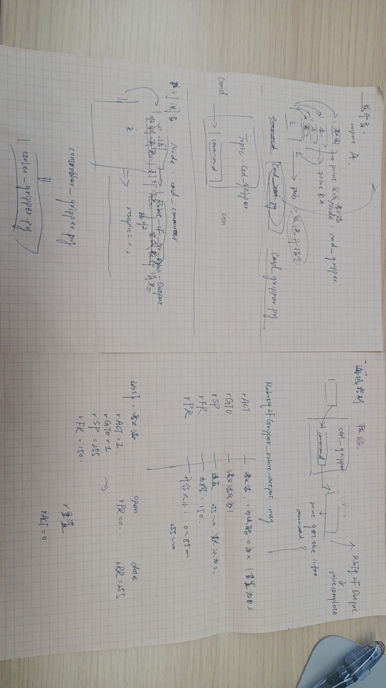

# robotiq-ros:夹爪和力传感器
## 硬件安装使用教程

[「智科特教程」ROBOTIQ三指夹爪和两指夹爪使用教程_哔哩哔哩_bilibili](https://www.bilibili.com/video/BV1Yz411v7x1?spm_id_from=333.1007.top_right_bar_window_custom_collection.content.click)

https://robotiq.com/products/2f85-140-adaptive-robot-gripper?ref=nav_product_new_button

## Robtiq功能包下载

### 教程

> https://blog.csdn.net/gyxx1998/article/details/118710774
>
> https://blog.csdn.net/weixin_42268975/article/details/105151377
>
> http://wiki.ros.org/robotiq
>
> http://wiki.ros.org/robotiq/Tutorials
>
> https://blog.csdn.net/w1301100424/article/details/88540442

### Git-hub开源网址

https://github.com/ros-industrial/robotiq
>非官方：
https://github.com/jr-robotics/robotiq

### 安装过程
```shell
sudo apt update -qq
rosdep update
rosdep install -from-path src -ignore-src -y

rosdep install robotiq_modbus_tcp

sudo apt-get install ros-melodic-soem
catkin_make
```

### 使用时需要开通串口的权限
```shell
sudo usermod -a -G dialout $USER
sudo chmod 777 /dev/ttyUSB0
```

### chat给予的链接

```
Robotiq官方网站：https://robotiq.com/
Robotiq Documentation（官方文档）：https://robotiq.com/support/documentation/
Robotiq ROS包文档：http://wiki.ros.org/robotiq
Robotiq ROS驱动GitHub存储库：https://github.com/ros-industrial/robotiq
Robotiq ROS包示例：https://github.com/ros-industrial/robotiq/tree/melodic-devel/robotiq_2f_gripper_control/examples
ROS Industrial（ROS工业）官方网站：http://wiki.ros.org/Industrial/Tutorials
Robotiq User Group（用户组）论坛：https://dof.robotiq.com/
Robotiq社区网站：https://robotiq.readme.io/
https://robotiq.com/products/2f85-140-adaptive-robot-gripper?ref=nav_product_new_button
```

## robotiq 功能包使用-简单控制编程

### 完整流程

1. 串口权限

   ```shell
   sudo chmod 777 /dev/ttyUSB0
   ```

   

2. 启动`Rtu-Node`（夹爪的硬件驱动）-:star:夹爪指示灯由红变蓝

   ```shell
   rosrun robotiq_2f_gripper_control Robotiq2FGripperRtuNode.py /dev/ttyUSB0
   ```

3. 启动`sub`

   ```shell
   rosrun robotiq_2f_gripper_control  cmd_gripper_pub.py
   ```

4. 启动`pub`

   ```shell
   rosrun robotiq_2f_gripper_control ctrl_gripper_sub.py
   ```

   ## 控制节点编写

   基于`robotiq-control`编写了一个外部调用`simple-controller`的节点程序


