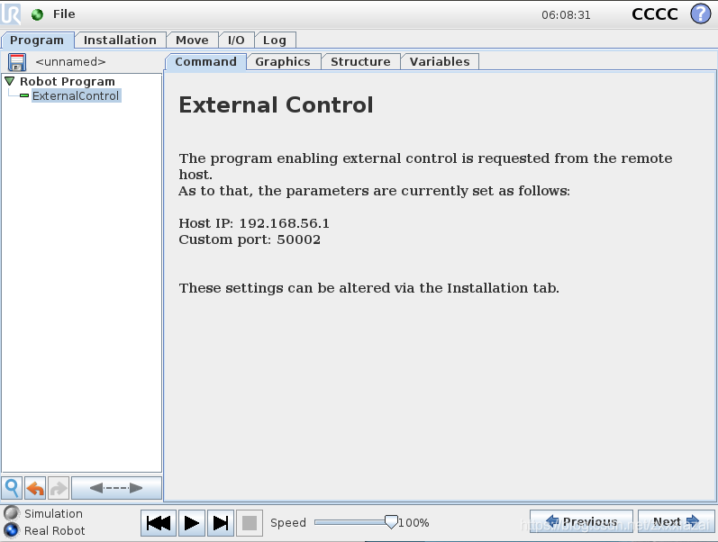
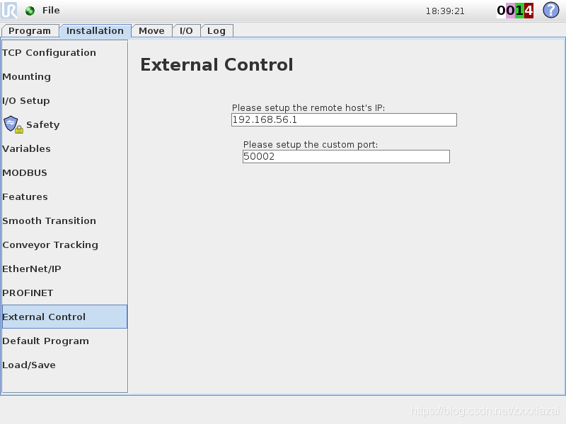
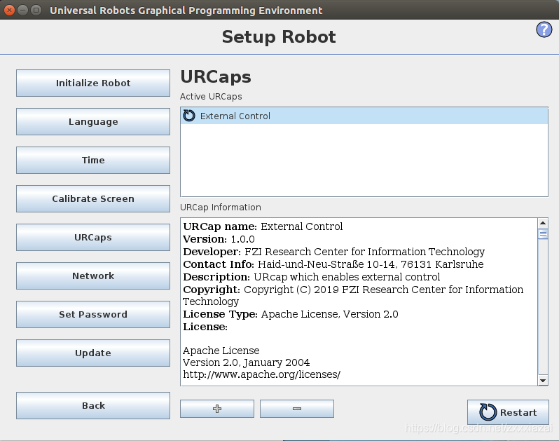
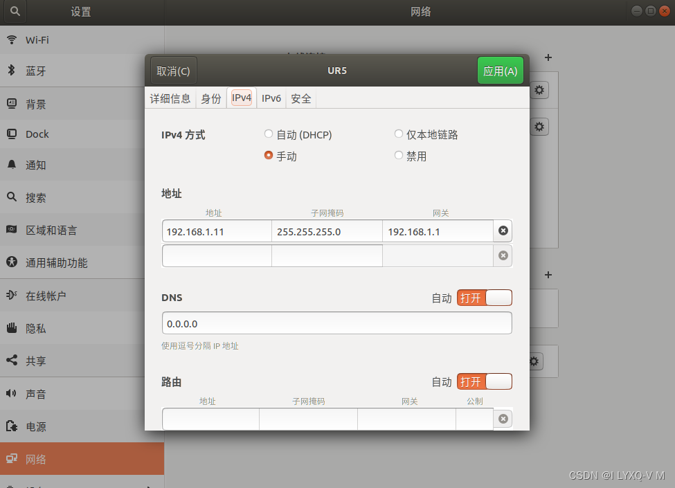

# urcaps及通讯配置

## External-control安装

> 参考教程`https://github.com/UniversalRobots/Universal_Robots_ROS_Driver/blob/master/ur_robot_driver/doc/usage_example.md`
>
> https://github.com/UniversalRobots/Universal_Robots_ROS_Driver/blob/master/ur_robot_driver/doc/install_urcap_cb3.md
>
> 下载链接：
>
> https://github.com/UniversalRobots/Universal_Robots_ExternalControl_URCap/releases

- 文件地址：`Universal_Robots_ROS_Driver /ur_robot_driver/ resources/externalcontrol-1.0.4.urcap`

- 示教器：`>>UR-Caps >> External Control`

- 网络设置

  | 设备        | 地址           |
  | ----------- | -------------- |
  | Robot / VM  | 192.168.56.101 |
  | ROS machine | 192.168.56.1   |

  Linux-手动模式：输入相同的IP地址、子网掩码、默认网关
  电脑-ip : 192.168.56.1
  ur5-ip ：192.168.56.101

 

 

 

 

- 关闭无线网络

- 测试通讯

```shell
ping 192.168.125.100
```

- 编程驱动

  - GUI界面

    - `安装设置>>External Control `设置IP（电脑的IP）>>

    - GUI程序：UR Caps >>External Control
      192.168.56.101 Robot

      192.168.56.1 ROS

    - 配置External control的网址
      External control是指电脑的ip
      Host ip设置为电脑的ip

    - 设置机械臂的网址
      在settings中找到network，选择静态网址，然后把ip设成跟电脑的在同一网段

## 机械爪的安装及驱动载入

- 软件包Robotiq： Support/universal Robot
- 利用USB导入示教器：
  - `列表>>设置>>systems>>URCaps>>USB 盘符>>Open`
  - Find Grisper 
  - Restart
  - `安装设置`
    - URCaps >>Griper
      勾选：Griper is connected to the Wrist 
      点击scann 选择activate
    - calibration 
- 安装配件-调整机械臂位姿-Z轴朝上

## FT300的安装及驱动设置

https://blog.csdn.net/TinyBenji/article/details/124199593

https://blog.csdn.net/weixin_45676305/article/details/124083349


- 驱动 Setup robot
  URCaps 点击添加 重启示教器
  - `Installation >>Copilot >calibration >stat calibration wizard >根据提醒调整位姿>continue
    TCP Configuration`

- 接线：电源接线：红黑 跨接i/o 左红右黑
  - Configurable i/o
    Digital i/o

- 编辑`ur5.xacro`文件，包含FT300的模型

```xml
<?xml version="1.0"?>
<robot xmlns:xacro="http://wiki.ros.org/xacro" name="ur5_robot_ft">  
  <xacro:include filename="$(find myur5_description)/urdf/ur5.xacro"/>
  <xacro:include filename="$(find robotiq_ft_sensor)/urdf/robotiq_ft300.urdf.xacro"/> 
  <!--robotiq_ft_sensor-->
  <xacro:robotiq_ft300 prefix="" parent="tool0">
      <origin xyz="0 0 0" rpy="0 0 0"/>
  </xacro:robotiq_ft300>
</robot>
```

- 串口权限

```shell
# Linux串口是默认普通用户没有读写权限的
sudo chmod a+rw /dev/ttyUSB0
```

- 读取数据

````shell
$ rosrun robotiq_ft_sensor rq_sensor # 发布者
$ rosrun robotiq_ft_sensor rq_test_sensor # 订阅者
[ INFO] [1650284097.356151697]: No device filename specified. Will attempt to discover Robotiq force torque sensor.
[ INFO] [1650284098.040120336]: Waiting for sensor connection...
[ INFO] [1650284099.182842730]: Sensor connected!
[ INFO] [1650284100.260359416]: Starting Sensor
````

