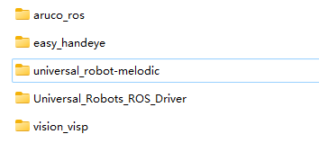
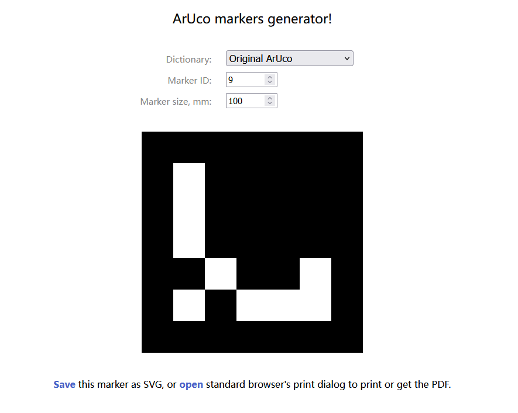
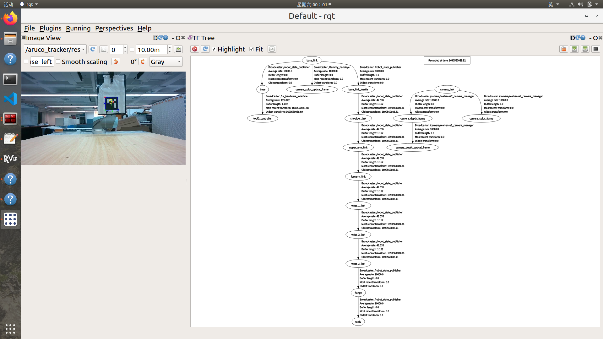
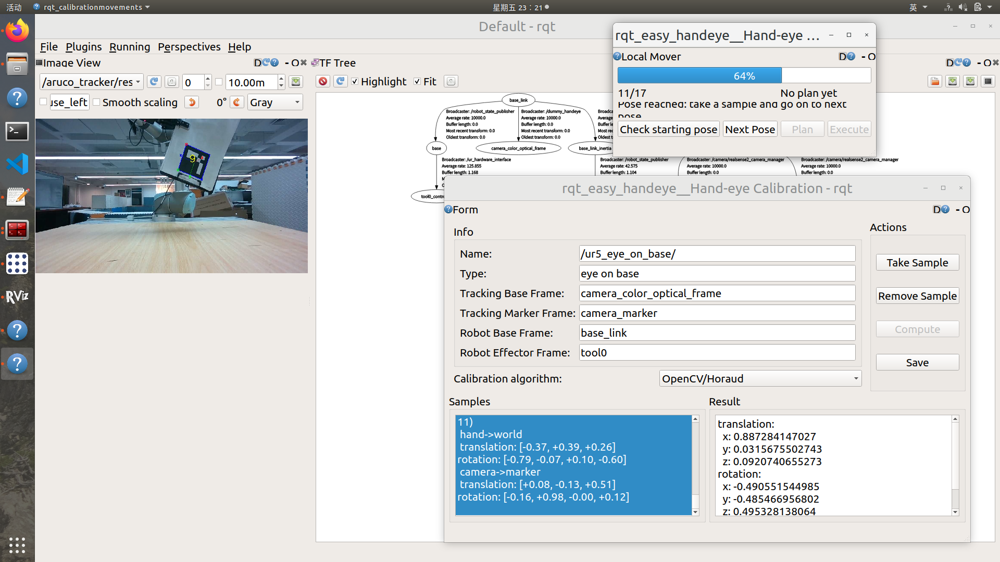
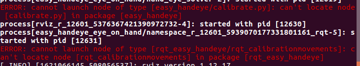

# 手眼标定

## 工作空间配置

### 所有软件包



> Aruco-ros：二维码识别及位姿发布程序
>
> easy-handeye：简易手眼标定程序-Qt界面-节点启动管理
>
> Vision-visp：视觉包-用于计算二维码及手眼矩阵
>
> UR-driver&robot：驱动、机器人描述文件、运动规划和控制文件
>
> Intel-Realsense：RGB-D相机驱动

### Git-Hub 链接

> https://github.com/pal-robotics/aruco_ros
>
> https://github.com/IFL-CAMP/easy_handeye
>
> https://github.com/lagadic/vision_visp.git
>
> **小鱼**
>
> https://gitee.com/ohhuo/handeye-calib#https://gitee.com/link?target=https%3A%2F%2Fcalib.io%2Fpages%2Fcamera-calibration-pattern-generator

### 官方安装过程

```shell
cd ~/catkin_ws/src  
git clone https://github.com/IFL-CAMP/easy_handeye

cd ..
rosdep install -iyr --from-paths src
(安装依赖项：aruco_ros，visp_hand2eye_calibration)

### 或者手动安装
sudo -H apt-get install -y ros-melodic-visp-hand2eye-calibration
sudo -H apt-get install -y ros-melodic-aruco-ros

cakin_make

### 安装rqt插件
$ sudo apt-get install ros-melodic-rqt
$ sudo apt-get install ros-melodic-rqt-common-plugins
```

### :exclamation:修改`easy—handeye.launch`文件

- 参考<kbd>Doc</kbd>路径：`easy_handeye/docs/example_launch`

- 编辑


```xml
<launch>
    <arg name="namespace_prefix" default="ur3_realsense_handeyecalibration" />

    <arg name="robot_ip" doc="The IP address of the UR3 robot" />

    <arg name="marker_size" doc="Size of the ArUco marker used, in meters" default="0.1" />
    <arg name="marker_id" doc="The ID of the ArUco marker used" default="9" />
    <!--start ArUco -->
    <node name="aruco_tracker" pkg="aruco_ros" type="single">
        <remap from="/camera_info" to="/camera/color/camera_info" />
        <remap from="/image" to="/camera/color/image_raw" />
        <param name="image_is_rectified" value="true"/>
        <param name="marker_size"        value="0.1"/>
        <param name="marker_id"          value="9"/>
        <param name="reference_frame"    value="camera_color_optical_frame"/>
        <param name="camera_frame"       value="camera_color_optical_frame"/>
        <param name="marker_frame"       value="camera_marker" />
    </node>

    <!--  start easy_handeye -->
    <include file="$(find easy_handeye)/launch/calibrate.launch" >
        <arg name="namespace_prefix" value="$(arg namespace_prefix)" />
        <arg name="eye_on_hand" value="false" />

        <arg name="tracking_base_frame" value="camera_color_frame" />
        <arg name="tracking_marker_frame" value="camera_marker" />
        <arg name="robot_base_frame" value="base" />
        <arg name="robot_effector_frame" value="tool0_controller" />

        <arg name="freehand_robot_movement" value="false" />
        <arg name="robot_velocity_scaling" value="0.5" />
        <arg name="robot_acceleration_scaling" value="0.2" />
    </include>
    	
</launch>

```

- 说明：相机和机械臂节点需要单独启动
- 参数解释

> `marker_size`:二维码尺寸，10cm，值为0.1
>
> `marker_id`：二维码ID，选用9
>
> `reference_frame`：相机的参考坐标系，任意，选择与光学成像面相同
>
> `camera_frame`：相机的光学成像面坐标系，camera_color_optical_frame
>
> `marker_frame`:二维码坐标系，任意命名，但要求前后统一，camera_marker
>
> `tracking_base_frame`:跟踪的坐标系基准，(变换的坐标系)camera_color_optical_frame
>
> `tracking_marker_frame`：二维码坐标系，camera_marker
>
> `freehand_robot_movement`:是否允许示教器开启手拖动机械臂（默认：false）
>
> `eye_on_hand`：是否眼在手上

## 准备材料

### 标定板

网页：https://chev.me/arucogen/

:warning:Dictionary 一定要选一定要选用<kbd>Original ArUco</kbd>



- 其他
  - 电脑-鼠标-网线


## 标定过程

- 测试通讯-:warning:关闭无线网
```shell
$ ping 192.168.1.101
$ roslaunch ur_robot_driver ur5_bringup.launch limited:=true robotip:=192.168.1.101
```
- ==示教器==：启动 UR-Caps: External Control
- UR5-planning及RVIZ
```shell
$ roslaunch ur5_moveit_config moveit_planning_execution.launch limited:=true
$ roslaunch ur5_moveit_config moveit_rviz.launch rviz_config:=$(rospack find ur5_moveit_config)/launch/moveit.rviz
```
- 启动相机
```shell
$ roslaunch realsense2_camera rs_camera.launch
```
- 启动easy_handeye
```shell
$ roslaunch easy_handeye ur5_rs_calib.launch
## 可选
$ rosrun tf static_transform_publisher 0.0 0.0 0.0 0.0 0.0 0.0 map camera_color_optical_frame 100
```
- 启动 `rqt`
`plugins >>visulization>>image_raw>>aruco_traker/result`
### Tips:
- 若不显示Image  需要重启相机
- GUI操作：点击<kbd>check starting pose</kbd>，成功后：` 0/17，ready to start`
  - 然后点击`Next Pose -> Plan -> Execute `
  - 执行完成以后如果标定码在视野范围内则 点击Take Sample 
  - 循环往复直到执行完17个位姿，点击窗口的<kbd>Compute</kbd>
  - 点击<kbd>Save</kbd>，数据保存在`$HOME/.ros/easy_handeye`目录下
- 关于算法：OpenCV-xxx
  - Andreff误差最大
  - Tsai-lenz为默认，一般与Park和Horaud差距不大
  - Daniilidis的略微有些差距-2cm左右，多对比观察数据

- 关于启动的launch文件的说明

  - `bringup`中不可以添加关节限位
  - `moveit`中不可以有未知关节信息
  - `rqt`观察是否跟踪到二维码

- 标定过程

  - 首先，选择二维码在画面中心且几乎没有偏转，这样可以保证生成的17个方向位置各异的位姿都可以识别到二维码。
  - 其次一般如果启动节点失败，主要是因为`camera_color_optical_frame`的变换关系未知，有时手眼标定程序会自动启动，但是没有的话需要手动静态发布

  

### 标定的细致操作过程

- 标定的实际操作
 - 第一步点击<kbd>Check starting pose</kbd>，成功后提示`1/17`
 - 第二步点击<kbd> Next Pose</kbd>并<kbd> plan && Execute</kbd>
 - 第三部-计算界面
   - <kbd>Take sample</kbd>
   - ==一定要至少7个样本之后再点击<kbd>compute</kbd>否则会失败==
   - 直至17个位姿都成功

:star:注意，未追踪到的二维码不可以点击需要跳过，并且每个17个位姿最好是都可以成功追踪的到的测试是结果较好的。

:star: 其中算法algorithm可选，可以额外<kbd>Take sample</kbd> 再<kbd> Remove Sample</kbd>，之后重新计算。



## 发布变换

`easy_handeye` 功能包提供了 `publish.launch` 文件，可以将标定好的 TF 发布

亦或者在`launch`文件中

```xml
<launch>  
<node pkg="tf" type="static_transform_publisher" name="link1_broadcaster" args="x y z qx qy qz qw base_link camera_link 100" />
</launch>
```


## 最终测试结果

```yaml
Tsai-lenz
transformation:
  qw: 0.5005875077598312
  qx: -0.49156899487077343
  qy: -0.47978918834638995
  qz: 0.526853305107267
  x: 0.8697982730425432
  y: 0.010940082273925619
  z: 0.09772335176582145
```


##  Debug

### 正常报错

> - [ WARN] [1678281225.207353536]: IK plugin for group 'manipulator' relies on deprecated API. Please implement initialize(RobotModel, ...).
> - [ WARN] [1678281221.632877972]: normalizeImageIllumination is unimplemented!

### 缺乏依赖项

```shell
$ sudo apt install python-pyqt5
$ sudo apt install python3-pyqt5
$ pip install pyqt5
$ pip install PySide2
$ pip install transforms3d
$ pip install tabulate
$ pip2 install opencv-python==4.2.0.32
$ sudo apt-get install ros-melodic-genpy 

```

### `.py`文件没有执行权限



```shell
$ sudo chmod +x calibrate.py
$ sudo chmod +x rqt_calibrationmovements
```


## 精度提升

### 操作说明

> (1) 不管采集多少组用于标定的运动数据，每组运动使运动角度最大。
> (2) 使两组运动的旋转轴角度最大。
> (3) 每组运动中机械臂末端运动距离尽量小，可通路径规划实现该条件。
> (4) 尽量减小相机中心到标定板的距离，可使用适当小的标定板。
> (5) 尽量采集多组用于求解的数据。
> (6) 使用高精度的相机标定方法。
> (7) 尽量提高机械臂的绝对定位精度，如果该条件达不到，至少需要提高相对运动精度。
> 原文链接：https://blog.csdn.net/Thinkin9/article/details/123743924
>
> https://blog.csdn.net/qq_27865227/article/details/119650675
>
> https://mp.weixin.qq.com/s?__biz=MzkzMzI2MTU2Nw==&mid=2247483704&idx=3&sn=0738c3e6195675a17d526ee02ea681e6&chksm=c24e78a8f539f1be69f1750bac42079b1a616d523faaf4719c2232de71ee1171a14d8aad3577&scene=21#wechat_redirect
>
> https://blog.csdn.net/laoli_/article/details/128144613

### 误差链

- 内参
- 点云对齐
- 机械臂标定
- 手眼标定

### 对准

在 `/camera/depth_registered/points` 话题中，点云数据已经注册到了相机图像上，也就是深度和颜色信息已经对齐。这意味着每个点的深度值和颜色值都是对应的，这对于进行点云的可视化、物体检测、环境感知和三维重建等任务非常有用。

## 参考教程

https://www.jianshu.com/p/dcc7fe02e55e

https://github.com/lochinasc1017/UR5_easyhandeye_D435i_Calibration

https://blog.csdn.net/sinat_23853639/article/details/80276848

https://blog.csdn.net/gyxx1998/article/details/122238052

https://blog.csdn.net/zhang970187013/article/details/81098175

https://blog.csdn.net/lqsdddd/article/details/126544007


https://www.jianshu.com/p/3e6764b13c6e（原理）

https://blog.csdn.net/m0_52785249/article/details/125973858

https://zhuanlan.zhihu.com/p/448120739

https://blog.csdn.net/weixin_43575752/article/details/116136075

https://zhuanlan.zhihu.com/p/587858107

https://zhuanlan.zhihu.com/p/529298152

https://blog.csdn.net/qq_40369926/article/details/89251296
