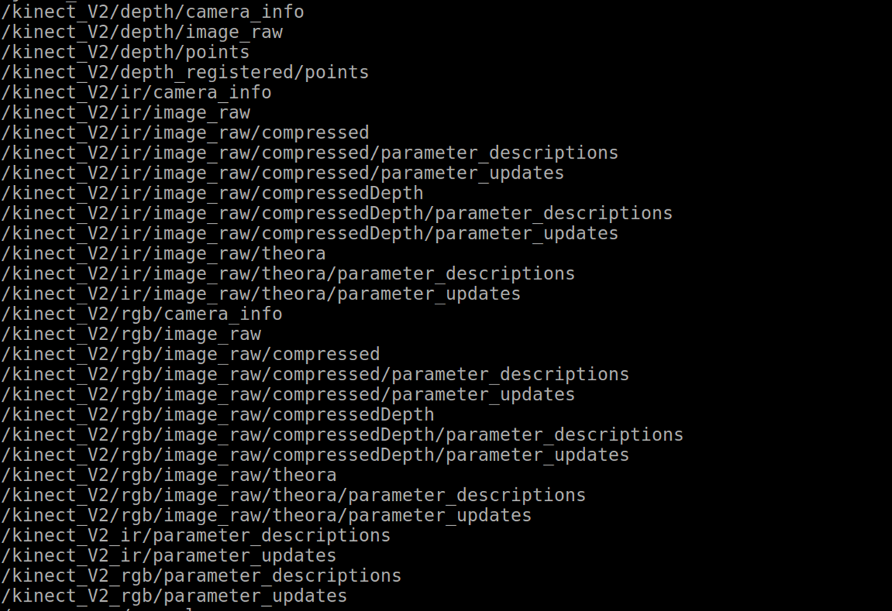

# urdf

## 常用

- 检查URDF

``` shell
check_urdf [your urdf file name].urdf
```


## 从Solidworks中利用插件导出URDF

- 插件：`sw_urdf_exporter`,官网：__wiki.ros.org__，或是古月居教程文件
- 使用：在装配体中选择`工具>>file>>Export as URDF`
- 导出为`description`软件包时
  - 修改`package.xml`中的个人email格式
  - `view.launch`中的`gui_arg`修改为true
  - 启动：`display.launch`


## 在机器人URDF添加相机

### 安装intel-Realsense的描述文件

```shell
sudo apt-get install ros-kinetic-realsense2-description
```

- 修改`description`中的`.urdf.xacro`

````xml
<xacro:include filename="$(find realsense2_description)/urdf/_d435.urdf.xacro" />
<xacro:sensor_d435 name="" parent="world" >
    <origin xyz="0.3 0.0 1.5" rpy="0.0 ${pi/2} 0.0" />
</xacro:sensor_d435>
````

----

### 安装Kinect_V2的描述文件并导入

```xml
## 链接关节和连杆
  <xacro:kinect_v2 parent="world" >
    <origin xyz="0.5 0.0 1.5" rpy="0.0 ${pi/2} 0.0" />
  </xacro:kinect_v2>
## 导入文件
  <xacro:include filename="$(find kinect_v2)/urdf/kinect_v2.urdf.xacro" />
```

- Gazebo中发布的关于相机的话题

 

## 机械臂的URDF编辑

### 添加夹爪

- 文件:page_facing_up:`robotiq_arg2f_85_model_macro.xacro`
  - 夹爪整体宏定义

```xml
  <!-- Initialization of all joints and links -->

  <xacro:macro name="robotiq_arg2f_85" params="prefix">

    <xacro:robotiq_arg2f_base_link prefix="${prefix}"/>

    <xacro:finger_links prefix="${prefix}" fingerprefix="left" stroke="85"/>

    <xacro:finger_links prefix="${prefix}" fingerprefix="right" stroke="85"/>

    <xacro:finger_joint prefix="${prefix}"/>

    <xacro:right_outer_knuckle_joint prefix="${prefix}"/>

    <xacro:robotiq_arg2f_transmission prefix="${prefix}"/>

  </xacro:macro>
```

> 参数说明：
>
> prefix：其实就是一个名称前缀，在实例化宏的时候可以加也可以不加，加了后面可能还要修改一些名称，所以这里就不加了。
>
> parent：表示要把夹爪接到哪个关节上，这里我们是接到UR5的末端ee_link上了。
>
> origin：origin前有一个“*”，表示这是一个块参数,在实现宏时指的是第一个元素

### 添加传感器

- 文件：:page_facing_up:`robotiq_ft300.urdf.xacro`
  - 使用案例教程

```xml
<robot xmlns:xacro="http://ros.org/wiki/xacro" name="robotiq_fts150">

    <!-- Macro function to instanciate URDF model of the FT300 force-torque sensor with mounting plate

        Example use: 
```
~~~xml
        // Import this macro function
        <xacro:include filename="$(find robotiq_ft_sensor)/urdf/robotiq_ft300.urdf.xacro" />
        
        // Instanciate sensor instance and connect it to robot flange
        <xacro:robotiq_ft300 parent="robot_flange_link" prefix="">
            <origin xyz="0 0 0" rpy="0 0 0"/> 
        </xacro:robotiq_ft300>
    ```
-->
<xacro:macro name="robotiq_ft300" params="parent prefix *origin">

    <!-- mount the fts to the robot -->
    <joint name="${prefix}ft300_fix" type="fixed">
        <xacro:insert_block name="origin" />
        <parent link="${parent}" />
        <child link="${prefix}ft300_mounting_plate" />
    </joint>
~~~


### 整体文件

- :page_facing_up:`ur_platform.urdf.xacro`
  - 导入文件
    - 传动及HW接口
    - 运动学标定配置-机械臂标定
    - Gazebo-common：gazebo插件
    - FT传感器
    - 二指夹爪
  - 关节-宏包调用
    - 世界坐标
    - 相机、FT、gripper调用及关节坐标设置

```xml
<?xml version="1.0"?>
<robot xmlns:xacro="http://www.ros.org/wiki/xacro" name="ur_platform">

  <xacro:arg name="transmission_hw_interface" default="hardware_interface/PositionJointInterface"/>
  <!--xacro:arg name="kinematics_config" default="$(find ur_robot_driver)/calibration/my_robot_calibration.yaml"/-->
  <xacro:arg name="kinematics_config" default="$(find ur_description)/config/ur5_default.yaml"/>
  <xacro:include filename="$(find ur_description)/urdf/common.gazebo.xacro" />
  <xacro:include filename="$(find ur_description)/urdf/ur5.urdf.xacro" />
  <xacro:include filename="$(find robotiq_ft_sensor)/urdf/robotiq_ft300.urdf.xacro" />
  <xacro:include filename="$(find robotiq_85_description)/urdf/robotiq_85_gripper.urdf.xacro" />

  <xacro:include filename="$(find kinect_v2)/urdf/kinect_v2.urdf.xacro" />

  <xacro:ur5_robot prefix="" joint_limited="false"
    transmission_hw_interface="$(arg transmission_hw_interface)"
    kinematics_file="${load_yaml('$(arg kinematics_config)')}"
  />
  <link name="world" />
  <joint name="world_joint" type="fixed">
    <parent link="world" />
    <child link ="base_link" />
    <origin xyz="0.3 0.0 0.8" rpy="0.0 0.0 0.0" />
  </joint>
  <xacro:robotiq_ft300 prefix="" parent="tool0" >
		<origin xyz="0 0 0" rpy="0 0 0"/> 
	</xacro:robotiq_ft300>
  <xacro:robotiq_85_gripper prefix="" parent="robotiq_ft_frame_id">
    <origin xyz="0 0 0" rpy="0 ${-pi/2} 0"/>
  </xacro:robotiq_85_gripper>
  <xacro:kinect_v2 parent="base_link" >
    <origin xyz="0.8981 -0.0257 0.0837" rpy="0.01640 0.003926 -3.1303" />
  </xacro:kinect_v2>
</robot>
```

### 配置`ee_link`

- :file_folder:`ur_description`-:page_facing_up:`ur5.urdf.xacro`

```xml
    <joint name="${prefix}ee_fixed_joint" type="fixed">
      <parent link="${prefix}wrist_3_link" />
      <child link = "${prefix}ee_link" />
      <origin xyz="0.0 0.0 0.210" rpy="0.0 ${-pi/2.0} ${pi/2.0}" />
    </joint>

    <link name="${prefix}ee_link">
      <collision>
        <geometry>
          <box size="0.01 0.01 0.01"/>
        </geometry>
        <origin rpy="0 0 0" xyz="-0.01 0 0"/>
      </collision>
    </link>
```

- 测试

```shell
roslaunch ur_description view_ur5.launch
```

