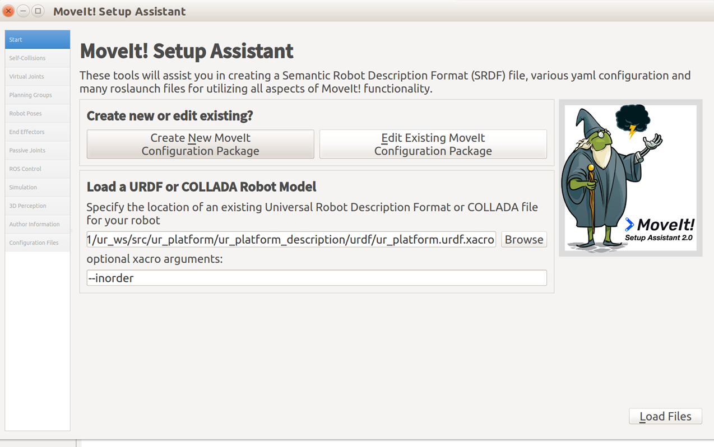
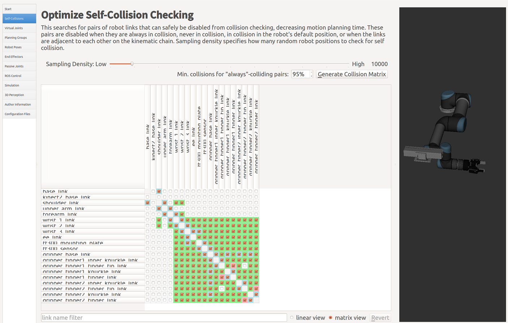
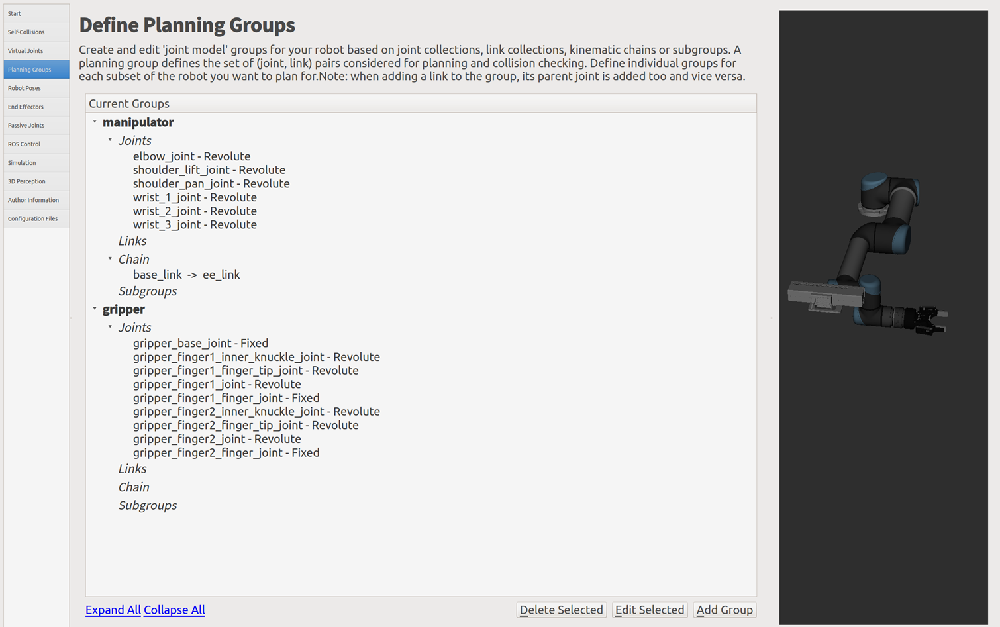
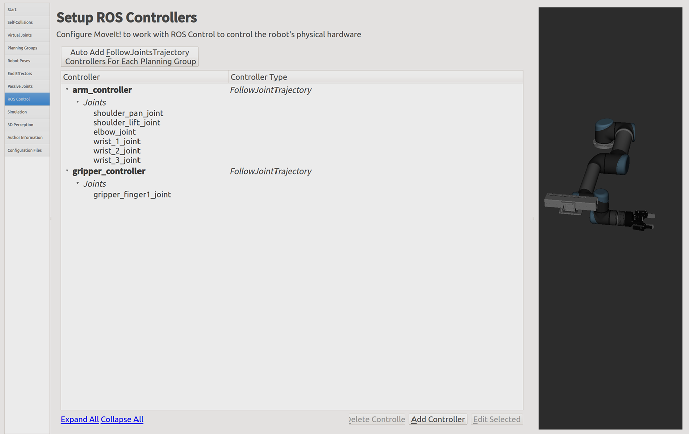
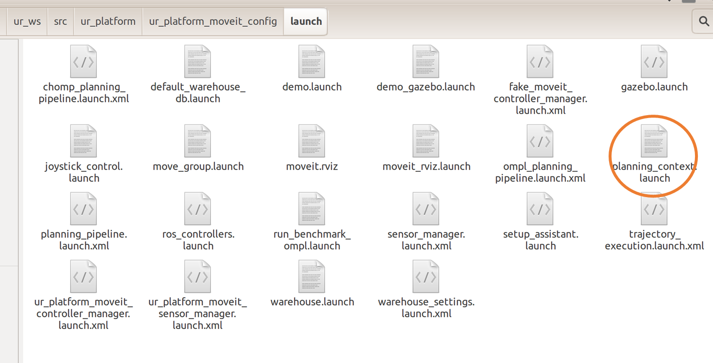
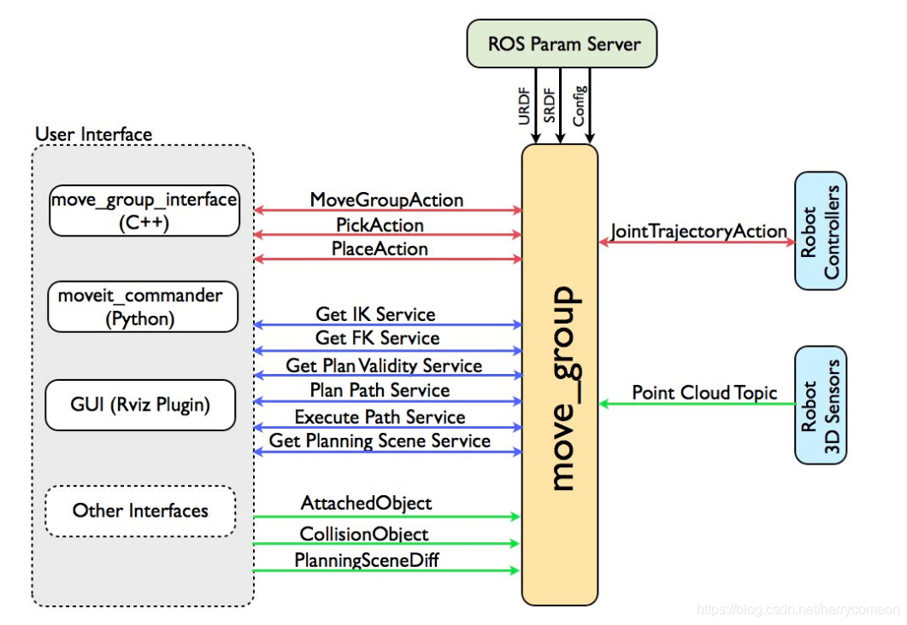

# Moveit设置

## 常用

- 安装

```shell
sudo apt-get install ros-kinetic-moveit
sudo apt-get install ros-melodic-moveit
$ sudo apt-get install ros-melodic-moveit-resources
```


## Moveit-setupassistant

### 配置流程

> https://blog.csdn.net/weixin_48319333/article/details/129203384

- 进入工作空间，并进行环境变量配置`source devel/setup.bash`

```shell
roslaunch moveit_setup_assistant setup_assistant.launch
```

### 使用配置

- 选择`.urdf.xacro`或是`xx_moveit_config`



- 自碰撞检测矩阵



- 运动组设置
  - Kin. Search Resolution: 关节空间的采样密度 
  - Kin. Search TImeout: 求解时间 
  - Kin. Solver Attempts: 求解失败尝试次数




- 控制器生成



- 导出后

  - 修改：email格式、srdf文件名称

  

  - 编译


## `Move-group`节点



http://wiki.ros.org/moveit_commander

###  古月抓取例程

````xml
<launch>
  
    <!-- Launch Gazebo  -->
    <include file="$(find probot_gazebo)/launch/probot_anno/probot_anno_gazebo_world.launch" />
 
    <!-- ros_control arm launch file -->
    <include file="$(find probot_gazebo)/launch/probot_anno/probot_anno_gazebo_states.launch" />   
 
    <!-- ros_control trajectory control dof arm launch file -->
    <include file="$(find probot_gazebo)/launch/probot_anno/probot_anno_trajectory_controller.launch" />
 
    <!-- moveit launch file -->
    <include file="$(find probot_anno_moveit_config)/launch/moveit_planning_execution.launch" />
    <node name="joint_state_publisher" pkg="joint_state_publisher" type="joint_state_publisher">
    	<param name="/use_gui" value="false"/>
    	<rosparam param="/source_list">[/joint_states]</rosparam>
    </node>
 
</launch>
````

- 重点在于最后启动一个关节状态发布者节点，用于公布机械臂当前状态

:exclamation:==注意== movei_assistant  要在工作空间中配置完成环境变量后才能检索到所需文件

## Moveit motion Planning失败

- 方案1
  - 使用函数group.setApproximateJointValueTarget(target_pose1, "link3");来代替函数group.setPoseTarget(target_pose1,"link3");
  - 程序里设置tolerance


## 文件说明

```shell
├── CMakeLists.txt
├── config #配置文件目录
│ ├── fake_controllers.yaml #虚拟控制器配置文件,方便我们在没有实体机器人,甚至没有任何模拟器（如gazebo）开启的情况下也能运行MoveIt
│ ├── joint_limits.yaml #记录了机器人各个关节的位置速度加速度的极限
│ ├── kinematics.yaml #初始化运动学求解库
│ ├── lwr.srdf #配置助手设置参数，包含组,位姿,末端执行器,虚拟关节及碰撞免测矩阵ACM等的定义。
│ └── ompl_planning.yaml #配置OMPL各种算法及参数
├── launch #启动文件脚本目录
│ ├── default_warehouse_db.launch #如果激活数据库载入方式，会启动mongodb.被demo.launch调用,
│ ├── demo.launch #启动配置包的入口文件
│ ├── fake_moveit_controller_manager.launch.xml #调用fake_controllers.yaml
│ ├── joystick_control.launch #游戏杆控制
│ ├── lwr_moveit_controller_manager.launch.xml #控制管理器定义，在trajectory_execution.launch.xml被调用
│ ├── lwr_moveit_sensor_manager.launch.xml #传感器管理器定义，在sensor_manager.launch.xml被调用
│ ├── move_group.launch #move_group节点
│ ├── moveit.rviz #rviz相关参数文件
│ ├── moveit_rviz.launch #rviz启动文件
│ ├── ompl_planning_pipeline.launch.xml #ompl规划管道启动，在planning_pipeline.launch.xml被调用
│ ├── planning_context.launch #载入URDF, SRDF,正向运动学求解等设置
│ ├── planning_pipeline.launch.xml #总的规划管道启动
│ ├── run_benchmark_ompl.launch #针对ompl库的压力测试，需要指定.cfg文件列表。
│ ├── sensor_manager.launch.xml #传感器启动文件
│ ├── setup_assistant.launch #重配置oveIt!包
│ ├── trajectory_execution.launch.xml #轨迹执行启动文件
│ ├── warehouse.launch #运行数据库
│ └── warehouse_settings.launch.xml #数据库配置文件
└── package.xml
```

编程教程：

> https://blog.csdn.net/huangjunsheng123/article/details/126061826
>
> https://blog.csdn.net/weixin_44287946/article/details/108108443
>
> https://www.jianshu.com/p/0ed41946df84
>
> https://www.guyuehome.com/455
>
> https://zhuanlan.zhihu.com/p/90784465
>
> http://docs.ros.org/en/melodic/api/moveit_msgs/html/index-msg.html
