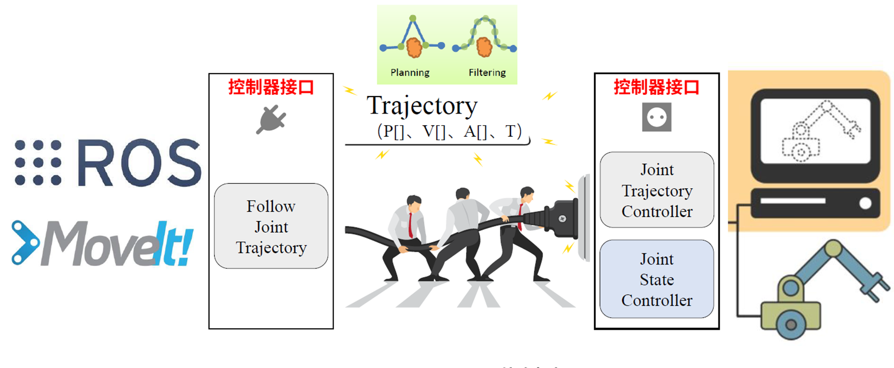

# gazebo-moveit

 

## Gazebo-Moveit! 的联动配置

- :file_folder:`config`-:page_facing_up:`ros_control.yaml`
  - 修改`name`保证一致，且关节数量名称对应

https://zhuanlan.zhihu.com/p/392635284

## 复现-UR-Platform

[链接](https://github.com/borninfreedom/ur_ws)

> 教程:
>
> https://blog.csdn.net/bornfree5511/article/details/106454699
>
> 

 

### 编译-Kinetic版本

```shell
cd ur_ws/
sudo rosdep init
rosdep update
rosdep install --from-paths src --ignore-src --rosdistro kinetic -y
catkin build
```

### 文件架构

 

> ├── find_object_2d
> ├── fmauch_universal_robot
> │   ├── ur5_moveit_config
> │   ├── ur_bringup
> │   ├── ur_description
> │   ├── ur_driver
> │   ├── ur_gazebo
> │   ├── ur_kinematics
> │   └── ur_msgs
> ├── gazebo_grasp_plugin   ### 夹爪的仿真插件
> ├── kinect_v2
> ├── robotiq
> │   ├── robotiq_85_gripper
> │   └── robotiq_ft_sensor
> ├── Universal_Robots_ROS_Driver
> │   ├── controller_stopper
> │   ├── README.md
> │   ├── ur_calibration
> │   ├── ur_controllers
> │   ├── ur_dashboard_msgs
> │   └── ur_robot_driver
> └── ur_platform
>     ├── pick
>     ├── ur_platform_description
>     ├── ur_platform_gazebo
>     └── ur_platform_moveit_config

### 操作

- 原系统教程-基于find-object-2d

```shell
## 启动仿真平台及相关文件
roslaunch ur_platform_gazebo ur_platform_gazebo.launch
## 启动抓取例程
rosrun ur_robotiq_manipulation grasp_object.py
## 启动抓取&放置例程
rosrun ur_robotiq_manipulation grasping_demo.py
## 启动find_object_2d
## 识别物块位姿，并发布到TF树 
roslaunch find_object_2d find_object_3d_kinect2.launch
## 订阅发布的位姿，并发布给机械臂 -注意修改object的话题名称
rosrun ur_robotiq_manipulation tf_listener.py
## 结合抓取策略，进行物块的抓取操作 
rosrun ur_robotiq_manipulation grasping_vision.py
```

- 新程序

```shell
## 启动GPD
roslaunch gpd pq_grasp.launch ##改自tutorials2.launch
## 启动GPD选择
python src/gpd/scripts/select_grasp.py
rosrun ur_robotiq_manipulation select_grasp.py
## 启动grasp to pose
rosrun gpd grasp2pose
rosrun gpd tf_pub
rosrun gpd grasp2pose_tfsub
## 结合抓取策略，进行物块的抓取操作 
rosrun ur_robotiq_manipulation grasp_gpd.py

##成功版本
roslaunch ur_platform_gazebo ur_platform_gazebo.launch
rosrun ur_robotiq_manipulation grasp_gpd.py
rosrun add_obj add_collision
roslaunch gpd pq_grasp.launch
rosrun gpd grasp2pose_tfsub
```

## 复现基于find_object_2d 的整体仿真

>全部参考：
>
>https://github.com/harrycomeon/ur5-gazebo-grasping
>
>https://blog.csdn.net/harrycomeon/article/details/107073020?spm=1001.2014.3001.5502
>
>https://blog.csdn.net/harrycomeon/article/details/107331674
>
>https://blog.csdn.net/qq_43313298/article/details/124694309


### 第一步编译

- :exclamation:OpenCV的依赖项中的cv-bridge拼写错误，修改`package.xml`的cv-bridge

- 编译

```shell
## 启动模拟环境： 
roslaunch ur5_single_arm_tufts ur5_single_arm_gazebo.launch

## 识别物块位姿，并发布到TF树 
roslaunch find_object_2d find_object_3d_kinect2.launch

## 订阅发布的位姿，并发布给机械臂 
rosrun opencv tf_listener.py

## 结合抓取策略，进行物块的抓取操作 
rosrun ur5_single_arm_manipulation grasping_demo_vision2.py
```

- 融合两个工作空间
  - 修改URDF：:file_folder:`ur_platform_description`-:page_facing_up:`.urdf.xacro`

```xml
## 链接关节和连杆
  <xacro:kinect_v2 parent="world" >
    <origin xyz="0.5 0.0 1.5" rpy="0.0 ${pi/2} 0.0" />
  </xacro:kinect_v2>
## 导入文件
  <xacro:include filename="$(find kinect_v2)/urdf/kinect_v2.urdf.xacro" />
```

- 修改2D识别	
  - :page_facing_up:`find_object_3d.launch`

```xml
	<arg name="rgb_topic"         default="camera/rgb/image_rect_color"/>
	<arg name="depth_topic"       default="camera/depth_registered/image_raw"/>
	<arg name="camera_info_topic" default="camera/rgb/camera_info"/>
修改为
	<arg name="rgb_topic"         default="/kinect_V2/rgb/image_raw"/>
	<arg name="depth_topic"       default="/kinect_V2/depth/image_raw"/>
	<arg name="camera_info_topic" default="/kinect_V2/rgb/camera_info"/>
```

- 修改TF及抓取两个程序
  - `tf_listener.py(~/ur_platform_manipulation/scripts)`
  - `gr_vision2.py(~/ur_platform_manipulation/scripts)`

### 关于定位的问题

- Gazebo启动时，机械臂整体向上提升了0.1m，然而`move_group`运动规划器并没有将机器人与世界坐标的变化修正
  - :star:将Gazebo的提升改成URDF的初始模型变化

#### 完全修正后，整个机器人关节变化关系

 

## 关于ROS-Controller

https://www.guyuehome.com/890

https://blog.csdn.net/a17381562089/article/details/113805928

https://blog.csdn.net/qq_38288618/article/details/78902544

https://blog.csdn.net/weixin_43463140/article/details/123981745

https://blog.csdn.net/yaked/article/details/51436262
