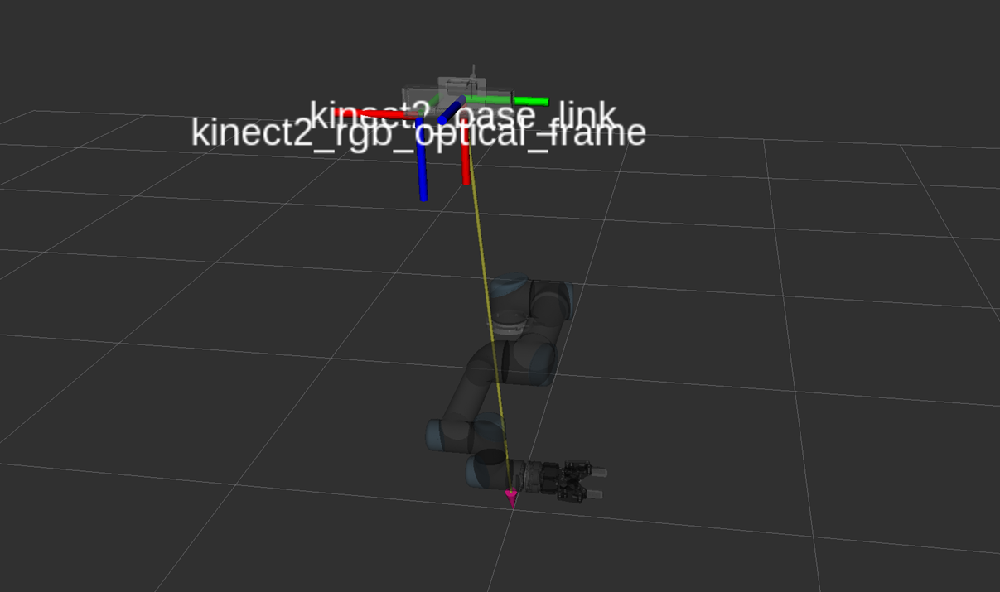
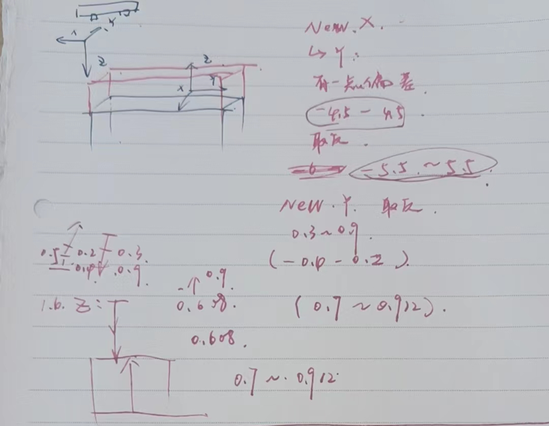
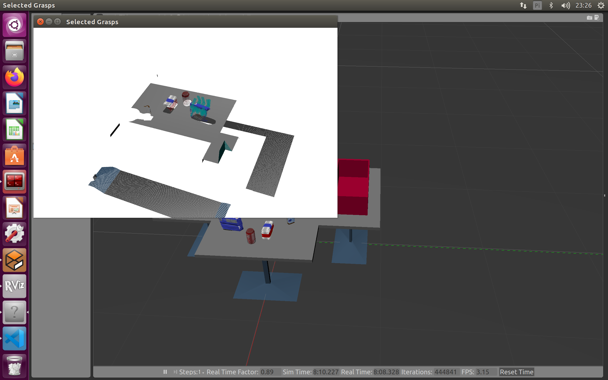
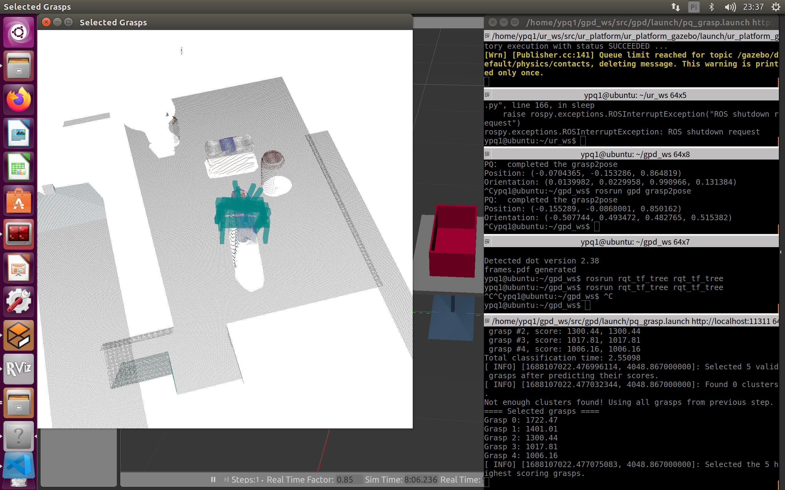
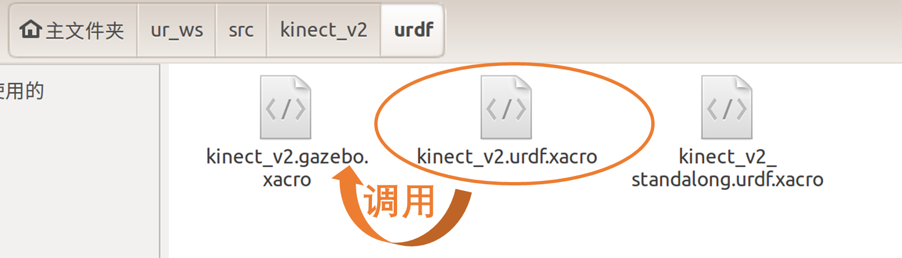

# gpd-gazebomoveit-kinetic

## GPD相关参数设置

### 工作空间设置

> https://blog.csdn.net/flyfish1986/article/details/85791858?ops_request_misc=%7B%22request_id%22%3A%22168317010616800197096407%22%2C%22scm%22%3A%2220140713.130102334..%22%7D

- 编辑`tutorial2.launch`文件中的相关参数

  - 工作空间：[minX, maxX, minY, maxY, minZ, maxZ]
  - 夹爪工作空间

- 工作空间的原点是点云的图像中心，即相机的`optical_frame`的坐标

  - 其XYZ三个轴的方向也由`optical_frame`确定
  - 光学镜头顺着其坐标方向看去：右X，下Y，前 Z

  

 

 

- 修改其参数

```xml
<rosparam param="workspace"> [-0.5, 0.5, -0.40, 0.2, 0.6, 0.812]</rosparam>
<rosparam param="camera_position"> [0.5, 0,1.6] </rosparam>
```

- 抓取桌面的设置

```xml
<!-- Filtering of grasps which are too low on (i.e. too close to) table -->
<param name="filter_table_side_grasps" value="true" /> 
<param name="table_height" value="0.6" />
<param name="remove_plane_before_image_calculation" value="true" />
```

- 关于检测抓取策略的方向性-`approach`

  - 关于工作空间方向彻底反向的情况，由于相机的朝向与世界坐标系的朝向相反，所以生成的抓取位姿相反，及grasp pose是内嵌在物体内部如图
 
  - 将相机的z轴取为负值，即-1.5，可得抓取的期望位姿为正向及approach在体外
 


----

### Kinect-V2相机的点云参考坐标-`frame_id`

- `kinect-v2`软件包下的Gazebo插件-确定`kinect2_rgb_optical_frame`

 

```xml
<!--kinect_v2.urdf.xacro 调用macro语句-->
<xacro:kinect2_rgb_gazebo link_name="kinect2_rgb_link" frame_name="kinect2_rgb_optical_frame" camera_name="kinect_V2"/>
<!--kinect_V2.gazebo.xacro 中定义macro的结构-->
<frameName>${frame_name}</frameName>
```

----

### 编辑GPD-`launch`文件

- 绘制点云和已经选用的抓取

```xml
<param name="plot_selected_grasps" value="true" />
```

- 关于点云话题

```xml
    <!-- What type of point cloud is used and what ROS topic it comes from -->
    <param name="cloud_type" value="0" /> <!-- 0: PointCloud2, 1: CloudIndexed, 2: CloudSamples -->
    <param name="cloud_topic" value="/kinect_V2/depth_registered/points" />
```

- 体素化

```xml
    <param name="voxelize" value="true"/>
    <param name="remove_outliers" value="false"/>
```

- 桌子相关

```xml
    <!-- Filtering of grasps which are too low on (i.e. too close to) table -->
    <param name="filter_table_side_grasps" value="true" />
    <rosparam param="vertical_axis"> [0, 0, 1] </rosparam>
    <param name="angle_thresh" value="0.00001" />
    <param name="table_height" value="0.868" />
    <param name="table_thresh" value="0.01" />
```

``

