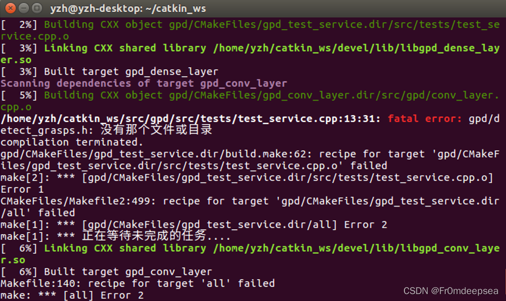
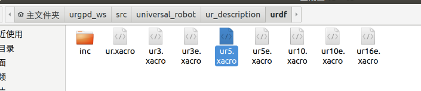
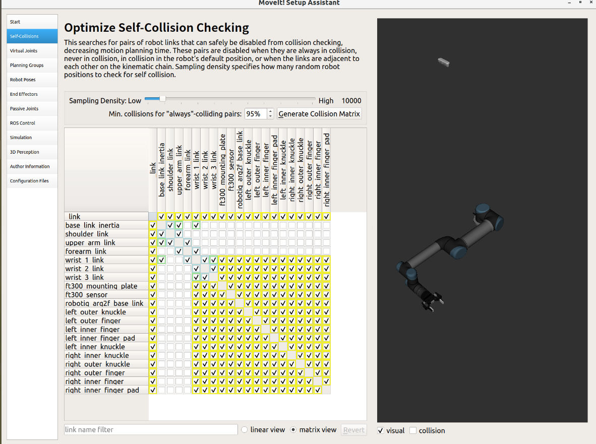
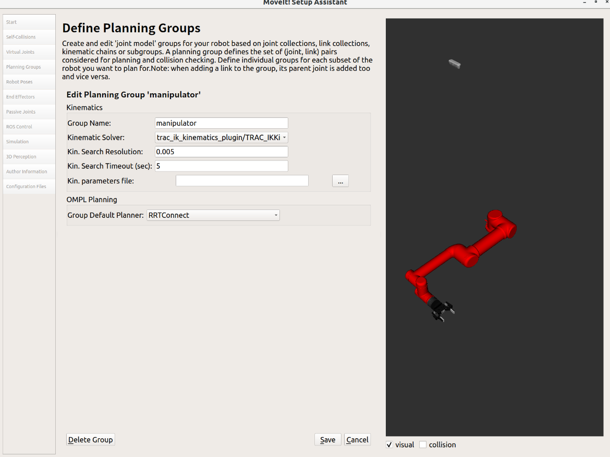
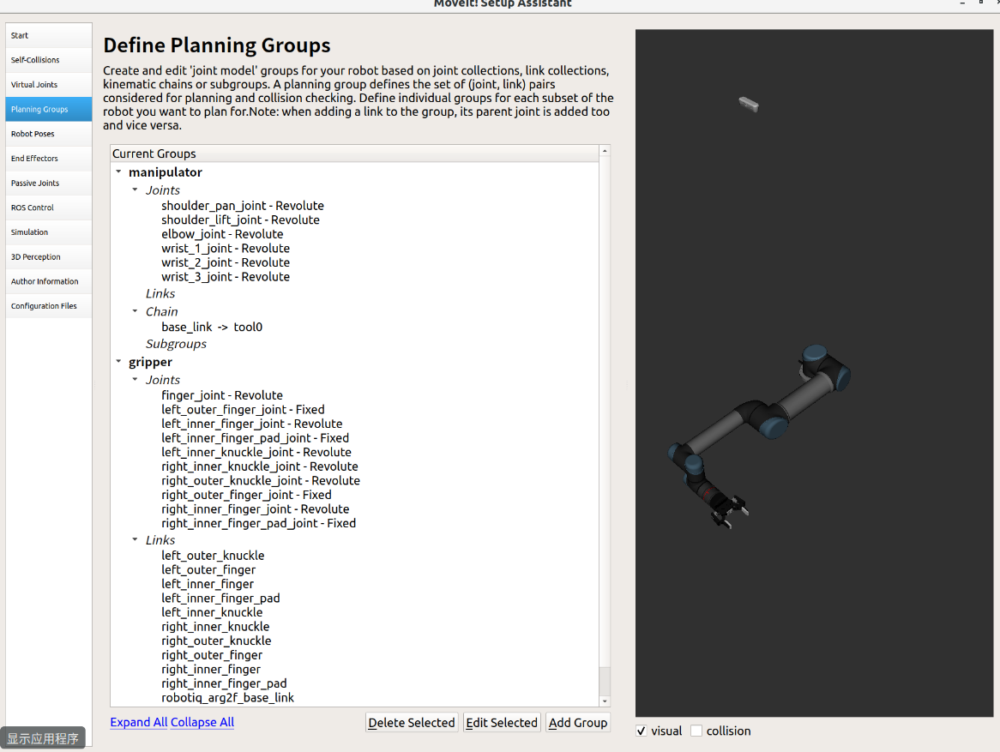

[toc]

# Melodic移植-从kinetic到虚拟机再到双系统


## 安装文件

### 官网链接

https://github.com/IntelRealSense/realsense-ros/tree/ros1-legacy

1. 安装realsense

   ```shell
   sudo apt-get install ros-$ROS_DISTRO-realsense2-camera
   sudo apt-get install ros-$ROS_DISTRO-realsense2-description
   ```

2. 安装GPD-gpg

   ```shell
   https://blog.csdn.net/Eeko_x/article/details/104835154?ops_request_misc=
   cd <location_of_your_workspace> 
   git clone http://github.com/atenpas/gpg.git
   
   https://github.com/atenpas/gpg
   cd gpg
   mkdir build && cd build
   cmake ..
   make
   sudo make install
   ## GPD
   cd <location_of_your_workspace>
   catkin_make
   
   ```

   编译报错：找不到头文件`xxx.h`
   
   原因：gcc与g++版本问题
   
   ```shell
   sudo apt-get remove gcc
   sudo apt-get install gcc
   sudo apt-get install g++
   ```
   
   



第二个把CmakeList文件中test部分注释掉就可以，编译通过后取消注释重新编译

https://blog.csdn.net/Csdn_Darry/article/details/60469599

修改Cmake.list 完成后

```shell
rosdep install --rosdistro $ROS_DISTRO --ignore-src --from-paths src
```

3. 安装ur-robots 和ur-driver

   https://github.com/ros-industrial/universal_robot

https://github.com/UniversalRobots/Universal_Robots_ROS_Driver

4. 安装robotiq

   https://github.com/jr-robotics/robotiq
   

## 创建ur-inter realsense 机器人

### ur—description



```xml
<?xml version="1.0"?>
<robot xmlns:xacro="http://wiki.ros.org/xacro" name="ur5_robot">
  <xacro:include filename="$(find ur_description)/urdf/inc/ur5_macro.xacro"/>
  <xacro:ur5_robot prefix="" />
  <xacro:include filename="$(find robotiq_ft_sensor)/urdf/robotiq_ft300.urdf.xacro" />
  <xacro:include filename="$(find robotiq_2f_85_gripper_visualization)/urdf/robotiq_arg2f_85_model_macro.xacro" />
     <!--ft_sensor-->
       <xacro:robotiq_ft300 parent="tool0" prefix="">
        <origin xyz="0 0 0" rpy="0 0 0"/> 
       </xacro:robotiq_ft300>

     <!--2f_figger-->
       <xacro:robotiq_arg2f_85 prefix=""/>
          <joint name="ft_gripper_joint" type="fixed">
              <parent link="robotiq_ft_frame_id"/>
              <child link="robotiq_arg2f_base_link"/>
              <origin xyz="0 0 0" rpy="0 0 0"/>
          </joint>
     <!--world to the arm-->
        <link name="world"/>
        <joint name="world_joint" type="fixed">
           <parent link="world"/>
           <child link="base_link"/>
           <origin xyz="0.0 0.0 0.0" rpy="0.0 0.0 0.0"/>
        </joint>
</robot>
```

####  添加ee_link

```xml
     <!--ee_link-->
        <link name="ee_link"/>
        <joint name="ee_joint" type="fixed">
           <parent link="wrist_3_link"/>
           <child link="ee_link"/>
           <origin xyz="0.0 0.0 0.210" rpy="0.0 ${-pi/2} ${pi/2}"/>
        </joint>
```


### ur5-moveit-config






Kin. Search Resolution: 关节空间的采样密度 

Kin. Search TImeout: 求解时间 

Kin. Solver Attempts: 求解失败尝试次数



完成后需要修改ur5_moveit_config 包下面的：

- `planning_context.launch`

```xml
  <!-- Load universal robot description format (URDF) -->
  <param if="$(arg load_robot_description)" name="$(arg robot_description)" command="xacro  '$(find ur_description)/urdf/ur5.xacro'"/>
```

- ` sensors_3d.yaml `
- ` ros_controllers.yaml `


测试

```shell
roslaunch ur5_moveit_config demo.launch
```

## 移植程序

### gpd package下

#### 程序

1. TF变换-订阅并发布-命名：`tf_pub`
2. 接受TF变换-转换Grasp并发布Grasp-命名：`grasp_trans_pub`
3. 接受TF变换-转换为pose并发布Pose-命名：`pose_trans_pub`

#### 编译`Cmake.lists`

```Cmake
find_package(catkin REQUIRED COMPONENTS cmake_modules eigen_conversions geometry_msgs message_generation roscpp
  sensor_msgs std_msgs cmake_modules tf tf2_ros tf2_geometry_msgs moveit_msgs)
  
catkin_package(
INCLUDE_DIRS include
CATKIN_DEPENDS moveit_msgs tf tf2_ros tf2_geometry_msgs cmake_modules eigen_conversions geometry_msgs message_runtime roscpp sensor_msgs std_msgs
DEPENDS Eigen3 OpenCV PCL
)

#ypq
add_executable(${PROJECT_NAME}_grasp_trans_pub src/ypq/grasp_trans_pub.cpp)
add_executable(${PROJECT_NAME}_pose_trans_pub src/ypq/pose_trans_pub.cpp)
add_executable(${PROJECT_NAME}_tf_pub src/ypq/tf_pub.cpp)

# ypq
target_link_libraries(${PROJECT_NAME}_pose_trans_pub
                      ${GENERATOR_LIB}
                      ${catkin_LIBRARIES})
target_link_libraries(${PROJECT_NAME}_grasp_trans_pub
                      ${GENERATOR_LIB}
                      ${catkin_LIBRARIES})
target_link_libraries(${PROJECT_NAME}_tf_pub
                      ${GENERATOR_LIB}
                      ${catkin_LIBRARIES})
```


#### 编辑`Pack.xml`

```xml
    <run_depend>tf</run_depend>
    <run_depend>tf2_ros</run_depend>
      <run_depend>tf2</run_depend>
    <run_depend>tf2_geometry_msgs</run_depend>
    <run_depend>moveit_msgs</run_depend>

  <build_depend>tf</build_depend>
    <build_depend>tf2_ros</build_depend>  
     <build_depend>tf2</build_depend>  
 <build_depend>tf2_geometry_msgs</build_depend> 
 <build_depend>moveit_msgs</build_depend> 
```

### 创建软件包`Grasp-it`

#### 创建软件包

##### 选定依赖项

```xml
  <exec_depend>geometry_msgs</exec_depend>
  <exec_depend>moveit_core</exec_depend>
  <exec_depend>moveit_msgs</exec_depend>
  <exec_depend>roscpp</exec_depend>
  <exec_depend>std_msgs</exec_depend>
  <exec_depend>tf</exec_depend>
  <exec_depend>tf2_geometry_msgs</exec_depend>
  <exec_depend>tf2_ros</exec_depend>
  <exec_depend>moveit_ros_planning</exec_depend>
  <exec_depend>moveit_ros_planning_interface</exec_depend>

```

##### 创建软件包

```shell
$ catkin_create_pkg grasp_it geometry_msgs moveit_core moveit_msgs roscpp rospy std_msgs tf tf2 tf2_geometry_msgs tf2_ros moveit_ros_planning moveit_ros_planning_interface
```

安装依赖项并完成编译

#### 创建launch

##### 实现功能

- 名称：`ur_up2base`启动 UR5-bringup、Moveit！、RVIZ、move2base
- 位置：`detect`启动gpd、grasp-trans、(tf_sub)、导入障碍
- 位置：`grasp`启动Realsense相机、抓取例程、

## 修改参数

### 添加桌子

#### 修改机械臂

因为多一个15mm的端面法兰，所以整个模型上移15mm

#### 修改add_collision 程序

#### read-me 

```shell
$ roslaunch grasp_it 1.ur_up2base.launch
$ roslaunch grasp_it 2.detect.launch
$ roslaunch grasp_it 3.grasp.launch
```

## 实际机器人操作日志

###  安装ros-controllers插件

```shell
## 报错
https://answers.ros.org/question/254084/gazebo-could-not-load-controller-jointtrajectorycontroller-does-not-exist-mastering-ros-chapter-10/
$ sudo apt-get install ros-melodic-ros*-controller*
$ sudo apt-get install ros*controller*
$ sudo apt-get install ros-noetic-joint-trajectory-controller
```

## Debug

### 笛卡尔路径规划失败

ur5-bringup.launch的limited参数取消

即取消关节限位

### python 2.7 安装库报错：

`pip install :Command "python setup.py egg_info" failed with error code 1 in /tmp/pip-build-...`

- 解决方法：
  - 升级所使用的python版本
  - 指定安装低版本的库

- :warning:怎么看某个库有哪些可安装的版本?
  - 指定一个不存在的版本安装，就会出现可安装的版本
  - `pip install idna==1000000` 


