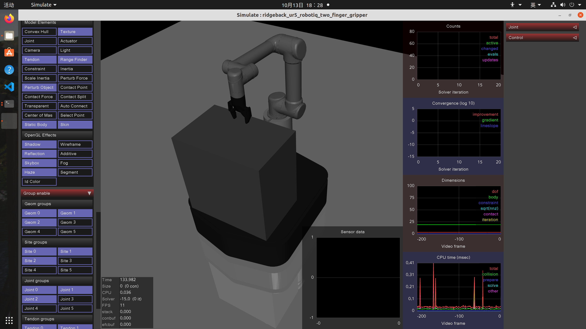
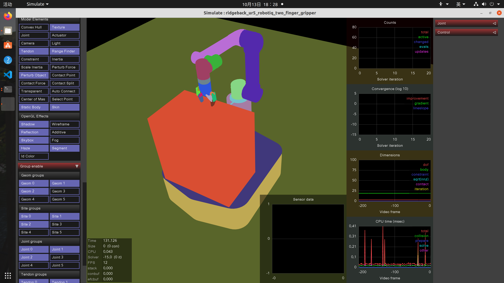
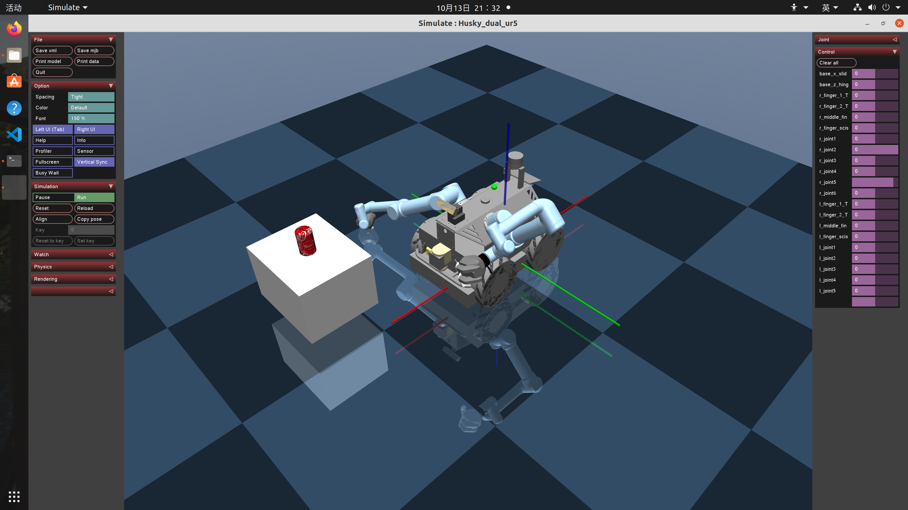
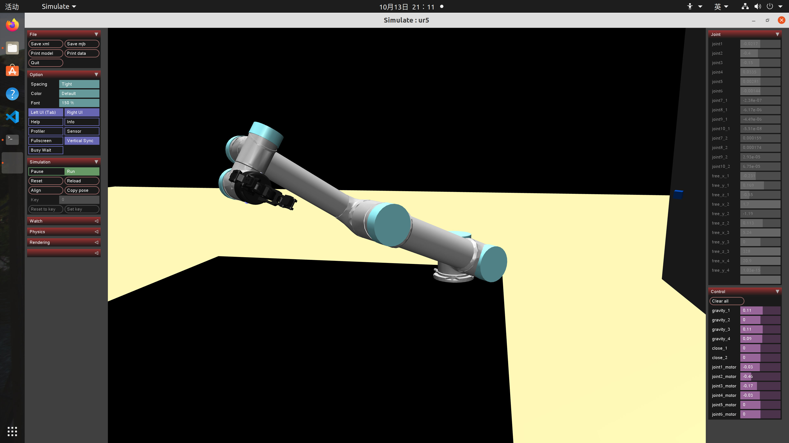
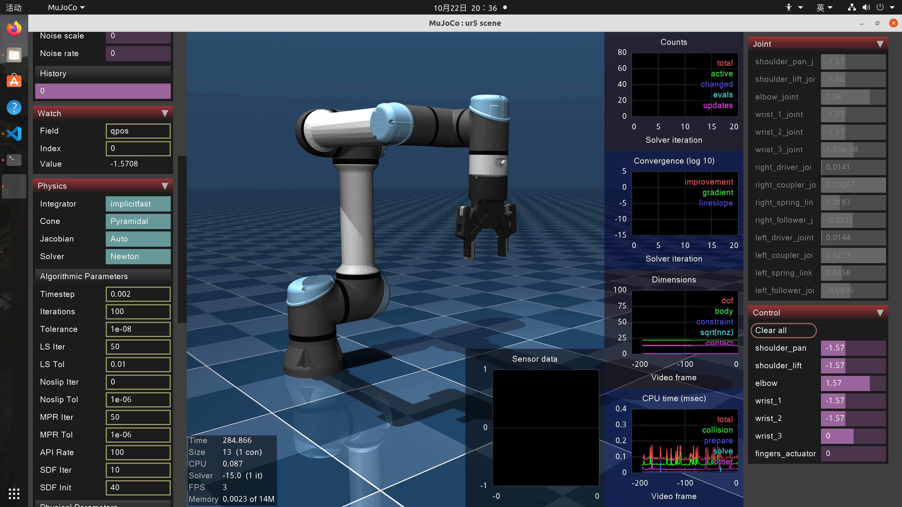
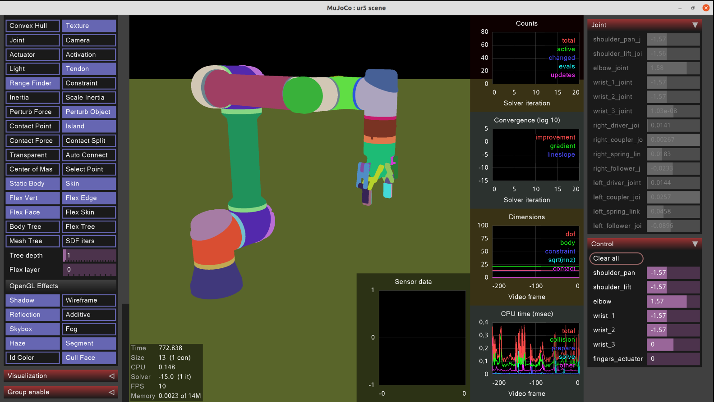
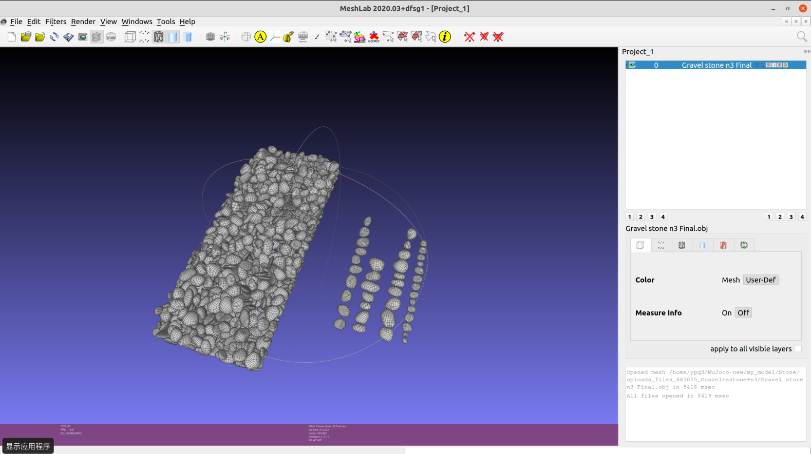

# 导入模型

[toc]


## 导入UR5-Robotiq

### 参考

https://github.com/deepmind/mujoco_menagerie/tree/main/universal_robots_ur5e

https://blog.csdn.net/fei_6/article/details/103966959?ops_request_misc=&request_id=&biz_id=102&utm_term=mujoco%20%E5%AF%BC%E5%85%A5UR5&utm_medium=distribute.pc_search_result.none-task-blog-2~all~sobaiduweb~default-1-103966959.142

教程

https://blog.csdn.net/weixin_50920579/article/details/131092562

Aubo

https://blog.csdn.net/Cactus_mao/article/details/126554232

### 将UR5导入MuJoco

#### Git-Hub 仓库

https://github.com/roboticsleeds

https://github.com/roboticsleeds/mujoco-ur5-model#description-about-the-robot-configuration

:file_folder:  mujoco-ur5-model-master

位置：`.mujoco/mujoco210/model/UR5_Mujoco`

#### 建立文件

- 虚拟机系统：Noetic
- 文件夹：:file_folder:UR5_MuJoco
- 文件架构
  - Example.xml
    - Asset
      - table_asset.xml
      - robot_asset.xml
    - worldbody
      - robot.xml
    - actuators.xml


#### 测试仿真

```shell
cd ~/.mujoco/mujoco200/bin
./simulate ../model/UR5_MuJoco/example.xml

python3 set_ur5_joints.py
../include/robot.xml

## 调整关节角度：依次输入六个轴的度数并按下回车，最后输入UR5的XML文件地址
Enter the desired joint angle for the base joint in terms of degrees: -90
Enter the desired joint angle for the shoulder joint in terms of degrees: -90
Enter the desired joint angle for the elbow joint in terms of degrees: 90
Enter the desired joint angle for the wrist 1 joint in terms of degrees: -90
Enter the desired joint angle for the wrist 2 joint in terms of degrees: -90
Enter the desired joint angle for the wrist 3 joint in terms of degrees: 180
Please type the path to the xml file to be updated: ../include/robot.xml

```





### 另一个方案

https://zhuanlan.zhihu.com/p/99991106

https://github.com/wangcongrobot/dual_ur5_husky_mujoco#step3-verify-urdf-file

:file_folder:dual_ur5_husky_mujoco-dual_ur5_husky_mujoco.zip

位置：`.mujoco/mujoco210/model/Robotiq-UR5-car`

```shell
cd ~/.mujoco/mujoco200/bin
./simulate 

```




### 更好的一方案

https://github.com/cxy1997/Robotiq-UR5

:file_folder:Robotiq-UR5-master.zip

位置：`.mujoco/mujoco210/model/Robotiq-UR5`

```shell
cd ~/.mujoco/mujoco200/bin
./simulate 

```




### 官网的UR5-Robotiq

https://github.com/google-deepmind/mujoco_menagerie/tree/main/robotiq_2f85

https://github.com/google-deepmind/mujoco_menagerie/tree/main/universal_robots_ur5e







