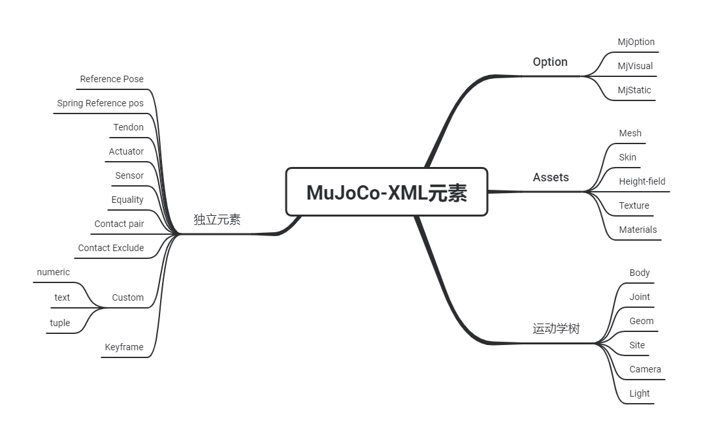

# mujoco

## 来源

[官方book](https://mujoco.readthedocs.io/en/latest/unity.html)

[unity-book](https://docs.unity3d.com/Manual/ExecutionOrder.html)

### 官方Tutorials

https://colab.research.google.com/github/google-deepmind/mujoco/blob/main/python/tutorial.ipynb#scrollTo=xasXQpVMjIwA

https://pab47.github.io/mujoco.html

https://pab47.github.io/mujocopy.html

### 参考

https://zhuanlan.zhihu.com/p/639017263

## 编程

https://zhuanlan.zhihu.com/p/641449452

### 目录结构

> bin     - dynamic libraries, executables, MUJOCO_LOG.TXT
> doc     
> include - header files needed to develop with MuJoCo
> model   - model collection
> sample  - code samples and makefile need to build them

### 概念

- 引擎

模拟器（或物理引擎）是用C语言编写的，它负责所有运行时的计算。

- 解析器

XML解析器是用C++编写的。它可以解析MJCF模型和URDF模型，将它们转换为内部的mjCModel C++对象，不直接暴露给用户。

- 编译器

编译器是用C++编写的。它接收由解析器构建的mjCModel C++对象，并将其转换为运行时使用的mjModel C结构。

- 抽象的可视化器

抽象的可视化器是用C语言编写的，它生成一个代表仿真状态的抽象几何实体的列表，并提供实际渲染所需的所有信息。它还为摄像机和扰动控制提供了抽象的鼠标钩子。

- OpenGL渲染器

渲染器是用C语言编写的，基于固定功能的OpenGL。它不具备最先进的渲染引擎的所有功能（如果需要的话，可以用这样的引擎来代替），但尽管如此，它还是提供了高效和信息丰富的3D渲染。

- UI框架

UI框架（MuJoCo 2.0中的新框架）是用C语言编写的，UI元素用OpenGL渲染。它有自己的事件机制和用于键盘和鼠标输入的抽象挂钩。代码样本将它与GLFW一起使用，但它也可以与其他窗口库一起使用

### 头文件

> - mujoco.h
>   这是主头文件，必须包含在所有使用MuJoCo的程序中。它定义了所有的API函数和全局变量，并包括所有其他头文件，除了mjxmacro.h。
> - mjmodel.h
>   定义了C结构mjModel，它是被模拟的模型的运行时表示。它还定义了一些原始类型和定义mjModel所需的其他结构。
> - mjdata.h
>   定义了C结构mjData，它是所有计算读取其输入和写入其输出的工作区。它还定义了定义mjData所需的原始类型和其他结构。
> - mjvisualize.h
>   定义了抽象的可视化器所需的原始类型和结构。
> - mjrender.h
>   定义了OpenGL渲染器所需的原始类型和结构。
> - mjui.h
>   定义了UI框架所需的原始类型和结构。
> - mjtnum.h
>   定义MuJoCo的mjtNum浮点类型为双数或浮点数。
> - mjmacro.h
>   定义了在用户代码中有用的C语言宏。
> - mjxmacro.h
>   这个文件是可选的，不被mujoco.h包含。它定义了X宏，可以自动将mjModel和mjData映射到脚本语言中，以及其他需要访问mjModel和mjData所有字段的操作。
> - mjexport.h
>   用于从MuJoCo库中导出公共符号的宏。这个头文件不应该被客户端代码直接使用。
> - mjplugin.h
>   定义了引擎插件所需的数据结构。

### 命名规范


API 中定义的所有符号都以前缀“mj”开头。前缀中“mj”后面的字符决定了所属的家族符号。首先，我们列出与类型定义对应的前缀。

- mj

核心仿真数据结构（C结构），例如mjModel。如果所有字符 前缀为大写字母后，例如 mjMIN，这是一个宏或符号 （#define）。

- mjt

基元类型，例如 mjtGeom。除了 mjtByte 和 mjtNum，所有其他此系列中的定义是枚举。

- mjf

回调函数类型，例如 mjfGeneric。

- mjv

与抽象可视化相关的数据结构，例如 mjvCamera。

- mjr

与 OpenGL 渲染相关的数据结构，例如 mjrContext。

- mjui

与 UI 框架相关的数据结构，例如 mjuiSection。

接下来，我们列出与函数定义对应的前缀。请注意，函数前缀始终以下划线结尾。

- mj_

核心仿真功能，例如mj_step。几乎所有此类功能都具有指向 mjModel 和 mjData 作为它们的前两个参数，可能后面跟着其他参数。他们通常写 它们输出到 mjData。

- mju_

实用功能，例如mju_mulMatVec。 从某种意义上说这些函数是独立的，它们没有 mjModel 和 mjData 指针作为他们的参数。

- mjv_

与抽象可视化相关的函数，例如mjv_updateScene。

- mjr_

与 OpenGL 渲染相关的函数，例如mjr_render。

- mjui_

与 UI 框架相关的函数，例如mjui_update。

- mjcb_

全局回调函数指针，例如mjcb_control。用户可以安装 通过设置这些指向用户定义函数的全局指针来自定义回调。

- mjd_

用于计算导数的函数，例如mjd_transitionFD。

```python
sim.data.set_joint_qpos('object0:joint', object_qpos)
# 获取在任务空间标记维site的零件位置和速度
pos = self.sim.data.get_site_xpos('hoge_site')
velp = self.sim.data.get_site_xvelp('hoge_site')
velr = self.sim.data.get_site_xvelr('hoge_site')
# 获取关节位移加速度
for name in sim.model.joint_names:
    qpos = sim.data.get_joint_qpos(name)
    qvel = sim.data.get_joint_qvel(name)
# 将零件名称转化为ID
# from body name to id
body_id = sim.model.body_name2id('robot0:gripper_link')
xpos = sim.data.body_xpos[body_id]

# from site name to id
site_id = self.sim.model.site_name2id('target0')
pos = sim.model.site_pos[site_id]
# 设置动作捕捉位置
sim.data.set_mocap_pos('robot0:mocap', gripper_target)
sim.data.set_mocap_quat('robot0:mocap', gripper_rotation)
```

### 具体常用函数

- 控制回调函数

```c
// simple controller applying damping to each dof
void mycontroller(const mjModel* m, mjData* d)
{
  if( m->nu==m->nv )
    mju_scl(d->ctrl, d->qvel, -0.1, m->nv);
}
// install control callback
mjcb_control = mycontroller;
```

1. 检查**控件的数量**mjModel.nu是否等于**DoF的数量**mjModel.nv。2.
2. MuJoCo有一个类似BLAS的函数库，非常有用；事实上，代码库的很大一部分是由内部调用这种函数组成的。上面的mju_scl函数通过一个恒定的反馈增益对**速度向量mjData.qvel**进行缩放，并将**结果复制到控制向量mjData.ctrl**。
3. **分配给全局控制回调指针mjcb_control**：调用mj_step时，只要仿真pipeline需要控制信号，控制回调就会被执行，最终会模拟出受控的动力学（除了阻尼并没有实现控制的概念，而是更好地实现了一个带阻尼的被动的关节）

- 不使用回调函数的控制方案
  - 仅适用于欧拉积分器
  - 控制回调（如果有的话）是在前向动力学函数中调用的。

```c
while( d->time<10 ) {
  mj_step1(m, d);
  // set d->ctrl or d->qfrc_applied or d->xfrc_applied
  mj_step2(m, d);
}
void mj_step(const mjModel* m, mjData* d) {
  // common to all integrators
  mj_checkPos(m, d);
  mj_checkVel(m, d);
  mj_forward(m, d);
  mj_checkAcc(m, d);

  // compare forward and inverse solutions if enabled
  if( mjENABLED(mjENBL_FWDINV) )
    mj_compareFwdInv(m, d);

  // use selected integrator
  if( m->opt.integrator==mjINT_RK4 )
    mj_RungeKutta(m, d, 4);
  else
    mj_Euler(m, d);
}
```

- 动力学过程·

> [在 Mujoco 中，这个公式是用来计算逆向动力学的](https://matheecs.tech/study/2021/10/20/mujoco.html)[1](https://matheecs.tech/study/2021/10/20/mujoco.html)[2](https://zhuanlan.zhihu.com/p/641449452)。下面是这个公式中各个部分的解释：
>
> - [`mjData.qfrc_inverse`：这是逆向动力学的结果，表示在给定的状态下，需要施加的关节力矩](https://matheecs.tech/study/2021/10/20/mujoco.html)[1](https://matheecs.tech/study/2021/10/20/mujoco.html)[2](https://zhuanlan.zhihu.com/p/641449452)。
> - [`mjData.qfrc_applied`：这是施加在关节上的外部力矩](https://matheecs.tech/study/2021/10/20/mujoco.html)[1](https://matheecs.tech/study/2021/10/20/mujoco.html)[2](https://zhuanlan.zhihu.com/p/641449452)。
> - [`Jacobian'*mjData.xfrc_applied`：这是将施加在机器人末端执行器上的外部力（`mjData.xfrc_applied`）从笛卡尔空间转换到关节空间的结果](https://matheecs.tech/study/2021/10/20/mujoco.html)[1](https://matheecs.tech/study/2021/10/20/mujoco.html)[2](https://zhuanlan.zhihu.com/p/641449452)[。这里的 `Jacobian` 是关节空间到笛卡尔空间的映射](https://matheecs.tech/study/2021/10/20/mujoco.html)[1](https://matheecs.tech/study/2021/10/20/mujoco.html)[2](https://zhuanlan.zhihu.com/p/641449452)。
> - [`mjData.qfrc_actuator`：这是由执行器产生的关节空间力](https://matheecs.tech/study/2021/10/20/mujoco.html)[1](https://matheecs.tech/study/2021/10/20/mujoco.html)[2](https://zhuanlan.zhihu.com/p/641449452)。
>
> [在 Mujoco 中，有多种类型的力，它们在不同的场景下有不同的作用](https://matheecs.tech/study/2021/10/20/mujoco.html)[1](https://matheecs.tech/study/2021/10/20/mujoco.html)[2](https://zhuanlan.zhihu.com/p/641449452)：
>
> - [**内部力**：这是由机器人的关节和执行器产生的力，例如马达产生的扭矩](https://matheecs.tech/study/2021/10/20/mujoco.html)[1](https://matheecs.tech/study/2021/10/20/mujoco.html)[2](https://zhuanlan.zhihu.com/p/641449452)。
> - [**外部力**：这是施加在机器人上的力，例如重力或者用户施加的力](https://matheecs.tech/study/2021/10/20/mujoco.html)[1](https://matheecs.tech/study/2021/10/20/mujoco.html)[2](https://zhuanlan.zhihu.com/p/641449452)。
> - [**关节空间力**：这是在关节空间中表示的力，例如关节扭矩](https://matheecs.tech/study/2021/10/20/mujoco.html)[1](https://matheecs.tech/study/2021/10/20/mujoco.html)[2](https://zhuanlan.zhihu.com/p/641449452)。
> - [**笛卡尔空间力**：这是在笛卡尔空间中表示的力，例如施加在机器人末端执行器上的力](https://matheecs.tech/study/2021/10/20/mujoco.html)[1](https://matheecs.tech/study/2021/10/20/mujoco.html)[2](https://zhuanlan.zhihu.com/p/641449452)。
> - [**执行器的力**：这是由执行器产生的力，例如电机产生的扭矩](https://matheecs.tech/study/2021/10/20/mujoco.html)[1](https://matheecs.tech/study/2021/10/20/mujoco.html)[2](https://zhuanlan.zhihu.com/p/641449452)。

- 多线程

```c
// prepare OpenMP
int nthread = omp_get_num_procs();      // get number of logical cores
omp_set_dynamic(0);                     // disable dynamic scheduling
omp_set_num_threads(nthread);           // number of threads = number of logical cores

// allocate per-thread mjData
mjData* d[64];
for( int n=0; n<nthread; n++ )
    d[n] = mj_makeData(m);

// ... serial code, perhaps using its own mjData* dmain

// parallel section
#pragma omp parallel
{
  int n = omp_get_thread_num();       // thread-private variable with thread id (0 to nthread-1)

  // ... initialize d[n] from results in serial code

  // thread function
  worker(m, d[n]);                    // shared mjModel (read-only), per-thread mjData (read-write)
}

// delete per-thread mjData
for( int n=0; n<nthread; n++ )
  mj_deleteData(d[n]);
```

- model-change-during sim

> mjtByte类型的数组可以被安全地改变，是启用和禁用某些特性的二进制指标。这里唯一的例外是mjModel.tex_rgb，它是以mjtByte表示的纹理数据。

## Mujoco基础

https://zhuanlan.zhihu.com/p/640110929

- 模型文件

|        | High level           | Low level          |
| ------ | -------------------- | ------------------ |
| File   | MJCF/URDF (XML)      | MJB (binary)       |
| Memory | mjCModel (C++ class) | mjModel (C struct) |

> - (text editor) → MJCF/URDF file → (MuJoCo parser → mjCModel → MuJoCo compiler) → mjModel
> - (user code) → mjCModel → (MuJoCo compiler) → mjModel
> - MJB file → (MuJoCo loader) → mjModel

- XML元素 ：重点关注

  

  - Assets-Texture

  Texture可以从 PNG  文件中加载，也可以由编译器根据用户定义的过程参数合成。还可以选择在模型创建时将Texture保留为空，然后在运行时进行更改——以便在  MuJoCo 模拟中呈现视频，或创建其他动态效果。可视化工具支持两种类型的Texture映射: 2D  和立方体。二维映射对于平面和高度字段很有用。立方体映射对于围绕3D  对象的“收缩包装”纹理非常有用，不需要指定纹理坐标。它也被用来创建一个空中包厢。多维数据集映射的六个边可以从单独的图像文件加载，也可以从一个复合图像文件加载，或者通过重复相同的图像生成。与直接从模型元素引用的所有其他资产不同，Texture只能从另一个资产(即material)引用，然后从模型元素引用。

  - 独立-Contact pair

  检查接触的 Geom 对可以来自两个来源: 自动接近测试和统称为“动态”的其他过滤器，以及模型中提供的显式 Geom  对列表。后者是一种独立类型的模型元素。因为一个Contact 涉及两个 geom  的组合，显式规范允许用户以动态机制无法实现的方式定义Contact 参数。它还有助于微调接触模型，特别是添加通过积极过滤方案去除的接触对。

  - 独立-Custom text

  可以在模型中保存自定义文本字段。它们可以用于自定义计算——或者指定关键字命令，或者提供一些其他文本信息。但是不要将它们用于注释; 在编译后的模型中保存注释没有任何好处。XML 有自己的注释机制(MuJoCo 的解析器和编译器忽略了这一点) ，这种机制更为合适。

  - 独立-Custom tuple

  自定义元组是 MuJoCo 模型元素的列表，可能包括其他元组。模拟器不使用它们，但可用于指定用户代码所需的元素组。例如，可以使用元组来定义用于自定义contact处理的主体对。
  
  - Keyframe  

​		关键帧是模拟状态变量的快照。它包含关节位置、关节速度、执行器激活时间和仿真时间的向量。该模型可以包含一个关键帧库。它们对于将系统状态		重置为感兴趣的点非常有用。注意，关键帧不是用来在模型中存储轨迹数据的; 应该使用外部文件。

- Bodies、geoms、sites

  - 同
    - 附着在上的空间坐标系(尽管物体也有第二个框架，这个框架以物体的质心为中心，与惯性的主轴对齐）
  - 异
    - body被用来构造运动学树，并且是其他元素的容器，包括geom和site。body有一个空间框架，惯性属性，但没有性质相关的外观或碰撞几何。这是因为这些属性不影响物理，Body通常被画成无定形的形状——以表明它们的实际形状与物理学无关。
    - Geoms 用于指定外观和碰撞几何。每个geom都属于body，并且与该物体紧密相连。多个geom可以连接到同一个body。MuJoCo  的碰撞检测器假设所有的几何图形都是凸的(如果网格不是凸的，它就用它们的凸壳在内部替换网格)。因此，如果你想建立一个非凸形状的模型，你必须把它分解成一个凸宝石的并，并把它们都附加到同一个body上。==在 XML 模型中，Geoms 也可以有质量和惯性(或者更确切地说是用于计算质量和惯性的材料密度)  ，但是这只用于计算模型编译器中的体质量和惯性。在实际的被模拟的 mjModel 中，geoms 没有惯性特性==。
    - sites是light geom。它们具有相同的外观特征，但不能参与碰撞，不能用于推断物体质量。另一方面，site可以做一些 Geom 做不到的事情:  它们可以指定触摸传感器的体积、 IMU  传感器的附件、空间肌腱的路由、曲柄滑块驱动器的端点。这些都是空间量，但它们并不对应于应该有质量或与其他实体碰撞的实体——这就是为什么创建  site 元素。site还可以用来指定用户感兴趣的点(或帧)。

- 坐标系

  - MuJoCo 在广义或节点坐标系下运行，而游戏引擎在笛卡尔坐标系下运行，尽管 Bullet 现在支持广义坐标。这两种方法之间的差异可归纳如下:

    - **Joint coordinates：**

      - 最适合复杂的运动结构，如机器人;

      - 关节增加了body之间的自由度，默认焊接在一起;

      - 节点约束在表示中是隐含的，不能被违反;

      - 模拟物体的位置和方向由广义坐标通过正向运动学得到，不能直接操作(根体除外)。

    - **Cartesian coordinates：**

      - 最适合许多互相反弹的物体，如分子动力学和盒子堆叠;
      - 关节消除了body之间的自由度，而这种自由度在默认情况下是自由浮动的;
      - 节点约束在数值上被强制执行，并且可以被违反;
      - 模拟机构的位置和方向是明确的，可以直接操作，虽然这可能会引入进一步的关节约束违反。


## 关于mujoco 中 body坐标和geom坐标

> 在 MuJoCo 中，`data.geom_xpos` 和 `data.xpos` 这两个数组确实代表不同的概念，它们之间的差异在于它们所表示的坐标系和更新的时机。
>
> 1. `data.geom_xpos`：
>    - 这个数组包含了所有几何体（如形状、站点、相机等）的世界坐标位置。
>    - 每个几何体的位置都是相对于其父级物体的局部坐标系。
>    - `geom_xpos` 在仿真的每个时间步都会被更新，以反映当前物理状态。
>    - 这个数组通常用于渲染和计算几何体在世界中的最终位置。
>
> 2. `data.xpos`：
>    - 这个数组包含了所有刚体（body）的局部坐标系原点的世界坐标位置。
>    - 每个刚体的位置是基于其父级坐标系的，如果没有父级，则相对于世界坐标系。
>    - `xpos` 同样在每个仿真步骤中更新，但它反映的是刚体的位置和方向。
>    - 这个数组通常用于物理模拟和碰撞检测。
>
> 由于 `geom_xpos` 和 `xpos` 描述的是不同的对象（一个是几何体，另一个是刚体），它们的位置自然会不同。几何体可以附着在刚体上，它们的最终位置取决于刚体的位置和方向，以及它们相对于刚体的局部位置。
>
> 例如，如果你有一个刚体（比如一个机器人的手臂），并且在这个手臂上有一个几何体（比如一个手），那么：
>
> - `data.xpos[id]` 将给出手臂根部在世界坐标系中的位置。
> - `data.geom_xpos[id]` 将给出手在世界坐标系中的位置，这通常是手臂的位置加上手相对于手臂的局部位置。
>
> 在进行物理模拟或渲染时，理解这些坐标系和它们之间的关系是非常重要的。确保你使用正确的数组来获取你需要的信息。如果你需要计算几何体相对于其父级刚体的位置，你应该使用 `geom_xpos`。如果你需要知道刚体在世界坐标系中的位置，那么 `xpos` 数组是正确的选择。

> 是的，你的理解是正确的。在MuJoCo中，`body`和`geom`之间的关系可以通过以下几个要点来理解：
>
> 1. **Body（刚体）**：
>    - `body`是MuJoCo模型中的动态对象，它具有质量、惯性等物理属性，并且可以受到力和扭矩的影响。
>    - `data.xpos`数组包含了每个`body`的世界坐标位置和方向（四元数）。这些位置和方向是在仿真过程中根据物理动力学计算得到的。
>    - `body`的位置是相对于其父级`body`的局部坐标系，如果没有父级，则相对于世界坐标系。
>
> 2. **Geom（几何体）**：
>    - `geom`是附加在`body`上的几何形状，它可以是球体、盒子、胶囊体等，用于表示物体的形状。
>    - `data.geom_xpos`数组包含了每个`geom`的世界坐标位置。这些位置是相对于其父级`body`的局部坐标系，考虑了`body`的世界坐标变换。
>    - 几何体的中心点（或其他特征点）的位置是通过`body`的位置和方向以及`geom`的局部坐标变换计算得到的。
>
> 因此，当你在模型中定义了一个`geom`附着在`body`上时，`geom`的位置实际上是由`body`的位置和方向以及`geom`在`body`局部坐标系中的位置共同决定的。`geom`的全局位置是`body`的全局变换（包括位置和旋转）与`geom`的局部位置的组合结果。
>
> 在进行仿真和分析时，你需要根据你的具体需求选择使用`data.xpos`还是`data.geom_xpos`。如果你关注的是整个`body`的位置和方向，那么应该使用`data.xpos`。如果你需要知道`geom`的确切位置（例如，用于渲染或碰撞检测），那么应该使用`data.geom_xpos`。

> 在MuJoCo中，`body`的坐标（`data.xpos`）和附着在`body`上的`geom`的坐标（`data.geom_xpos`）之间的关系是通过变换矩阵来定义的。这种变换关系考虑了`body`在世界坐标系中的位置和方向，以及`geom`相对于其父`body`的局部位置和方向。
>
> ### 变换关系
>
> 1. **`body`的局部坐标系**：
>    - `body`的局部坐标系原点位于`body`的质心。
>    - `body`的方向（四元数）定义了局部坐标系的旋转。
>
> 2. **`geom`的局部坐标系**：
>    - `geom`的局部坐标系原点和方向是根据`geom`的定义在`body`的局部坐标系中设置的。
>    - `geom`的位置通常是相对于其父`body`的局部坐标系原点。
>
> 3. **全局坐标系**：
>    - `geom`的全局坐标是`body`的全局变换（位置和旋转）与`geom`的局部位置的组合结果。
>
> ### 换算关系
>
> 要将`geom`的局部坐标转换为全局坐标，你需要应用`body`的变换。这可以通过以下步骤完成：
>
> 1. **提取`body`的全局位置和方向**：
>    - 从`data.xpos`中提取`body`的全局位置（前三个值）和方向（后四个值，通常以四元数形式表示）。
>
> 2. **应用`body`的变换**：
>    - 使用`body`的全局位置和方向来创建一个变换矩阵。
>    - 将`geom`的局部位置（相对于`body`的局部坐标系）乘以这个变换矩阵，得到`geom`的全局位置。
>
> 3. **考虑`geom`的局部旋转**：
>    - 如果`geom`在局部坐标系中也有旋转（例如，`quat`或`euler`参数），你需要将这个旋转应用到`geom`的局部位置上。
>
> 在实际应用中，MuJoCo的API会自动处理这些变换，因此你通常不需要手动计算。但是，如果你需要在自定义的函数中进行坐标转换，你可能需要使用MuJoCo提供的辅助函数或自己实现变换矩阵的乘法。
>
> 例如，如果你想要根据`body`的全局位置和方向以及`geom`的局部位置来计算`geom`的全局位置，你可以使用类似下面的代码：
>
> ```python
> import numpy as np
> 
> # 假设 body_id 是你要转换的 body 的 ID
> body_id = 0
> 
> # 提取 body 的全局位置和方向
> body_xpos = m.data.xpos[body_id]
> body_pos = body_xpos[:3]  # 位置
> body_quat = body_xpos[3:]  # 方向（四元数）
> 
> # 创建从世界坐标系到 body 局部坐标系的变换矩阵
> body_transform = np.eye(4)
> body_transform[:3, :3] = cg.quat2mat(body_quat)  # 应用旋转
> body_transform[:3, 3] = body_pos  # 应用平移
> 
> # 提取 geom 的局部位置
> geom_xpos_local = m.data.geom_xpos[geom_id, :3]
> 
> # 计算 geom 的全局位置
> geom_xpos_global = body_transform.dot(np.append(geom_xpos_local, 1))  # 应用变换矩阵
> ```
>
> 请注意，这段代码只是一个示例，实际使用时需要根据你的具体情况进行调整。在MuJoCo中，通常你不需要手动进行这些计算，因为MuJoCo的API已经为你处理了这些变换。
>
> 在 MuJoCo 的 XML 配置文件中，确实定义了 `body` 和 `geom` 之间的关系，包括它们的位置和方向。这些定义影响了 `body` 和 `geom` 在模型中的布局和它们之间的相对变换。
>
> ### `body` 标签
>
> 在 MuJoCo 的 XML 文件中，`<body>` 标签用于定义模型中的一个刚体（`body`）。它包含了刚体的物理属性，如质量、惯性、摩擦等，以及相对于其父级的位置和方向。例如：
>
> ```xml
> <body name="body_name" pos="x,y,z"quat="qx,qy,qz,qw">
>   <!-- 定义附着在该 body 上的 geom -->
> </body>
> ```
>
> - `pos` 属性定义了 `body` 在其父级坐标系中的位置。
> - `quat` 属性定义了 `body` 的方向，使用四元数表示。
>
> ### `geom` 标签
>
> `<geom>` 标签用于定义一个几何形状，它可以附着在 `body` 上。`geom` 的位置和方向是相对于其父级 `body` 的局部坐标系的。例如：
>
> ```xml
> <geom name="geom_name" type="sphere" size="radius" pos="dx,dy,dz"quat="qx,qy,qz,qw">
>   <!-- 定义 geom 的其他属性 -->
> </geom>
> ```
>
> - `pos` 属性定义了 `geom` 在其父级 `body` 的局部坐标系中的位置。
> - `quat` 属性定义了 `geom` 的方向，相对于其父级 `body` 的局部坐标系。
>
> ### 坐标变换
>
> 当 MuJoCo 模型被加载和运行时，MuJoCo 引擎会根据 XML 文件中定义的位置和方向，以及仿真过程中的物理交互，计算出每个 `body` 和 `geom` 在世界坐标系中的最终位置。这个过程包括了从局部坐标系到全局坐标系的变换。
>
> 例如，如果你有一个 `geom` 定义在 `body` 上，并且它们在 XML 文件中有不同的位置和方向定义，MuJoCo 会将 `geom` 的局部位置和方向变换到 `body` 的全局位置和方向。这就是为什么在仿真过程中，`data.xpos` 和 `data.geom_xpos` 会显示出不同的坐标值。
>
> 总之，`body` 和 `geom` 之间的坐标关系是在 XML 配置文件中定义的，但它们的最终位置是由 MuJoCo 引擎根据这些定义和仿真过程中的物理状态计算得出的。理解 XML 文件中的这些定义对于创建准确的模型和进行正确的仿真至关重要。
>
> 是的，你的理解是正确的。在 MuJoCo 的层次结构中，如果只有一个 `worldbody`（通常表示整个世界的参考框架）和一个 `body`（通常表示模型中的一个动态对象），那么 `body` 的父级坐标系就是 `worldbody`。这意味着 `body` 的位置和方向是相对于整个世界坐标系来定义的。
>
> 在 `body` 内部定义的 `geom`（几何体）则是相对于 `body` 的局部坐标系来定位的。`geom` 的位置 `pos` 和方向 `quat` 是相对于其父 `body` 的局部坐标系。因此，`geom` 的全局位置和方向是由 `body` 的全局变换（位置和旋转）与 `geom` 的局部位置和方向的组合决定的。
>
> 这里是一个简单的例子来说明这个层次结构：
>
> ```xml
> <worldbody name='world'>
>     <!-- 定义 worldbody 的属性 -->
> </worldbody>
> 
> <body name='parent_body' pos='0, 0, 0'>
>     <!-- 定义一个 body，它的父级是 worldbody -->
>     <geom name='child_geom' type='sphere' pos='0, 0, 0.5' quat='1, 0, 0, 0'>
>         <!-- 定义一个 geom，它的父级是 parent_body -->
>     </geom>
> </body>
> ```
>
> 在这个例子中，`parent_body` 是 `worldbody` 的子级，而 `child_geom` 是 `parent_body` 的子级。`child_geom` 的全局位置将是 `parent_body` 的全局位置和 `child_geom` 的局部位置的组合。
>
> 在仿真过程中，MuJoCo 会根据物理引擎的计算来更新 `body` 和 `geom` 的位置和方向。`data.xpos` 数组存储了 `body` 的全局位置和方向，而 `data.geom_xpos` 数组存储了所有 `geom` 的全局位置。这些数组是由 MuJoCo 在仿真过程中自动更新的，因此你可以直接从这些数组中获取 `body` 和 `geom` 的当前状态。


> 