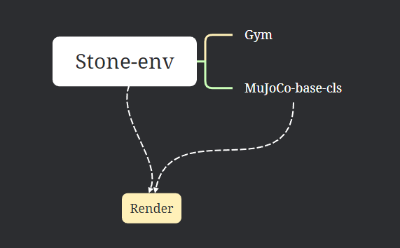

# mujoco_通用仿真类

## 整体架构

- 类的引用关系

 

## 开发

### Debug

#### Numpy库版本问题

> pygame 2.1.0 (SDL 2.0.16, Python 3.10.13)
> Hello from the pygame community. https://www.pygame.org/contribute.html
> Traceback (most recent call last):
>   File "/home/ypq3/anaconda3/envs/Stone/lib/python3.10/site-packages/numpy/_core/__init__.py", line 23, in <module>
>     from . import multiarray
>   File "/home/ypq3/anaconda3/envs/Stone/lib/python3.10/site-packages/numpy/_core/multiarray.py", line 10, in <module>
>     from . import overrides
>   File "/home/ypq3/anaconda3/envs/Stone/lib/python3.10/site-packages/numpy/_core/overrides.py", line 6, in <module>
>     from .._utils import set_module
> ModuleNotFoundError: No module named 'numpy._utils'
>
> During handling of the above exception, another exception occurred:
>
> Traceback (most recent call last):
>   File "/home/ypq3/PycharmProjects/MuJoCo-py-dev/cls_base_mj_dev/cls_stone_mujoco.py/main.py", line 5, in <module>
>     my_params.load_pkl("test-1")
>   File "/home/ypq3/PycharmProjects/MuJoCo-py-dev/cls_base_mj_dev/cls_stone_mujoco.py/arg_combine_cls.py", line 99, in load_pkl
>     self.categories = pickle.load(f)
>   File "/home/ypq3/anaconda3/envs/Stone/lib/python3.10/site-packages/numpy/_core/__init__.py", line 49, in <module>
>     raise ImportError(msg)
> ImportError: 
>
> IMPORTANT: PLEASE READ THIS FOR ADVICE ON HOW TO SOLVE THIS ISSUE!
>
> Importing the numpy C-extensions failed. This error can happen for
> many reasons, often due to issues with your setup or how NumPy was
> installed.
>
> We have compiled some common reasons and troubleshooting tips at:
>
>     https://numpy.org/devdocs/user/troubleshooting-importerror.html
>
> Please note and check the following:
>
>   * The Python version is: Python3.10 from "/home/ypq3/anaconda3/envs/Stone/bin/python"
>   * The NumPy version is: "1.23.0"
>
> and make sure that they are the versions you expect.
> Please carefully study the documentation linked above for further help.
>
> Original error was: No module named 'numpy._utils'
