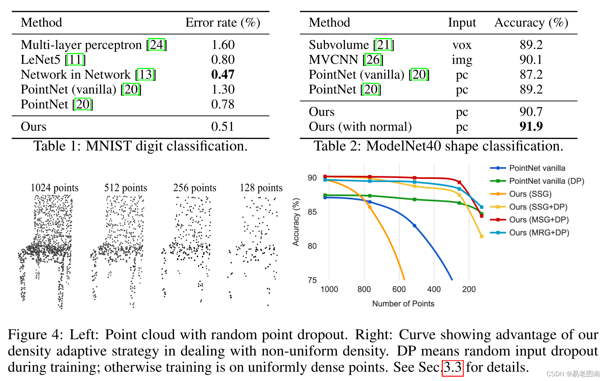

https://zhuanlan.zhihu.com/p/99680662?utm_id=0

https://www.xiaohongshu.com/explore/6291faa2000000000102c5fd

https://www.ngui.cc/el/802684.html?action=onClick

https://blog.csdn.net/Yong_Qi2015/article/details/122098230

https://www.yii666.com/blog/385595.html

https://blog.csdn.net/qq_45467083/article/details/103794866

https://www.zhihu.com/question/31233837

## Cgtrader

missing ：image-20230717155120039.png

购买记录

https://www.cgtrader.com/profile/purchases

- Free3D

## 三维重建

- 方案：
  - 找到现有的石块三维模型
  - 多角度二维图像建立稀疏点云-基于特征匹配形成稠密点云-点云转化为网格模型
  - 深度相机多角度拍摄生成点云PCD文件-基于特征匹配形成稠密点云-点云转为网格模型
  - 高精度扫描仪生成高质量网格模型

### PointNet++

