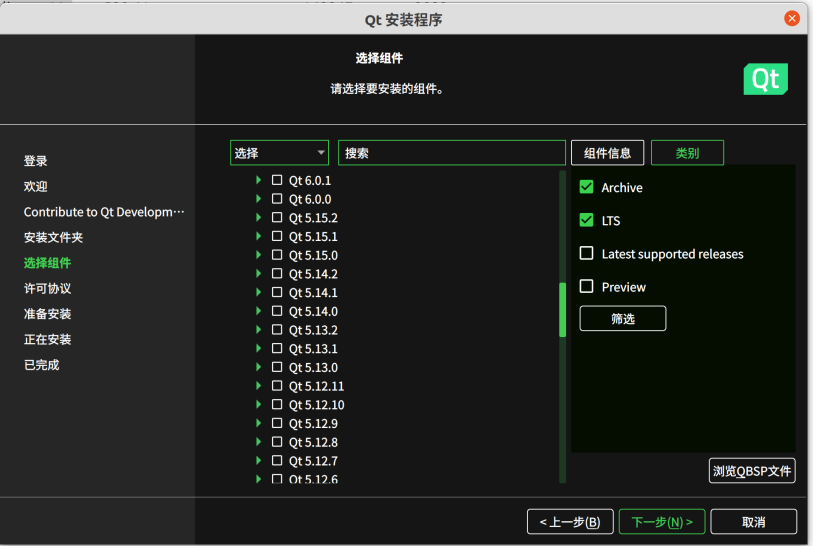
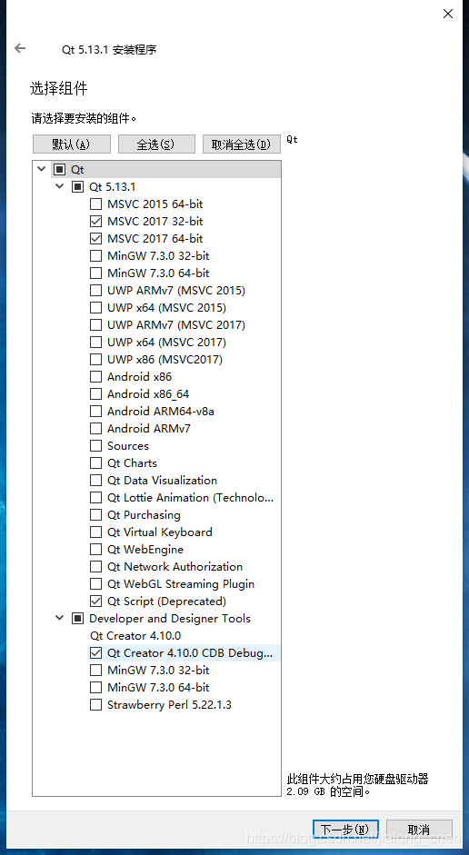

# CGAL配置相关库

## CGAL

- 简介及OpenCV区别

OpenCV（Open Source Computer Vision  Library）是一个开源的计算机视觉库，主要用于处理图像和视频分析。它提供了丰富的图像处理、计算机视觉、深度学习等功能，包括图像读取、图像处理、特征提取、目标检测、人脸识别、视频分析等。OpenCV广泛应用于计算机视觉领域的各种任务，例如医学影像处理、机器人视觉、视频监控等。

CGAL（Computational Geometry Algorithms  Library）是一个计算几何算法库，主要用于处理二维和三维几何结构。它提供了一系列的几何算法和数据结构，用于解决几何问题，包括点、线、多边形、曲线、三角形、网格、曲面等的处理和操作。CGAL广泛应用于计算几何、计算机辅助设计、计算机图形学等领域，例如几何建模、地理信息系统、三维重建等。

总的来说，OpenCV主要用于图像和视频处理，包括各种视觉任务和应用；而CGAL主要用于处理几何结构，用于解决几何问题和进行几何操作。它们在功能和应用领域上有着不同的重点。

### CGAL-C++库

#### 相关网址

- git-hub源库存

https://github.com/CGAL/cgal

- 官网

https://www.cgal.org

- 最新文档

https://doc.cgal.org/latest/Manual/index.html

- Release下载

https://www.cgal.org/releases.html

https://github.com/CGAL/cgal/releases/tag/v5.6

#### 安装

- Windows 安装

https://blog.csdn.net/m0_67316550/article/details/128068238

https://blog.csdn.net/qq_28368377/article/details/134023151

https://blog.csdn.net/jialong_chen/article/details/115486598

https://blog.csdn.net/qq_32867925/article/details/127021063

- 手册

https://doc.cgal.org/latest/Manual/usage.html

- 推荐方式

```shell
sudo apt-get install libcgal-dev
```

- 依赖项- Cmake

```shell
cmake --version
```

- 依赖项-Boost

https://www.boost.org/doc/libs/1_84_0/more/getting_started/unix-variants.html

https://www.boost.org

https://doc.cgal.org/5.1.5/Manual/usage.html

```shell
sudo apt-get install libboost-all-dev
tar -zxvf boost_1_84_0.tar.gz 
./bootstrap.sh --prefix=...
./b2 install

```

> BUG: 
>
> libboost-all-dev : 
>
> 依赖: libboost-mpi-dev 但是它将不会被安装                     
>
> 依赖: libboost-mpi-python-dev 但是它将不会被安装 

```shell
#You can fix it by using aptitude:
sudo apt-get install aptitude
sudo aptitude install libboost-all-dev
```

```shell
# 验证
dpkg -s libboost-dev
```

- 依赖项-GMP-MPFR

https://www.mpfr.org/mpfr-current/

https://gmplib.org/manual/

https://gmplib.org/

https://gmplib.org/manual/

https://gmplib.org/manual/Installing-GMP

```shell
tar xf gmp-6.3.0.tar.xz 
./configure --prefix=/home/ypq3/CGAL-learn/mpfr-4.2.1 --with-gmp=/home/ypq3/CGAL-learn/gmp-6.3.0
./configure --prefix=/home/ypq3/CGAL-learn/gmp-6.3.0
make
make check
sudo make install

dpkg -s libgmp-dev
dpkg -s libmpfr-dev
```

- 依赖项-Qt5

https://blog.csdn.net/jin739738709/article/details/126875926

```shell
sudo apt-get install qt5-default
sudo apt-get install qt5*
```

- 依赖项-GCC/
- 验证

## Ubuntu18.04-CGAL 4.11.2 


https://doc.cgal.org/4.11.3/Manual/installation.html

```shell
cd examples/Straight_skeleton_2 # go to an example directory
cmake -DCGAL_DIR=$HOME/CGAL-4.11.2 . # configure the examples
make # build the examples 
./draw_triangulation_2 ../data/triangulation_prog1.cin
```

## Ubuntu 20.04-CGAL

- conda创建了新环境 cgal

### 安装依赖项

- Gcc

```shell
conda install -c conda-forge gcc
cmake --version
```

- Boost

```shell
conda install -c conda-forge boost
conda list
```

- CMake

```shell
conda install -c conda-forge cmake
gcc --version
```

- Qt5~

```
彻底卸载
sudo apt-get autoremove --purge qt5-*
sudo apt-get remove qt5-default
sudo apt-get remove qt5*
sudo rm -rf /opt/Qt
```


```
1.依赖项
conda install -c conda-forge build-essential libgl1-mesa-dev libfontconfig1
2.下载`.run`
https://download.qt.io/archive/qt/5.14/5.14.2/

```

#### Qt安装

- 全部网站

>1.Qt Download
>
>https://download.qt.io/
>
>https://www.qt.io/download#eval-form-modal
>
>2.Qt documents
>
>https://doc.qt.io/qt-5/gettingstarted.html
>
>https://doc.qt.io/qt-5/linux-building.html
>
>https://doc.qt.io/qt-5/build-sources.html
>
>3.Bili Tutorials
>
>【Linux(Ubuntu)安装Qt及设置快捷方式】https://www.bilibili.com/video/BV1Ts4y1A783?vd_source=a16f4c6f7a2a235c328816d5509362e9

1.方案一 quick installation

- 指定版本选择：

> 右侧选择Archive 点击`筛选`
>
> 在Qt侧栏选择对应版本





- 必选项

> Desktop gcc 64-bit  Sources  Developer and Designer Tools

- 卸载

``` shell
home/Qt/MaintainTool 运行即可卸载
```


- 安装完成后报错

> From 6.5.0, xcb-cursor0 or libxcb-cursor0 is needed to load the Qt xcb platform plugin.
> Could not load the Qt platform plugin "xcb" in "" even though it was found.
> This application failed to start because no Qt platform plugin could be initialized. Reinstalling the application may fix this problem.
>
> Available platform plugins are: linuxfb, xcb, eglfs, vkkhrdisplay, minimalegl, minimal, offscreen, vnc, wayland, wayland-egl.

```
sudo apt-get install libxcb-cursor0
```

- 编译文件

https://blog.csdn.net/qq_42946643/article/details/129060321

```shell
  cmake -DCGAL_DIR=$CMAKE_INSTALLED_PREFIX/lib/CGAL -DCMAKE_BUILD_TYPE=Release .
```

  - > - anaconda库文件路径冲突问题-覆盖
    >
    > CMake Warning at /usr/local/lib/cmake/CGAL/CGAL_CreateSingleSourceCGALProgram.cmake:49 (add_executable):
    >  Cannot generate a safe runtime search path for target voronoi because files
    >  in some directories may conflict with libraries in implicit directories:
    >
    >   runtime library [libmpfr.so.6] in /usr/lib/x86_64-linux-gnu may be hidden by files in:
    >    /home/ypq3/anaconda3/lib
    >   runtime library [libgmp.so.10] in /usr/lib/x86_64-linux-gnu may be hidden by files in:
    >    /home/ypq3/anaconda3/lib
    >
    > - ==解释==：urs/lib/x86-x64-linux-gnu跟usr/local/lib中的库冲突了，不知道链接是否正确，将urs/lib/x86-x64-linux-gnu中的冲突*.so建立符号链接到usr/local/lib下面，问题解决，

    - 解决

      - 删除anaconda/lib文件下所有依赖-libgmp、libmfpr、libqt*

      - 编辑CMakeLists.
    
        - ```cmake
          set(CMAKE_PREFIX_PATH "/usr/lib")
          #一定要在find_package 文件前
          ```

        - 此后删除CMake的所有记录，重启终端
    
  - > - 缺少相关库文件
    >
    > CMake Error at /usr/local/lib/cmake/CGAL/CGAL_Qt5Exports.cmake:61 (set_target_properties):  The link interface of target "CGAL::CGAL_Qt5" contains:    Qt5::OpenGL  but the target was not found.  Possible reasons include:    * There is a typo in the target name.    * A find_package call is missing for an IMPORTED target.    * An ALIAS target is missing.

    - 解决

      - ```shell
        sudo apt install libqt5opengl5-dev
        ```


- 编译

```shell
make
```

  - > - 编译链接库问题、Qt多版本问题
    >
    > /usr/bin/ld: /usr/local/lib/libCGAL_Qt5.so.14.0.0: undefined reference to `qt_version_tag@Qt_5.15'
    > collect2: error: ld returned 1 exit status

    - 解决-修正选择的5.15版本

      - https://blog.csdn.net/qq_44324181/article/details/133313724

      - 修改环境变量`.bashrc`记得重启客户端

        ```sh
        export PATH="/home/ypq3/Qt/Tools/QtCreator/bin:/home/ypq3/Qt/5.15.2/gcc_64/bin:$PATH"
        export LD_LIBRARY_PATH="/home/ypq3/Qt/5.15.2/gcc_64/lib:$LD_LIBRARY_PATH"
        export QT_PLUGIN_PATH="/home/ypq3/Qt/5.15.2/gcc_64/plugins:$QT_PLUGIN_PATH"
        export QML2_IMPORT_PATH="/home/ypq3/Qt/5.15.2/gcc_64/qml:$QML2_IMPORT_PATH"
        # 这一句也在.bashrc中 不清楚对不对
        export LD_LIBRARY_PATH=/usr/lib/x86_64-linux-gnu/:$LD_LIBRARY_PATH
        ```

      - 查看版本
      
        ```shell
        ypq3@ypq3:~/Qt/5.15.2/gcc_64$ qmake --version
        QMake version 3.1
        Using Qt version 5.15.2 in /home/ypq3/Qt/5.15.2/gcc_64/lib
        ```
    
- 其他依赖项安装-经验记录

```shell
sudo apt-get install libgl1-mesa-dev
sudo apt-get update
sudo apt-get install build-essential libgl1-mesa-dev

chmod +x qt-installer-file.run
./qt-installer-file.run
```

>- 基本上，当我安装 qt5 时，我相信我使用过`sudo apt-get libcal-qt5-default`而不是`sudo apt-get libcal-qt5-dev`
>
>- C++源码编译经验
>
>  - ```shell
>    cd $name_project
>    mkdir build
>    cd build
>    cmake ..
>    make
>    sudo make install
>    ```
>
>- CMake找到了正确的路径还提示你冲突，之前利用旧版本PCL编译产生的makefile文件残留，并没有重头编译，直接把之前编译的build文件夹删了，让他重新编译就不会有问题了。
>
>-  您的系统库与您的本地自定义生成Qt库冲突。 它是一个警告，但你可能不会得到预期的结果在你的应用程序，因为这一点。 您需要告诉CMake，它应该在搜索CMakeModule中的库时排除系统路径。 从[这个文档](http://www.cmake.org/cmake/help/v2.8.12/cmake.html) 
>
>  >  如果指定了NO_DEFAULT_PATH，则不会将其他路径添加到搜索中。 
>
>  ​    同样在同一个文档中，还提到了`NO_CMAKE_SYSTEM_PATH`标志`NO_CMAKE_SYSTEM_PATH` ，它只包含特定于平台的默认路径。 
>
>-  如果你正在处理`find_library` 
>
>   `find_library(LIBRARY_NAME PATHS "/usr/lib/x86_64-linux-gnu" NO_DEFAULT_PATH)` where 
>
>  -  `PATHS`代表库的确切路径 
>  -  `NO_DEFAULT_PATH`表示cmake不会在其他地方搜索 
>
>   检查lib的值并包含带有`message(status, ${LIBRARY_NAME})`路径`message(status, ${LIBRARY_NAME})` 
>
>- 如果你正在处理`find_package` ： 
>
>   这比前面的例子稍微复杂一点，但实质上是一样的。 
>
>   对于每个包，你必须运行`find_package` ： 
>
>  - 使用名称`Find<Packagename>.cmake`创建文件，例如，如果您正在查找cppunit，则必须创建`FindCPPUNIT.cmake` 。 
>
>  - 在那个文件中，你必须在包含文件上运行`find_path` ，在lib文件上运行`find_path` ，如“如果你正在处理`find_library` ”。 
>
>    find_path（CPPUNIT_INCLUDE_DIR PATHS“/ usr / include / x86_64-linux-gnu”NO_DEFAULT_PATH） 
>    find_library（CPPUNIT_LIBRARY PATHS“/ usr / lib / x86_64-linux-gnu”NO_DEFAULT_PATH） 
>
>   然后，您必须将文件的路径添加到CMAKE_MODULE_PATH。 
>
>- 将库内文件彻底移走
>
>  - ```shell
>    ls ~/anaconda2/lib/libuuid*
>    mkdir ~/anaconda2/libuuid
>    mv ~/anaconda2/lib/libuuid* ~/anaconda2/libuuid
>    ```

- 验证

```shell
./draw_triangulation_3
./draw_triangulation_2 ../data/triangulation_prog1.cin
```


#### Ubuntu磁盘清理

https://www.linuxprobe.com/disk-release.html

- 清除依赖包

如果该软件包被移除，这些自动安装的软件包在系统中就没有用处了。它还会删除在 Ubuntu 升级时自动安装的旧 Linux 内核。

```shell
sudo apt autoremove
```

- Ubuntu 使用 APT（高级软件包工具）在系统上安装、删除和管理软件，并且在软件被卸载后，它仍会保留先前下载和安装的软件包缓存。

  APT 软件包管理系统将 DEB 软件包的缓存保存在 /var/cache/apt/archives 目录中。随着时间的推移，这个缓存可能会变得非常庞大，并保存着许多不再需要的软件包。

  可以使用下面的 du 命令查看这个缓存的大小：

  ```sudo du -sh /var/cache/apt```

  - 使用以下命令删除过时的软件包，例如那些已经被更新取代的软件包：

```
sudo apt autoclean
# 要么完全删除APT缓存（释放更多磁盘空间）：
sudo apt clean
```

- 清除 systemd 日志记录

```shell
1.检查日志大小
journalctl --disk-usage
2.清除三天的旧日志
sudo journalctl --vacuum-time=3d
```

- 移除旧版本的 Snap 应用程序

  - 查看

  - ```shell
    du -h /var/lib/snapd/snaps
    ```

  - 清理旧版本-.sh

  - ```
    #!/bin/bash
    # Removes old revisions of snaps
    # CLOSE ALL SNAPS BEFORE RUNNING THIS
    set -eu
    snap list --all | awk '/disabled/{print $1, $3}' |
        while read snapname revision; do
            snap remove "$snapname" --revision="$revision"
        done
    ```

  - ```shell
    vi remove-snaps.sh
    chmod +x remove-snaps.sh
    sudo ./remove-snaps.sh
    
    ```

- Stacer

  - ```shell
    1. add source
    sudo add-apt-repository ppa:oguzhaninan/stacer
    2. update
    sudo apt-get update
    3. install
    sudo apt-get install stacer
    sudo apt-get install stacer -y
    ```

  - ```shell
    stacer
    ```

- 缩略图缓存

  - ```
    ```

  - 

- Bleachbit
  - https://www.bleachbit.org/download
  - 启动-as root版本（高权限）

- 其他软件：Ubuntu Cleaner、sweeper、Czkawka、baobab

## CGAL学习

- 教程

> https://segmentfault.com/a/1190000003851946
>
> https://blog.csdn.net/qq_59068750/article/details/132418669
>
> https://www.cnblogs.com/ping-code/p/17621788.html
>
> https://zhuanlan.zhihu.com/p/579168502

- Pybinding-CGAL

> https://blog.csdn.net/qq_39784672/article/details/128001123
>
> https://blog.51cto.com/u_13479/7137187
>
> https://codeleading.com/article/4675844892/
>
> https://github.com/CGAL/cgal-swig-bindings
>
> https://github.com/mgeplf/cgal-pybind
>
> https://pybind11.readthedocs.io/en/stable/
>
> https://github.com/Hui606/Install-CGAL-Bindings-for-python-and-java
>
> https://github.com/manaakiwhenua/nn-py-cgal
>
> https://github.com/cmpute/cgal.py  Cython Binding
>
> 
>
> https://github.com/CGAL/cgal-swig-bindings/wiki/Package_wrappers_available
>
> https://github.com/CGAL/cgal-swig-bindings/wiki
>
> https://blog.csdn.net/qq_39784672/article/details/128496002	

- CGAL-git-hub资源-学习为主

> https://github.com/poke1024/pycgalmini
>
> https://github.com/xvdp/pycgal
>
> https://github.com/poke1024/pycgalmini
>
> https://github.com/CGAL/cgal   # 官方库
>
> - 优秀的教程库
>   - https://github.com/DengMen/learnCGAL
> - 二维生成三维
>   - https://github.com/meshpro/pygalmesh
> - CGAL4py
>   - https://github.com/langmm/cgal4py
> - 
