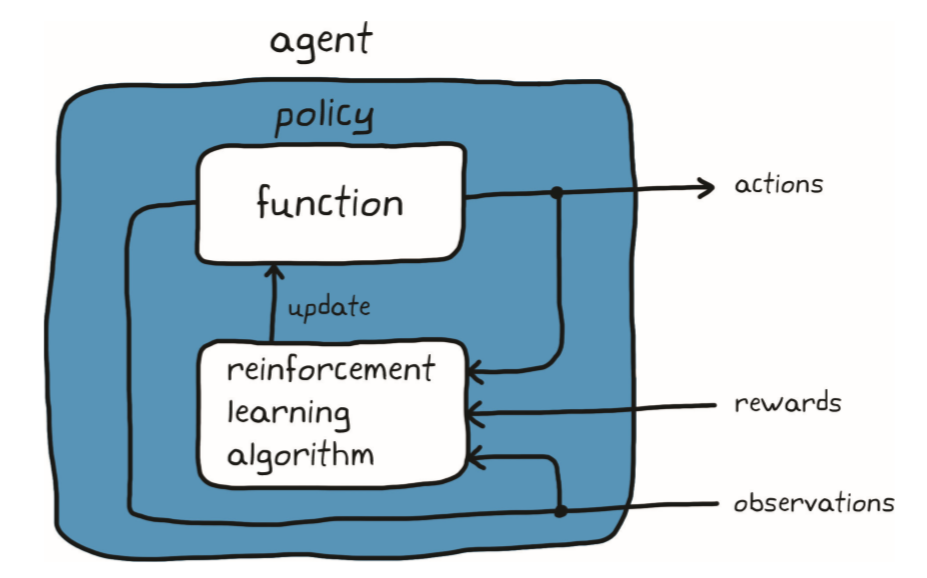
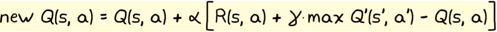

# 强化学习

## 参考

https://zhuanlan.zhihu.com/p/158457613

https://www.mathworks.com/products/reinforcement-learning.html?s_tid=srchtitle

【强化学习/OpenAI】强化学习中的关键概念

https://blog.csdn.net/qq_33446100/article/details/117868833?spm=1001.2014.3001.5502

## 基础概念

### 控制系统的目标

控制系统的目标是确定生成期望的系统行为的正确系统输入（动作）

 

 

 

-  强化学习与传统控制系统设计的概念对比

 

### 价值和奖励

奖励：处于某一状态或采取特定动作的即时收益

价值：代理预期从某一状态和往后将会获得的总回报

短视的好处？

 

### 策略

智能体由策略和学习算法组成

策略是一种将观测量映射到行动的函数抽象

学习算法是用来获取最优策略的优化方法

 

如何理解策略

- 简单的，策略是以状态观测为输入、以动作为输出的函数。任何具有这种输入和输出关系的函数都可以用于表示策略。

 

如何构造策略函数

- 直接：状态观测和动作间存在的特定映射
- 简介：由其他指标（价值）来判断最优映射关系

策略的表达形式

- 用表格
  - 状态和动作空间离散且稀少
  - Q-table

 

- 连续函数-神经网络
  - 连续的状态/动作空间
  - 特性函数：状态为输入、动作为输出
  - 通用函数逼近器：神经网络
  - 学习过程将包括系统地调节参数，找到最优输入/输出关系。

 

- 神经网络表示策略
  - 以大量的观测量为输入，并将其变换为能控制一些非线性环境的一组动作

 

### 强化学习的环境

在强化学习中，与智能体相交互的所有内容都被称为环境，除去智能体之外的所有事物均为环境，环境有不同的类型，主要分为以下几个种类：

- **确定性环境**

这是一种根据当前的状态就可以知道相应结果的环境。比如在我们在下象棋的时候可以知道在移动一颗棋子后的确切结果。

- **随机性环境**

对比上一种环境，如果根据当前的状态无法知道相应结果，那就是随机环境。这样的环境存在较大的不确定性，比如掷骰子，我们无法预知即将出现的数字。

- **完全可观测环境**

如果智能体在任何时候都可以确定系统的状态，那就是一个完全可观测的环境。比如在下围棋的时候，我们可以知道棋盘上所有棋子的位置信息。

- **部分可观测环境**

如果智能体无法像上一种环境中那样，在任何时刻都确定系统状态，那就是部分可观测环境。比如我们在打斗地主的时候，我们只知道自己的牌，却无法知道对手的牌是什么。

- **离散环境**

如果从一个状态转移到另一个状态后只能有一个有限的行为状态，那就是离散的环境。比如在国际象棋中，只能有移动棋子后的有限集。

- **连续环境**

如果从一个状态到另一个状态后可以有无限个行为状态，那么就是连续环境。比如从A点到B点可以有无数条路。

- **情景和非情景环境**

在情景（非序贯）环境中，智能体的当前行为不会影响将来行为，执行的是独立任务。而在非情景（序贯）环境中，智能体当前的行为会影响未来的行为，智能体前后的行为是相关的。

- **单智能体和多智能体环境**

环境中有一个智能体就是单智能体，有多个智能体就是多智能体。在执行复杂任务时常使用多智能体环境，各智能体之间可以相互通信。多智能体环境具有较大程度的不确定性，所以大多是随机的。

### 强化学习算法

强化学习算法主要有两大分类，分别是免模型学习（Model-Free） vs 有模型学习（Model-Based），这两者的差别体现在：**智能体是否能完整了解或学习到所在环境的模型。**

有模型学习（Model-Based）对环境有提前的认知，可以提前考虑规划，但是缺点是如果模型跟真实世界不一致，那么在实际使用场景下会表现的不好。

免模型学习（Model-Free）放弃了模型学习，在效率上不如前者，但是这种方式更加容易实现，也容易在真实场景下调整到很好的状态。所以免模型学习方法更受欢迎，得到更加广泛的开发和测试。

 

### 强化学习流程

- 强化学习算法（理解为学习方法）

  - 策略函数

    - 策略梯度

 

    - 随机策略

  - 价值函数

 

  - 执行器-评价器（Actor-critic）

  missing： v2-655f39f0f6b63fc1d8b8c8608f5e876f_1440w.webp

- 贝尔曼方程（用于更新价值）
 

### 基于模型与否

- 基于模型的强化学习
  - 缩短学习最优策略所需的时间，使用模型指导代理远离已知的低奖励状态空间区域。
  - 在基于模型的强化学习中，不需要了解整个环境模型；只需为代理提供我们自己了解的那部分环境。

- 无模型 RL 更受欢迎，应用也更广泛，因为人们希望通过它来解决一些难以开发模型（甚至是简单模型）的问题。

