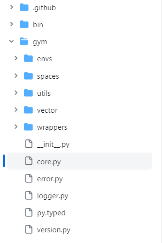
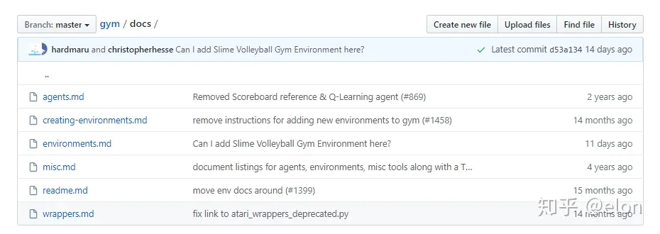

# Gym-MuJoco

## 参考

### 文档

- [MuJoco](https://mujoco.readthedocs.io/en/latest/programming/simulation.html)

- [Gymnasium](https://gymnasium.farama.org/tutorials/gymnasium_basics/environment_creation/#sphx-glr-tutorials-gymnasium-basics-environment-creation-py)

- [Gymnasium-mujoco-robotics](https://robotics.farama.org/envs/MaMuJoCo/ma_ant/)


### 教程

- 极简环境及注册

https://www.youtube.com/watch?v=ZxXKISVkH6Y&t=3s

- gym下-官方参考




- Docs



- Agent

  - random_agent.py运行一个随机的智能体对象；

  - cem.py 使用交叉熵方法运行一个确定的智能体对象；

  - keyboard_agent.py 将自己作为智能体进行测试，将环境名称作为命令行参数传递。

    （scripts暂时没看明白用来做什么的。）

- 保存视频

  ```python
  from gym import wrappers
  from time import time # just to have timestamps in the files
  env = gym.make(ENV_NAME)
  env = wrappers.Monitor(env, './videos/' + str(time()) + '/')
  ```


## 自定义一个新环境

https://blog.csdn.net/qq_33446100/article/details/118249795

- 强化学习的算法库

https://blog.csdn.net/qq_33446100/article/details/119089724?spm=1001.2014.3001.5502

```python
# 源码地址 https://github.com/openai/gym/blob/master/gym/core.py
class Env(object):
    """
        step
        reset
        render
        close
        seed

        action_space: 行为空间，在本例中，行为空间即[0,360)，整型，因为我们支持360度的方向改变；
        			  行为空间可能不止一个维度，例如在某些支持多个行为的环境中，行为空间可以是[[0, 360], [0, 100], ...]
        observation_space: 观察空间，agent能看到的数据，可以是环境的部分或全部数据
        				   在本例中（为全量数据），我们将其设置为所有球的坐标、分数、以及球类型(自己还是其它球)
        reward_range: 奖励范围，agent执行一个动作后，环境给予的奖励值，在本例中为实数范围
    """
        self.action_space = spaces.Discrete(360)
        self.observation_space = spaces.Box(low=0, high=VIEWPORT_H, shape=(MAX_BALL_NUM, 4), dtype=np.float32)

        spaces.Box(low=, high=, shape=(,...), dtype=)
        s = spaces.Box(low=0, high=255, shape=(4, 5, 3), dtype=np.uint8)
        print(s.sample()) #随机取样 
    def step(self, action):
        """环境的主要驱动函数，主逻辑将在该函数中实现。该函数可以按照时间轴，固定时间间隔调用

        参数:
            action (object): an action provided by the agent

        返回值:
            observation (object): agent对环境的观察，在本例中，直接返回环境的所有状态数据
            reward (float) : 奖励值，agent执行行为后环境反馈
            done (bool): 该局游戏时候结束，在本例中，只要自己被吃，该局结束
            info (dict): 函数返回的一些额外信息，可用于调试等
        """
        raise NotImplementedError

    def reset(self):
        """将环境重置为初始状态，并返回一个初始状态；在环境中有随机性的时候，需要注意每次重置后要保证与之前的环境相互独立
        """
	# 管理所有球的列表， reset时先清空
    	self.balls = []

    # 随机生成MAX_BALL_NUM - 1个其它球
    	for i in range(MAX_BALL_NUM - 1):
        	self.balls.append(self.randball(BALL_TYPE_OTHER))
    # 生成agent球
    		self.selfball = self.randball(BALL_TYPE_SELF)
    # 把agent球加入管理列表
    		self.balls.append(self.selfball)
    # 更新观察数据
    		self.state = np.vstack([ball.state() for (_, ball) in enumerate(self.balls)])
		# 返回
        return self.state

@staticmethod
		def randball(_t: np.int):
			# _t 为球类型（agent或其它）
			# Ball class 参数为坐标x,y, 分数score, 类型_t
      # VIEWPORT_W, VIEWPORT_H为地图宽高
    		_b = Ball(np.random.rand(1)[0]*VIEWPORT_W, np.random.rand(1)[0]*VIEWPORT_H, np.random.rand(1)[0] * MAX_BALL_SCORE, np.int(np.random.rand(1)[0] * 360), _t)
    		return _b


    def render(self, mode='human'):
        """环境渲染，用于将环境用图形、数字等表现出来
        """
        raise NotImplementedError

    def close(self):
        """一些环境数据的释放可以在该函数中实现
        """
        pass

    def seed(self, seed=None):
        """设置环境的随机生成器
        """
        return

```

- 主环境

```python
class Ball():
    def __init__(self, x: np.float32, y: np.float32, score: np.float32, way: np.int, t: np.int):
        '''
            x   初始x坐标
            y   初始y坐标
            s   初始分
            w	移动方向，弧度值
            t   球类型
        '''
        self.x = x
        self.y = y
        self.s = score
        self.w = way * 2 * math.pi / 360.0  # 角度转弧度
        self.t = t

        self.id = GenerateBallID()      # 生成球唯一id
        self.lastupdate = time.time()   # 上一次的计算时间
        self.timescale = 100            # 时间缩放，或者速度的缩放

    def update(self, way):
        '''
            更新球的状态
        '''

        # 如果是agent球，那么就改变方向
        if self.t == BALL_TYPE_SELF:
            self.w = way * 2 * math.pi / 360.0  # 角度转弧度

        speed = 1.0 / self.s    # 分数转速度大小
        now = time.time()       # 当前时间值

        self.x += math.cos(self.w) * speed * (now - self.lastupdate) * self.timescale   # 距离=速度*时间
        self.y += math.sin(self.w) * speed * (now - self.lastupdate) * self.timescale   

        self.x = CheckBound(0, VIEWPORT_W, self.x)
        self.y = CheckBound(0, VIEWPORT_H, self.y)

        self.lastupdate = now   # 更新计算时间

    def addscore(self, score: np.float32):
        self.s += score

    def state(self):
        return [self.x, self.y, self.s, self.t]

```

- step函数

```python
def step(self, action):
    reward = 0.0	# 奖励初始值为0
    done = False	# 该局游戏是否结束

    # 首先调用ball.update方法更新球的状态
    for _, ball in enumerate(self.balls):
        ball.update(action)

    # 然后处理球之间的吞噬
    # 定一个要补充的球的类型列表，吃了多少球，就要补充多少球
    _new_ball_types = []
    # 遍历，这里就没有考虑性能问题了
    for _, A_ball in enumerate(self.balls):
        for _, B_ball in enumerate(self.balls):

			# 自己，跳过
            if A_ball.id == B_ball.id:
                continue

            # 先计算球A的半径
            # 我们使用球的分数作为球的面积
            A_radius = math.sqrt(A_ball.s / math.pi)

            # 计算球AB之间在x\y轴上的距离
            AB_x = math.fabs(A_ball.x - B_ball.x)
            AB_y = math.fabs(A_ball.y - B_ball.y)

            # 如果AB之间在x\y轴上的距离 大于 A的半径，那么B一定在A外
            if AB_x > A_radius or AB_y > A_radius:
                continue

            # 计算距离
            if AB_x*AB_x + AB_y*AB_y > A_radius*A_radius:
                continue

            # 如果agent球被吃掉，游戏结束
            if B_ball.t == BALL_TYPE_SELF:
                done = True

            # A吃掉B A加上B的分数
            A_ball.addscore(B_ball.s)

            # 计算奖励
            if A_ball.t == BALL_TYPE_SELF:
                reward += B_ball.s

            # 把B从列表中删除，并记录要增加一个B类型的球
            _new_ball_types.append(B_ball.t)
            self.balls.remove(B_ball)

    # 补充球
    for _, val in enumerate(_new_ball_types):
        self.balls.append(self.randball(np.int(val)))

	# 填充观察数据
    self.state = np.vstack([ball.state() for (_, ball) in enumerate(self.balls)])

	# 返回
    return self.state, reward, done, {}

```

- Render

```python
def render(self, mode='human'):
    # 按照gym的方式创建一个viewer, 使用self.scale控制缩放大小
    from gym.envs.classic_control import rendering
    if self.viewer is None:
        self.viewer = rendering.Viewer(VIEWPORT_W * self.scale, VIEWPORT_H * self.scale)

    # 渲染所有的球
    for item in self.state:
    	# 从状态中获取坐标、分数、类型
        _x, _y, _s, _t = item[0] * self.scale, item[1] * self.scale, item[2], item[3]

		# transform用于控制物体位置、缩放等
        transform = rendering.Transform()
        transform.set_translation(_x, _y)

        # 添加一个⚪，来表示球
        # 中心点: (x, y)
        # 半径: sqrt(score/pi)
        # 颜色: 其它球为蓝色、agent球为红/紫色
        self.viewer.draw_circle(math.sqrt(_s / math.pi) * self.scale, 30, color=(_t, 0, 1)).add_attr(transform)

	# 然后直接渲染（没有考虑性能）
    return self.viewer.render(return_rgb_array = mode=='rgb_array')

```


# Gym-ENV-MuJoCo-Stable baselines 3

## 步骤

### 环境准备

- 安装

```shell
pip install stable-baselines3
```

- 阅读软件包

路径：`/home/ypq3/anaconda3/envs/Stone/lib/python3.10/site-packages/stable_baselines3`

- 封装程序包：

  - 生成:`requirement.txt`

    - Conda-环境包装

    ```sh
       conda activate myenv
       conda env export > environment.yml
       conda list --export > requirements.txt
       conda env create -f environment.yml
       conda create --name myenv --file requirements.txt
    ```

    

  - Pycharm：Tools ->Sync Python Requirements（同步python要求）
  - pipreqs

    
  ```shell
  # 安装
  pip install pipreqs
  # 在项目根目录下运行:
  pipreqs ./ --encoding=utf8
  ```


### Gym

- Demo

```python
import gymnasium as gym
env = gym.make("LunarLander-v2", render_mode="human")
observation, info = env.reset()
for _ in range(1000):
    action = env.action_space.sample()  # agent policy that uses the observation and info
    observation, reward, terminated, truncated, info = env.step(action)

    if terminated or truncated:
        observation, info = env.reset()
env.close()
```

- Env-custom

  - Docs

  - Tutorials

  - copycat

    - 模板

    ```python
    import gym
    from gym import spaces
    
    class CustomEnv(gym.Env):
        """Custom Environment that follows gym interface"""
        def __init__(self, arg1, arg2, ...):
            super(CustomEnv, self).__init__()
            self.action_space = spaces.Discrete(N_DISCRETE_ACTIONS)
            self.observation_space = spaces.Box(low=0, high=255,
                                                shape=(N_CHANNELS, HEIGHT, WIDTH), dtype=np.uint8)
        def step(self, action):
            ...
            return observation, reward, done, info
        def reset(self):
            ...
            return observation  # reward, done, info can't be included 
        def render(self, mode="human"):
            ...
    ```

    - 游戏环境

    ```python
    import numpy as np
    import gym
    from gym import spaces
    
    
    class GoLeftEnv(gym.Env):
      """
      这是一个让智能体学习一直向左走的 1D grid 环境 
      """
      metadata = {'render.modes': ['console']}
      LEFT = 0
      RIGHT = 1
    
      def __init__(self, grid_size=10):
        super(GoLeftEnv, self).__init__()
    
        # 1D-grid 的大小
        self.grid_size = grid_size
        # agent 初始化在 grid 的最右边
        self.agent_pos = grid_size - 1
    
        # 定义 action  observation 
        # 离散行为空间: left、 right
        n_actions = 2
        self.action_space = spaces.Discrete(n_actions)
        # 观测是智能体现在的位置
        self.observation_space = spaces.Box(low=0, high=self.grid_size,
                                            shape=(1,), dtype=np.float32)
    
      def reset(self):
        """
        Important: 观测必须是一个 np.array
        :return: (np.array) 
        """
        # Initialize the agent at the right of the grid
        self.agent_pos = self.grid_size - 1
        # here we convert to float32 to make it more general (in case we want to use continuous actions)
        return np.array([self.agent_pos]).astype(np.float32)
    
      def step(self, action):
        if action == self.LEFT:
          self.agent_pos -= 1
        elif action == self.RIGHT:
          self.agent_pos += 1
        else:
          raise ValueError("Received invalid action={} which is not part of the action space".format(action))
        # 如果走到边缘就不能继续走了
        self.agent_pos = np.clip(self.agent_pos, 0, self.grid_size)
        # 如果走到最左边代表结束了
        done = bool(self.agent_pos == 0)
        # 走到最左边就给一个正的 reward
        reward = 1 if self.agent_pos == 0 else 0
        # 目前没有需要额外输出的信息
        info = {}
        return np.array([self.agent_pos]).astype(np.float32), reward, done, info
    
      def render(self, mode='console'):
        # 在命令行中渲染
        if mode != 'console':
          raise NotImplementedError()
        # agent is represented as a cross, rest as a dot
        print("." * self.agent_pos, end="")
        print("x", end="")
        print("." * (self.grid_size - self.agent_pos))
    
      def close(self):
        pass
    ```

    实例化代码

    ```python
    from stable_baselines3 import PPO, A2C # DQN coming soon
    from stable_baselines3.common.env_util import make_vec_env
    
    # 构建环境
    env = GoLeftEnv(grid_size=10)
    env = make_vec_env(lambda: env, n_envs=1)
    # 训练智能体
    model = A2C('MlpPolicy', env, verbose=1).learn(5000)
    # Test the trained agent
    obs = env.reset()
    n_steps = 20
    for step in range(n_steps):
      action, _ = model.predict(obs, deterministic=True)
      print("Step {}".format(step + 1))
      print("Action: ", action)
      obs, reward, done, info = env.step(action)
      print('obs=', obs, 'reward=', reward, 'done=', done)
      env.render(mode='console')
      if done:
        # Note that the VecEnv resets automatically
        # when a done signal is encountered
        print("Goal reached!", "reward=", reward)
        break
    ```

    

- MuJoCo-src-read

  - 环境观察：
    - 可视化：坐标系、接触力、相机切换镜头、截屏、透视、隐藏菜单
    - 位于body下：
    - ``       <camera name="track" mode="trackcom" pos="0 -3 0.3" xyaxes="1 0 0 0 0 1"/>``
  - 类的继承架构
    - Ant-V4 -> MujocoEnv ->GymEnv

- SB-3

  - Demo-cart pole -gym
  - SB-3 src reading

    - > **`common` 文件夹**: 这个文件夹包含了很多重要的基础代码，例如基类、工具函数和通用的数据结构。
      >
      > - 文件名: `base_class.py`, `buffers.py`, `policies.py`, `type_aliases.py` 等。
      >
      > **算法文件夹 (`a2c`, `ppo`, `dqn`等)**: 每个算法文件夹中包含了该算法的实现代码。
      >
      > - 文件名: `a2c/a2c.py`, `ppo/ppo.py`, `dqn/dqn.py` 等。
      >
      > **代码阅读**: 打开上述文件，开始阅读代码。每个文件都应该有注释来解释代码的功能和结构。注意理解每个算法的核心逻辑和它们是如何与 `common`文件夹中的基类和工具函数交互的。
      >
      > 此过程可以帮助你更好地理解 `stable-baselines3`的结构和强化学习算法的实现，从而为你自己的项目提供坚实的基础。同时，通过深入了解这些代码，你可以学习到如何遵循最佳实践来组织和实现你的代码。
      >
      > ### 快速浏览一两个算法的代码
      >
      > 在 `stable-baselines3`库中，每种算法的实现通常都遵循着一种组织结构，它们都继承自 `common/base_class.py`中的 `BaseAlgorithm`类，并实现一些特定的方法。以下是你在浏览 `a2c/a2c.py`和 `ppo/ppo.py`时需要注意的主要组件：
      >
      > **算法类的声明**:
      >
      > - 每种算法都有一个主类，例如 `A2C`和 `PPO`，它们继承自 `BaseAlgorithm`类。
      >
      > **构造函数 `__init__`**:
      >
      > - 初始化方法用于配置算法的参数和环境。
      >
      > **`_setup_model` 方法**:
      >
      > - 这个方法用于设置算法需要的模型，例如神经网络架构。
      >
      > **`learn` 方法**:
      >
      > - 这是算法的主要训练循环，其中包含了数据收集、优化等步骤。
      >
      > **`collect_rollouts` 方法 (仅在 A2C 中)**:
      >
      > - 这个方法用于收集经验数据，这些数据将用于训练。
      >
      > **`_update` 方法 (仅在 PPO 中)**:
      >
      > - PPO 算法中的核心更新步骤，包括执行多次优化迭代。
    - https://blog.csdn.net/tianjuewudi/article/details/123113885?utm_source=miniapp_weixin
    - Common
    - single algorithm
    - DDPG
      - 中级错题家
      - CSDN
      - to-be-learned
        - 原版论文：https://zhuanlan.zhihu.com/p/371451813?utm_id=0
        - https://github.com/gabrielcassimiro17/rl-robot-movement
        - https://aijishu.com/a/1060000000401854
        - https://avoid.overfit.cn/post/54829204a5c74f0bb2b3a686c5fe079f
        - https://avoid.overfit.cn/post/9951ac196ec84629968ce7168215e461
        - 原理：https://blog.csdn.net/dgvv4/article/details/129479878
        - https://blog.csdn.net/shoppingend/article/details/124344083
        - https://zhuanlan.zhihu.com/p/651052296
        - https://zhuanlan.zhihu.com/p/26754280
        - https://blog.csdn.net/te_sun/article/details/105082305
        - https://zhuanlan.zhihu.com/p/624639496
        - https://blog.csdn.net/qq_45889056/article/details/130297960
    - model-based
      - https://www.zhihu.com/question/318703290
  - Office Docs

- Mujoco-env

  - MyEnvStone
  - RL-Knowledge-
  - Gym-customer-env
  - DDPG-sb3
    - 参数

- 硬件

  - CUDA-PyTorch-issac
    - [PyTorch documentation — PyTorch 2.2 documentation](https://pytorch.org/docs/stable/index.html)
    - [主页 - PyTorch中文文档 (pytorch-cn.readthedocs.io)](https://pytorch-cn.readthedocs.io/zh/latest/)
  - 并行CPU
  - MuJoCo-JAX
  - TensorBoard

## 学习/练习

### 参考

https://zhuanlan.zhihu.com/p/659089157

https://zhuanlan.zhihu.com/p/581153708

## TensorBoard

- Official

[Tensorboard Integration — Stable Baselines3 2.3.2 documentation (stable-baselines3.readthedocs.io)](https://stable-baselines3.readthedocs.io/en/master/guide/tensorboard.html)

- Install
- Usage

```python
from torch.utils.tensorboard import SummaryWriter

writer = SummaryWriter(log_dir="your_log_dir")

from stable_baselines3 import PPO

model = PPO("MlpPolicy", "CartPole-v1", tensorboard_log=writer)
model.learn(total_timesteps=10000)
```

- Launch

```shell
tensorboard --logdir your_log_dir
```

- 浏览器地址：`localhost:6006`
