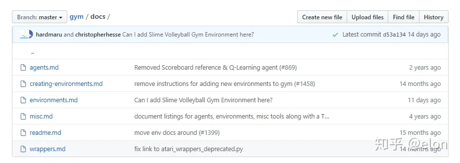

# gym-mujoco

## 参考

### 文档

- [MuJoco](https://mujoco.readthedocs.io/en/latest/programming/simulation.html)

- [Gymnasium](https://gymnasium.farama.org/tutorials/gymnasium_basics/environment_creation/#sphx-glr-tutorials-gymnasium-basics-environment-creation-py)

- [Gymnasium-mujoco-robotics](https://robotics.farama.org/envs/MaMuJoCo/ma_ant/)

- 环境自定义
  - https://blog.csdn.net/qq_33446100/article/details/118249795

  - 强化学习的算法库
  - https://blog.csdn.net/qq_33446100/article/details/119089724?spm=1001.2014.3001.5502
  - 源码地址 https://github.com/openai/gym/blob/master/gym/core.py


### 教程

- 极简环境及注册

https://www.youtube.com/watch?v=ZxXKISVkH6Y&t=3s

- gym下-官方参考

 


- Docs

 

- Agent

  - random_agent.py运行一个随机的智能体对象；

  - cem.py 使用交叉熵方法运行一个确定的智能体对象；

  - keyboard_agent.py 将自己作为智能体进行测试，将环境名称作为命令行参数传递。

    （scripts暂时没看明白用来做什么的。）

- 保存视频

```python
from gym import wrappers
from time import time # just to have timestamps in the files
env = gym.make(ENV_NAME)
env = wrappers.Monitor(env, './videos/' + str(time()) + '/')
```

