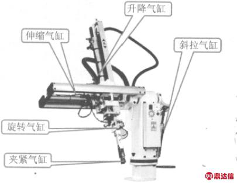
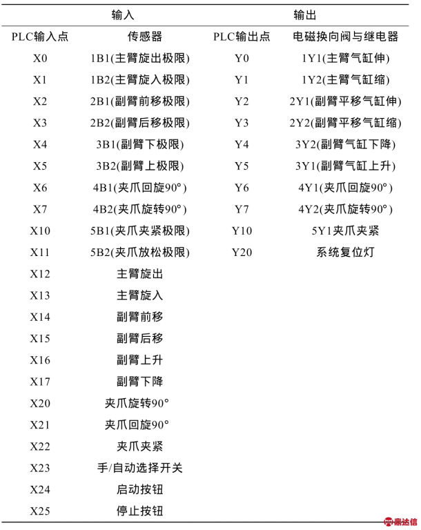
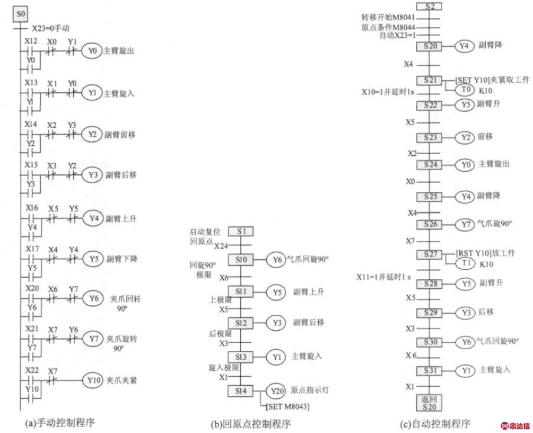

# 以plc为核心的气动机械手控制系统的设计

以PLC为核心的气动机械手控制系统的设计

星期四, 十二月 15, 2022

12:25 下午

 

已剪辑自: [https://www.dingdx.com/news/202110/25/761.html]{.underline}

*导读*

摘 要：以气动机械手为研究对象，阐述一种基于PLC控制的气动机械手的结构功能、控制原理，并介绍基于三菱FX2N-48MR PLC控制机械手的控制过程.关键词：气动机械手；PLC控制；应用机械手是一种能自动定位控制并可重新编程改变的多功能机器，具有多个自由度，可用来搬运工件以完成在各个不同环境中工作.机械手系统最核心的部分

**摘 要：** 以气动机械手为研究对象，阐述一种基于PLC控制的气动机械手的结构功能、控制原理，并介绍基于三菱FX2N-48MR PLC控制机械手的控制过程.

**关键词：** 气动机械手；PLC控制；应用

机械手是一种能自动定位控制并可重新编程改变的多功能机器，具有多个自由度，可用来搬运工件以完成在各个不同环境中工作.机械手系统最核心的部分是执行系统和控制系统，其执行机构一般由液压、气动或电机来完成.气动机械手是以压缩空气为动力源，气动阀为控制元件，实现各种需要的动作，具有系统结构简单，造价成本低，工作环境要求低，设计和制造周期短等优点，因此受到越来越广泛的重视\[1\].以PLC为核心的气动机械手控制系统具有较强的抗干扰能力，系统可改造和可扩展性好，特别适用于点位控制模式的机械手\[2\].本文介绍基于三菱FX系列的PLC对搬运气动机械手的控制系统.

1 系统的组成及其工作过程
------------------------

 

图1 机械手结构

### 1.1 系统的组成

本搬运机械手是由升降气缸、伸缩气缸、主臂斜拉气缸、气爪旋转气缸、气爪夹紧气缸共5个气缸组成.该系统主要是按照控制要求和机械手的运行路线，控制电磁阀的得失电状态驱动气动控制元件，以控制气动的相关参数达到控制机械手自动运行的目的.部件运行方向控制主要通过外部限位开关传递信号改变气压回路中换向阀的工作位置，使气流按要求流动.完成将工件从一个位置搬运到另一个位置，其系统结构如图1所示.机械手在自动化生产线中应用时讲究的是效率，设计时要调整好适当行程，尽量缩短循环周期.系统主要执行元件选用的是日本SMC轻磨擦高速气缸及法国LEGRIS大流量调速接头.

### 1.2 工程过程

系统启动时，首先进行自检，若设备检验正常，则机械手处于待料位置，当控制系统检测到需取工件信号时，机械手开始动作.系统的具体动作过程为：原始位置---副臂下降---夹爪夹紧取工件---副臂上升---副臂前移---主臂旋出---副臂下降---夹爪旋转90°---夹爪放松放工件---副臂上升---副臂后移---夹爪回旋90°---主臂旋入---开始循环.

机械手的动作示意图如图2所示.其全部动作由气缸驱动，而气缸又由相应的电磁阀控制.其中，上升/下降、伸出/缩回和主臂旋出/旋回分别由双线圈二位电磁阀控制.当下降电磁阀通电时，机械手下降；当下降电磁阀断电时，机械手下降停止.上升电磁阀通电时，机械手上升；上升电磁阀断电时，机械手上升停止.同样，伸出/缩回和主臂旋出/旋回分别由伸出电磁阀和缩回电磁阀控制.当斜拉气缸伸出时，主臂旋出；当斜拉气缸缩回时，主臂旋回.机械手夹爪旋转是由90°旋转气缸完成的，机械手的终端是一个气动夹爪，可以实现抓和放的动作，气动夹爪的放松/夹紧由一个单线圈(称为夹紧电磁阀)控制.该线圈通电，机械手夹紧；该线圈断电，机械手放松.在该系统中，机械手的运动都采用调节流阀获得不同的运行速度.

 

图2 机械手工位示意图

2 系统设计
----------

系统的硬件主要由气动驱动系统和PLC控制系统组成，软件系统主要通过PLC的编程实现.气动机械手气动原理图如图3所示\[3-4\].根据系统控制信号的数量，本系统选用三菱FX2N系列晶体管输出型PLC.通过手持编程器，能实现工作现场离线及在线编程，还可以结合实际的工程要求在工作现场调整控制程序，完成机械手的不同动作，以实现机械手柔性化设计.

 

图3 机械手气动原理图

### 2.1 系统输入和输出

系统输入、输出表见表1.通过向系统提供符合要求的开关信号实现整个机械手的控制.即按机械手的动作要求，PLC通过信号采集、控制气动系统的电磁换向阀的通断电，实现装置的自动或手动上下料.

### 2.2 软件设计

表1 机械手系统与PLC的I/O表

 

该机械手在PLC控制下可实现手动、连动两种工作方式，手动方式是指利用按钮对机械手每步动作单独进行控制.连动方式是指机械手根据控制信号自动循环执行每步动作，直至获得停止信号.系统启动后，根据工序要求，通过旋转式按钮确定机械手的工作方式为单动或连动形式，如果选择单动则执行手动程序，否则默认执行连动程序.根据本次设计中机械手的特点，要求每一个动作严格按顺序执行，采用步进指令编写，保证机械手的运行有条不紊，即使出现误动作也不会造成混乱.

机械手的动作执行过程为：系统启动，机械手处于待料状态，当获得取料信号，机械手开始动作，从原点出发按工序自动循环工作，直到接受停止信号，在完成最后一个周期的工作后，返回原点，自动停机.根据以上动作执行过程，设计出机械手动作过程控制梯形图，用状态初始化指令IST来设置具有多种工作方式的控制系统的初始状态，IST指令执行条件满足时，初始状态继电器S0---S3和特殊辅助继电器自动指定功能为：

M8040，禁止转移，其线圈接通时，禁止所有的状态转化；

M8041，转换启动，其线圈接通时，允许从初始状态的转化；

M8042，启动脉冲，仅在按启动按钮时瞬时动作；

S1，回原点操作的初始状态继电器；

M8044，原点条件，即系统处于原点位置时，其线圈接通；

S0，手动操作的初始状态继电器；

2)回原点程序，开始按下启动按钮自动回原点的顺序功能图，如图4(b)所示，当原点条件满足时，特殊辅助继电器M8044(原点条件)为ON，自动返回原点结束后，用SET指令将M8043(回原点完成)置为ON，并用RST指令将回原点的最后一步S14复位.

S2，自动操作的初始状态继电器\[5\].

该机械手控制程序较复杂，运用模块化设计思想，将机械手控制程序分为回原点操作、手动单步操作和自动连续操作程序\[6-7\]：

1)手动运行程序，用初始状态继电器S0控制见图4(a)，由于手动程序、自动运行程序和回原点程序均采用STL触点驱动，这三部分程序不会同时被驱动.

M8043，回原点完成；

3)自动运行程序，根据系统自动动作流程进行编程，梯形图程序如图4(c )所示.

 

图4 部分PLC程序

3 结论
------

经调试，基于PLC控制的气动机械手能够实现物体的自动循环搬运，并处于良好的运行状态.根据工业生产的实际需要，对其进一步改进，在条件允许的情况下，也可以采用触摸屏对机械手系统进行控制，这样占用空间小，人机交互界面直观，操作更方便.由"可编程序控制器-传感器-气动元件"组成的典型的控制系统仍然是自动化技术的重要方面.发展与电子技术相结合的自适应控制气动元件，使气动技术从"开关控制"进入到高精度的"反馈控制".省配线的复合集成系统，不仅减少配线、 配管和元件，而且拆装简单，大大提高了系统的可靠性.
