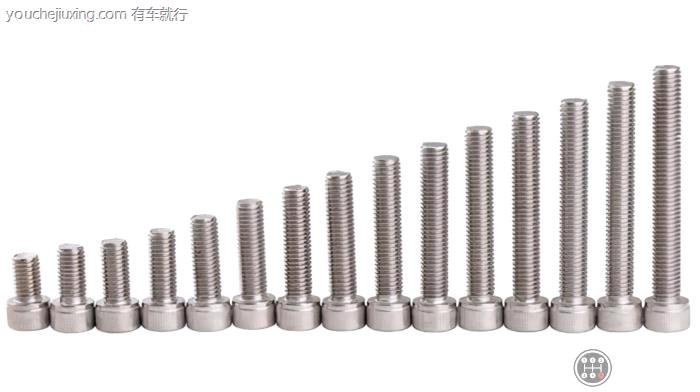

# m6_6h是什么意思___有车就行

m6-6h是什么意思 - 有车就行

星期一, 十二月 19, 2022

12:45 下午

 

已剪辑自: [https://www.youchejiuxing.com/qccs/9440.html]{.underline}

M6的意思就是公称直径为6mm的普通螺纹，而M6-6H为螺纹的等级，内螺纹分为三种等级：5H、6H、7H来区分；在国家标准规定的标准螺纹标注方法中，第一个字母代表螺纹代号，例如：M表示普通螺纹、G表示非螺纹密封的管螺纹、R表示用螺纹密封的管螺纹、Tr表示梯形螺纹等；第二个数字表示螺纹公称直径，也就是螺纹的大径；它表示的是螺纹的最大直径，单位为毫米；往后的符号分别是螺距、旋转、中径公差代号、顶径公差代号、旋合长度代号。

 

**尺寸代号**

尺寸代号：公称直径×螺距(多线螺纹的导程和螺距均要注出，单线粗牙普通螺纹螺距不标注)；

"M10"表示公称直径为10 mm、螺距1.5 mm的单线粗牙普通螺纹；

"M10×1"表示公称直径为10mm、螺距为1 mm的单线细牙普通螺纹；
