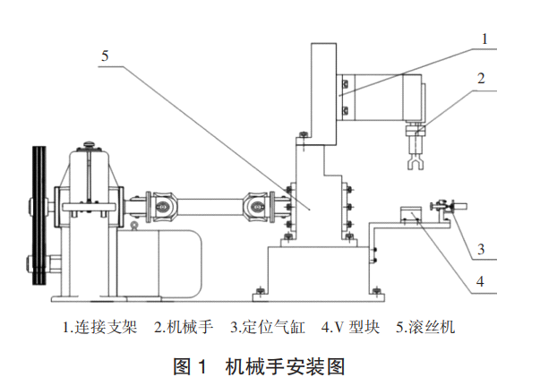
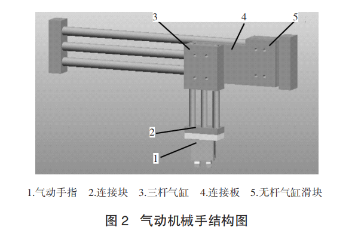
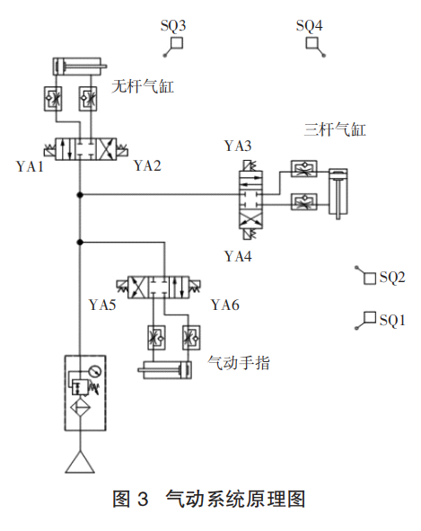
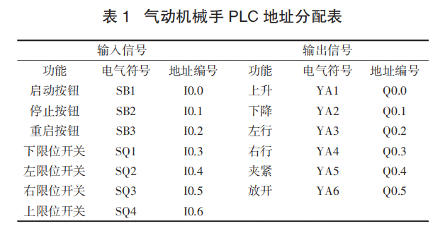
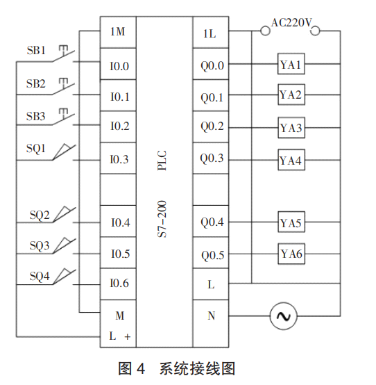
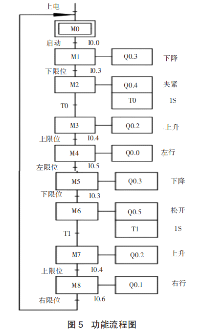

# 设计研究一种采用plc控制的全自动气动搬运机械手

工业机械手-设计研究一种采用PLC控制的全自动气动搬运机械手-悦普达自动化机械手

星期四, 十二月 15, 2022

12:26 下午

已剪辑自: [http://www.ypd-robot.com/news/517.html]{.underline}

　　王宇钢，朱彦松

　　摘要：为了实现活塞杆零件在滚丝加工中的自动搬运，设计了一种采用 PLC 控制的全自动气动**搬运机械手**。首先，对**机械手**的结构进行了设计，阐述了机械手的组成及工作过程。其次，建立了气缸驱动系统的原理图，并简述了气缸驱动系统的控制原理。最后，分析了 PLC 的控制端口分配，对 PLC 型号进行选型，并设计了 PLC 控制系统的硬件接线图和功能流程图。设计的气动机械手结构简单，易于维护，相比传统继电器控制依靠 PLC 控制精度得到提高，有助于提高企业生 产效率。

 

　　工业机械手可以模仿人手的动作功能，已广泛用于抓放材料、搬运物件或操持工具等工作。气缸驱动具有结构简单、速度快、反应灵敏、易于维护和控制等特点，在机械手的驱动系统中被大量采用。利用PLC作为机械手的控制核心，相比传统基于继电器-接触器的控制模式可有效提高系统可靠性和适应性。

　　随着阀岛技术的发展，利用PLC控制气动机械手已变得越来越普遍。

　　针对活塞杆零件滚丝加工生产的自动化上下料问题，本文设计了一种基于PLC控制的气压驱动搬运机械手，将该系统与滚丝机配套使用，对提高企业生产效率和智能程度具有积极意义。

 

1机械手结构设计
---------------

　　1.1搬运系统总体结构

　　本文设计的气动搬运机械手主要用于将活塞杆

　　工件从料台搬运至滚丝专机，或将加工好的工件从滚丝专机搬运至下料台。为了避免加工零件与机床发生干涉，机械手采用架空式布局，通过连接支架将搬运机械手与滚丝机相连，如图1所示。

 

 

　　1.2机械手设计
-----------------

　　结合活塞杆滚丝加工过程，机械手上料完成动作如下：机械手向下运动抓取工件，向上提起，横向移动至两滚丝轮轴心连线中点正前方，然后向下运动松开工件，放置于定位元件V型块上。机械手上升，横向移动返回上料初始位置。下料过程功能和执行动作与上料过程相似。

　　根据机械手运动过程，本文设计的机械手由三个主要部件组成：气动手指、三杆气缸、磁耦无杆气缸。一个气动手指实现抓和放工件动作，气动手指通过连接块与一个垂直方向的三杆气缸连结，三杆气缸实现竖直方向上升和下降运动，三杆气缸通过连接板与一个水平方向的磁耦无杆气缸滑块连结，在水平方向磁耦无杆气缸装载三杆气缸及气动手指往复运动。气动机械手结构如图2所示。

 

 

　　采用气动手爪作为机械手的终端执行部件。带导杆气缸将与活塞平行的导杆与气缸组成一体，具有结构紧凑，导向精度高，能承受较大的横向负载和力矩的特点，因此用于连接气动手爪，实现竖直方向上下运动。无杆气缸可承受高悬臂负载，具有省空间，重量轻，自导向，行程可变多样的特点，已经广泛应用于悬挂机械设备移动。为了匹配机械手架空式布局，机械手设计的气动机械手采用无杆气缸带动悬臂水平移动。

 

2气动系统设计

　　按照气缸的工作原理，在机械手的搬运动作过程中，采用3个三位四通电磁阀6个点来实现下降-抓紧-上升-左平移-下降-放开-上升-右平移复位动作，并且各气路中均配置了节流阀，可以调节气流速度。此外，气动机械手的运动控制信号部分采用了信号开关：左右极限位置各用1个磁电开关，上下极限位置也各采用1个磁电开关。最后机械手再配上3个按钮，分别用于启动、停止和重启。气动原理图如图3所示。

 

 

3PLC控制系统设计

　　3.1PLC型号的选择

　　分析搬运机械手运行需求可知，其共需7个输入端子和6个输出端子，PLC的地址分配表如表1所示。

 

　　由西门子生产的S7－200系列PLC可满足控制机械手运动的PLC地址分配。S7－200（CPU224）型号PLC共有14个输入点、10个输出点，5KB内存，个计数器以及256个定时器。PLC和有关信号的系统接线图如图4所示。

 

　　3.2PLC的程序设计

　　顺序功能图（SequentialFunctionChart，SFC）是描述控制系统的控制过程、功能和特性的一种图形，也是设计PLC的顺序控制程序的有力工具。所谓的顺序控制，就是按照生产工艺预先规定的顺序，在各个输入信号的作用下，根据内部状态和时间的顺序，在生产过程中各个执行机构自动地、有秩序地进行操作。顺序设计法最基本的思想是将系统的一个工作周期划分为若干个顺序相连的阶段，这些阶段称为步（Step），然后用编程软件（例如存储器位M）来代表各步。运用PLC进行顺序控制时常采用顺序功能图描述程序的设计思想，然后根据顺序控制指令编写符合程序设计思想的程序。

　　顺序功能图是设计梯形图程序的基础，通过控制指令可将顺序功能图转换为相应的梯形图程序。

　　本文根据机械手执行动作的控制要求，按照输出量的状态变化，将机械手搬运动作的一个工作周期分为9个顺序相连的执行步（M0-M8），设计的机械手搬运功能流程图如图5所示。

 

 

4总结

　　本文设计了一种基于PLC控制的气压驱动**搬运机械手**，可用于活塞杆零件滚丝加工生产的自动化上下料。该机械手采用气缸驱动方式，可以充分利用丰富的空气介质减小开发成本，同时因气缸移动迅速，结构简单，降低了维护难度，提高了工作效率。

　　同时，采用PLC实现对**机械手**的气动控制，相比较传统的继电器-接触器控制系统，由于利用可编程序存储器实现控制功能，提高了控制系统的可扩展性和灵活性。此外，通过软件编程的方式控制电磁阀的开关通断，可迅速调节空气的流速和方向，提高了**工业机械手**控制的精度。

 

         昆山悦普达自动化科技有限公司主营数控车床[上下料机械手]{.underline},[工业机械手]{.underline},**[码垛机械手]{.underline},[六轴机械手]{.underline},[四轴机械手]{.underline},[焊接机械手]{.underline},搬运机械手,助力机械手,越来越多的厂商选择[川崎机械手]{.underline}，悦普达自动化科技跟随市场趋势，稳步推进川崎机械手产品的布局、事业部布局,扩大经营规模与业绩,现有产品可以满足柔性装配,伺服驱动,多级同步跟随工作站,机器人插件工作站等新技术应用。广泛应用于金属加工、3C、食品饮料、汽车装配等行业，以低成本、高品质、高产出的组合为企业服务理念，加速工厂自动化、无人化产业进程，广获客户的高度评价。**\
\
近些年来，自动化领域日新月异，我们努力成为市场的领跑者而不是追随者。公司注重打造团队的年轻化、多元化，勇于启用和培养新人，公司希望每位同事有不同的视野、想法和背景，并鼓励大家全力地投入，勇于尝试去做截然不同的事，突破自己的舒适区，不畏惧新的创意、新的知识、新的体验，学会重塑自己体验世界的方式！\
\
因梦想而奋斗！是我们大家共同追求的理念。\
\
在大家的共同努力下，未来，悦普达可以走得更高更远！
来，悦普达可以走得更高更远！
