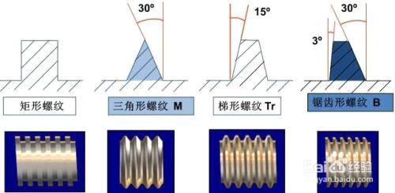
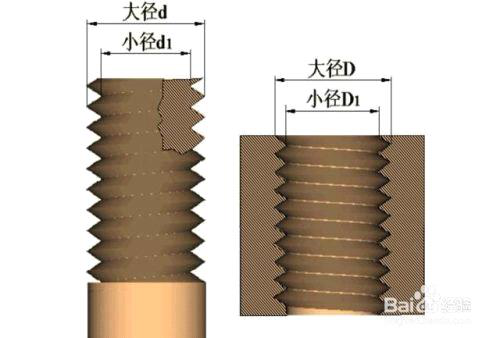
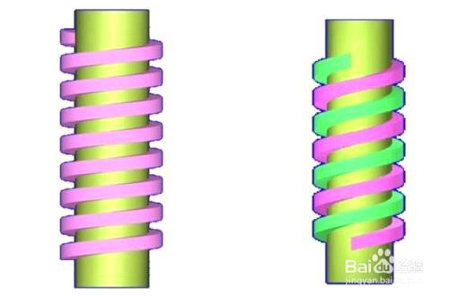
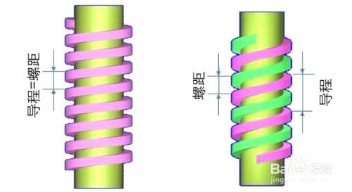
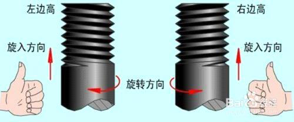

# 螺纹五个要素_百度经验

螺纹五个要素-百度经验

星期一, 十二月 19, 2022

12:45 下午

 

> 已剪辑自: [https://jingyan.baidu.com/article/7f766dafd6762c4101e1d0fe.html]{.underline}
>
> 螺纹包括五个要素：牙型、公称直径、线数、螺距（或导程）、旋向。

工具/原料
---------

-   螺纹

方法/步骤
---------

-   1

> 在通过螺纹轴线的剖面区域上，螺纹的轮廓形状称为牙型。有三角形、梯形、锯齿形、圆弧和矩形等牙型。
>
> []{.underline}[]{.underline}

-   2

> 螺纹有大径（d、D）、中径（d2、D2）、小径（d1、D1），在表示螺纹时采用的是公称直径，公称直径是代表螺纹尺寸的直径。
>
> []{.underline}[]{.underline}

-   3

> 沿一条螺旋线形成的螺纹称为单线螺纹，沿轴向等距分布的两条或两条以上的螺旋线形成的螺纹称为多线螺纹。
>
> []{.underline}[]{.underline}

-   4

> 螺距（p）是相邻两牙在中径线上对应两点间的轴向距离。
>
> 导程（ph）是同一条螺旋线上的相邻两牙在中径线上对应两点间的轴向距离。
>
> 单线螺纹时，导程=螺距；多线螺纹时，导程=螺距×线数。
>
> []{.underline}[]{.underline}

-   5

> 顺时针旋转时旋入的螺纹称为右旋螺纹；
>
> 逆时针旋转时旋入的螺纹称为左旋螺纹。
>
> []{.underline}[]{.underline}
>
> END

注意事项
--------

-   认真区别内外螺纹以及各要素

> 经验内容仅供参考，如果您需解决具体问题(尤其法律、医学等领域)，建议您详细咨询相关领域专业人士。
