激光雷达LiDAR 传感器工作方式及其变型 数十年来，LiDAR 传感器已在全球工业中得以应用。这些传感器提供人员防护并实现流程自动化。它们适用于室内与室外区域。其\... - 雪球

已剪辑自: [https://xueqiu.com/4487111342/223279282]{.underline}

数十年来，LiDAR 传感器已在全球工业中得以应用。这些传感器提供人员防护并实现流程自动化。它们适用于室内与室外区域。其应用领域包括例如港口自动化、交通管理系统和目标保护设备。

本文将阐述不同 LiDAR 变型的基本工作方式。此外，通过所选示例介绍了非接触式、通常不可见的激光扫描仪的应用选项。这些示例反映出 LiDAR 应用对工业 4.0 的重要性。

#### *什么是 LiDAR？*

利用激光进行非接触式距离测量的传感器已成为当今自动化领域不可或缺的一部分。这一发展始于所谓的 TOF 测量技术。TOF(Time of Flight) 即飞行时间，这一说法基本上已被更为准确的术语 LADAR 或比较常用的 LiDAR 所取代。LADAR（Laser Detectionand Ranging，激光检测和测距）或 LiDAR（Light Detection and Ranging，光检测和测距）源自通用术语 RADAR，它表示无线电检测和测距（Radio Detection and Ranging）。

#### *LiDAR 传感器的 1D、2D 或 3D 变型*

极简款 LiDAR 传感器在距离测量设备和传感系统中用作点状距离测量系统。通过对准自然目标或反射器，实现直接距离测量。

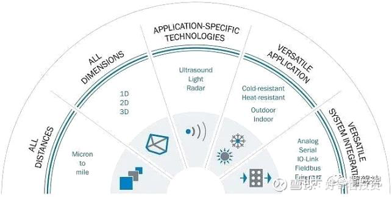

图 1 SICK工业传感器

通过此方式进行一维（距离）作业的传感器被称为一维传感器，即 1D 传感器。

如果测量光束在某一平面上旋转或移动，则可获得距离和角度数据，从而提供二维结果。用于此类测量的传感器通常被称为 2D激光扫描仪或 2D LiDAR 传感器。它们按顺序依次采集测量值，通常具有相等的测量时间间隔。

LiDAR 传感器在旋转时采用第三维度作业。由此提供 x 轴方向的距离和位置信息以及 y 轴和 z 轴方向的位置信息。当传感器中的多个发射和接收系统沿不同的水平角度移动扫描时，可获得有关不同空间参数的同类信息。此类传感器现称为多层扫描仪。

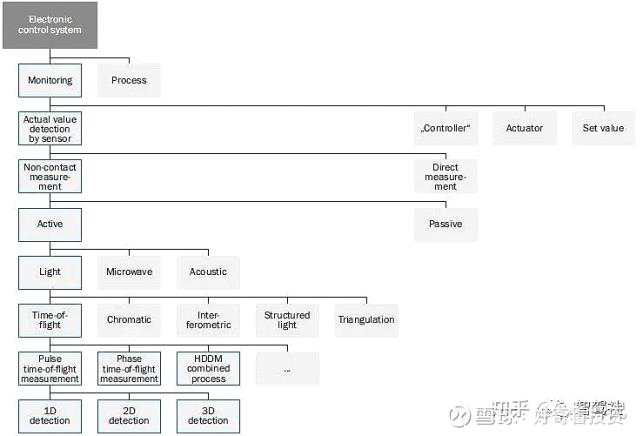

图 2：电子控制系统结构

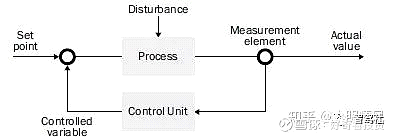

图 3：控制系统电路原理图

在传统的控制系统中，由测量元件在工作流程输出端非接触式采集实际值是 LiDAR 传感器的优势所在。借助非接触式测量方法，无需向被测物体施加机械压力或其他压力。由此确保流程不会产生反作用，并为后续控制系统回路提供可靠且可追溯的测量结果。

#### *激光测量------各种测量方法*

使用激光意味着主动照亮被测物体。通过主动照明有助于传感器接收器在一切测量环境中对准发射源。传感器不受外部光源影响，可在夜间、地下、隧道等环境中使用。无论是用于室外区域还是针对人造光源，性能始终如一。

激光提供连续稳定的聚焦光线，从而带来其他优势。由此，例如用于检测物体的发射信号可实现高精度空间界定。传感器采用人眼安全设计，同时满足允许发射功率的相关法律要求，这一点对此至关重要。发射激光的 2D 和 3D 聚焦能够提供高分辨率，用以对远距离或微结构物体进行扫描。

使用激光作为发射源进行测量时，必须使用合适的接收元件。发射器和接收器以及具有高时间分辨率的评价单元共同构成 LiDAR传感器的核心。如需使用所获得的测量数据，后续的电子回路至关重要。用于机械对准发射和接收单元的数据与根据传感器应用进行性能技术调整的数据于此汇总。

非接触式测量方法要求能够根据传感器的测量原理对被测物体进行物理检测。这意味着，使用激光时，激光光束必须无干扰地直接"照"射至物体并从物体射出。由此构成非接触式激光测量的一大优势：它适用于具有几乎任何物理特征的被测物体。因此，基于激光的非接触式检测在工业领域中具有诸多应用选项。例如，基于激光的测量传感器可用于物流（输送流程等）、道路交通流量检测或者港口集装箱的装卸流程自动化。

激光脉冲的反射光输出直接取决于被测物体的物理特征和距离。由于激光脉冲沿发射方向呈直角平面扩散（即发散），到达物体单位面积上的光输出将根据距离相应减少。针对反射光适用相同的扩散条件。另外，待照射表面的对准方式未必确保所有反射光均反射至传感器。通常，只有一小部分反射光到达 LiDAR 传感器的接收器。

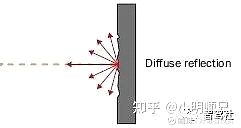

图 4：物体表面的光线反射

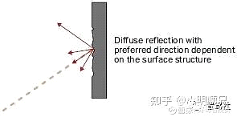

图 5：反射角

物体反射量直接取决于物体的物理特征。这就是所谓的反射比。该值由物体的光泽度和反射率决定。[柯达]{.underline}标准表格中规定了反射比的百分比值。无烟煤的反射比约为 5％，黑色哑光鞋面革的反射比约为 10％，而白色干墙的反射比约为 90％。反射光朝向光源的逆向反射器可实现高达 10,000％ 的反射率，而反光膜亦可达到 3,000％。无论物体直接位于传感器前方还是与之距离甚远，其反射特征均对传感器接收器的动态性提出挑战。通过适当协调激光发射器、脉冲能量和接收器灵敏度，LiDAR 传感器亦可可靠测量具有低反射比的远距离物体。

如果使用激光进行距离测量，则将直接在光路中检测物体和传感器之间的最短距离。此为一大优势：按照光速测量可防止额外偏转，从而避免出现额外"放大"。然而，在个别应用中，它同样是一项缺陷。因此可能难以测量放置在玻璃板或包装膜后方的物体。在特定应用中，LiDAR 传感器无法按需全角"观测"，通常也无法透视物体。在大多数情况下，透明物体会对测量值造成干扰，但应用中通常可借助多重回波等技术可靠滤除。

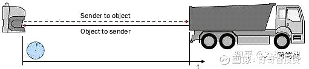

图 6：采用脉冲飞行时间测量的距离测量

通过选择合适的测量方法，可针对具体应用优化 LiDAR 传感器。

#### *相位相关测量法*

相位相关法是一种常见的距离测量方法。针对每条连续的激光光束分配一个具有特定频率的信号。随后，接收器检测到发射光束和接收光束之间的相位飞行时间差，并由评价单元进行评估。相位差与传感器和物体之间的距离有关。如果测量相位差时该值大于 360°，则无法获得明确的距离数据，此为该方法的一大系统缺陷。这就是所谓的明确测距范围（\< 360°）。切换不同波长对应频率的传感器是一维系统中的解决方案，它们通过测量值的逻辑对比来实现大扫描范围和高测量准确度。

#### *脉冲飞行时间测量法*

脉冲飞行时间测量法确保 LiDAR 传感器能够在扫描范围高达数百米的情况下成功运行。同时还提供借助计量仪在几厘米范围内检测飞行时间的传感器。脉冲飞行时间测量法采用发射器、物体和接收器之间的纯光脉冲飞行时间。如果物体反射激光脉冲，通过测量将检测物体和传感器之间的最短距离。由于按照光速测量，LiDAR 传感器基于脉冲飞行时间测量法提供的测量值具有出色的可靠性与可用性。

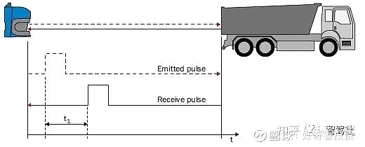

图 7：飞行时间测量的作用原理

#### *HDDM+测量法（统计评估）：*

升级型高分辨率距离测量 (HDDM+) 是一种统计式测量方法。。HDDM（+ 升级型高分辨率距离测量）是一种用于非接触式距离测量的高分辨率光飞行时间测量法，既可用于距离传感器，也可用于 2D 或 3D LiDAR 区域扫描传感器。该技术适用于室内与室外区域，用于测量距漫反射物体和逆向反射型反射器的距离。采用 HDDM+ 的距离传感器针对逆向反射型薄膜的扫描范围可达 1.5 km。不同于"单脉冲"(single pulse) 或相位相关等技术，HDDM+ 是一种统计式测量方法。也就是说，传感器以统计学方式分析多个激光脉冲的回波，以计算距离值。此外，还可凭借 HDDM+ 实现具有多重回波功能的传感器。如有多个回波，则可识别到相关有效回波并加以评估。借此，即使在恶劣环境条件下亦可实现高测量可靠性的距离测量。

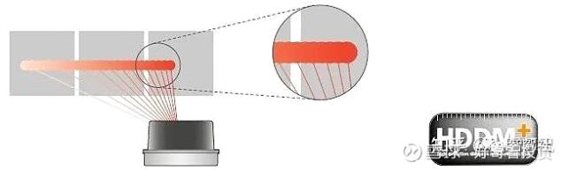

图 8：全方位检测扫描范围，以 SICK LiDAR 传感器 MRS1000 为例

#### *评估测量光束中的多个接收脉冲*

实际上不存在无限短的激光脉冲，光点也不能沿扩散方向无限聚焦（小），而传感器可以利用由此产生的物理效应来计算测量值。反射回波信号是比较常见的效应，可用于多重采样。如果激光光点大于被测物体，光点局部位于边缘上，则部分光脉冲将由第一个被测物体反射，同时另一部分将由其后方的表面（如有）反射。该效应可重复多次，进而实现后续测量。当前的目标是研发出一种能够将此类表面干扰效应投入应用的方法。传感器提供各个角度反射回波的距离和回波值。1D 传感器中的有效回波多达八个，而扫描型传感器中至多为五个。通过发射多个回波，LiDAR 传感器也可用于室外区域。由此能够可靠滤除可视范围内因雨、雪、灰尘和冰雹造成的干扰测量值。

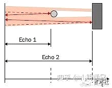

图 9：物体小于激光光束直径

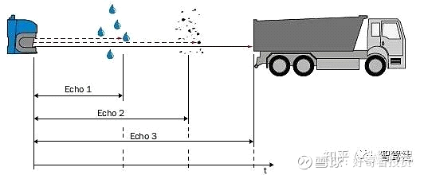

图 10：测量光束中的多重回波效应

LiDAR 传感器能够针对各个角度行程检测不同的距离测量值，如采用多重回波系统则可检测多个测量值。该测量值可传输，用于内部评估或外部数据输出。一旦在给定角度上检测到测量值，则通过脉冲飞行时间测量法确保物体位于该测量光束上。如果LiDAR 传感器安装在车辆上，则连续两次测量不一定涉及同一物体。在后续应用中必须进行评估，以确定测量值属于该应用或者应当滤除（例如因部分位于可视范围内而产生）。使用激光测量传感器时，用户可自由安装适合其应用的筛选器。此外，传感器通常具有可配置的附加筛选器。传感器数据扫描包含用于确定测量时间的时间戳，其可与外部数据源同步。

图 11：以 SICK LiDAR 传感器LMS5xx 多重回波分析为例

#### *1D、2D 或 3D 传感器采用的测量方法*

#### *线性测量传感器 (1D)*

Dx1000 等距离传感器沿被测物体方向进行一维线性扫描，以确定至自然目标（反射比高达 100%）或反射器的距离及距离变化。针对反射器测量时，扫描范围最高可达 1,500 m (DL1000)。借助线性测量传感器例如可按照精确间距定位大型起重机，进而完成抓取与卸载操作。根据具体应用优化测量周期时间，由此确保高度精确且可靠地采集远距离与快速距离变化。

#### *平面测量传感器 (2D)*

2D 传感器的研发目的在于保留出色的激光测量特点，同时沿用至平面测量传感器。为此通过偏转镜偏转激光光束，这一方法看似简单。在细节方面却面临挑战。多数扫描型传感器为同轴测量系统。其中，发射光束位于接收光束的中间。现可通过偏转镜转向。由此可保留激光测量所拥有的上述所有出色特点，例如大扫描范围以及针对深色物体的测量能力。

对于 LiDAR 传感器，激光脉冲的发射序列与电机旋转频率及所需角度分辨率同步。电机转速通常由激光源的最大发射频率和所需角度分辨率决定。旋转周期内产生的脉冲数量不得超过激光器布线的允许范围。

扫描型传感器在发射序列的角度精确性和角度分辨率以及高测量频率（电机转速）方面同样占据优势。

通过偏转镜偏转激光光束需要高机械精度。

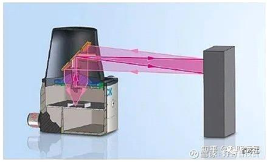

图 12：2D LiDAR 传感器的作用原理

图中为多边形发射器视图，多边形接收器侧的接收光线通过聚光镜引至侧方接收器。使用偏转镜转向时，每个多边形面均可进行扫描，故多边形构造可在低电机转速下确保高扫描率。因此，根据多边形面的数量和机械构造，可视范围限制不超过 100度，LMS4000 为 70 度。

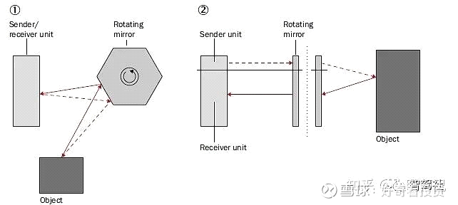

图 13：SICK LiDAR 传感器 LMS4000 构造，1 = 俯视图；2 = 侧视图

如上所述，扫描频率是 LiDAR 传感器的一大重要特点。通过使用多个发射器与接收器可提高采样率。SICK 的一款 LiDAR 传感器LMS1000 共有 4 个发射/接收模块，采用交叉布局（俯视）绕轴旋转。实际上设有四个激光传感器，彼此间以 90 度的相位距扫描同一平面。如果电机按照 50 Hz 旋转（一个整圈 20 ms），则扫描每个 90 度区域将用时20 ms的 ¼。四个模块覆盖一个整圈（即 360度），其中每个模块只需扫描 90 度。也就是说，360 度的可视范围将在 5 ms 内扫描完毕；换言之：传感器以 200 Hz 的采样率作业。

对于平面测量型 LiDAR 传感器，扫描面的角度分辨率是关键。其所含信息确定是否能够全方位扫描平面。为此，许多传感器根据具体应用提供合适的角度分辨率。例如，LMS511 可借助扫描频率改变角度分辨率。其激光光点尺寸大于传感器的角度分辨率，从而得以全方位检测扫描区域。不同扫描仪的有效扫描范围为 10 至 80 m 不等。即使反射光束特征要求高，例如反射比仅为 10%，这一点同样适用。

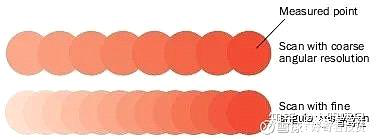

图 14：SICK LiDAR 传感器 LMS5xx 示例

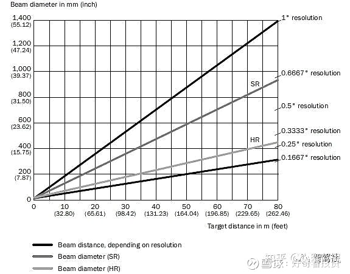

图 15：在 0 m 至 80 m 范围内，SICK LiDAR 传感器 LMS500 测量点之间的光束直径与间距

#### *空间测量传感器 (3D)*

基于所述的平面测量型 LiDAR 传感器原理，衍生出一个疑问：如何实现三维物体测量？

如欲利用 2D LiDAR 传感器的测量数据生成 3D 图像，除标准数据输出报文外，还需要传感器在用户坐标系中的机械安装位置。输出的扫描图像带有时间戳与编号，以便用户能够按照正确的时间和位置条理清晰地生成连续输出的扫描图像。由此亦可通过固定在机架或支柱上的传感器为移动物体生成 3D 图像。理论上，此时还需要物体自身移动的速度向量，以便同步采集扫描频率与各次物体扫描的实际距离。由此也可测量经过传感器下方的物体长度。例如可用于借助激光传感器提供具体车辆类别数据的收费系统，或是测量车辆尺寸或超宽物体的体积测量系统。

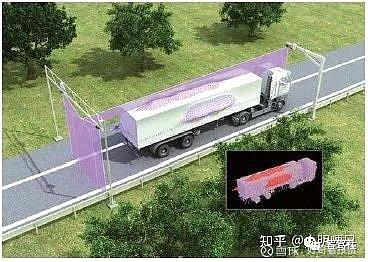

图 16：使用三台 2D LiDAR 传感器测量卡车轮廓

根据传感器测量数据提供的信息，各台 SICK 激光传感器也可自行"移动"。这一情况常见于摆动设备或利用线性轴创建物体"3D距离图像"。在此类应用中，物体通常保持静止。例如用于龙门吊的自动装卸装置或体积测量系统。由于设计坚固耐用，SICK 传感器不会受到摆动、加速或制动等移动过程的影响。

#### *多层扫描仪*

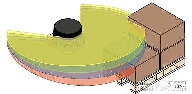

图 17：拥有 4 个扫描面的 LiDAR 传感器

3D LiDAR 传感器的产品系列增添诸多特点。通过多个发射器与接收器或二合一设计，可形成同时或偏角扫描多个层面的传感器。这意味着，除水平方向的 2D 层面（即传感器水平放置时的 0° 层）外，LD-MRS 或 MRS1000 及 MRS6000 产品系列的传感器还能扫描上倾或下倾的层面。

#### *3D LiDAR 传感器 MRS1000*

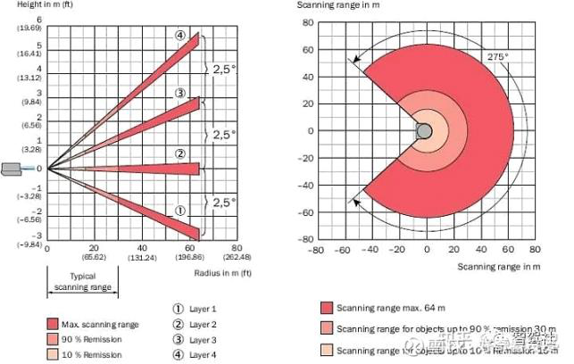

图 18：SICK LiDAR 传感器MRS1000 例图

用户显著获益。通过旋转产生更多测量点。为此需要采集距离、水平面角度、三维空间的各平面角度等信息。根据这三项空间坐标，可确定测量点 X、Y、Z 在原始坐标系中的位置。这一测量值在很大程度上显示出 SICK AG 传感器（包括 1D 或 2D 传感器）惯有的相同可用性。例如，MRS1000 拥有四个层面，分别倾斜 2.5°。相较于 2D 传感器，相同时间内可扫描更多测量点。此外，多层机械构造还有助于提高采样速度。

多层系统提供各种不同的结构型式。MRS1000 的内部发射与接收模块构成层面倾斜。因此，每个模块均可旋转 90° 扫描一个区域。如此一来，只需整圈用时的四分之一即可检测具有多个层面的物体。

3D 传感器及利用偏转镜偏转发射/接收路径"视角"的测量原理保留激光测量的优势。如果以不同角度定向模块，除扫描方向的距离和角度外，测量物体时还会确定物体平面角度，即 x、y 与 z 空间坐标。如需针对各个平面进行测量，亦可保留高灵敏度和大扫描范围的优势。

图 19：SICK LiDAR 传感器 MRS1000 构造

距离约 16 m 时，MRS1000 的横向覆盖范围可达 2 m 左右。斜面呈锥状。

若传感器安装在穿行通道的无人驾驶车辆（例如 AGV 或 AGC）上，则可在经过时扫描物体表面。通过倾斜传感器可改变扫描范围。五米以内的近距离层面倾斜会形成宽约 0.5 m 的扫描范围。由此实现近距离快速反应，即使是小型物体亦可逐层扫描。通过偏置90 度的发射/接收模块布局，扫描速度较之单个模块的旋转频率快四倍。

#### *3D LiDAR 传感器 MRS6000*

在 MRS6000 中，可利用多面镜效应迭置多个发射器。这是令一台扫描仪产生多个测量面的另一方法。每个多面镜用于倾斜含 6条光束的发射套组，因此多边形转满一圈便可通过 4 个多边形面获得 24 个层面。MRS6000 实现覆盖整个水平孔径角的全方位扫描。其具备 120 度的水平孔径角与 15 度的垂直孔径角。

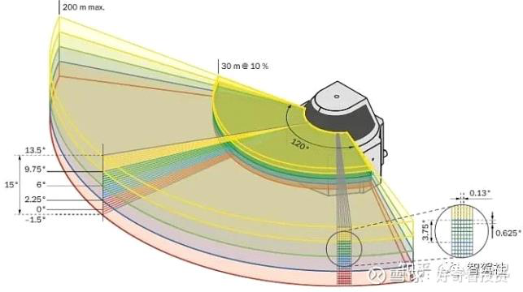

图 20：作用原理 3D 示图

#### *3D LiDAR 传感器 LD-MRS*

多层扫描仪 LD-MRS 凭借 4 至 8 个扫描面覆盖高达 100 m 的大扫描范围，而 MRS1000 在 AGV 中的扫描范围最多可达 30 m。

LD-MRS 系列传感器使用两个高级激光二极管作为发射元件。此外，接收信号可分别分给 2 个接收元件。因此，LD-MRS 传感器具有四个层面。它的机械构造与 MRS6000 多边形扫描仪类似，但其多边形由双面构成，即偏转镜正面与背面。

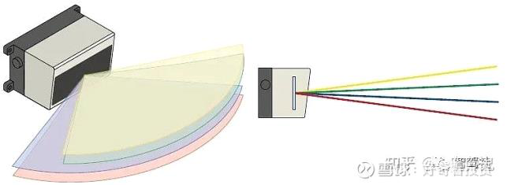

\-\--转

星期一, 十二月 5, 2022

9:22 上午
