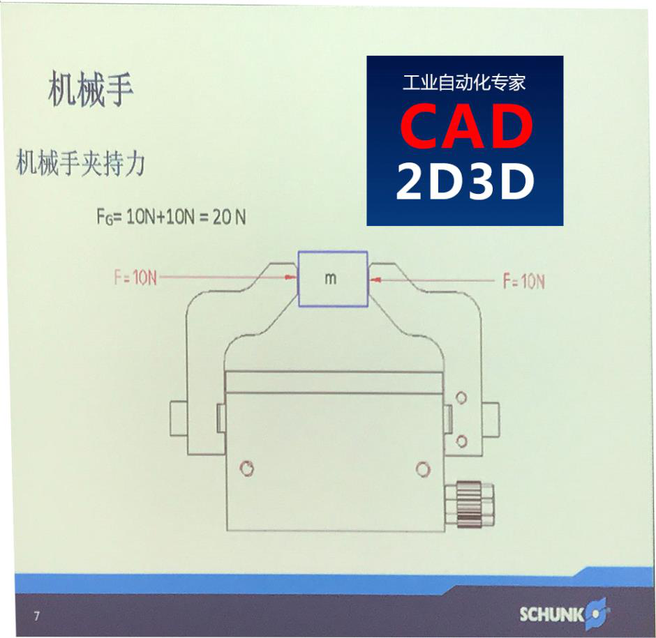
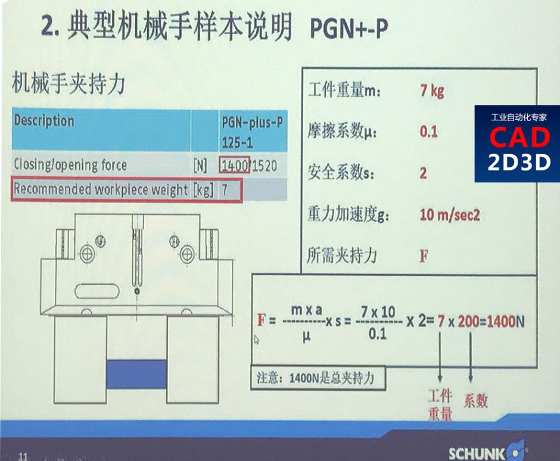
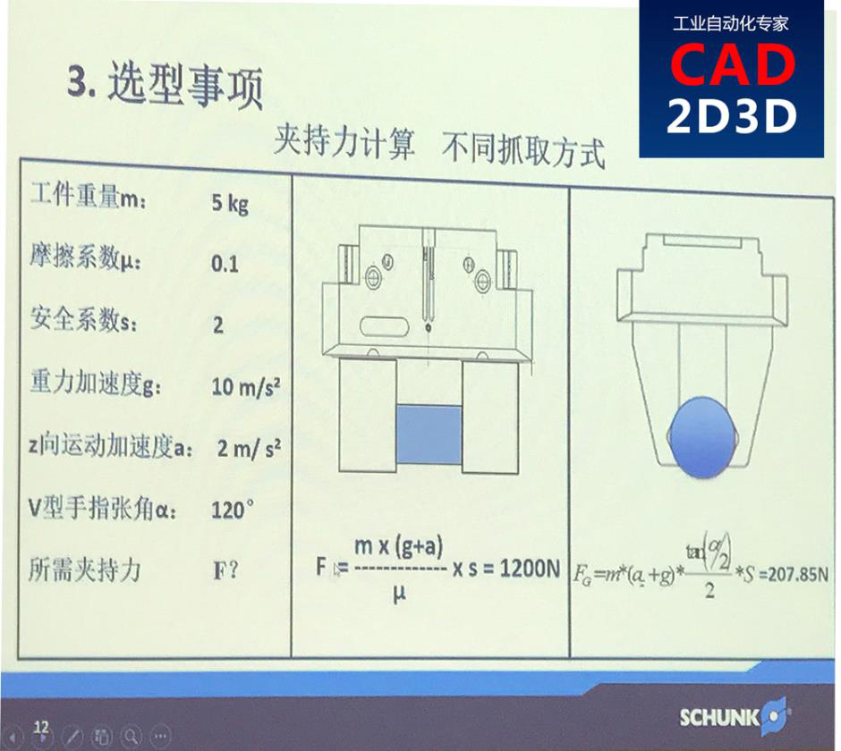
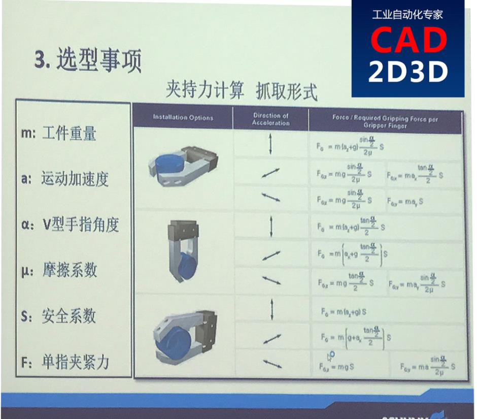
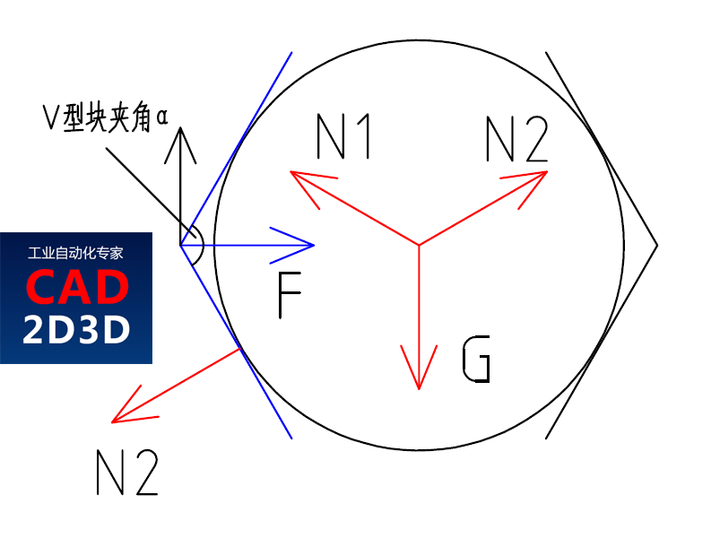
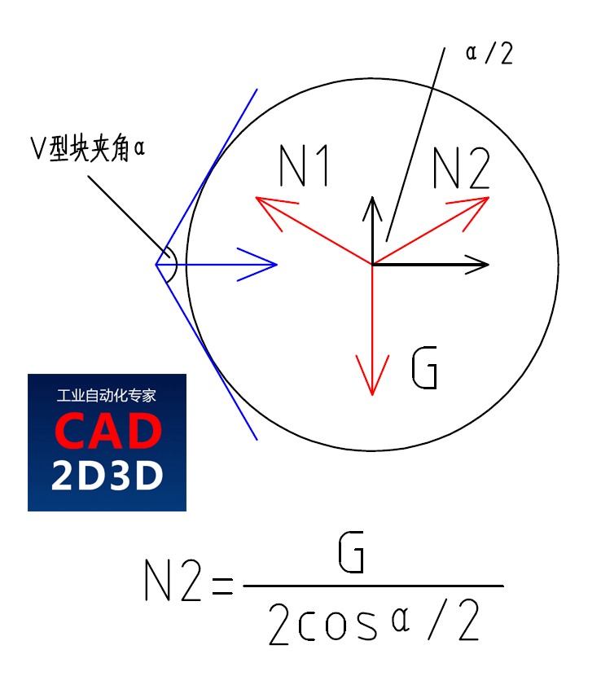
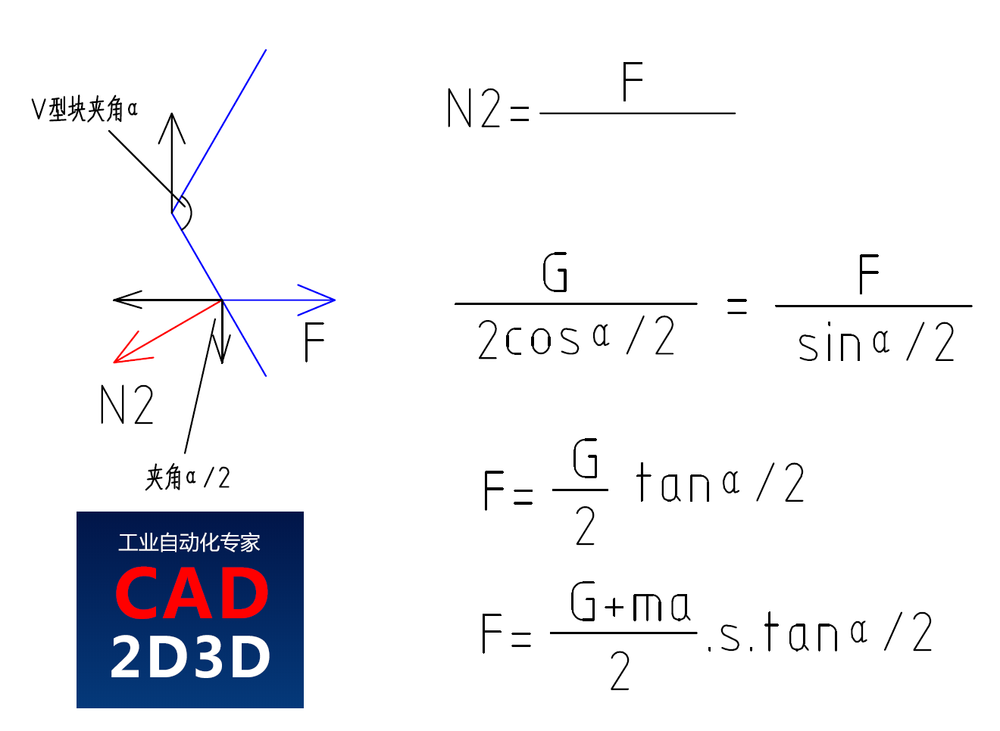

雄克手爪选型方法和步骤，手爪夹持力计算公式 - CAD2D3D.com

星期一, 十二月 5, 2022

9:30 上午

已剪辑自: [https://www.cad2d3d.com/post-1573.html]{.underline}

手爪选型跟工件重量、重心、使用环境等因素有关，不同品牌的手爪选型方法略有区别，雄克手爪的夹持力是所有手爪夹持力的总和，比如下图所示的手爪夹持力是20N，但作用在工件上的力是10N（2个爪）。

V型手指受力（手指竖直，上下运动）推算过程：

所需夹持力F=m×(a+g)×tan(α/2)×s/2

[]{.underline}[]{.underline}
