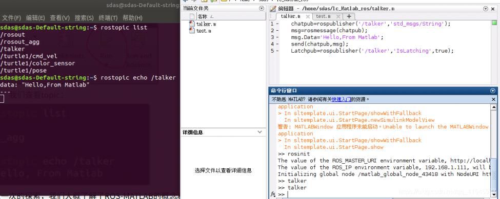

ros与matlab联动使用（重要-紧急）

星期四, 十二月 15, 2022

12:35 下午

 

已剪辑自: [https://blog.csdn.net/qq\_41545537/article/details/109235983]{.underline}

联动使用教程
============

[ROS与Matlab语言入门教程-目标跟踪]{.underline}

1 ubuntu18.04或16.04下安装matlab R2017b
=======================================

参考[链接]{.underline}

**matlab中常用命令如下：**\
**查看robotics system toolbox工具箱是否安装成功**

help robotics.ros

-   1

rosinit ------表示启动ROS，相当于roscore\
rosshutdown ------表示关闭ROS\
1）列出topic列表

rostopic list

-   1

2）查看topic 信息

rostopic info /torso\_lift\_imu/data

-   1

3）打印topic 信息

rostopic echo /torso\_lift\_imu/data

-   1

交互式运行案例

3 matlab与ubuntu联动后，roscore启动失败问题
===========================================

1） roscore启动失败问题
-----------------------

解决方案：\
通过查阅[资料]{.underline}，发现以下方式可解决\
ifconfig 查看ip地址\
sudo gedit \~/.bashrc打开后填入以下内容\
export ROS\_IP=192.168.1.109\
之所以失败原因就在于此，重启电脑后，ip地址变了，此处思考一个固定ip的方法应该就省事了

source \~/.bashrc

-   1

2）某一文件夹下的roslaunch启动失败问题
--------------------------------------

该文件夹前输入如下命令再重新启动就可以了

export ROS\_MASTER\_URI=http://192.168.1.109:11311/

-   1

3）针对1）与2）问题的一次性搞定方案
-----------------------------------

gedit \~/.bashrc\
修改一下两个指令：修改后Save

export ROS\_HOSTNAME=localhost\
export ROS\_MASTER\_URI=http://localhost:11311\
接下来，我们在运行roscore就可以啦\
思路来源参考 [资料]{.underline}
