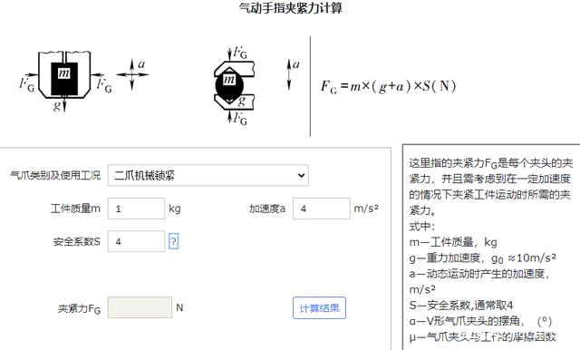
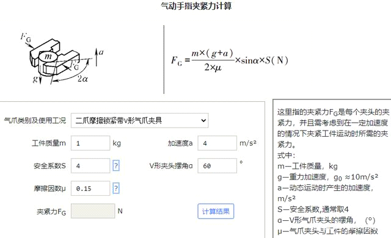
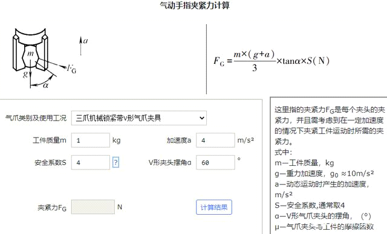

# 机械设计工具分享和介绍之_气动手指夹紧力计算

机械设计工具分享和介绍之-气动手指夹紧力计算

星期一, 十二月 5, 2022

9:31 上午

 

已剪辑自: [https://baijiahao.baidu.com/s?id=1693174355201542983&wfr=spider&for=pc]{.underline}

各位好，今天介绍一个气压传动设计方面的小工具-气动手指夹紧力计算。

1．功能简介

程序中的参数和设计方法参照行业标准。设计界面简洁，操作方便。电脑端和移动端都能直接使用此工具。程序目前支持二爪和三爪气动手指夹紧力计算，夹紧形式包括机械锁紧、机械锁紧带V形气爪夹、摩擦锁紧、摩擦锁紧带V形气爪夹具。

2．设计方法

要确保气动手指有足够的夹紧力，以免影响夹持效果。 但是反过来说， 夹紧力过大也容易损伤产品。 这里指的夹紧力是每个夹头的夹紧力，并且需考虑到在一定加速度的情况下夹紧工件运动时所需的夹紧力。计算出气爪夹紧力后可进一步对气动制造商提供的气爪进行核对或选型。

3．界面构成

气动手指夹紧力计算程序的主界面如下图所示。

 

气动手指夹紧力计算-二爪机械锁紧

 

气动手指夹紧力计算-二爪摩擦锁紧带V形

 

气动手指夹紧力计算-三爪机械锁紧带V形

程序界面左侧为计算程序，右侧为相关公式数据或设计方法、使用说明。

网页左侧导航栏 查询资料-\>气动手指夹紧力计算 提供了所需相关数据的查询和设计方法及说明资料等。

百度搜\'mechtool\'进入网站首页点击右侧导航栏\'气压传动系统计算\'-\>'气动手指夹紧力计算'-\>即可直接使用此工具。

大家在使用工具中有任何疑问或建议，欢迎在评论区留言探讨。稍后还有更多工具分享，谢谢关注。

举报/反馈
