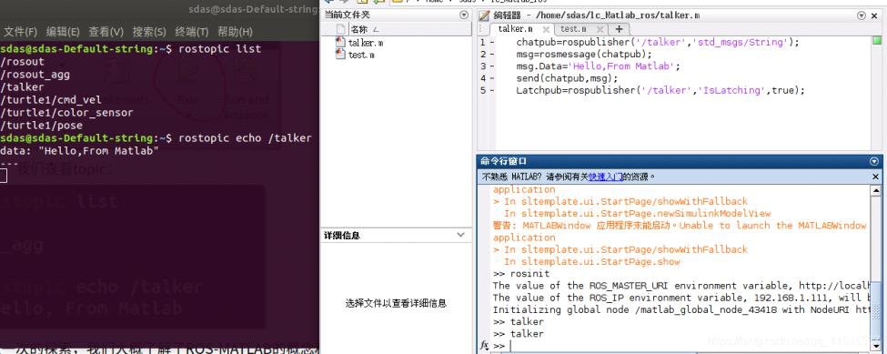

# 1_ubuntu18_04或16_04下安装matlab_r2017b
=======================================

参考[链接]{.underline}

**matlab中常用命令如下：**\
**查看robotics system toolbox工具箱是否安装成功**

help robotics.ros

-   1

rosinit ------表示启动ROS，相当于roscore\
rosshutdown ------表示关闭ROS\
1）列出topic列表

rostopic list

-   1

2）查看topic 信息

rostopic info /torso\_lift\_imu/data

-   1

3）打印topic 信息

rostopic echo /torso\_lift\_imu/data

-   1

交互式运行案例

 
