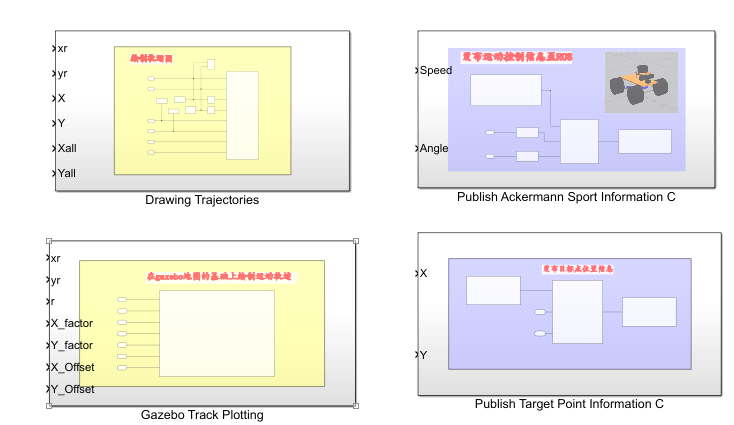
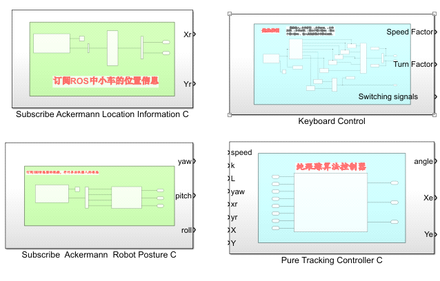
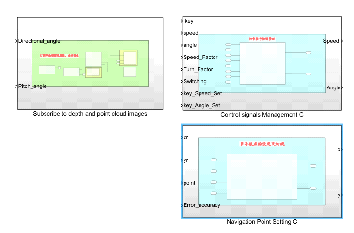
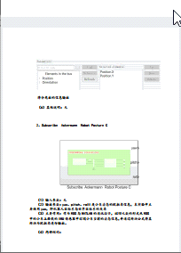

# matlab与ros联合仿真探索总结_matlab_ros重要_紧急

MATLAB与ROS联合仿真探索总结-matlab ros（重要-紧急）

星期四, 十二月 15, 2022

12:33 下午

已剪辑自: [https://blog.csdn.net/qq\_44339029/article/details/121546941]{.underline}

   2021年的9月底收到老师的委托之后，开始着手使用MATLAB探索开发一些实验，控制对象为ROS中的仿真小车

   为什么要用MATLAB呢？因为这个实验是面向机器人专业的全体学生的，而不是个别学生，这就意味着如果直接使用ROS开发，那么部分没有接触过ROS，零基础的同学可能会感到比较吃力，而如果仅仅是把程序给他们，让他们运行一下，看看效果，估计收获甚微，为了让全体同学都自己动手去完成实验内容，选择了大家比较熟悉的MALTAB作为开发工具，依托SImulink中的ROS工具箱与ROS建立联系，并在此基础上探索开发一些实验去控制ROS中的小车

   在明白了大体的任务后，就开始构思如何实现了，说实话，刚接到任务后，确实感觉无从下手，先说一下我的ROS基础，2020年的10月份，我学习了古月居的ROS入门21讲，利用课余时间大约学了一个月左右，这就是当时我所有的ROS基础，是不是少的可怜？\
   对了，我还有对ROS机器人的无限热爱， 因为热爱，所以无所畏惧。 我大体整理了一下思路，我将整个实现过程规划为以下几个阶段

   第一阶段：建立MATALB与ROS的通讯\
   第二阶段：在虚拟机的Gazebo中进行小车仿真的可行性验证\
   第三阶段： 探索建立Simulink与Gazebo中仿真小车的通讯\
   第四阶段： 探索在Simulink中设计实验来控制Gazebo中小车\
   第五阶段： 将在Simulink中设计的实验生成ROS代码\
   第六阶段： 推广测试阶段\
   第七阶段： 探索对实物进行控制

   2021年10月1日，我正式开始了第一阶段的探索\
   首先，便是ROS的安装，综合考虑之下，决定采用虚拟机安装的方式，VMware16.1.1+Ubuntu20.04+ROS Noetic，我2020年10月份学习的时候装过，也踩过了很多的坑，整理成了博客，链接如下：

   [详细介绍如何在ubuntu20.04中安装ROS系统，以及安装过程中出现的常见错误的解决方法，填坑！！！【点击可跳转】]{.underline}

   今年，我又将其安装步骤进行了优化处理，整个VMware16.1.1 +Ubuntu20.04+ROS Noetic的安装过程压缩到了三个小时以内，同样编写了博客，链接如下：

   [详细介绍如何在ubuntu20.04中安装ROS系统，超快完成安装（最新版教程）【点击可跳转】]{.underline}

   刚开始的时候，是想采用Ubuntu下的MATLAB与ROS进行联合仿真的，耗时三天，在踩过一个个坑之后终于在Ubuntu中装好了MATLAB2021a，于次日借助小海龟，实现和验证了MATLAB与ROS的通讯，相关博客链接如下：

   [虚拟机中的Ubuntu扩容及重新分区方法【点击可跳转】]{.underline}

   [在ubuntu20.04中安装MATLAB时常见问题及解决方法 【点击可跳转】]{.underline}

   [详细介绍如何在Ubuntu中实现MATLAB与ROS的通讯，借助MATALB进行ROS开发【点击可跳转】]{.underline}

   此时考虑到，部分同学电脑硬件也许很难支持在虚拟机中同时运行MATLAB/Simulink+Gazebo+Rviz，尤其是进行Slam建图及导航相关的实验\
   不得不暂时放弃该方案，转而采用Win10下的MATLAB与虚拟机Ubuntu20.04中的ROS联合仿真的方案，并成功实现通讯，相关的博客链接如下：

   [实现Win10环境下的MATLAB与虚拟机Ubuntu中的ROS的通讯的方法 【点击可跳转】]{.underline}

   2021年10月7日，我开始了第二阶段的探索

   这一阶段，本来的设想是快速验证一下在虚拟机的Gazebo中进行小车仿真的可行性，于是购买了古月学院的《如何在Gazebo中实现阿克曼转向车的仿真》课程，拿到了课程资料，但是遗憾的是课程资料在Noetic版本的ROS中并不能运行，报了一堆的错误，网上查了一下，并没有解决\
   于是，我开始了自学之路，经过一段时间的学习和探索，课程资料的代码差不多读了各遍，走过一个个Error，成功纠正了所有发现的错误（这些错误其实是由于ROS和Python等版本的更新带来的），同时也不断搭建着实验所需的实验环境，比如相关必备的ROS功能包等，相关博客链接如下：

   对了，这里还有一个坑，在我进行了一天的探索后，成功在Ubuntu20.04中装好了RoboWare Studio，却一直都打不开，后来才知道Ubuntu20.04不支持RoboWare Studio（停止维护了），确实很遗憾，无奈转而使用Visual Studio Code 作为IDE

   2021年10月26日，我开始了第三阶段的探索

   其实本来很多工作是计划在第三阶段完成的，却被迫在第二阶段完成了，比如由于第二阶段把整个程序差不多读了一遍（有些地方读了很多遍），可以说对程序很熟悉了，很容易就找到了程序中用于阿克曼小车的接口，也就是车的线速度和前轮打角，再加上第一阶段的通讯基础，很快就建立了MATLAB与ROS中的仿真小车的通讯，并成功将MATLAB/Simulink作为控制器，Gazebo中的仿真小车作为控制对象，进行了简单的走直线和画圈测试

   2021年10月28日，我开始了第四阶段的探索

   经过前三个阶段，实验所需求的实验环境就搭建好了，在差不多一个月的时间里，我的理论基础和ROS开发能力有了很大的进步，当然这些进步是建立在独立解决一个个Error之上的\
   到这里，也就要正式开始实验相关内容的开发了，说到MATLAB与ROS的联合仿真，在网上很难找到想要的资料，可以说基本没有（或者说我没找到），更不用说适合ROS零基础的本科生的实验了，还是那句话 因为热爱，所以无所畏惧。 于是我开始了一边构思实验内容，一边探索的自研之路

   为了让同学们自己动手去实现实验内容，这部分的内容，我并没有写成博客在网上进行公布，但是在这部分的整个开发过程，我花费大量的时间写成了非常非常详细的文档资料，包括开发过程中的常见错误及解决方法等，后续有机会可能已博客形式发布出来，但是应该是在很长一段时间之后了

   历经一个月的设计和开发，也经过了多次测试和修改，最终我设计编写了以下Simulink模块，并将其模块化，具备很强的复用性和可移植性，推广使用也很方便\
   （白色背景的是给定类模块，淡黄色背景的是可视化绘图类模块，紫色背景的是发送消息至ROS类模块，绿色背景的是从ROS订阅消息类模块，淡蓝色背景的是控制类模块）

 

 

 

 

 

   这些模块的详细介绍，使用方法及详细的搭建设计过程我都写成了详细的文档资料，因实验需要暂时不适合在网上公布

 

   相关的博客链接如下（大部分内容目前未发布）：

   [使用MATLAB绘制Gazebo中的仿真小车的运动轨迹【点击可跳转】]{.underline}\
   [在Simunlink中使用Read image模块或Read Point Could模块读取ROS中图像时显示全黑的解决方法【点击可跳转】]{.underline}

   这一阶段所完成的主要内容，如下面的视频所示：

MATLAB与ROS联合仿真探索总结

   2021年11月25日，我开始了第五阶段的探索

   成功将实验内容中，不涉及绘图及视频播放的部分由Simulink生成了ROS代码，并成功在ROS中独立运行

   2021年12月份，我将开始第六阶段的探索

   目前实验内容的初稿已经完成了，但是还没在其他电脑上验证过，这一阶段，需要找多台电脑，进行可行性测试，并解决在推广中可能出现的问题，以使其具备广泛的可推广性

   至于第七阶段，对实物的探索将于2022年1月开始

   车已拿到了，这绝对是我买过的最贵的小车了（7K），暂时实在无暇研究，只得暂时抑制兴奋之感

   最后说一下探索开发的感受吧

   一路走来，踩过一个个坑，解决了一个个Error

   经历过痛苦和折磨，但确实收获良多

   最惨的一次，被一个Error，折磨了三天三夜

   可参考的资料真的真的少得可怜

   大部分内容得靠自已钻研

  \
   所谓热爱和喜欢，也许就是

   在困境面前，会毫不犹豫选择勇往直前

   即使充满无力感，也不会萌生放弃的念头

   道阻且长，行则将至

   因为热爱，所以无所畏惧\
  

   同时也祝愿小伙伴们，所愿皆所得

   学习/科研/工作

   硕果累累，顺顺利利666
�666
