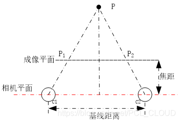
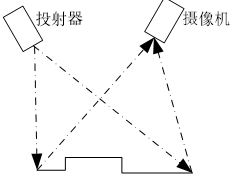

# rgb_d相机原理与选型

RGB-D相机原理与选型

星期一, 十二月 5, 2022

9:25 上午

 

已剪辑自: [https://www.ngui.cc/el/1310128.html?action=onClick]{.underline}

一、RGB双目
-----------

 

1.1 成像原理：由三角法原理进行三维信息的获取，即由两个摄像机的图像平面和被测物体之间构成一个三角形。根据相机的基线距离、焦距、图中几何关系、坐标系转换即可求得目标体的三维信息。\
1.2 分辨精度：0.01mm-1cm\
1.3 优点：成本低、功耗低，价格便宜，在千元级别\
1.4 缺点：对光照敏感，处理速度慢\
1.5 品牌：Stereolabs-ZED; Point Grey-BumbleBee;

二、结构光
----------

 

1.1成像原理：基于光学三角测量原理，光学投射器将一定模式的结构光（点结构、线结构、面结构）透射于物体表面，在表面上形成由被测物体表面形状所调制的光条三维图像。当光学投射器与摄像机之间的相对位置一定时，由畸变的二维光条图像坐标便可重现物体表面三维形状轮廓。\
1.2 测量范围:0.1m-10m\
1.3分辨精度：0.01mm-1mm\
1.4 优点：选择性大，根据分辨精度的不同价格从千元到几十万不等\
1.5 缺点：易受光滑平面反光影响\
1.6品牌：intel-real sense; Microsoft-Kinect v1; Orbbec-Astra; ASUS- Xtion

三、飞行时间TOF（Time of Flight）
---------------------------------

1.1成像原理：通过连续发射光脉冲到被观测物体上，然后用传感器接收从物体返回的光，通过探测光脉冲的飞行时间来得到目标物距离。\
1.2测量范围:0.1m-100m\
1.3分辨精度：1cm\
1.4 优点：TOF深度相机抗干扰能力较强，测量精度不会随着测量距离的增大而降低，适合测量距离要求比较远的场合。\
1.5 缺点：分辨率低，很难达到毫米级的精度，价格昂贵。\
1.6品牌：Microsoft-Kinect v2; Intel-SoftKinect DepthSense; Google Project Tango-PMD Tech
