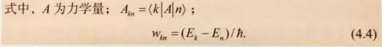
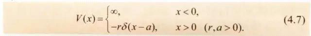

数学符号与数学公式的规范表达

星期六, 十二月 2, 2023

8:42 下午

 

已剪辑自: [https://mp.weixin.qq.com/s?\_\_biz=MzI0NzE5NDI2MA==&mid=2652217408&idx=3&sn=344c72b117979ceb2add4dcfada966f6&chksm=f252b7bbc5253ead70c6e6d2a81c9b54fa3ef9b9c574fb23058604f9af1188f97c265a18f3e7&scene=27]{.underline}

**   PDF版原文------    **

**（点图可放大，可按住图片滑动阅读▼）**

 

数学符号同其他科技符号一样，是从特定的任务出发，人为创造出来表达完整数学概念的符号。数学符号十分繁杂，既有大量的未知量和变量符号，又有许多关系符号、运算符号、说明性符号。因此，数学符号的使用，要求做到规范、简明，准确表达复杂的数学内容。

 

 

 

 

经国家权威机构制定颁布的符号称为规定符号。规定符号具有相对稳定性和严格约束性，要求在出版物中遵照使用。1993年颁布的国家标准GB3102.11---1993（物理科学和技术中使用的数学符号）对几何符号、集合论符号、数理逻辑符号、杂类符号、运算符号、函数符号、指数函数和对数函数符号、三角函数和双曲函数符号、复数符号、矩阵符号、坐标系符号、矢量和张量符号、特殊函数符号等数学符号做了明确规定。作者撰稿和编辑加工时，均应遵照此规定，正确使用数学符号。

 

 

未经正式颁布，而在一本书中根据需要选定并被赋予特定意义，约定使用的符号称为约定符号。使用约定符号时，要注意保持符号的单义性（即在同一本书中一个符号只代表一个概念），并在约定符号第一次出现时对其特定意义进行说明。

 

 

数学符号的使用要规范，即在出版物中应尽量使用国标固定的符号；暂时没有规定的，可使用国际通用符号；国际通用符号也没有时，则须约定新的符号。

 

新的约定符号可根据数学概念的性质、形体设定。其方法是：对于未知量和变量，可用外文字符（尽可能用相应的数学术语的首字母）表示；对于有形体的概念，可用与形体相似的符号表示；对于无具体形象的事物，可采用象征性符号表示。

 

 

 

数学中的各种符除了大、小写的区别外，还有白正、白斜体，黑正、黑斜体的区别。按GB3102.11---1993（物理科学和技术中使用的数学符号）的要求和约定俗成原则，未知量符号，表示变量的字母，变量符号以及表示点、线段及弧的符号用白斜体；矢量、张量和矩阵符号用黑斜体；特殊集合符号用黑正体；其他符号和数字码等用白正体。

 

**白正体**如：cm（厘米）、kg（千克）、三角函数（sin,cos,tan）等。

 

**白斜体**如：*x,y,z*（坐标）、*o*（原点）、*Φ*（直径符号）、*R*（半径符号）等。

 

**黑正体**如：**N**（非负整数集或自然数集）、**Q**（有理数集）、**Z**（整数集）、**R**（实数集）、**C**（复数集）等。

 

**黑斜体**如：***a***（矢量）、***e***（单位矢量）、***T***（张量）等。

 

 

数学公式是用量符号、数学符号和数字等组合起来表达科学内容的式子。数学公式包括关系式、算式、方程等，各自有自己的结构和编排格式。它们形式繁多，层次重叠，所用字母符号庞杂，因此公式的编排必须做到准确、简明和规范。

 

 

**1.公式在正文中的书写和排版方式**

 

对于形式简单的一般叙述性公式可以直接串排于正文的文字行中，这种排版方式称为串文排；对于重要的、正文中要引用而须加序号的公式以及比较复杂的公式，一律单独占行，排于每行中间，这种排版方式称为另行居中排（简称居中排）。例如：

 

 

 

其中第一行中的公式为串文排公式，式（4.1）为另行居中排公式。

 

**2.公式的标点符号**

 

 

无论是串文排公式还是另行居中排公式，均应视为正文行文的一部分，因而公式末宜加标点符号，所加标点符号与公式的主体对齐。公式中常用的标点符号有圆括号"（）"、方括号"\[  \]"、花括号"{  }"、逗号"，"、分号"；"、三点省略号"..."和句点"."或句号"。"等。科技书中多用句点而少用句号。例如：

 

 

 

三种括号多重使用时，一般是圆括号外套方括号，外再套花括号。如果一个公式须同时使用三重以上括号时，则第四重以后的括号可以循环重复使用字号稍大的前三种括号，即

{\[({ \[(  )\] })\]}.

 

数学公式中的省略均用三点省略号，并根据情况在其前后加逗号或运算符号。例如：

 

 

 

矩阵中行内的省略一般用横排的三点省略号，列内的省略一般用竖排的三点省略号。例如：

 

 

居中排公式前面的标点符号的使用和公式后面的标点符号的使用，都应遵守标点符号的使用规则。公式前面，如上行末文字是"令""为""有""得"等字时，其后不加任何标点符号。公式后面，根据公式在文中的语句位置使用标点符号。

 

 

 

**有时为了省略起见，居中排公式后面也可以不用标点符号，但须全书统一。**

 

**3.公式中符号的说明**

 

公式中各符号的意义一般在公式后进行说明（也有在公式前设定各符号意义的）。说明文字要求准确、简洁。公式与说明文字之间用"式中"或"其中"连接。

 

 

串文排公式的符号说明紧接公式排，若说明文字插入时断开了表述语句，则可用括号将说明文字括起来。例如：

 

 

 

 

居中排公式的符号说明排在另行顶格排的"式中"或"其后"之后，其排版格式有两种：

 

一种是接排式，即符号与说明文字之间用"为""表示"连接，各项接排，各项间用分号隔开。例如：

 

 

 

这种接排式排法具有版面紧凑的优点，多为科技图书采用。

 

另一种是分列式，即将各项分开另行排，符号与说明文字之间用破折号"------"或等号"="连接，各项间用分号隔开。例如，式（4.2）的符号说明可排为：\
 

 

 

 

分列式排法中破折号"------"和等号"="要上下对齐，说明文字转行时，转行的第一个字与上行说明文字的第一个字对齐。

 

用公式表示的符号说明的排法。科技书中公式符号说明常有用公式表示的。如果这种说明性的公式比较简单，则可在"式中"之后按接排式的版式排。例如：

 

 

如果说明性公式较复杂，或者式子虽简单但后文要引用而须排公式序号，则可将其另行居中排。例如，式（4.3）的符号说明可排为：

 

 

 

如果还须对式（4.4）中的*Ek*和*En*进行说明，则将此时的公式与说明文字之间的连词改用"其中"或"这里"，以便与上面的"式中"相区别，而不致引起关系混淆。

 

**4.公式的序号**

 

书刊中重要的和正文中要引用的公式需加排序号，以便引证和检索。公式序号采用阿拉伯数码，并用圆括号括起，放在公式右边行末版口（版心右沿，下同）处，公式和序号之间不加点线连接。

 

 

科技图书中的公式序号一般按章连续编号，章号与序号之间用下圆点"."或连接号"-"隔开，如第一章第一个需要加的公式序号为（1.1）或（1-1）。对于篇幅大而公式多的图书，也可按章分节连续编号，章号、节号、序号之间用下圆点"."或连接号"-"隔开，如（1.1.1）或（1-1-1）；也可在章号与节号之间用连接号"-"，而节号与序号之间用下圆点"."，如（1-1.1）。对于篇幅小且公式少的图书（含论文集），可全书（论文集按各篇论文）连续编号，如（1）。附录中的公式序号一般在前冠以Appendix（附录）的首字母A，如（A.1）或（A-1）。\
 

 

一本图书的公式序号形式只能选择一种，并与图的序号和表的序号形式对应一致，如公式序号用"（1.1）"，图和表的序号也相应采用"图1.1"和"表1.1"。

 

 

几个并列公式用一个序号时，一行能排下的，则排一行，序号排在行末版口处；一行排不下的，则各式另行排，用一个前花括号在并列公式右边把这几个公式括起来，序号放在括号中间位置的右版口处。例如：

 

 

和\
 

 

 

对于本身就有花括号的公式，序号放在右版口并对准前面花括号的尖角，例如：

 

 

 

使用一个序号的方程组，如在一个版面中无法排完整个公式时，可将方程组分开排在两个版面上，具体版式为：

 

上一版面末排

 

下一版面首排\
 

 

 

数学符号与量符号除了字体不同外，还须在字距上隔开一些予以区别。公式中各种数学符号（如＋、－、× 、÷、=、＜、＞以及sin、arcsin、sinh、lim、log、exp、max等）与其前后的量符号和数码字之间，都要空三开或四开。例如：

 

 

和

 

 

 

数学式排版时，要注意将式中的主体对齐；分清式中的主、辅线，主线对齐；式中的各单元不要交叉。

 

1.主体对齐。无论式中的符号有否为上、下角，无论式子是直排还是横排，凡属公式的主体都必须前后对齐，排在同一水平线上，不能偏高或偏低。例如：

 

 

 

又如：

 

 

 

不能排为

 

 

 

即→、∑和...必须与* jr* 和两个分式的分数线排在同一水平线上。

 

2.主线对齐。在分式中往往有主、辅线之分。其中，主线要比辅线长，并要与数学符号在同一水平线上（即主线与数学符号对齐）。例如：

 

 

 

不能写为

 

 

 

根号线的长短要和被开方的数对应，例如：

 

 

 

平均值的平均线符号位置要正确，例如：

 

 

 

3.各单元不能交叉。公式中的求和号、求积号、积分号等，无论它们上、下限的符号有多少，均应与左右两侧的其他单元的符号隔开，而不能左右交叉混排在一起。例如：

 

 

 

不能排为

 

 

 

 

 

方程组和有若干相关关系的公式，如其中各式形式相同（含方程组）时，则采用上下等号对齐的排法。例如：\
 

 

 

 

如各相关公式形式不同时，则采用左边对齐的排法，以表示各式有相关关系。例如：

 

 

 

 

 

排行列式和矩阵时，要注意元素的行列间隔及其上下左右对齐。行距一般空对开（字符的一半高），空距要均匀一致；列距一般空全身（字符宽度），要使各列关系清楚。

 

1.行列式的排法。行列式的符号是"丨丨"，排版时要将行距空开。例如：

 

 

 

如果元素中有用多项式表示的元素，则必须将列元素上下主体居中对齐。例如：

 

 

 

不能排为

 

 

 

如果非数字元素前有正负号，则须以正负号对齐，对于以数字为元素的行列式，则应以其个位对齐。例如：

 

 

 

2.矩阵的排法。矩阵的排法与行列式的排法基本相同，只是矩阵的符号一般为"（）""\[  \]"（两种都可使用，但全书统一使用一种）。例如：

 

 

注意，矩阵\
 

 

 

可以排为

 

 

 

但不能排为

 

 

 

如果行列式或矩阵太长、太复杂，排不下时，可排小号字，或横过来排一面，或通过双单面组成的和合版来解决。

 

 

**编辑  by  SHMILY **

**本文摘自《科学出版社作者编辑手册》**
