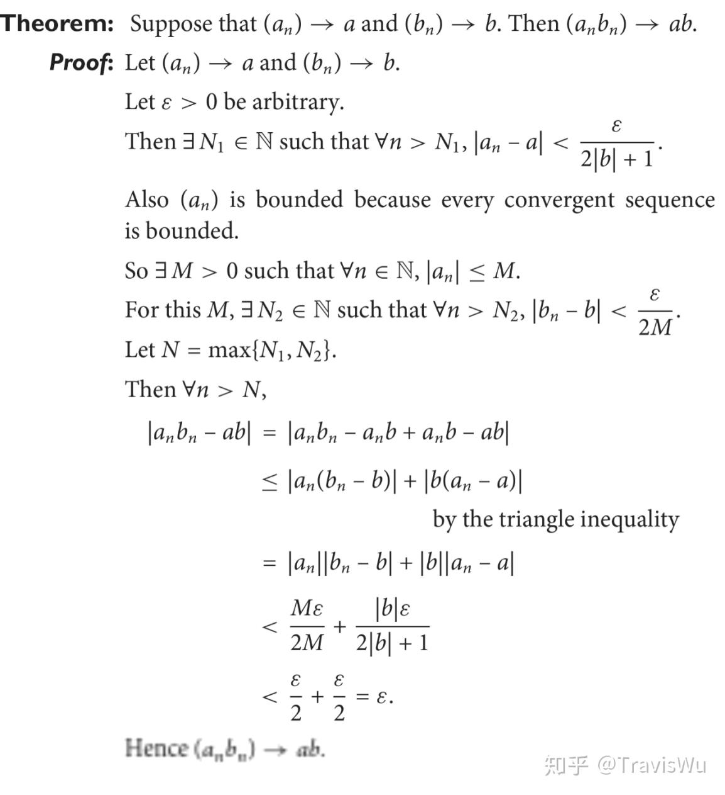

# 国际数学数学基本符号介绍

【国际数学】数学基本符号介绍 - 知乎

星期六, 十二月 2, 2023

8:43 下午

 

> 已剪辑自: [https://zhuanlan.zhihu.com/p/254963486?utm\_id=0]{.underline}
>
> 无论是在数学教科书上还是在课堂上，总是存在一些奇怪的字符，既非数字又非英文字母，它们似乎纯为增加理解难度而设。本文旨在向非理工专业的人或数学新手介绍这些"阴间"数学符号，降低理解难度。

1.  **表示量的符号**

> 数学或物理中经常用希腊字母表示一些常量，单位，变量或虚拟变量。下面是一些熟悉的例子：
>
> π\\pi pi 圆周率 ρ\\rho rho 密度 Ω\\Omega Omega 欧姆
>
> 以上例子在初中就很熟悉了。下面介绍更多常用变量和它们的读法。
>
> α\\alpha alpha β\\beta beta γ\\gamma gamma （相当于a b c）\
> λ\\lambda lambda μ\\mu mu ν\\nu nu ε\\varepsilon epsilon （常用虚拟变量，同样的还有 i，j）\
> θ\\theta theta （通常表示角度）\
> Ω\\Omega omega (经常被用来指代所有元素，IG中也有 ξ\\xi ）
>
> 2\. **表示常用集合的符号**
>
> 很多情况下，需要重复表示一些集合，如自然数，整数等。方便起见，这些集合被一些符号代表，引用起来更方便。
>
> N\\mathbb{N} : 自然数集 Natural number\
> Z\\mathbb{Z} : 整数集 Zahlen (为纪念德国数学家女数学家诺特）可记为Zheng\
> O\\mathbb{O}：奇数集 Odd E\\mathbb{E}：偶数集 Even\
> Q\\mathbb{Q} : 有理数集 Quotient (有理数可表示为分数，即商 pq\\frac{p}{q} )\
> R\\mathbb{R} : 实数集 Real number\
> I\\mathbb{I} : 虚数集 Imaginary number\
> C\\mathbb{C}：复数集 Complex number
>
> 另外复习一下集合的关系表达：
>
> a∈Sa\\in S 表示元素a属于集合S\
> A⊂BA\\subset B 表示集合A是集合B的真子集，而 A⊆BA\\subseteq B 表示集合A是集合B的子集\
> A∪BA\\cup B 表示集合A与集合B的合集， A∩BA\\cap B 代表A与B的并集\
> { x∈A∣Bx\\in A \\mid B }表示集合A的元素中符合条件B的元素的集合
>
> 与上面结合，我们可以说 Z⊂Q\\mathbb{Z} \\subset \\mathbb{Q} ，既然所有的整数一定是有理数。同样， O∪E=Z\\mathbb{O} \\cup \\mathbb{E} = \\mathbb{Z} 也成立。
>
> 注意到 ∣\\mid 在定义集合时可用来区分附加条件，但是同样一个符号 ∣\\mid 还可用来表示整除关系。如 3∣123\\mid 12 表示3是12的因数， x+2∣x2+5x+6x+2\\mid x\^2+5x+6 表示 x+2x+2 是 x2+5x+6x\^2+5x+6 的因式，而 4∣54\\mid5 是不正确的。
>
> 3\. **极限有关符号**
>
> 极限表示当一个量趋近于一个值时，另一个量因之趋近的值（不是严谨定义）。极限的概念是微积分的基础。AS pure math中没有太多提到极限，但是掌握极限对后续数学的理解是很重要的。
>
> x→ax\\rightarrow a 表示x无限接近于a\
> limx→af(x)\\lim\_{x\\rightarrow a}f(x) 表示当x无限接近于a时f(x)无限趋近的值，其中lim是limit的简写\
> ∞\\infty 表示正无穷， −∞- \\infty 表示负无穷。注意无穷这个概念只有在极限的语境下才成立。你不能说 f(x)= ∞\\infty ，只能说 limx→af(x)\\lim\_{x\\rightarrow a}f(x) = ∞\\infty\
> d， δ\\delta 或 Δ\\Delta 表示"变化"，加在一变量前面表示这一变量的变化值。\
> limx→a+f(x)\\lim\_{x\\rightarrow a+}f(x) 指x趋近于a却大于a时f(x)的极限，即x趋近于a时f(x)的右极限。类似的， limx→a−f(x)\\lim\_{x\\rightarrow a-}f(x) 是x趋近于a时f(x)的左极限。\
> \[a,b\]\[a,b\] 指闭区间a，b（包含两端），而 (a,b)(a,b) 指开区间a，b（不包含两端）
>
> 顺便提一下，极限 limx→af(x)\\lim\_{x\\rightarrow a}f(x) 存在的前提是左极限存在，右极限存在，且左右极限相等。
>
> 接下来的文章中我们会cover更多有关极限的内容。
>
> ddxf(x)\\frac{d}{dx}f(x) 和 f′(x)f'(x) 都表示 f(x)的关于x的导数。 dfdx\|x=a\\frac {df}{dx} \\lvert \_{x=a} 表示当x=a时导数的值。\
> 定积分符号 ∫\\int 实际上是拉长的S，表示面积
>
> 4\. **运算符号**
>
> 我们现已接触过的数学运算符号有加减乘除等，在高中的国际课程中将接触更多的运算符号。
>
> a！a！ 表示从正整数a开始，乘(a-1)(a-2)\... 一直乘到1。在counting中的意义是将a个元素排序\
> Pmn=m!(m−n)!P\^n\_m= \\frac{m!}{(m-n)!} 表示从m个元素中选n个进行排序\
> Cmn=m!n!(m−n)!C\^n\_m = \\frac {m!}{n!(m-n)!} 或 (nm)(\_n\^m) 表示从m个元素中选n个，不排序。
>
> 5\. **求和符号**
>
> 如何简便地表示 1−4+7−10+13−16\...1-4+7-10+13-16\... 的值？可以用求和符号sigma Σ\\Sigma .
>
> ∑i=1i=nai\\sum \_{i=1}\^{i=n}a\_i 表示对于i从1到n的所有自然数值， aia\_i 的所有对应值的和，即 a1+a2+a3+\...+ana\_1+a\_2+a\_3+\...+a\_n 注意这里i只是一个虚拟变量，用来给不同的a的值标记，可以用j，k等代替
>
> 因此我们可以写下 1−4+7−10+13−16\...=∑i=1∞(−1)i−1(−2+3i)1-4+7-10+13-16\... = \\sum \_{i=1}\^{ \\infty}{(-1)\^{i-1}(-2+3i)}
>
> 注意求和符号右边的表达式可以不包含虚拟变量。如 ∑j=155=5+5+5+5+5=25\\sum \_{j=1}\^{5}5 = 5+5+5+5+5 = 25
>
> 当两个求和符号连续出现时，先计算右边的和，再对展开后的所有项计算左边的和。例如： ∑i=12∑j=13ij=∑i=12(i+2i+3i)=(1+2+3)+(2+4+6)=18\\sum \_{i=1}\^{2} \\sum \_{j=1}\^{3}ij = \\sum \_{i=1}\^{2}(i+2i+3i)=(1+2+3)+(2+4+6)=18
>
> 6\. **求积符号**
>
> 类似于求和符号，
>
> ∏i=1i=nai\\prod \_{i=1}\^{i=n}a\_i 表示对于i从1到n的所有自然数值， aia\_i 的所有对应值的积，即 a1×a2×a3×\...×ana\_1 \\times a\_2 \\times a\_3 \\times\... \\times a\_n
>
> 注意上面提到的 阶乘（!），P都可以用求积符号表示。
>
> a!=∏i=1aia!=\\prod \_{i=1}\^{a}i
>
> Pmn=∏i=m−n+1miP\^n\_m = \\prod \_{i=m-n+1}\^{m}i
>
> 7\. **短句缩写**
>
> 数学证明中为了使语言变得更加精炼，常常用符号代替一些短句。
>
> ∀\\forall 代表"对于所有的\
> ∃\\exists 代表"存在"\
> s.t. 代表"使得（such that）"\
> ⇒\\Rightarrow 代表"意味着"（即推导出）\
> ⇔\\Leftrightarrow 代表"等价于"（即可互相推导出）
>
> 学习了这些以后，你至少能明白下面这段文字在说什么了
>
 
>
> 不需要看懂
>
> ∀P∈{readers∣likeThisArticle},P={veryveryveryBrilliantAndAdorable}\\forall P\\in \\{readers\\mid likeThisArticle\\}, P=\\{veryveryveryBrilliantAndAdorable\\}\
>  
>
> Travis
avis
s
avis
